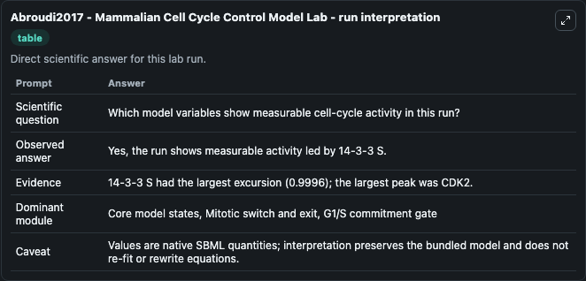
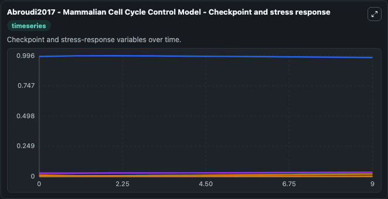
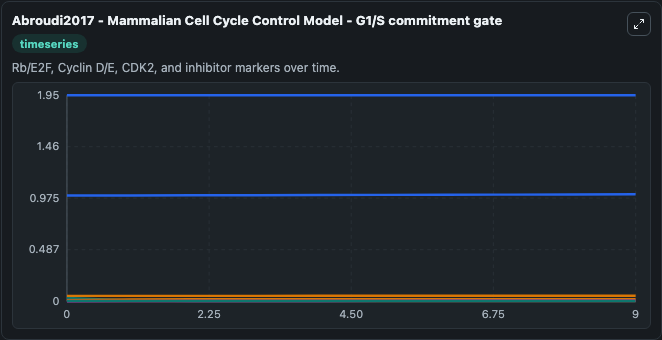
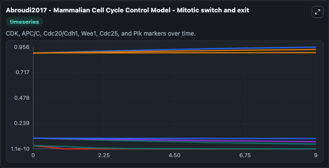
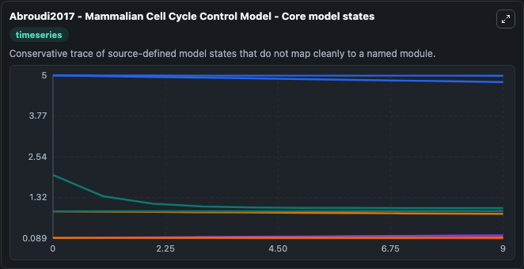
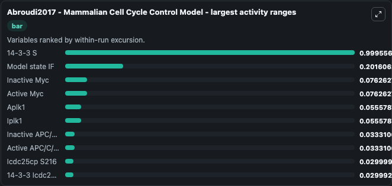
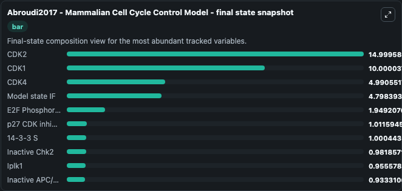
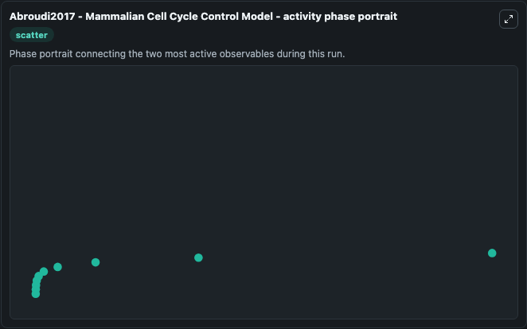

# Abroudi2017 - Mammalian Cell Cycle Control Model Lab

Single-model lab wrapper for Abroudi2017 - Mammalian Cell Cycle Control Model. Not many models of mammalian cell cycle system exist due to its complexity. Some models are too complex and hard to understand, while some others are too simple and not comprehensive enough.

This lab is a single-model Biosimulant wrapper for a cell-cycle simulation. The captured run uses the lab defaults and renders the model outputs as dark-mode visualizations for quick inspection and README embedding.

## Model Context

Not many models of mammalian cell cycle system exist due to its complexity. Some models are too complex and hard to understand, while some others are too simple and not comprehensive enough.

- Core model: Abroudi2017 - Mammalian Cell Cycle Control Model
- Runtime used by the lab: duration 10, step 1
- Controllable inputs: DSB, Oxygen-dependent degradation factor, Growth Factor
- Primary outputs: Active Myc, Inactive Myc, ATM checkpoint kinase, Active Chk2, Inactive Chk2, p53 tumor suppressor, Mdm2, Model state IF, P21, Cyclin D CDK4, and 53 more
- Tags: cellcycle, sbml, biomodels_ebi, faithful

## Output Visualizations

The images below were generated from a Biosimulant lab run in dark mode. Each capture corresponds to one rendered visualization from the run output panel.

<!-- BIOSIMULANT_VISUALS_START -->

### 1. Abroudi2017 Mammalian Cell Cycle Control Model Lab Run Interpretation

Run interpretation view that anchors the captured simulation: it summarizes the lab purpose, runtime, and how to read the generated cell-cycle outputs.

### 2. Abroudi2017 Mammalian Cell Cycle Control Model Checkpoint And Stress Response

Checkpoint and stress-response time courses, showing how the configured run moves through DNA damage, surveillance, and arrest-related signals.

### 3. Abroudi2017 Mammalian Cell Cycle Control Model G1 S Commitment Gate

G1/S commitment view, focused on the regulatory variables that gate entry into DNA synthesis and cell-cycle progression.

### 4. Abroudi2017 Mammalian Cell Cycle Control Model Mitotic Switch And Exit

Mitotic switch and exit view, capturing late-cycle regulators and the transition out of mitosis.

### 5. Abroudi2017 Mammalian Cell Cycle Control Model Core Model States

Core model state trajectories for Active Myc, Inactive Myc, ATM checkpoint kinase, Active Chk2, Inactive Chk2, p53 tumor suppressor, and 57 additional outputs, using the lab default initial conditions and runtime.

### 6. Abroudi2017 Mammalian Cell Cycle Control Model Largest Activity Ranges

Largest activity ranges chart, ranking the variables with the widest simulated movement so the dominant responses are easy to spot.

### 7. Abroudi2017 Mammalian Cell Cycle Control Model Final State Snapshot

Final state snapshot, comparing the end-of-run values for the selected cell-cycle variables.

### 8. Abroudi2017 Mammalian Cell Cycle Control Model Activity Phase Portrait

Activity phase portrait, showing pairwise movement between selected variables across the simulated trajectory.

<!-- BIOSIMULANT_VISUALS_END -->

## How to Read This Run

Use the time-course plots to see transient and steady-state behavior, the range or snapshot charts to identify the variables with the strongest response, and any phase-portrait view to inspect coupled regulator movement through the simulated trajectory. For this cell-cycle lab, the most useful comparison is usually between checkpoint, commitment, and mitotic-exit variables because those signals define where the simulated system sits in the cycle.

## Inputs

| Input | Context |
| --- | --- |
| DSB | Controls DSB in the lab model via `cellcycle_sbml_abroudi2017_mammalian_cell_cycle_control_model_model1812130001_model.dsb`. |
| Oxygen-dependent degradation factor | Controls Oxygen-dependent degradation factor in the lab model via `cellcycle_sbml_abroudi2017_mammalian_cell_cycle_control_model_model1812130001_model.oxygen_dependent_degradation_factor`. |
| Growth Factor | Controls Growth Factor in the lab model via `cellcycle_sbml_abroudi2017_mammalian_cell_cycle_control_model_model1812130001_model.growth_factor`. |

## Outputs

| Output | Context |
| --- | --- |
| Active Myc | Tracks Active Myc in the lab model via `cellcycle_sbml_abroudi2017_mammalian_cell_cycle_control_model_model1812130001_model.active_myc`. |
| Inactive Myc | Tracks Inactive Myc in the lab model via `cellcycle_sbml_abroudi2017_mammalian_cell_cycle_control_model_model1812130001_model.inactive_myc`. |
| ATM checkpoint kinase | Tracks ATM checkpoint kinase in the lab model via `cellcycle_sbml_abroudi2017_mammalian_cell_cycle_control_model_model1812130001_model.atm_checkpoint_kinase`. |
| Active Chk2 | Tracks Active Chk2 in the lab model via `cellcycle_sbml_abroudi2017_mammalian_cell_cycle_control_model_model1812130001_model.active_chk2`. |
| Inactive Chk2 | Tracks Inactive Chk2 in the lab model via `cellcycle_sbml_abroudi2017_mammalian_cell_cycle_control_model_model1812130001_model.inactive_chk2`. |
| p53 tumor suppressor | Tracks p53 tumor suppressor in the lab model via `cellcycle_sbml_abroudi2017_mammalian_cell_cycle_control_model_model1812130001_model.p53_tumor_suppressor`. |
| Mdm2 | Tracks Mdm2 in the lab model via `cellcycle_sbml_abroudi2017_mammalian_cell_cycle_control_model_model1812130001_model.mdm2`. |
| Model state IF | Tracks Model state IF in the lab model via `cellcycle_sbml_abroudi2017_mammalian_cell_cycle_control_model_model1812130001_model.model_state_if`. |
| P21 | Tracks P21 in the lab model via `cellcycle_sbml_abroudi2017_mammalian_cell_cycle_control_model_model1812130001_model.p21`. |
| Cyclin D CDK4 | Tracks Cyclin D CDK4 in the lab model via `cellcycle_sbml_abroudi2017_mammalian_cell_cycle_control_model_model1812130001_model.cyclin_d_cdk4`. |
| P21 Cyclin D CDK4 | Tracks P21 Cyclin D CDK4 in the lab model via `cellcycle_sbml_abroudi2017_mammalian_cell_cycle_control_model_model1812130001_model.p21_cyclin_d_cdk4`. |
| Acyce CDK2 | Tracks Acyce CDK2 in the lab model via `cellcycle_sbml_abroudi2017_mammalian_cell_cycle_control_model_model1812130001_model.acyce_cdk2`. |
| P21 Acyce CDK2 | Tracks P21 Acyce CDK2 in the lab model via `cellcycle_sbml_abroudi2017_mammalian_cell_cycle_control_model_model1812130001_model.p21_acyce_cdk2`. |
| P21 Acyca CDK2 | Tracks P21 Acyca CDK2 in the lab model via `cellcycle_sbml_abroudi2017_mammalian_cell_cycle_control_model_model1812130001_model.p21_acyca_cdk2`. |
| Acyca CDK2 | Tracks Acyca CDK2 in the lab model via `cellcycle_sbml_abroudi2017_mammalian_cell_cycle_control_model_model1812130001_model.acyca_cdk2`. |
| 14-3-3 S | Tracks 14-3-3 S in the lab model via `cellcycle_sbml_abroudi2017_mammalian_cell_cycle_control_model_model1812130001_model.observable_14_3_3_s`. |
| Gadda45 | Tracks Gadda45 in the lab model via `cellcycle_sbml_abroudi2017_mammalian_cell_cycle_control_model_model1812130001_model.gadda45`. |
| Cyclin D | Tracks Cyclin D in the lab model via `cellcycle_sbml_abroudi2017_mammalian_cell_cycle_control_model_model1812130001_model.cyclin_d`. |
| CDK4 | Tracks CDK4 in the lab model via `cellcycle_sbml_abroudi2017_mammalian_cell_cycle_control_model_model1812130001_model.cdk4`. |
| Ascf | Tracks Ascf in the lab model via `cellcycle_sbml_abroudi2017_mammalian_cell_cycle_control_model_model1812130001_model.ascf`. |
| p27 CDK inhibitor | Tracks p27 CDK inhibitor in the lab model via `cellcycle_sbml_abroudi2017_mammalian_cell_cycle_control_model_model1812130001_model.p27_cdk_inhibitor`. |
| P27 Acyce CDK2 | Tracks P27 Acyce CDK2 in the lab model via `cellcycle_sbml_abroudi2017_mammalian_cell_cycle_control_model_model1812130001_model.p27_acyce_cdk2`. |
| P27 Acyca CDK2 | Tracks P27 Acyca CDK2 in the lab model via `cellcycle_sbml_abroudi2017_mammalian_cell_cycle_control_model_model1812130001_model.p27_acyca_cdk2`. |
| E2F transcription factor | Tracks E2F transcription factor in the lab model via `cellcycle_sbml_abroudi2017_mammalian_cell_cycle_control_model_model1812130001_model.e2f_transcription_factor`. |
| Phosphorylated Rb | Tracks Phosphorylated Rb in the lab model via `cellcycle_sbml_abroudi2017_mammalian_cell_cycle_control_model_model1812130001_model.phosphorylated_rb`. |
| E2F Phosphorylated Rb | Tracks E2F Phosphorylated Rb in the lab model via `cellcycle_sbml_abroudi2017_mammalian_cell_cycle_control_model_model1812130001_model.e2f_phosphorylated_rb`. |
| P27 Cyclin D CDK4 | Tracks P27 Cyclin D CDK4 in the lab model via `cellcycle_sbml_abroudi2017_mammalian_cell_cycle_control_model_model1812130001_model.p27_cyclin_d_cdk4`. |
| Phosphorylated E2F Phosphorylated Rb P | Tracks Phosphorylated E2F Phosphorylated Rb P in the lab model via `cellcycle_sbml_abroudi2017_mammalian_cell_cycle_control_model_model1812130001_model.phosphorylated_e2f_phosphorylated_rb_p`. |
| Phosphorylated Phosphorylated Rb PP | Tracks Phosphorylated Phosphorylated Rb PP in the lab model via `cellcycle_sbml_abroudi2017_mammalian_cell_cycle_control_model_model1812130001_model.phosphorylated_phosphorylated_rb_pp`. |
| App1 | Tracks App1 in the lab model via `cellcycle_sbml_abroudi2017_mammalian_cell_cycle_control_model_model1812130001_model.app1`. |
| Ipp1 | Tracks Ipp1 in the lab model via `cellcycle_sbml_abroudi2017_mammalian_cell_cycle_control_model_model1812130001_model.ipp1`. |
| Acycb CDK1 Nuc | Tracks Acycb CDK1 Nuc in the lab model via `cellcycle_sbml_abroudi2017_mammalian_cell_cycle_control_model_model1812130001_model.acycb_cdk1_nuc`. |
| Cyclin E | Tracks Cyclin E in the lab model via `cellcycle_sbml_abroudi2017_mammalian_cell_cycle_control_model_model1812130001_model.cyclin_e`. |
| CDK2 | Tracks CDK2 in the lab model via `cellcycle_sbml_abroudi2017_mammalian_cell_cycle_control_model_model1812130001_model.cdk2`. |
| Cyclin A | Tracks Cyclin A in the lab model via `cellcycle_sbml_abroudi2017_mammalian_cell_cycle_control_model_model1812130001_model.cyclin_a`. |
| Active BMyb | Tracks Active BMyb in the lab model via `cellcycle_sbml_abroudi2017_mammalian_cell_cycle_control_model_model1812130001_model.active_bmyb`. |
| NF-Y transcription factor | Tracks NF-Y transcription factor in the lab model via `cellcycle_sbml_abroudi2017_mammalian_cell_cycle_control_model_model1812130001_model.nf_y_transcription_factor`. |
| Icyca CDK2 | Tracks Icyca CDK2 in the lab model via `cellcycle_sbml_abroudi2017_mammalian_cell_cycle_control_model_model1812130001_model.icyca_cdk2`. |
| Active APC/C/C Cdc20 | Tracks Active APC/C/C Cdc20 in the lab model via `cellcycle_sbml_abroudi2017_mammalian_cell_cycle_control_model_model1812130001_model.active_apc_c_c_cdc20`. |
| Active APC/C/C Cdh1 | Tracks Active APC/C/C Cdh1 in the lab model via `cellcycle_sbml_abroudi2017_mammalian_cell_cycle_control_model_model1812130001_model.active_apc_c_c_cdh1`. |
| Icyce CDK2 | Tracks Icyce CDK2 in the lab model via `cellcycle_sbml_abroudi2017_mammalian_cell_cycle_control_model_model1812130001_model.icyce_cdk2`. |
| Acdc25a | Tracks Acdc25a in the lab model via `cellcycle_sbml_abroudi2017_mammalian_cell_cycle_control_model_model1812130001_model.acdc25a`. |
| Iscf | Tracks Iscf in the lab model via `cellcycle_sbml_abroudi2017_mammalian_cell_cycle_control_model_model1812130001_model.iscf`. |
| Inactive BMyb | Tracks Inactive BMyb in the lab model via `cellcycle_sbml_abroudi2017_mammalian_cell_cycle_control_model_model1812130001_model.inactive_bmyb`. |
| Icdc25a | Tracks Icdc25a in the lab model via `cellcycle_sbml_abroudi2017_mammalian_cell_cycle_control_model_model1812130001_model.icdc25a`. |
| Aplk1 | Tracks Aplk1 in the lab model via `cellcycle_sbml_abroudi2017_mammalian_cell_cycle_control_model_model1812130001_model.aplk1`. |
| Awee1 | Tracks Awee1 in the lab model via `cellcycle_sbml_abroudi2017_mammalian_cell_cycle_control_model_model1812130001_model.awee1`. |
| Iwee1 | Tracks Iwee1 in the lab model via `cellcycle_sbml_abroudi2017_mammalian_cell_cycle_control_model_model1812130001_model.iwee1`. |
| Acdc25c | Tracks Acdc25c in the lab model via `cellcycle_sbml_abroudi2017_mammalian_cell_cycle_control_model_model1812130001_model.acdc25c`. |
| Icdc25c | Tracks Icdc25c in the lab model via `cellcycle_sbml_abroudi2017_mammalian_cell_cycle_control_model_model1812130001_model.icdc25c`. |
| Icdc25cp S216 | Tracks Icdc25cp S216 in the lab model via `cellcycle_sbml_abroudi2017_mammalian_cell_cycle_control_model_model1812130001_model.icdc25cp_s216`. |
| Acycb CDK1 Cyto | Tracks Acycb CDK1 Cyto in the lab model via `cellcycle_sbml_abroudi2017_mammalian_cell_cycle_control_model_model1812130001_model.acycb_cdk1_cyto`. |
| Acdc25cp S216 | Tracks Acdc25cp S216 in the lab model via `cellcycle_sbml_abroudi2017_mammalian_cell_cycle_control_model_model1812130001_model.acdc25cp_s216`. |
| 14-3-3 Icdc25cp S216 | Tracks 14-3-3 Icdc25cp S216 in the lab model via `cellcycle_sbml_abroudi2017_mammalian_cell_cycle_control_model_model1812130001_model.observable_14_3_3_icdc25cp_s216`. |
| Iplk1 | Tracks Iplk1 in the lab model via `cellcycle_sbml_abroudi2017_mammalian_cell_cycle_control_model_model1812130001_model.iplk1`. |
| Cyclin B | Tracks Cyclin B in the lab model via `cellcycle_sbml_abroudi2017_mammalian_cell_cycle_control_model_model1812130001_model.cyclin_b`. |
| CDK1 | Tracks CDK1 in the lab model via `cellcycle_sbml_abroudi2017_mammalian_cell_cycle_control_model_model1812130001_model.cdk1`. |
| Icycb CDK1 Cyto | Tracks Icycb CDK1 Cyto in the lab model via `cellcycle_sbml_abroudi2017_mammalian_cell_cycle_control_model_model1812130001_model.icycb_cdk1_cyto`. |
| P21 Acycb CDK1 Nuc | Tracks P21 Acycb CDK1 Nuc in the lab model via `cellcycle_sbml_abroudi2017_mammalian_cell_cycle_control_model_model1812130001_model.p21_acycb_cdk1_nuc`. |
| Icycb CDK1 Nuc | Tracks Icycb CDK1 Nuc in the lab model via `cellcycle_sbml_abroudi2017_mammalian_cell_cycle_control_model_model1812130001_model.icycb_cdk1_nuc`. |
| Inactive APC/C/C Cdc20 | Tracks Inactive APC/C/C Cdc20 in the lab model via `cellcycle_sbml_abroudi2017_mammalian_cell_cycle_control_model_model1812130001_model.inactive_apc_c_c_cdc20`. |
| Inactive APC/C/C Cdh1 | Tracks Inactive APC/C/C Cdh1 in the lab model via `cellcycle_sbml_abroudi2017_mammalian_cell_cycle_control_model_model1812130001_model.inactive_apc_c_c_cdh1`. |
| Phosphorylated Rb PPP Copy | Tracks Phosphorylated Rb PPP Copy in the lab model via `cellcycle_sbml_abroudi2017_mammalian_cell_cycle_control_model_model1812130001_model.phosphorylated_rb_ppp_copy`. |

## Lab Files

- `lab.yaml` defines the Biosimulant lab wrapper, exposed inputs, outputs, and runtime settings.
- `wiring-layout.json` stores the canvas layout used by the lab UI.
- `models/core/model.yaml` contains the wrapped simulation model metadata.
- `models/core/README.md` contains the source model notes and provenance.
- `models/visualisation/model.yaml` defines the visualization model used to render the run outputs.
- `assets/` contains the generated dark-mode visualization captures embedded above.
