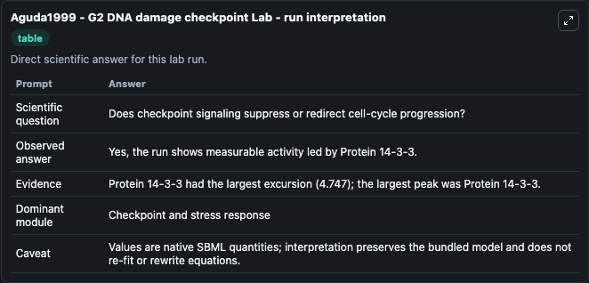
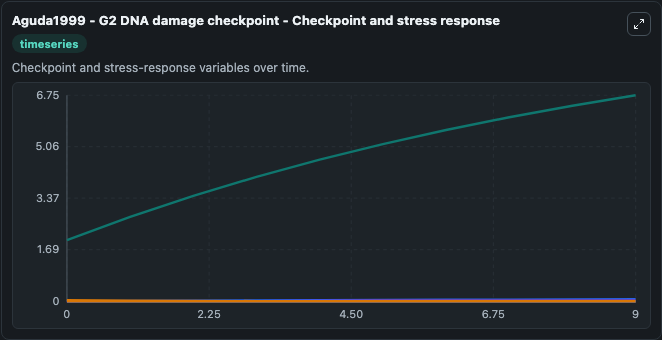
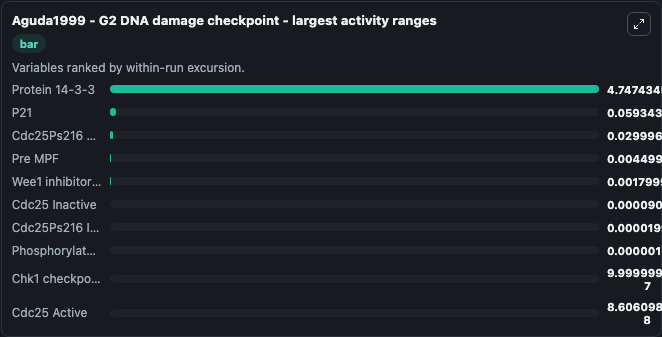
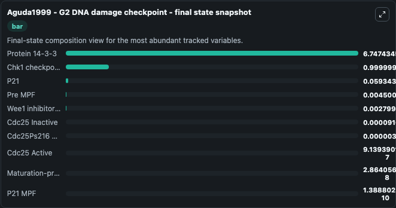
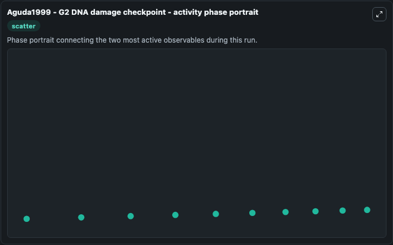

# Aguda1999 - G2 DNA damage checkpoint Lab

Single-model lab wrapper for Aguda1999 - G2 DNA damage checkpoint. Baltazar D. It can be used to explore cell-cycle regulation dynamics and compare checkpoint behavior across conditions.

This lab is a single-model Biosimulant wrapper for a cell-cycle simulation. The captured run uses the lab defaults and renders the model outputs as dark-mode visualizations for quick inspection and README embedding.

## Model Context

Baltazar D. It can be used to explore cell-cycle regulation dynamics and compare checkpoint behavior across conditions.

- Core model: Aguda1999 - G2 DNA damage checkpoint
- Runtime used by the lab: duration 10, step 1
- Controllable inputs: Cdc25 Active Total
- Primary outputs: Cdc25 Active, Cdc25Ps216 Active, Cdc25 Inactive, Cdc25Ps216 Inactive, Phosphorylated Chk1, Protein 14-3-3, Cdc25Ps216 14-3-3 Inactive, p53 tumor suppressor, P21, Maturation-promoting factor, and 6 more
- Tags: cellcycle, sbml, biomodels_ebi, faithful

## Output Visualizations

The images below were generated from a Biosimulant lab run in dark mode. Each capture corresponds to one rendered visualization from the run output panel.

<!-- BIOSIMULANT_VISUALS_START -->

### 1. Aguda1999 G2 Dna Damage Checkpoint Lab Run Interpretation

Run interpretation view that anchors the captured simulation: it summarizes the lab purpose, runtime, and how to read the generated cell-cycle outputs.

### 2. Aguda1999 G2 Dna Damage Checkpoint Checkpoint And Stress Response

Checkpoint and stress-response time courses, showing how the configured run moves through DNA damage, surveillance, and arrest-related signals.

### 3. Aguda1999 G2 Dna Damage Checkpoint Largest Activity Ranges

Checkpoint and stress-response time courses, showing how the configured run moves through DNA damage, surveillance, and arrest-related signals.

### 4. Aguda1999 G2 Dna Damage Checkpoint Final State Snapshot

Checkpoint and stress-response time courses, showing how the configured run moves through DNA damage, surveillance, and arrest-related signals.

### 5. Aguda1999 G2 Dna Damage Checkpoint Activity Phase Portrait

Checkpoint and stress-response time courses, showing how the configured run moves through DNA damage, surveillance, and arrest-related signals.

<!-- BIOSIMULANT_VISUALS_END -->

## How to Read This Run

Use the time-course plots to see transient and steady-state behavior, the range or snapshot charts to identify the variables with the strongest response, and any phase-portrait view to inspect coupled regulator movement through the simulated trajectory. For this cell-cycle lab, the most useful comparison is usually between checkpoint, commitment, and mitotic-exit variables because those signals define where the simulated system sits in the cycle.

## Inputs

| Input | Context |
| --- | --- |
| Cdc25 Active Total | Controls Cdc25 Active Total in the lab model via `cellcycle_sbml_aguda1999_g2_dna_damage_checkpoint_biomd0000000704_model.cdc25_active_total`. |

## Outputs

| Output | Context |
| --- | --- |
| Cdc25 Active | Tracks Cdc25 Active in the lab model via `cellcycle_sbml_aguda1999_g2_dna_damage_checkpoint_biomd0000000704_model.cdc25_active`. |
| Cdc25Ps216 Active | Tracks Cdc25Ps216 Active in the lab model via `cellcycle_sbml_aguda1999_g2_dna_damage_checkpoint_biomd0000000704_model.cdc25ps216_active`. |
| Cdc25 Inactive | Tracks Cdc25 Inactive in the lab model via `cellcycle_sbml_aguda1999_g2_dna_damage_checkpoint_biomd0000000704_model.cdc25_inactive`. |
| Cdc25Ps216 Inactive | Tracks Cdc25Ps216 Inactive in the lab model via `cellcycle_sbml_aguda1999_g2_dna_damage_checkpoint_biomd0000000704_model.cdc25ps216_inactive`. |
| Phosphorylated Chk1 | Tracks Phosphorylated Chk1 in the lab model via `cellcycle_sbml_aguda1999_g2_dna_damage_checkpoint_biomd0000000704_model.phosphorylated_chk1`. |
| Protein 14-3-3 | Tracks Protein 14-3-3 in the lab model via `cellcycle_sbml_aguda1999_g2_dna_damage_checkpoint_biomd0000000704_model.protein_14_3_3`. |
| Cdc25Ps216 14-3-3 Inactive | Tracks Cdc25Ps216 14-3-3 Inactive in the lab model via `cellcycle_sbml_aguda1999_g2_dna_damage_checkpoint_biomd0000000704_model.cdc25ps216_14_3_3_inactive`. |
| p53 tumor suppressor | Tracks p53 tumor suppressor in the lab model via `cellcycle_sbml_aguda1999_g2_dna_damage_checkpoint_biomd0000000704_model.p53_tumor_suppressor`. |
| P21 | Tracks P21 in the lab model via `cellcycle_sbml_aguda1999_g2_dna_damage_checkpoint_biomd0000000704_model.p21`. |
| Maturation-promoting factor | Tracks Maturation-promoting factor in the lab model via `cellcycle_sbml_aguda1999_g2_dna_damage_checkpoint_biomd0000000704_model.maturation_promoting_factor`. |
| P21 MPF | Tracks P21 MPF in the lab model via `cellcycle_sbml_aguda1999_g2_dna_damage_checkpoint_biomd0000000704_model.p21_mpf`. |
| Pre MPF | Tracks Pre MPF in the lab model via `cellcycle_sbml_aguda1999_g2_dna_damage_checkpoint_biomd0000000704_model.pre_mpf`. |
| Wee1 inhibitory kinase | Tracks Wee1 inhibitory kinase in the lab model via `cellcycle_sbml_aguda1999_g2_dna_damage_checkpoint_biomd0000000704_model.wee1_inhibitory_kinase`. |
| Chk1 checkpoint kinase | Tracks Chk1 checkpoint kinase in the lab model via `cellcycle_sbml_aguda1999_g2_dna_damage_checkpoint_biomd0000000704_model.chk1_checkpoint_kinase`. |
| Rad3 ATM | Tracks Rad3 ATM in the lab model via `cellcycle_sbml_aguda1999_g2_dna_damage_checkpoint_biomd0000000704_model.rad3_atm`. |
| Wee1 Phosphorylated | Tracks Wee1 Phosphorylated in the lab model via `cellcycle_sbml_aguda1999_g2_dna_damage_checkpoint_biomd0000000704_model.wee1_phosphorylated`. |

## Lab Files

- `lab.yaml` defines the Biosimulant lab wrapper, exposed inputs, outputs, and runtime settings.
- `wiring-layout.json` stores the canvas layout used by the lab UI.
- `models/core/model.yaml` contains the wrapped simulation model metadata.
- `models/core/README.md` contains the source model notes and provenance.
- `models/visualisation/model.yaml` defines the visualization model used to render the run outputs.
- `assets/` contains the generated dark-mode visualization captures embedded above.
