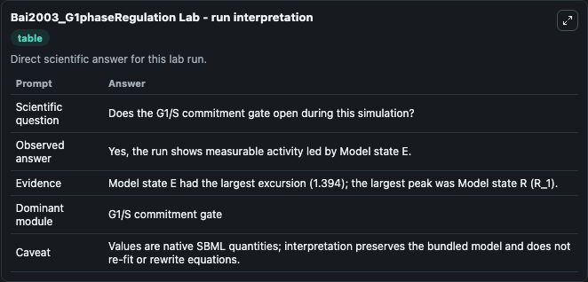
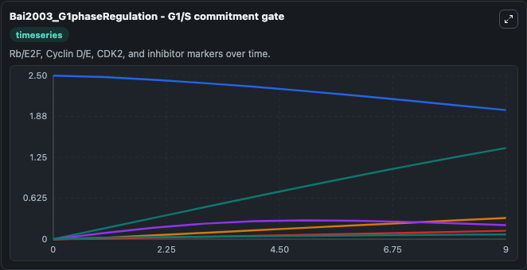
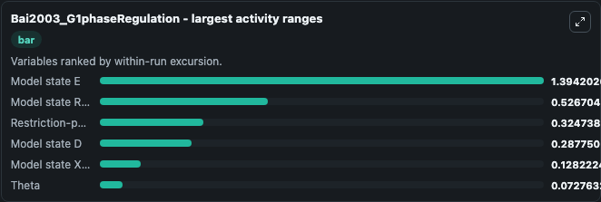
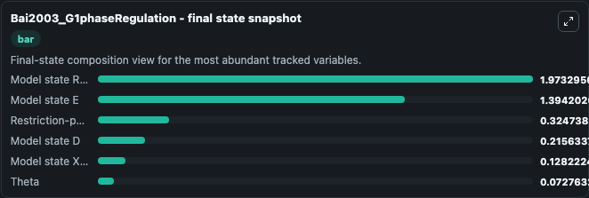
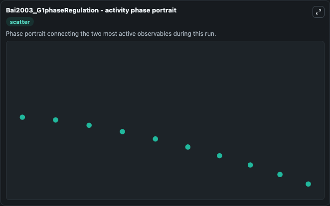

# Bai2003_G1phaseRegulation Lab

Single-model lab wrapper for Bai2003_G1phaseRegulation. This a model from the article: Theoretical and experimental evidence for hysteresis in cell proliferation. Bai S, Goodrich D, Thron CD, Tecarro E, Obeyesekere M.

This lab is a single-model Biosimulant wrapper for a cell-cycle simulation. The captured run uses the lab defaults and renders the model outputs as dark-mode visualizations for quick inspection and README embedding.

## Model Context

This a model from the article: Theoretical and experimental evidence for hysteresis in cell proliferation. Bai S, Goodrich D, Thron CD, Tecarro E, Obeyesekere M.

- Core model: Bai2003_G1phaseRegulation
- Runtime used by the lab: duration 10, step 1
- Controllable inputs: Growth Factor
- Primary outputs: Model state D, Model state E, Model state R (R_1), Restriction-point signal, Theta, Model state X (X_1)
- Tags: cellcycle, sbml, biomodels_ebi, faithful

## Output Visualizations

The images below were generated from a Biosimulant lab run in dark mode. Each capture corresponds to one rendered visualization from the run output panel.

<!-- BIOSIMULANT_VISUALS_START -->

### 1. Bai2003 G1phaseregulation Lab Run Interpretation

Run interpretation view that anchors the captured simulation: it summarizes the lab purpose, runtime, and how to read the generated cell-cycle outputs.

### 2. Bai2003 G1phaseregulation G1 S Commitment Gate

G1/S commitment view, focused on the regulatory variables that gate entry into DNA synthesis and cell-cycle progression.

### 3. Bai2003 G1phaseregulation Largest Activity Ranges

G1/S commitment view, focused on the regulatory variables that gate entry into DNA synthesis and cell-cycle progression.

### 4. Bai2003 G1phaseregulation Final State Snapshot

G1/S commitment view, focused on the regulatory variables that gate entry into DNA synthesis and cell-cycle progression.

### 5. Bai2003 G1phaseregulation Activity Phase Portrait

G1/S commitment view, focused on the regulatory variables that gate entry into DNA synthesis and cell-cycle progression.

<!-- BIOSIMULANT_VISUALS_END -->

## How to Read This Run

Use the time-course plots to see transient and steady-state behavior, the range or snapshot charts to identify the variables with the strongest response, and any phase-portrait view to inspect coupled regulator movement through the simulated trajectory. For this cell-cycle lab, the most useful comparison is usually between checkpoint, commitment, and mitotic-exit variables because those signals define where the simulated system sits in the cycle.

## Inputs

| Input | Context |
| --- | --- |
| Growth Factor | Controls Growth Factor in the lab model via `cellcycle_sbml_bai2003_g1phaseregulation_biomd0000000242_model.growth_factor`. |

## Outputs

| Output | Context |
| --- | --- |
| Model state D | Tracks Model state D in the lab model via `cellcycle_sbml_bai2003_g1phaseregulation_biomd0000000242_model.model_state_d`. |
| Model state E | Tracks Model state E in the lab model via `cellcycle_sbml_bai2003_g1phaseregulation_biomd0000000242_model.model_state_e`. |
| Model state R (R_1) | Tracks Model state R (R_1) in the lab model via `cellcycle_sbml_bai2003_g1phaseregulation_biomd0000000242_model.model_state_r_r_1`. |
| Restriction-point signal | Tracks Restriction-point signal in the lab model via `cellcycle_sbml_bai2003_g1phaseregulation_biomd0000000242_model.restriction_point_signal`. |
| Theta | Tracks Theta in the lab model via `cellcycle_sbml_bai2003_g1phaseregulation_biomd0000000242_model.theta`. |
| Model state X (X_1) | Tracks Model state X (X_1) in the lab model via `cellcycle_sbml_bai2003_g1phaseregulation_biomd0000000242_model.model_state_x_x_1`. |

## Lab Files

- `lab.yaml` defines the Biosimulant lab wrapper, exposed inputs, outputs, and runtime settings.
- `wiring-layout.json` stores the canvas layout used by the lab UI.
- `models/core/model.yaml` contains the wrapped simulation model metadata.
- `models/core/README.md` contains the source model notes and provenance.
- `models/visualisation/model.yaml` defines the visualization model used to render the run outputs.
- `assets/` contains the generated dark-mode visualization captures embedded above.
