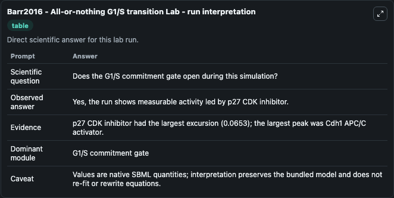
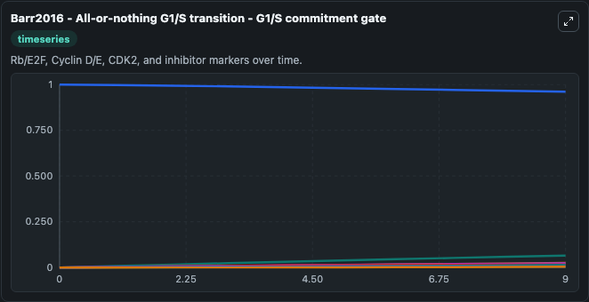
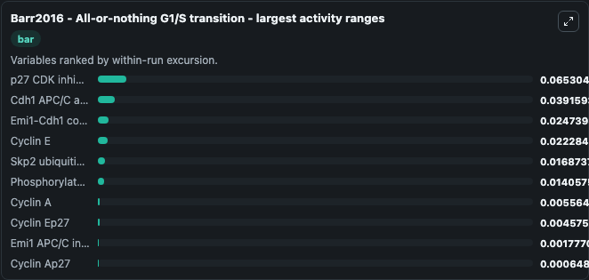
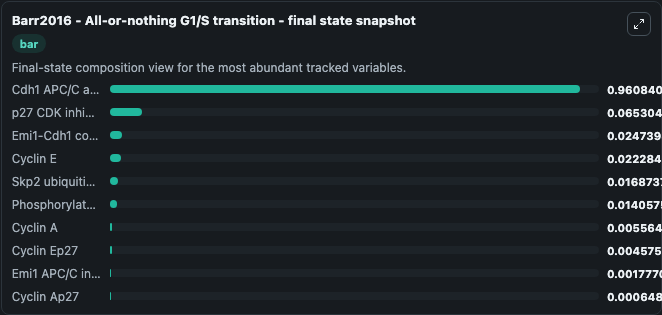
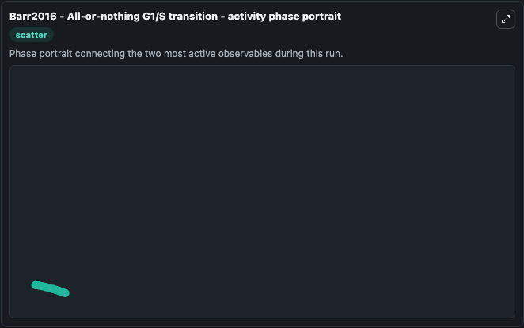

# Barr2016 - All-or-nothing G1/S transition Lab

Single-model lab wrapper for Barr2016 - All-or-nothing G1/S transition. Barr2016 - All-or-nothing G1/Stransition This model is described in the article: A Dynamical Framework for the All-or-None G1/S Transition. Barr AR, Heldt FS, Zhang T, Bakal C, Nov\u00e1k B.

This lab is a single-model Biosimulant wrapper for a cell-cycle simulation. The captured run uses the lab defaults and renders the model outputs as dark-mode visualizations for quick inspection and README embedding.

## Model Context

Barr2016 - All-or-nothing G1/Stransition This model is described in the article: A Dynamical Framework for the All-or-None G1/S Transition. Barr AR, Heldt FS, Zhang T, Bakal C, Novák B.

- Core model: Barr2016 - All-or-nothing G1/S transition
- Runtime used by the lab: duration 10, step 1
- Controllable inputs: Cyclin ET, Cyclin AT, P27T, Emi Model state C, Emi1T, Cdh1dp
- Primary outputs: Cyclin E, Cyclin A, Cyclin Ep27, Cyclin Ap27, Skp2 ubiquitin-ligase adaptor, Phosphorylated Cdh1, Emi1 APC/C inhibitor, p27 CDK inhibitor, Cdh1 APC/C activator, Emi1-Cdh1 complex, and 1 more
- Tags: cellcycle, sbml, biomodels_ebi, faithful

## Output Visualizations

The images below were generated from a Biosimulant lab run in dark mode. Each capture corresponds to one rendered visualization from the run output panel.

<!-- BIOSIMULANT_VISUALS_START -->

### 1. Barr2016 All Or Nothing G1 S Transition Lab Run Interpretation

Run interpretation view that anchors the captured simulation: it summarizes the lab purpose, runtime, and how to read the generated cell-cycle outputs.

### 2. Barr2016 All Or Nothing G1 S Transition G1 S Commitment Gate

G1/S commitment view, focused on the regulatory variables that gate entry into DNA synthesis and cell-cycle progression.

### 3. Barr2016 All Or Nothing G1 S Transition Largest Activity Ranges

G1/S commitment view, focused on the regulatory variables that gate entry into DNA synthesis and cell-cycle progression.

### 4. Barr2016 All Or Nothing G1 S Transition Final State Snapshot

G1/S commitment view, focused on the regulatory variables that gate entry into DNA synthesis and cell-cycle progression.

### 5. Barr2016 All Or Nothing G1 S Transition Activity Phase Portrait

G1/S commitment view, focused on the regulatory variables that gate entry into DNA synthesis and cell-cycle progression.

<!-- BIOSIMULANT_VISUALS_END -->

## How to Read This Run

Use the time-course plots to see transient and steady-state behavior, the range or snapshot charts to identify the variables with the strongest response, and any phase-portrait view to inspect coupled regulator movement through the simulated trajectory. For this cell-cycle lab, the most useful comparison is usually between checkpoint, commitment, and mitotic-exit variables because those signals define where the simulated system sits in the cycle.

## Inputs

| Input | Context |
| --- | --- |
| Cyclin ET | Controls Cyclin ET in the lab model via `cellcycle_sbml_barr2016_all_or_nothing_g1_s_transition_biomd0000000646_model.cyclin_et`. |
| Cyclin AT | Controls Cyclin AT in the lab model via `cellcycle_sbml_barr2016_all_or_nothing_g1_s_transition_biomd0000000646_model.cyclin_at`. |
| P27T | Controls P27T in the lab model via `cellcycle_sbml_barr2016_all_or_nothing_g1_s_transition_biomd0000000646_model.p27t`. |
| Emi Model state C | Controls Emi Model state C in the lab model via `cellcycle_sbml_barr2016_all_or_nothing_g1_s_transition_biomd0000000646_model.emi_model_state_c`. |
| Emi1T | Controls Emi1T in the lab model via `cellcycle_sbml_barr2016_all_or_nothing_g1_s_transition_biomd0000000646_model.emi1t`. |
| Cdh1dp | Controls Cdh1dp in the lab model via `cellcycle_sbml_barr2016_all_or_nothing_g1_s_transition_biomd0000000646_model.cdh1dp`. |

## Outputs

| Output | Context |
| --- | --- |
| Cyclin E | Tracks Cyclin E in the lab model via `cellcycle_sbml_barr2016_all_or_nothing_g1_s_transition_biomd0000000646_model.cyclin_e`. |
| Cyclin A | Tracks Cyclin A in the lab model via `cellcycle_sbml_barr2016_all_or_nothing_g1_s_transition_biomd0000000646_model.cyclin_a`. |
| Cyclin Ep27 | Tracks Cyclin Ep27 in the lab model via `cellcycle_sbml_barr2016_all_or_nothing_g1_s_transition_biomd0000000646_model.cyclin_ep27`. |
| Cyclin Ap27 | Tracks Cyclin Ap27 in the lab model via `cellcycle_sbml_barr2016_all_or_nothing_g1_s_transition_biomd0000000646_model.cyclin_ap27`. |
| Skp2 ubiquitin-ligase adaptor | Tracks Skp2 ubiquitin-ligase adaptor in the lab model via `cellcycle_sbml_barr2016_all_or_nothing_g1_s_transition_biomd0000000646_model.skp2_ubiquitin_ligase_adaptor`. |
| Phosphorylated Cdh1 | Tracks Phosphorylated Cdh1 in the lab model via `cellcycle_sbml_barr2016_all_or_nothing_g1_s_transition_biomd0000000646_model.phosphorylated_cdh1`. |
| Emi1 APC/C inhibitor | Tracks Emi1 APC/C inhibitor in the lab model via `cellcycle_sbml_barr2016_all_or_nothing_g1_s_transition_biomd0000000646_model.emi1_apc_c_inhibitor`. |
| p27 CDK inhibitor | Tracks p27 CDK inhibitor in the lab model via `cellcycle_sbml_barr2016_all_or_nothing_g1_s_transition_biomd0000000646_model.p27_cdk_inhibitor`. |
| Cdh1 APC/C activator | Tracks Cdh1 APC/C activator in the lab model via `cellcycle_sbml_barr2016_all_or_nothing_g1_s_transition_biomd0000000646_model.cdh1_apc_c_activator`. |
| Emi1-Cdh1 complex | Tracks Emi1-Cdh1 complex in the lab model via `cellcycle_sbml_barr2016_all_or_nothing_g1_s_transition_biomd0000000646_model.emi1_cdh1_complex`. |
| Emi1-phosphorylated Cdh1 complex | Tracks Emi1-phosphorylated Cdh1 complex in the lab model via `cellcycle_sbml_barr2016_all_or_nothing_g1_s_transition_biomd0000000646_model.emi1_phosphorylated_cdh1_complex`. |

## Lab Files

- `lab.yaml` defines the Biosimulant lab wrapper, exposed inputs, outputs, and runtime settings.
- `wiring-layout.json` stores the canvas layout used by the lab UI.
- `models/core/model.yaml` contains the wrapped simulation model metadata.
- `models/core/README.md` contains the source model notes and provenance.
- `models/visualisation/model.yaml` defines the visualization model used to render the run outputs.
- `assets/` contains the generated dark-mode visualization captures embedded above.
