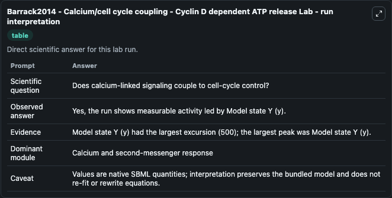
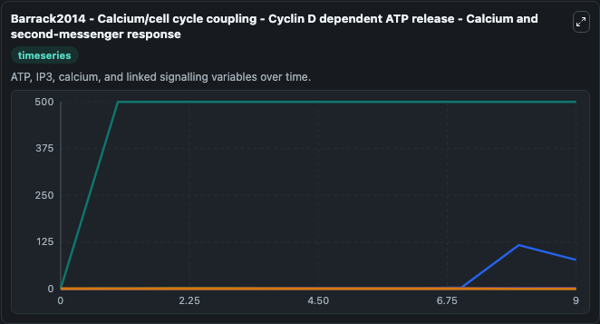
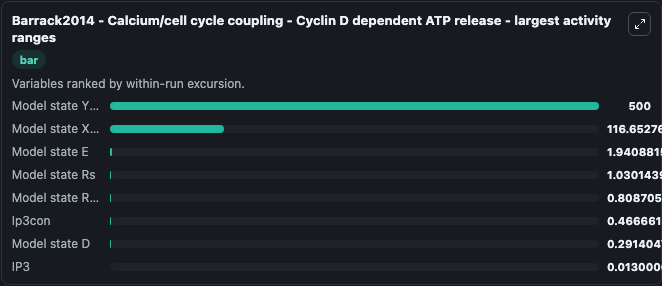
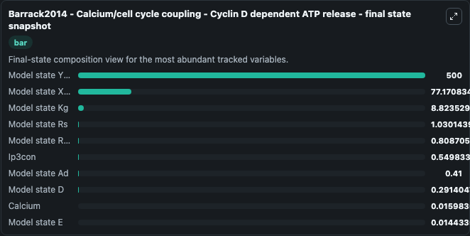
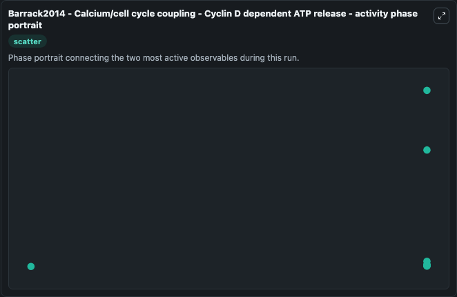

# Barrack2014 - Calcium/cell cycle coupling - Cyclin D dependent ATP release Lab

Single-model lab wrapper for Barrack2014 - Calcium/cell cycle coupling - Cyclin D dependent ATP release. Barrack2014 - Calcium/cell cycle coupling - Cyclin D dependent ATP release This model is designed based on the hypothesis that cytoplasmic calcium accelerates entry into S phase of the cell cycle and/. It can be used to explore cell-cycle regulation dynamics and compare checkpoint behavior across conditions.

This lab is a single-model Biosimulant wrapper for a cell-cycle simulation. The captured run uses the lab defaults and renders the model outputs as dark-mode visualizations for quick inspection and README embedding.

## Model Context

Barrack2014 - Calcium/cell cycle coupling - Cyclin D dependent ATP release This model is designed based on the hypothesis that cytoplasmic calcium accelerates entry into S phase of the cell cycle and/. It can be used to explore cell-cycle regulation dynamics and compare checkpoint behavior across conditions.

- Core model: Barrack2014 - Calcium/cell cycle coupling - Cyclin D dependent ATP release
- Runtime used by the lab: duration 10, step 1
- Controllable inputs: none declared
- Primary outputs: Model state D, Model state Ad, Model state E, Model state R (r), Model state Rs, Model state X (x), IP3, Model state Kg, Gstar, Model state Ro, and 6 more
- Tags: cellcycle, sbml, biomodels_ebi, faithful

## Output Visualizations

The images below were generated from a Biosimulant lab run in dark mode. Each capture corresponds to one rendered visualization from the run output panel.

<!-- BIOSIMULANT_VISUALS_START -->

### 1. Barrack2014 Calcium Cell Cycle Coupling Cyclin D Dependent Atp Release Lab Run I

Barrack2014 Calcium Cell Cycle Coupling Cyclin D Dependent Atp Release Lab Run I visualization captured from the dark-mode Biosimulant run for Barrack2014 - Calcium/cell cycle coupling - Cyclin D dependent ATP release Lab.

### 2. Barrack2014 Calcium Cell Cycle Coupling Cyclin D Dependent Atp Release Calcium A

Barrack2014 Calcium Cell Cycle Coupling Cyclin D Dependent Atp Release Calcium A visualization captured from the dark-mode Biosimulant run for Barrack2014 - Calcium/cell cycle coupling - Cyclin D dependent ATP release Lab.

### 3. Barrack2014 Calcium Cell Cycle Coupling Cyclin D Dependent Atp Release Largest A

Largest activity ranges chart, ranking the variables with the widest simulated movement so the dominant responses are easy to spot.

### 4. Barrack2014 Calcium Cell Cycle Coupling Cyclin D Dependent Atp Release Final Sta

Barrack2014 Calcium Cell Cycle Coupling Cyclin D Dependent Atp Release Final Sta visualization captured from the dark-mode Biosimulant run for Barrack2014 - Calcium/cell cycle coupling - Cyclin D dependent ATP release Lab.

### 5. Barrack2014 Calcium Cell Cycle Coupling Cyclin D Dependent Atp Release Activity 

Barrack2014 Calcium Cell Cycle Coupling Cyclin D Dependent Atp Release Activity  visualization captured from the dark-mode Biosimulant run for Barrack2014 - Calcium/cell cycle coupling - Cyclin D dependent ATP release Lab.

<!-- BIOSIMULANT_VISUALS_END -->

## How to Read This Run

Use the time-course plots to see transient and steady-state behavior, the range or snapshot charts to identify the variables with the strongest response, and any phase-portrait view to inspect coupled regulator movement through the simulated trajectory. For this cell-cycle lab, the most useful comparison is usually between checkpoint, commitment, and mitotic-exit variables because those signals define where the simulated system sits in the cycle.

## Inputs

| Input | Context |
| --- | --- |
| - | No entries declared in `lab.yaml`. |

## Outputs

| Output | Context |
| --- | --- |
| Model state D | Tracks Model state D in the lab model via `cellcycle_sbml_barrack2014_calcium_cell_cycle_coupling_cyclin_d_biomd0000000508_model.model_state_d`. |
| Model state Ad | Tracks Model state Ad in the lab model via `cellcycle_sbml_barrack2014_calcium_cell_cycle_coupling_cyclin_d_biomd0000000508_model.model_state_ad`. |
| Model state E | Tracks Model state E in the lab model via `cellcycle_sbml_barrack2014_calcium_cell_cycle_coupling_cyclin_d_biomd0000000508_model.model_state_e`. |
| Model state R (r) | Tracks Model state R (r) in the lab model via `cellcycle_sbml_barrack2014_calcium_cell_cycle_coupling_cyclin_d_biomd0000000508_model.model_state_r_r`. |
| Model state Rs | Tracks Model state Rs in the lab model via `cellcycle_sbml_barrack2014_calcium_cell_cycle_coupling_cyclin_d_biomd0000000508_model.model_state_rs`. |
| Model state X (x) | Tracks Model state X (x) in the lab model via `cellcycle_sbml_barrack2014_calcium_cell_cycle_coupling_cyclin_d_biomd0000000508_model.model_state_x_x`. |
| IP3 | Tracks IP3 in the lab model via `cellcycle_sbml_barrack2014_calcium_cell_cycle_coupling_cyclin_d_biomd0000000508_model.ip3`. |
| Model state Kg | Tracks Model state Kg in the lab model via `cellcycle_sbml_barrack2014_calcium_cell_cycle_coupling_cyclin_d_biomd0000000508_model.model_state_kg`. |
| Gstar | Tracks Gstar in the lab model via `cellcycle_sbml_barrack2014_calcium_cell_cycle_coupling_cyclin_d_biomd0000000508_model.gstar`. |
| Model state Ro | Tracks Model state Ro in the lab model via `cellcycle_sbml_barrack2014_calcium_cell_cycle_coupling_cyclin_d_biomd0000000508_model.model_state_ro`. |
| Ip3con | Tracks Ip3con in the lab model via `cellcycle_sbml_barrack2014_calcium_cell_cycle_coupling_cyclin_d_biomd0000000508_model.ip3con`. |
| Dcon | Tracks Dcon in the lab model via `cellcycle_sbml_barrack2014_calcium_cell_cycle_coupling_cyclin_d_biomd0000000508_model.dcon`. |
| ATP | Tracks ATP in the lab model via `cellcycle_sbml_barrack2014_calcium_cell_cycle_coupling_cyclin_d_biomd0000000508_model.atp`. |
| Model state Y (y) | Tracks Model state Y (y) in the lab model via `cellcycle_sbml_barrack2014_calcium_cell_cycle_coupling_cyclin_d_biomd0000000508_model.model_state_y_y`. |
| Delta | Tracks Delta in the lab model via `cellcycle_sbml_barrack2014_calcium_cell_cycle_coupling_cyclin_d_biomd0000000508_model.delta`. |
| Calcium | Tracks Calcium in the lab model via `cellcycle_sbml_barrack2014_calcium_cell_cycle_coupling_cyclin_d_biomd0000000508_model.calcium`. |

## Lab Files

- `lab.yaml` defines the Biosimulant lab wrapper, exposed inputs, outputs, and runtime settings.
- `wiring-layout.json` stores the canvas layout used by the lab UI.
- `models/core/model.yaml` contains the wrapped simulation model metadata.
- `models/core/README.md` contains the source model notes and provenance.
- `models/visualisation/model.yaml` defines the visualization model used to render the run outputs.
- `assets/` contains the generated dark-mode visualization captures embedded above.
