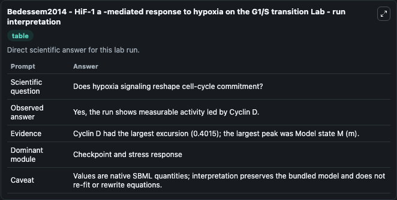
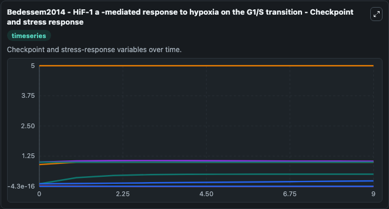
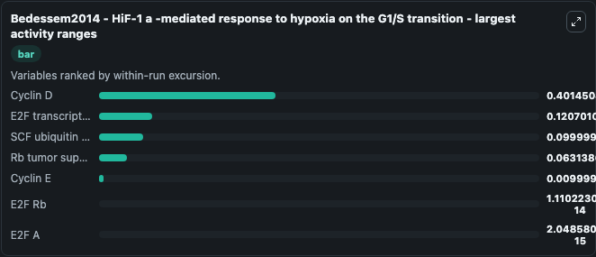
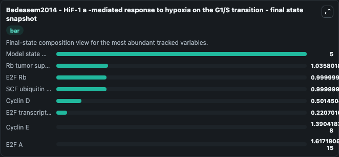
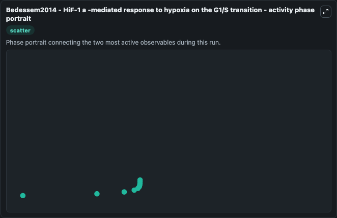

# Bedessem2014 - HiF-1 a -mediated response to hypoxia on the G1/S transition Lab

Single-model lab wrapper for Bedessem2014 - HiF-1 a -mediated response to hypoxia on the G1/S transition. Cell Cycle Bedessem2014Hif1AMediated Response To Hypoxi Model1812040001Model represents core biological mechanisms from biomodels_ebi reference biomodels_ebi:MODEL1812040001. When you run it, you can inspect state and compare temporal behavior between baseline and adjusted inputs.

This lab is a single-model Biosimulant wrapper for a cell-cycle simulation. The captured run uses the lab defaults and renders the model outputs as dark-mode visualizations for quick inspection and README embedding.

## Model Context

Cell Cycle Bedessem2014Hif1AMediated Response To Hypoxi Model1812040001Model represents core biological mechanisms from biomodels_ebi reference biomodels_ebi:MODEL1812040001. When you run it, you can inspect state and compare temporal behavior between baseline and adjusted inputs.

- Core model: Bedessem2014 - HiF-1 a -mediated response to hypoxia on the G1/S transition
- Runtime used by the lab: duration 10, step 1
- Controllable inputs: none declared
- Primary outputs: Model state M (m), Cyclin D, Rb tumor suppressor, Cyclin E, SCF ubiquitin ligase, E2F transcription factor, E2F A, E2F Rb
- Tags: cellcycle, sbml, biomodels_ebi, faithful

## Output Visualizations

The images below were generated from a Biosimulant lab run in dark mode. Each capture corresponds to one rendered visualization from the run output panel.

<!-- BIOSIMULANT_VISUALS_START -->

### 1. Bedessem2014 Hif 1 A Mediated Response To Hypoxia On The G1 S Transition Lab Run

G1/S commitment view, focused on the regulatory variables that gate entry into DNA synthesis and cell-cycle progression.

### 2. Bedessem2014 Hif 1 A Mediated Response To Hypoxia On The G1 S Transition Checkpo

G1/S commitment view, focused on the regulatory variables that gate entry into DNA synthesis and cell-cycle progression.

### 3. Bedessem2014 Hif 1 A Mediated Response To Hypoxia On The G1 S Transition Largest

G1/S commitment view, focused on the regulatory variables that gate entry into DNA synthesis and cell-cycle progression.

### 4. Bedessem2014 Hif 1 A Mediated Response To Hypoxia On The G1 S Transition Final S

G1/S commitment view, focused on the regulatory variables that gate entry into DNA synthesis and cell-cycle progression.

### 5. Bedessem2014 Hif 1 A Mediated Response To Hypoxia On The G1 S Transition Activit

G1/S commitment view, focused on the regulatory variables that gate entry into DNA synthesis and cell-cycle progression.

<!-- BIOSIMULANT_VISUALS_END -->

## How to Read This Run

Use the time-course plots to see transient and steady-state behavior, the range or snapshot charts to identify the variables with the strongest response, and any phase-portrait view to inspect coupled regulator movement through the simulated trajectory. For this cell-cycle lab, the most useful comparison is usually between checkpoint, commitment, and mitotic-exit variables because those signals define where the simulated system sits in the cycle.

## Inputs

| Input | Context |
| --- | --- |
| - | No entries declared in `lab.yaml`. |

## Outputs

| Output | Context |
| --- | --- |
| Model state M (m) | Tracks Model state M (m) in the lab model via `cellcycle_sbml_bedessem2014_hif_1_a_mediated_response_to_hypoxi_model1812040001_model.model_state_m_m`. |
| Cyclin D | Tracks Cyclin D in the lab model via `cellcycle_sbml_bedessem2014_hif_1_a_mediated_response_to_hypoxi_model1812040001_model.cyclin_d`. |
| Rb tumor suppressor | Tracks Rb tumor suppressor in the lab model via `cellcycle_sbml_bedessem2014_hif_1_a_mediated_response_to_hypoxi_model1812040001_model.rb_tumor_suppressor`. |
| Cyclin E | Tracks Cyclin E in the lab model via `cellcycle_sbml_bedessem2014_hif_1_a_mediated_response_to_hypoxi_model1812040001_model.cyclin_e`. |
| SCF ubiquitin ligase | Tracks SCF ubiquitin ligase in the lab model via `cellcycle_sbml_bedessem2014_hif_1_a_mediated_response_to_hypoxi_model1812040001_model.scf_ubiquitin_ligase`. |
| E2F transcription factor | Tracks E2F transcription factor in the lab model via `cellcycle_sbml_bedessem2014_hif_1_a_mediated_response_to_hypoxi_model1812040001_model.e2f_transcription_factor`. |
| E2F A | Tracks E2F A in the lab model via `cellcycle_sbml_bedessem2014_hif_1_a_mediated_response_to_hypoxi_model1812040001_model.e2f_a`. |
| E2F Rb | Tracks E2F Rb in the lab model via `cellcycle_sbml_bedessem2014_hif_1_a_mediated_response_to_hypoxi_model1812040001_model.e2f_rb`. |

## Lab Files

- `lab.yaml` defines the Biosimulant lab wrapper, exposed inputs, outputs, and runtime settings.
- `wiring-layout.json` stores the canvas layout used by the lab UI.
- `models/core/model.yaml` contains the wrapped simulation model metadata.
- `models/core/README.md` contains the source model notes and provenance.
- `models/visualisation/model.yaml` defines the visualization model used to render the run outputs.
- `assets/` contains the generated dark-mode visualization captures embedded above.
