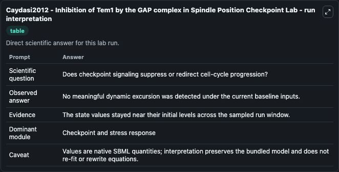
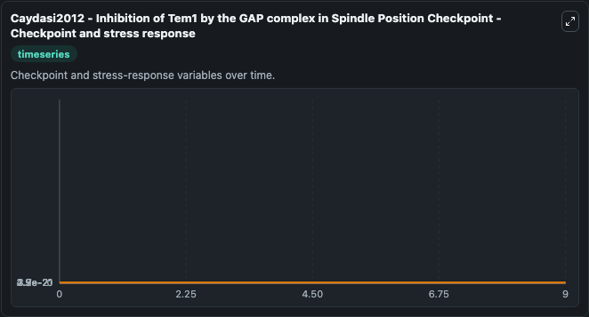
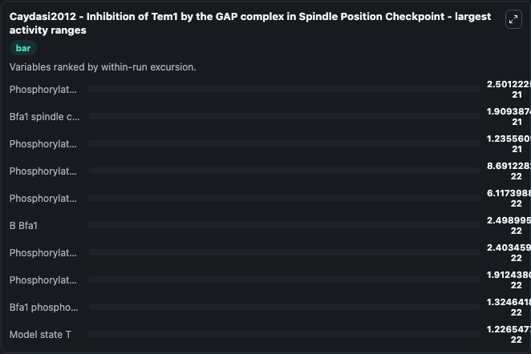
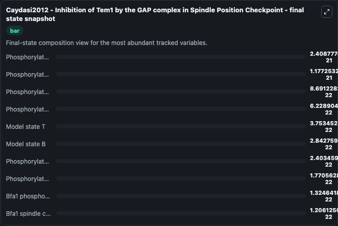
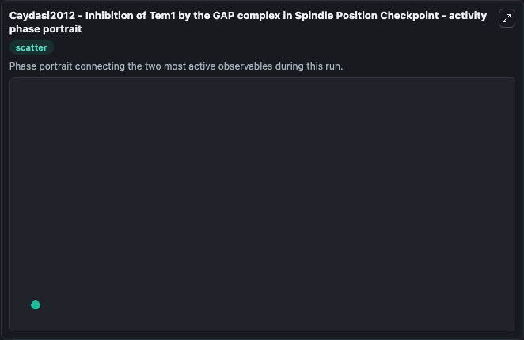

# Caydasi2012 - Inhibition of Tem1 by the GAP complex in Spindle Position Checkpoint Lab

Single-model lab wrapper for Caydasi2012 - Inhibition of Tem1 by the GAP complex in Spindle Position Checkpoint. This model is from the article: A dynamical model of the spindle position checkpoint Ayse Koca Caydasi, Maiko Lohel, Gerd Gr\u00fcnert, Peter Dittrich, Gislene Pereira, Bashar Ibrahim Molecular Systems Bio. It can be used to explore cell-cycle regulation dynamics and compare checkpoint behavior across conditions.

This lab is a single-model Biosimulant wrapper for a cell-cycle simulation. The captured run uses the lab defaults and renders the model outputs as dark-mode visualizations for quick inspection and README embedding.

## Model Context

This model is from the article: A dynamical model of the spindle position checkpoint Ayse Koca Caydasi, Maiko Lohel, Gerd Grünert, Peter Dittrich, Gislene Pereira, Bashar Ibrahim Molecular Systems Bio. It can be used to explore cell-cycle regulation dynamics and compare checkpoint behavior across conditions.

- Core model: Caydasi2012 - Inhibition of Tem1 by the GAP complex in Spindle Position Checkpoint
- Runtime used by the lab: duration 10, step 1
- Controllable inputs: Active Bfa1 At The SPB, Active Bfa1 At The Cytosol, Active Tem1 At The SPB, Active Tem1 In The Cytosol, Inactive Bfa1 At The SPB, Inactive Bfa1 In The Cytosol
- Primary outputs: Model state B, Model state T, Bfa1 spindle checkpoint GAP, Bfa1 phosphorylated state P4, Bfa1 phosphorylated state P5, Phosphorylated Tem1GT, Phosphorylated Tem1GD, B Bfa1, B Bfa1P4, B Bfa1P5, and 14 more
- Tags: cellcycle, sbml, biomodels_ebi, faithful

## Output Visualizations

The images below were generated from a Biosimulant lab run in dark mode. Each capture corresponds to one rendered visualization from the run output panel.

<!-- BIOSIMULANT_VISUALS_START -->

### 1. Caydasi2012 Inhibition Of Tem1 By The Gap Complex In Spindle Position Checkpoint

Checkpoint and stress-response time courses, showing how the configured run moves through DNA damage, surveillance, and arrest-related signals.

### 2. Caydasi2012 Inhibition Of Tem1 By The Gap Complex In Spindle Position Checkpoint

Checkpoint and stress-response time courses, showing how the configured run moves through DNA damage, surveillance, and arrest-related signals.

### 3. Caydasi2012 Inhibition Of Tem1 By The Gap Complex In Spindle Position Checkpoint

Checkpoint and stress-response time courses, showing how the configured run moves through DNA damage, surveillance, and arrest-related signals.

### 4. Caydasi2012 Inhibition Of Tem1 By The Gap Complex In Spindle Position Checkpoint

Checkpoint and stress-response time courses, showing how the configured run moves through DNA damage, surveillance, and arrest-related signals.

### 5. Caydasi2012 Inhibition Of Tem1 By The Gap Complex In Spindle Position Checkpoint

Checkpoint and stress-response time courses, showing how the configured run moves through DNA damage, surveillance, and arrest-related signals.

<!-- BIOSIMULANT_VISUALS_END -->

## How to Read This Run

Use the time-course plots to see transient and steady-state behavior, the range or snapshot charts to identify the variables with the strongest response, and any phase-portrait view to inspect coupled regulator movement through the simulated trajectory. For this cell-cycle lab, the most useful comparison is usually between checkpoint, commitment, and mitotic-exit variables because those signals define where the simulated system sits in the cycle.

## Inputs

| Input | Context |
| --- | --- |
| Active Bfa1 At The SPB | Controls Active Bfa1 At The SPB in the lab model via `cellcycle_sbml_caydasi2012_inhibition_of_tem1_by_the_gap_comple_biomd0000000701_model.active_bfa1_at_the_spb`. |
| Active Bfa1 At The Cytosol | Controls Active Bfa1 At The Cytosol in the lab model via `cellcycle_sbml_caydasi2012_inhibition_of_tem1_by_the_gap_comple_biomd0000000701_model.active_bfa1_at_the_cytosol`. |
| Active Tem1 At The SPB | Controls Active Tem1 At The SPB in the lab model via `cellcycle_sbml_caydasi2012_inhibition_of_tem1_by_the_gap_comple_biomd0000000701_model.active_tem1_at_the_spb`. |
| Active Tem1 In The Cytosol | Controls Active Tem1 In The Cytosol in the lab model via `cellcycle_sbml_caydasi2012_inhibition_of_tem1_by_the_gap_comple_biomd0000000701_model.active_tem1_in_the_cytosol`. |
| Inactive Bfa1 At The SPB | Controls Inactive Bfa1 At The SPB in the lab model via `cellcycle_sbml_caydasi2012_inhibition_of_tem1_by_the_gap_comple_biomd0000000701_model.inactive_bfa1_at_the_spb`. |
| Inactive Bfa1 In The Cytosol | Controls Inactive Bfa1 In The Cytosol in the lab model via `cellcycle_sbml_caydasi2012_inhibition_of_tem1_by_the_gap_comple_biomd0000000701_model.inactive_bfa1_in_the_cytosol`. |

## Outputs

| Output | Context |
| --- | --- |
| Model state B | Tracks Model state B in the lab model via `cellcycle_sbml_caydasi2012_inhibition_of_tem1_by_the_gap_comple_biomd0000000701_model.model_state_b`. |
| Model state T | Tracks Model state T in the lab model via `cellcycle_sbml_caydasi2012_inhibition_of_tem1_by_the_gap_comple_biomd0000000701_model.model_state_t`. |
| Bfa1 spindle checkpoint GAP | Tracks Bfa1 spindle checkpoint GAP in the lab model via `cellcycle_sbml_caydasi2012_inhibition_of_tem1_by_the_gap_comple_biomd0000000701_model.bfa1_spindle_checkpoint_gap`. |
| Bfa1 phosphorylated state P4 | Tracks Bfa1 phosphorylated state P4 in the lab model via `cellcycle_sbml_caydasi2012_inhibition_of_tem1_by_the_gap_comple_biomd0000000701_model.bfa1_phosphorylated_state_p4`. |
| Bfa1 phosphorylated state P5 | Tracks Bfa1 phosphorylated state P5 in the lab model via `cellcycle_sbml_caydasi2012_inhibition_of_tem1_by_the_gap_comple_biomd0000000701_model.bfa1_phosphorylated_state_p5`. |
| Phosphorylated Tem1GT | Tracks Phosphorylated Tem1GT in the lab model via `cellcycle_sbml_caydasi2012_inhibition_of_tem1_by_the_gap_comple_biomd0000000701_model.phosphorylated_tem1gt`. |
| Phosphorylated Tem1GD | Tracks Phosphorylated Tem1GD in the lab model via `cellcycle_sbml_caydasi2012_inhibition_of_tem1_by_the_gap_comple_biomd0000000701_model.phosphorylated_tem1gd`. |
| B Bfa1 | Tracks B Bfa1 in the lab model via `cellcycle_sbml_caydasi2012_inhibition_of_tem1_by_the_gap_comple_biomd0000000701_model.b_bfa1`. |
| B Bfa1P4 | Tracks B Bfa1P4 in the lab model via `cellcycle_sbml_caydasi2012_inhibition_of_tem1_by_the_gap_comple_biomd0000000701_model.b_bfa1p4`. |
| B Bfa1P5 | Tracks B Bfa1P5 in the lab model via `cellcycle_sbml_caydasi2012_inhibition_of_tem1_by_the_gap_comple_biomd0000000701_model.b_bfa1p5`. |
| Phosphorylated T Tem1GT | Tracks Phosphorylated T Tem1GT in the lab model via `cellcycle_sbml_caydasi2012_inhibition_of_tem1_by_the_gap_comple_biomd0000000701_model.phosphorylated_t_tem1gt`. |
| Phosphorylated T Tem1GD | Tracks Phosphorylated T Tem1GD in the lab model via `cellcycle_sbml_caydasi2012_inhibition_of_tem1_by_the_gap_comple_biomd0000000701_model.phosphorylated_t_tem1gd`. |
| Phosphorylated B Bfa1 Tem1GT | Tracks Phosphorylated B Bfa1 Tem1GT in the lab model via `cellcycle_sbml_caydasi2012_inhibition_of_tem1_by_the_gap_comple_biomd0000000701_model.phosphorylated_b_bfa1_tem1gt`. |
| Phosphorylated B Bfa1P4 Tem1GT | Tracks Phosphorylated B Bfa1P4 Tem1GT in the lab model via `cellcycle_sbml_caydasi2012_inhibition_of_tem1_by_the_gap_comple_biomd0000000701_model.phosphorylated_b_bfa1p4_tem1gt`. |
| Phosphorylated B Bfa1P5 Tem1GT | Tracks Phosphorylated B Bfa1P5 Tem1GT in the lab model via `cellcycle_sbml_caydasi2012_inhibition_of_tem1_by_the_gap_comple_biomd0000000701_model.phosphorylated_b_bfa1p5_tem1gt`. |
| Phosphorylated B Bfa1 Tem1GD | Tracks Phosphorylated B Bfa1 Tem1GD in the lab model via `cellcycle_sbml_caydasi2012_inhibition_of_tem1_by_the_gap_comple_biomd0000000701_model.phosphorylated_b_bfa1_tem1gd`. |
| Phosphorylated B Bfa1P4 Tem1GD | Tracks Phosphorylated B Bfa1P4 Tem1GD in the lab model via `cellcycle_sbml_caydasi2012_inhibition_of_tem1_by_the_gap_comple_biomd0000000701_model.phosphorylated_b_bfa1p4_tem1gd`. |
| Phosphorylated B Bfa1P5 Tem1GD | Tracks Phosphorylated B Bfa1P5 Tem1GD in the lab model via `cellcycle_sbml_caydasi2012_inhibition_of_tem1_by_the_gap_comple_biomd0000000701_model.phosphorylated_b_bfa1p5_tem1gd`. |
| Phosphorylated Bfa1 Tem1GT | Tracks Phosphorylated Bfa1 Tem1GT in the lab model via `cellcycle_sbml_caydasi2012_inhibition_of_tem1_by_the_gap_comple_biomd0000000701_model.phosphorylated_bfa1_tem1gt`. |
| Phosphorylated Bfa1P4 Tem1GT | Tracks Phosphorylated Bfa1P4 Tem1GT in the lab model via `cellcycle_sbml_caydasi2012_inhibition_of_tem1_by_the_gap_comple_biomd0000000701_model.phosphorylated_bfa1p4_tem1gt`. |
| Phosphorylated Bfa1P5 Tem1GT | Tracks Phosphorylated Bfa1P5 Tem1GT in the lab model via `cellcycle_sbml_caydasi2012_inhibition_of_tem1_by_the_gap_comple_biomd0000000701_model.phosphorylated_bfa1p5_tem1gt`. |
| Phosphorylated Bfa1 Tem1GD | Tracks Phosphorylated Bfa1 Tem1GD in the lab model via `cellcycle_sbml_caydasi2012_inhibition_of_tem1_by_the_gap_comple_biomd0000000701_model.phosphorylated_bfa1_tem1gd`. |
| Phosphorylated Bfa1P4 Tem1GD | Tracks Phosphorylated Bfa1P4 Tem1GD in the lab model via `cellcycle_sbml_caydasi2012_inhibition_of_tem1_by_the_gap_comple_biomd0000000701_model.phosphorylated_bfa1p4_tem1gd`. |
| Phosphorylated Bfa1P5 Tem1GD | Tracks Phosphorylated Bfa1P5 Tem1GD in the lab model via `cellcycle_sbml_caydasi2012_inhibition_of_tem1_by_the_gap_comple_biomd0000000701_model.phosphorylated_bfa1p5_tem1gd`. |

## Lab Files

- `lab.yaml` defines the Biosimulant lab wrapper, exposed inputs, outputs, and runtime settings.
- `wiring-layout.json` stores the canvas layout used by the lab UI.
- `models/core/model.yaml` contains the wrapped simulation model metadata.
- `models/core/README.md` contains the source model notes and provenance.
- `models/visualisation/model.yaml` defines the visualization model used to render the run outputs.
- `assets/` contains the generated dark-mode visualization captures embedded above.
