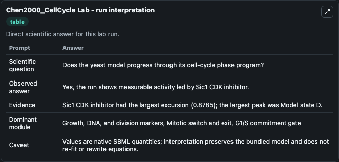
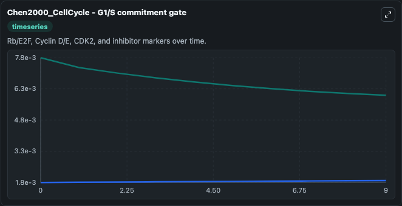
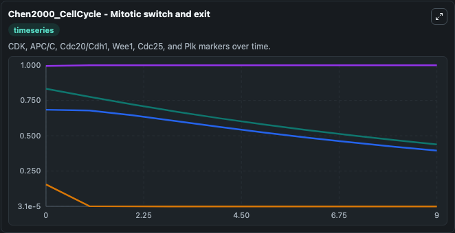
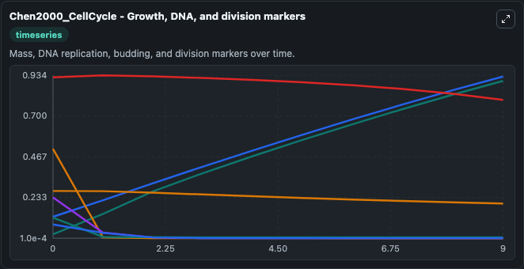
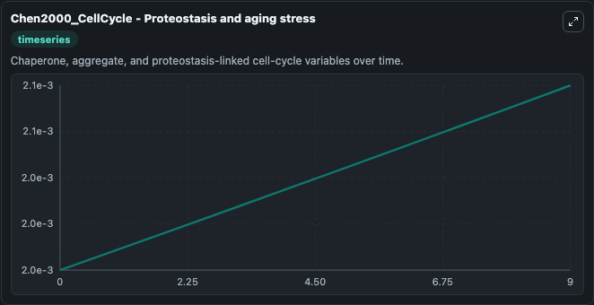
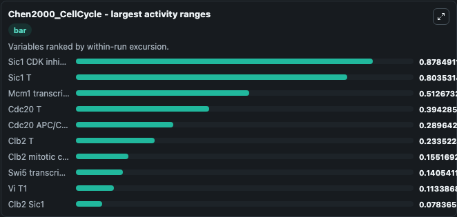
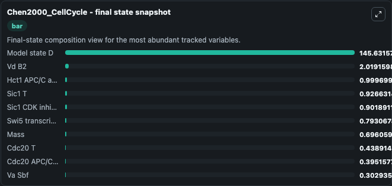
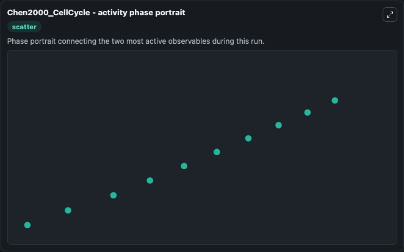

# Chen2000_CellCycle Lab

Single-model lab wrapper for Chen2000_CellCycle. This a model from the article: Kinetic analysis of a molecular model of the budding yeast cell cycle. Chen KC, Csikasz-Nagy A, Gyorffy B, Val J, Novak B, Tyson JJ.

This lab is a single-model Biosimulant wrapper for a cell-cycle simulation. The captured run uses the lab defaults and renders the model outputs as dark-mode visualizations for quick inspection and README embedding.

## Model Context

This a model from the article: Kinetic analysis of a molecular model of the budding yeast cell cycle. Chen KC, Csikasz-Nagy A, Gyorffy B, Val J, Novak B, Tyson JJ.

- Core model: Chen2000_CellCycle
- Runtime used by the lab: duration 10, step 1
- Controllable inputs: Hct1 T, Bck2 0, Cln3 Max
- Primary outputs: Cln2 G1 cyclin, Cdc20 APC/C activator, Cdc20 T, Hct1 APC/C activator, Clb2 Sic1, Sic1 T, Clb5 Sic1, Clb5 T, Clb2 T, Mass, and 19 more
- Tags: cellcycle, sbml, biomodels_ebi, faithful

## Output Visualizations

The images below were generated from a Biosimulant lab run in dark mode. Each capture corresponds to one rendered visualization from the run output panel.

<!-- BIOSIMULANT_VISUALS_START -->

### 1. Chen2000 Cellcycle Lab Run Interpretation

Run interpretation view that anchors the captured simulation: it summarizes the lab purpose, runtime, and how to read the generated cell-cycle outputs.

### 2. Chen2000 Cellcycle G1 S Commitment Gate

G1/S commitment view, focused on the regulatory variables that gate entry into DNA synthesis and cell-cycle progression.

### 3. Chen2000 Cellcycle Mitotic Switch And Exit

Mitotic switch and exit view, capturing late-cycle regulators and the transition out of mitosis.

### 4. Chen2000 Cellcycle Growth Dna And Division Markers

Growth, DNA, and division markers, linking mass accumulation and replication signals to cell-cycle state changes.

### 5. Chen2000 Cellcycle Proteostasis And Aging Stress

Checkpoint and stress-response time courses, showing how the configured run moves through DNA damage, surveillance, and arrest-related signals.

### 6. Chen2000 Cellcycle Largest Activity Ranges

Largest activity ranges chart, ranking the variables with the widest simulated movement so the dominant responses are easy to spot.

### 7. Chen2000 Cellcycle Final State Snapshot

Final state snapshot, comparing the end-of-run values for the selected cell-cycle variables.

### 8. Chen2000 Cellcycle Activity Phase Portrait

Activity phase portrait, showing pairwise movement between selected variables across the simulated trajectory.

<!-- BIOSIMULANT_VISUALS_END -->

## How to Read This Run

Use the time-course plots to see transient and steady-state behavior, the range or snapshot charts to identify the variables with the strongest response, and any phase-portrait view to inspect coupled regulator movement through the simulated trajectory. For this cell-cycle lab, the most useful comparison is usually between checkpoint, commitment, and mitotic-exit variables because those signals define where the simulated system sits in the cycle.

## Inputs

| Input | Context |
| --- | --- |
| Hct1 T | Controls Hct1 T in the lab model via `cellcycle_sbml_chen2000_cellcycle_biomd0000000675_model.hct1_t`. |
| Bck2 0 | Controls Bck2 0 in the lab model via `cellcycle_sbml_chen2000_cellcycle_biomd0000000675_model.bck2_0`. |
| Cln3 Max | Controls Cln3 Max in the lab model via `cellcycle_sbml_chen2000_cellcycle_biomd0000000675_model.cln3_max`. |

## Outputs

| Output | Context |
| --- | --- |
| Cln2 G1 cyclin | Tracks Cln2 G1 cyclin in the lab model via `cellcycle_sbml_chen2000_cellcycle_biomd0000000675_model.cln2_g1_cyclin`. |
| Cdc20 APC/C activator | Tracks Cdc20 APC/C activator in the lab model via `cellcycle_sbml_chen2000_cellcycle_biomd0000000675_model.cdc20_apc_c_activator`. |
| Cdc20 T | Tracks Cdc20 T in the lab model via `cellcycle_sbml_chen2000_cellcycle_biomd0000000675_model.cdc20_t`. |
| Hct1 APC/C activator | Tracks Hct1 APC/C activator in the lab model via `cellcycle_sbml_chen2000_cellcycle_biomd0000000675_model.hct1_apc_c_activator`. |
| Clb2 Sic1 | Tracks Clb2 Sic1 in the lab model via `cellcycle_sbml_chen2000_cellcycle_biomd0000000675_model.clb2_sic1`. |
| Sic1 T | Tracks Sic1 T in the lab model via `cellcycle_sbml_chen2000_cellcycle_biomd0000000675_model.sic1_t`. |
| Clb5 Sic1 | Tracks Clb5 Sic1 in the lab model via `cellcycle_sbml_chen2000_cellcycle_biomd0000000675_model.clb5_sic1`. |
| Clb5 T | Tracks Clb5 T in the lab model via `cellcycle_sbml_chen2000_cellcycle_biomd0000000675_model.clb5_t`. |
| Clb2 T | Tracks Clb2 T in the lab model via `cellcycle_sbml_chen2000_cellcycle_biomd0000000675_model.clb2_t`. |
| Mass | Tracks Mass in the lab model via `cellcycle_sbml_chen2000_cellcycle_biomd0000000675_model.mass`. |
| Replication origin state | Tracks Replication origin state in the lab model via `cellcycle_sbml_chen2000_cellcycle_biomd0000000675_model.replication_origin_state`. |
| Budding index | Tracks Budding index in the lab model via `cellcycle_sbml_chen2000_cellcycle_biomd0000000675_model.budding_index`. |
| Spindle state | Tracks Spindle state in the lab model via `cellcycle_sbml_chen2000_cellcycle_biomd0000000675_model.spindle_state`. |
| Bck2 G1 regulator | Tracks Bck2 G1 regulator in the lab model via `cellcycle_sbml_chen2000_cellcycle_biomd0000000675_model.bck2_g1_regulator`. |
| Clb2 mitotic cyclin | Tracks Clb2 mitotic cyclin in the lab model via `cellcycle_sbml_chen2000_cellcycle_biomd0000000675_model.clb2_mitotic_cyclin`. |
| Clb5 S-phase cyclin | Tracks Clb5 S-phase cyclin in the lab model via `cellcycle_sbml_chen2000_cellcycle_biomd0000000675_model.clb5_s_phase_cyclin`. |
| Cln3 Start cyclin | Tracks Cln3 Start cyclin in the lab model via `cellcycle_sbml_chen2000_cellcycle_biomd0000000675_model.cln3_start_cyclin`. |
| Model state D | Tracks Model state D in the lab model via `cellcycle_sbml_chen2000_cellcycle_biomd0000000675_model.model_state_d`. |
| MBF transcription factor | Tracks MBF transcription factor in the lab model via `cellcycle_sbml_chen2000_cellcycle_biomd0000000675_model.mbf_transcription_factor`. |
| Mcm1 transcription factor | Tracks Mcm1 transcription factor in the lab model via `cellcycle_sbml_chen2000_cellcycle_biomd0000000675_model.mcm1_transcription_factor`. |
| SBF transcription factor | Tracks SBF transcription factor in the lab model via `cellcycle_sbml_chen2000_cellcycle_biomd0000000675_model.sbf_transcription_factor`. |
| Sic1 CDK inhibitor | Tracks Sic1 CDK inhibitor in the lab model via `cellcycle_sbml_chen2000_cellcycle_biomd0000000675_model.sic1_cdk_inhibitor`. |
| Swi5 transcription factor | Tracks Swi5 transcription factor in the lab model via `cellcycle_sbml_chen2000_cellcycle_biomd0000000675_model.swi5_transcription_factor`. |
| Va Sbf | Tracks Va Sbf in the lab model via `cellcycle_sbml_chen2000_cellcycle_biomd0000000675_model.va_sbf`. |
| Vd2 Model state C1 | Tracks Vd2 Model state C1 in the lab model via `cellcycle_sbml_chen2000_cellcycle_biomd0000000675_model.vd2_model_state_c1`. |
| Vd B2 | Tracks Vd B2 in the lab model via `cellcycle_sbml_chen2000_cellcycle_biomd0000000675_model.vd_b2`. |
| Vd B5 | Tracks Vd B5 in the lab model via `cellcycle_sbml_chen2000_cellcycle_biomd0000000675_model.vd_b5`. |
| Vi 20 | Tracks Vi 20 in the lab model via `cellcycle_sbml_chen2000_cellcycle_biomd0000000675_model.vi_20`. |
| Vi T1 | Tracks Vi T1 in the lab model via `cellcycle_sbml_chen2000_cellcycle_biomd0000000675_model.vi_t1`. |

## Lab Files

- `lab.yaml` defines the Biosimulant lab wrapper, exposed inputs, outputs, and runtime settings.
- `wiring-layout.json` stores the canvas layout used by the lab UI.
- `models/core/model.yaml` contains the wrapped simulation model metadata.
- `models/core/README.md` contains the source model notes and provenance.
- `models/visualisation/model.yaml` defines the visualization model used to render the run outputs.
- `assets/` contains the generated dark-mode visualization captures embedded above.
