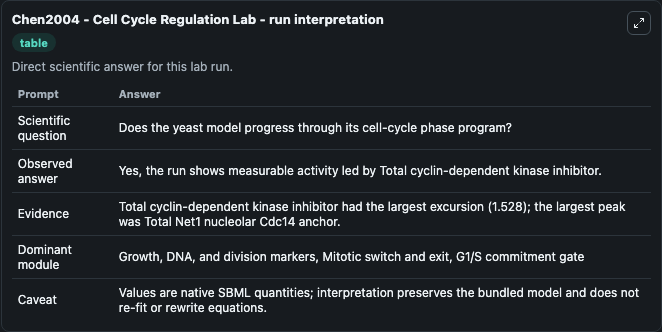
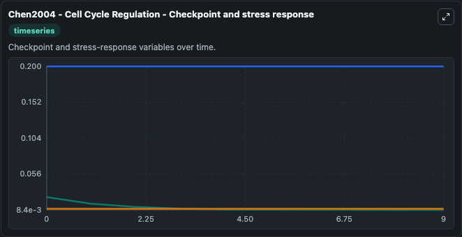
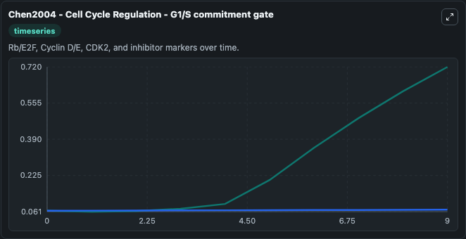
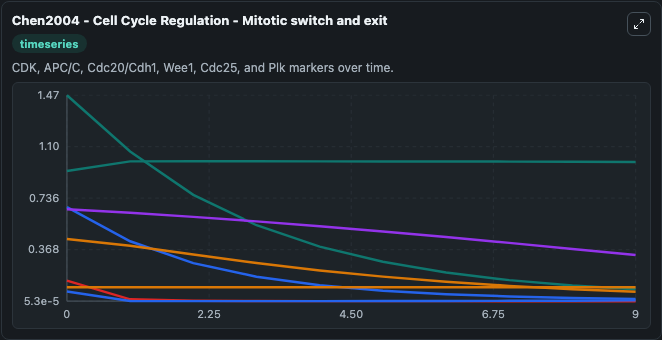
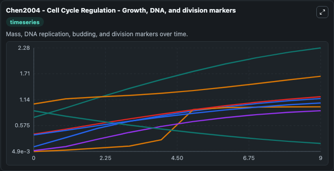
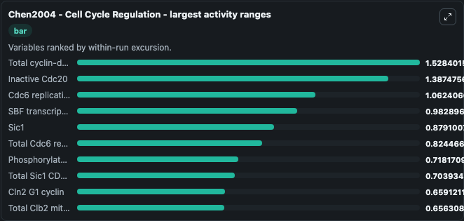
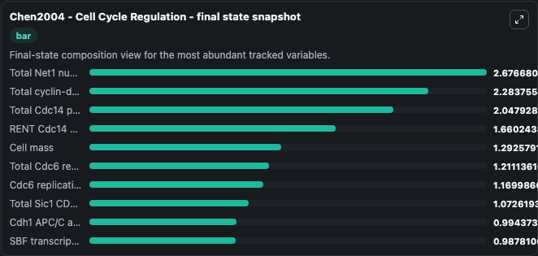
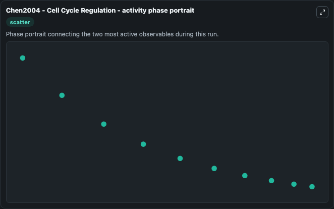

# Chen2004 - Cell Cycle Regulation Lab

Single-model lab wrapper for Chen2004 - Cell Cycle Regulation. Chen2004 - Cell Cycle Regulation This is a hypothetical model of cell cycle that describes the molecular mechanism for regulating DNA synthesis, bud emergence, mitosis, and cell division in budding ye. It can be used to explore cell-cycle regulation dynamics and compare checkpoint behavior across conditions.

This lab is a single-model Biosimulant wrapper for a cell-cycle simulation. The captured run uses the lab defaults and renders the model outputs as dark-mode visualizations for quick inspection and README embedding.

## Model Context

Chen2004 - Cell Cycle Regulation This is a hypothetical model of cell cycle that describes the molecular mechanism for regulating DNA synthesis, bud emergence, mitosis, and cell division in budding ye. It can be used to explore cell-cycle regulation dynamics and compare checkpoint behavior across conditions.

- Core model: Chen2004 - Cell Cycle Regulation
- Runtime used by the lab: duration 10, step 1
- Controllable inputs: CDC15i, Model state IE, Model state PE, Phosphorylated TEM1GD
- Primary outputs: Bub2, Budding index, Model state C2 (C2), Phosphorylated Model state C2, Model state C5 (C5), Phosphorylated Model state C5, Cdc14 phosphatase, Cdc15 mitotic exit kinase, Cdc20, Inactive Cdc20, and 40 more
- Tags: cellcycle, sbml, biomodels_ebi, faithful

## Output Visualizations

The images below were generated from a Biosimulant lab run in dark mode. Each capture corresponds to one rendered visualization from the run output panel.

<!-- BIOSIMULANT_VISUALS_START -->

### 1. Chen2004 Cell Cycle Regulation Lab Run Interpretation

Run interpretation view that anchors the captured simulation: it summarizes the lab purpose, runtime, and how to read the generated cell-cycle outputs.

### 2. Chen2004 Cell Cycle Regulation Checkpoint And Stress Response

Checkpoint and stress-response time courses, showing how the configured run moves through DNA damage, surveillance, and arrest-related signals.

### 3. Chen2004 Cell Cycle Regulation G1 S Commitment Gate

G1/S commitment view, focused on the regulatory variables that gate entry into DNA synthesis and cell-cycle progression.

### 4. Chen2004 Cell Cycle Regulation Mitotic Switch And Exit

Mitotic switch and exit view, capturing late-cycle regulators and the transition out of mitosis.

### 5. Chen2004 Cell Cycle Regulation Growth Dna And Division Markers

Growth, DNA, and division markers, linking mass accumulation and replication signals to cell-cycle state changes.

### 6. Chen2004 Cell Cycle Regulation Largest Activity Ranges

Largest activity ranges chart, ranking the variables with the widest simulated movement so the dominant responses are easy to spot.

### 7. Chen2004 Cell Cycle Regulation Final State Snapshot

Final state snapshot, comparing the end-of-run values for the selected cell-cycle variables.

### 8. Chen2004 Cell Cycle Regulation Activity Phase Portrait

Activity phase portrait, showing pairwise movement between selected variables across the simulated trajectory.

<!-- BIOSIMULANT_VISUALS_END -->

## How to Read This Run

Use the time-course plots to see transient and steady-state behavior, the range or snapshot charts to identify the variables with the strongest response, and any phase-portrait view to inspect coupled regulator movement through the simulated trajectory. For this cell-cycle lab, the most useful comparison is usually between checkpoint, commitment, and mitotic-exit variables because those signals define where the simulated system sits in the cycle.

## Inputs

| Input | Context |
| --- | --- |
| CDC15i | Controls CDC15i in the lab model via `cellcycle_sbml_chen2004_cell_cycle_regulation_biomd0000000056_model.cdc15i`. |
| Model state IE | Controls Model state IE in the lab model via `cellcycle_sbml_chen2004_cell_cycle_regulation_biomd0000000056_model.model_state_ie`. |
| Model state PE | Controls Model state PE in the lab model via `cellcycle_sbml_chen2004_cell_cycle_regulation_biomd0000000056_model.model_state_pe`. |
| Phosphorylated TEM1GD | Controls Phosphorylated TEM1GD in the lab model via `cellcycle_sbml_chen2004_cell_cycle_regulation_biomd0000000056_model.phosphorylated_tem1gd`. |

## Outputs

| Output | Context |
| --- | --- |
| Bub2 | Tracks Bub2 in the lab model via `cellcycle_sbml_chen2004_cell_cycle_regulation_biomd0000000056_model.bub2`. |
| Budding index | Tracks Budding index in the lab model via `cellcycle_sbml_chen2004_cell_cycle_regulation_biomd0000000056_model.budding_index`. |
| Model state C2 (C2) | Tracks Model state C2 (C2) in the lab model via `cellcycle_sbml_chen2004_cell_cycle_regulation_biomd0000000056_model.model_state_c2_c2`. |
| Phosphorylated Model state C2 | Tracks Phosphorylated Model state C2 in the lab model via `cellcycle_sbml_chen2004_cell_cycle_regulation_biomd0000000056_model.phosphorylated_model_state_c2`. |
| Model state C5 (C5) | Tracks Model state C5 (C5) in the lab model via `cellcycle_sbml_chen2004_cell_cycle_regulation_biomd0000000056_model.model_state_c5_c5`. |
| Phosphorylated Model state C5 | Tracks Phosphorylated Model state C5 in the lab model via `cellcycle_sbml_chen2004_cell_cycle_regulation_biomd0000000056_model.phosphorylated_model_state_c5`. |
| Cdc14 phosphatase | Tracks Cdc14 phosphatase in the lab model via `cellcycle_sbml_chen2004_cell_cycle_regulation_biomd0000000056_model.cdc14_phosphatase`. |
| Cdc15 mitotic exit kinase | Tracks Cdc15 mitotic exit kinase in the lab model via `cellcycle_sbml_chen2004_cell_cycle_regulation_biomd0000000056_model.cdc15_mitotic_exit_kinase`. |
| Cdc20 | Tracks Cdc20 in the lab model via `cellcycle_sbml_chen2004_cell_cycle_regulation_biomd0000000056_model.cdc20`. |
| Inactive Cdc20 | Tracks Inactive Cdc20 in the lab model via `cellcycle_sbml_chen2004_cell_cycle_regulation_biomd0000000056_model.inactive_cdc20`. |
| Cdc6 replication licensing factor | Tracks Cdc6 replication licensing factor in the lab model via `cellcycle_sbml_chen2004_cell_cycle_regulation_biomd0000000056_model.cdc6_replication_licensing_factor`. |
| Phosphorylated CDC6 | Tracks Phosphorylated CDC6 in the lab model via `cellcycle_sbml_chen2004_cell_cycle_regulation_biomd0000000056_model.phosphorylated_cdc6`. |
| Cdh1 APC/C activator | Tracks Cdh1 APC/C activator in the lab model via `cellcycle_sbml_chen2004_cell_cycle_regulation_biomd0000000056_model.cdh1_apc_c_activator`. |
| Inactive Cdh1 | Tracks Inactive Cdh1 in the lab model via `cellcycle_sbml_chen2004_cell_cycle_regulation_biomd0000000056_model.inactive_cdh1`. |
| Clb2 mitotic cyclin | Tracks Clb2 mitotic cyclin in the lab model via `cellcycle_sbml_chen2004_cell_cycle_regulation_biomd0000000056_model.clb2_mitotic_cyclin`. |
| Clb5 S-phase cyclin | Tracks Clb5 S-phase cyclin in the lab model via `cellcycle_sbml_chen2004_cell_cycle_regulation_biomd0000000056_model.clb5_s_phase_cyclin`. |
| Cln2 G1 cyclin | Tracks Cln2 G1 cyclin in the lab model via `cellcycle_sbml_chen2004_cell_cycle_regulation_biomd0000000056_model.cln2_g1_cyclin`. |
| Esp1 separase | Tracks Esp1 separase in the lab model via `cellcycle_sbml_chen2004_cell_cycle_regulation_biomd0000000056_model.esp1_separase`. |
| Model state F2 | Tracks Model state F2 in the lab model via `cellcycle_sbml_chen2004_cell_cycle_regulation_biomd0000000056_model.model_state_f2`. |
| Phosphorylated F2 | Tracks Phosphorylated F2 in the lab model via `cellcycle_sbml_chen2004_cell_cycle_regulation_biomd0000000056_model.phosphorylated_f2`. |
| Model state F5 | Tracks Model state F5 in the lab model via `cellcycle_sbml_chen2004_cell_cycle_regulation_biomd0000000056_model.model_state_f5`. |
| Phosphorylated F5 | Tracks Phosphorylated F5 in the lab model via `cellcycle_sbml_chen2004_cell_cycle_regulation_biomd0000000056_model.phosphorylated_f5`. |
| Phosphorylated IE | Tracks Phosphorylated IE in the lab model via `cellcycle_sbml_chen2004_cell_cycle_regulation_biomd0000000056_model.phosphorylated_ie`. |
| Lte1 mitotic exit regulator | Tracks Lte1 mitotic exit regulator in the lab model via `cellcycle_sbml_chen2004_cell_cycle_regulation_biomd0000000056_model.lte1_mitotic_exit_regulator`. |
| Mad2 spindle checkpoint protein | Tracks Mad2 spindle checkpoint protein in the lab model via `cellcycle_sbml_chen2004_cell_cycle_regulation_biomd0000000056_model.mad2_spindle_checkpoint_protein`. |
| Cell mass | Tracks Cell mass in the lab model via `cellcycle_sbml_chen2004_cell_cycle_regulation_biomd0000000056_model.cell_mass`. |
| Net1 nucleolar Cdc14 anchor | Tracks Net1 nucleolar Cdc14 anchor in the lab model via `cellcycle_sbml_chen2004_cell_cycle_regulation_biomd0000000056_model.net1_nucleolar_cdc14_anchor`. |
| Phosphorylated NET1 | Tracks Phosphorylated NET1 in the lab model via `cellcycle_sbml_chen2004_cell_cycle_regulation_biomd0000000056_model.phosphorylated_net1`. |
| Replication origin state | Tracks Replication origin state in the lab model via `cellcycle_sbml_chen2004_cell_cycle_regulation_biomd0000000056_model.replication_origin_state`. |
| Pds1 securin | Tracks Pds1 securin in the lab model via `cellcycle_sbml_chen2004_cell_cycle_regulation_biomd0000000056_model.pds1_securin`. |
| PPX phosphatase | Tracks PPX phosphatase in the lab model via `cellcycle_sbml_chen2004_cell_cycle_regulation_biomd0000000056_model.ppx_phosphatase`. |
| RENT Cdc14 sequestration complex | Tracks RENT Cdc14 sequestration complex in the lab model via `cellcycle_sbml_chen2004_cell_cycle_regulation_biomd0000000056_model.rent_cdc14_sequestration_complex`. |
| Phosphorylated RENT | Tracks Phosphorylated RENT in the lab model via `cellcycle_sbml_chen2004_cell_cycle_regulation_biomd0000000056_model.phosphorylated_rent`. |
| Sic1 | Tracks Sic1 in the lab model via `cellcycle_sbml_chen2004_cell_cycle_regulation_biomd0000000056_model.sic1`. |
| Phosphorylated Sic1 | Tracks Phosphorylated Sic1 in the lab model via `cellcycle_sbml_chen2004_cell_cycle_regulation_biomd0000000056_model.phosphorylated_sic1`. |
| Spindle state | Tracks Spindle state in the lab model via `cellcycle_sbml_chen2004_cell_cycle_regulation_biomd0000000056_model.spindle_state`. |
| Swi5 transcription factor | Tracks Swi5 transcription factor in the lab model via `cellcycle_sbml_chen2004_cell_cycle_regulation_biomd0000000056_model.swi5_transcription_factor`. |
| Phosphorylated SWI5 | Tracks Phosphorylated SWI5 in the lab model via `cellcycle_sbml_chen2004_cell_cycle_regulation_biomd0000000056_model.phosphorylated_swi5`. |
| Phosphorylated TEM1GT | Tracks Phosphorylated TEM1GT in the lab model via `cellcycle_sbml_chen2004_cell_cycle_regulation_biomd0000000056_model.phosphorylated_tem1gt`. |
| Bck2 G1 regulator | Tracks Bck2 G1 regulator in the lab model via `cellcycle_sbml_chen2004_cell_cycle_regulation_biomd0000000056_model.bck2_g1_regulator`. |
| Total Cdc14 phosphatase | Tracks Total Cdc14 phosphatase in the lab model via `cellcycle_sbml_chen2004_cell_cycle_regulation_biomd0000000056_model.total_cdc14_phosphatase`. |
| Total Cdc6 replication licensing factor | Tracks Total Cdc6 replication licensing factor in the lab model via `cellcycle_sbml_chen2004_cell_cycle_regulation_biomd0000000056_model.total_cdc6_replication_licensing_factor`. |
| Total cyclin-dependent kinase inhibitor | Tracks Total cyclin-dependent kinase inhibitor in the lab model via `cellcycle_sbml_chen2004_cell_cycle_regulation_biomd0000000056_model.total_cyclin_dependent_kinase_inhibitor`. |
| Total Clb2 mitotic cyclin | Tracks Total Clb2 mitotic cyclin in the lab model via `cellcycle_sbml_chen2004_cell_cycle_regulation_biomd0000000056_model.total_clb2_mitotic_cyclin`. |
| Total Clb5 S-phase cyclin | Tracks Total Clb5 S-phase cyclin in the lab model via `cellcycle_sbml_chen2004_cell_cycle_regulation_biomd0000000056_model.total_clb5_s_phase_cyclin`. |
| Cln3 Start cyclin | Tracks Cln3 Start cyclin in the lab model via `cellcycle_sbml_chen2004_cell_cycle_regulation_biomd0000000056_model.cln3_start_cyclin`. |
| Mcm1 | Tracks Mcm1 in the lab model via `cellcycle_sbml_chen2004_cell_cycle_regulation_biomd0000000056_model.mcm1`. |
| Total Net1 nucleolar Cdc14 anchor | Tracks Total Net1 nucleolar Cdc14 anchor in the lab model via `cellcycle_sbml_chen2004_cell_cycle_regulation_biomd0000000056_model.total_net1_nucleolar_cdc14_anchor`. |
| SBF transcription factor | Tracks SBF transcription factor in the lab model via `cellcycle_sbml_chen2004_cell_cycle_regulation_biomd0000000056_model.sbf_transcription_factor`. |
| Total Sic1 CDK inhibitor | Tracks Total Sic1 CDK inhibitor in the lab model via `cellcycle_sbml_chen2004_cell_cycle_regulation_biomd0000000056_model.total_sic1_cdk_inhibitor`. |

## Lab Files

- `lab.yaml` defines the Biosimulant lab wrapper, exposed inputs, outputs, and runtime settings.
- `wiring-layout.json` stores the canvas layout used by the lab UI.
- `models/core/model.yaml` contains the wrapped simulation model metadata.
- `models/core/README.md` contains the source model notes and provenance.
- `models/visualisation/model.yaml` defines the visualization model used to render the run outputs.
- `assets/` contains the generated dark-mode visualization captures embedded above.
