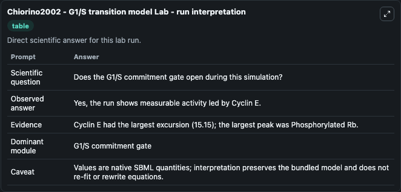
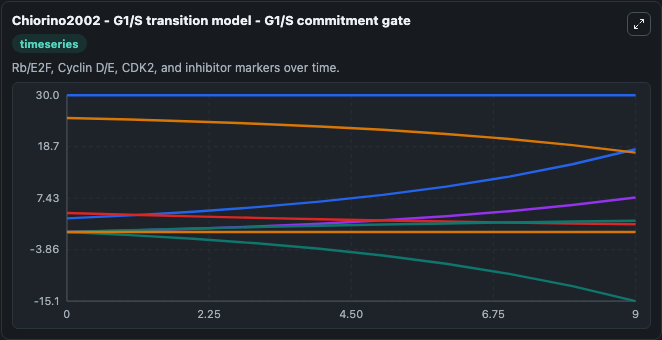
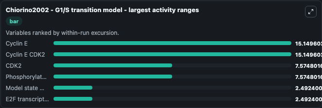
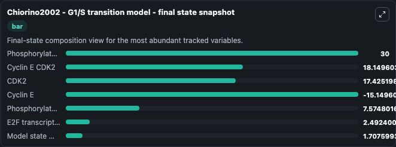
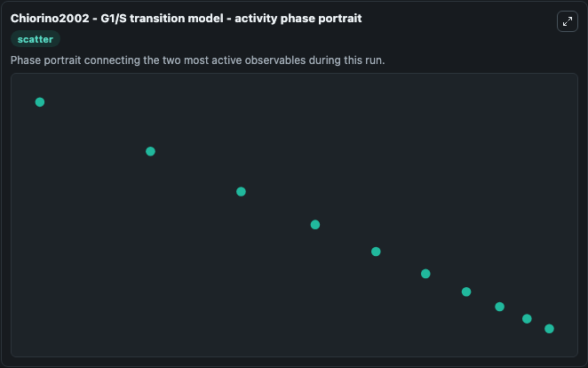

# Chiorino2002 - G1/S transition model Lab

Single-model lab wrapper for Chiorino2002 - G1/S transition model. mathematical approach to model the protein interactions regulating the transition from the G1 phase to the phase of DNA synthesis. Model is encoded by matthieu Maire and submitted to BioModels by kris.

This lab is a single-model Biosimulant wrapper for a cell-cycle simulation. The captured run uses the lab defaults and renders the model outputs as dark-mode visualizations for quick inspection and README embedding.

## Model Context

mathematical approach to model the protein interactions regulating the transition from the G1 phase to the phase of DNA synthesis. Model is encoded by matthieu Maire and submitted to BioModels by kris.

- Core model: Chiorino2002 - G1/S transition model
- Runtime used by the lab: duration 10, step 1
- Controllable inputs: none declared
- Primary outputs: Phosphorylated Rb, Phosphorylated Rb E2F, CDK2, Cyclin E, Cyclin E CDK2, Cyclin E CDK2 Phosphorylated Rb E2F, Phosphorylated Phosphorylated Rb, Phosphorylated Cyclin E, Cyclin E CDK2 P27, p27 CDK inhibitor, and 5 more
- Tags: cellcycle, sbml, biomodels_ebi, faithful

## Output Visualizations

The images below were generated from a Biosimulant lab run in dark mode. Each capture corresponds to one rendered visualization from the run output panel.

<!-- BIOSIMULANT_VISUALS_START -->

### 1. Chiorino2002 G1 S Transition Model Lab Run Interpretation

Run interpretation view that anchors the captured simulation: it summarizes the lab purpose, runtime, and how to read the generated cell-cycle outputs.

### 2. Chiorino2002 G1 S Transition Model G1 S Commitment Gate

G1/S commitment view, focused on the regulatory variables that gate entry into DNA synthesis and cell-cycle progression.

### 3. Chiorino2002 G1 S Transition Model Largest Activity Ranges

G1/S commitment view, focused on the regulatory variables that gate entry into DNA synthesis and cell-cycle progression.

### 4. Chiorino2002 G1 S Transition Model Final State Snapshot

G1/S commitment view, focused on the regulatory variables that gate entry into DNA synthesis and cell-cycle progression.

### 5. Chiorino2002 G1 S Transition Model Activity Phase Portrait

G1/S commitment view, focused on the regulatory variables that gate entry into DNA synthesis and cell-cycle progression.

<!-- BIOSIMULANT_VISUALS_END -->

## How to Read This Run

Use the time-course plots to see transient and steady-state behavior, the range or snapshot charts to identify the variables with the strongest response, and any phase-portrait view to inspect coupled regulator movement through the simulated trajectory. For this cell-cycle lab, the most useful comparison is usually between checkpoint, commitment, and mitotic-exit variables because those signals define where the simulated system sits in the cycle.

## Inputs

| Input | Context |
| --- | --- |
| - | No entries declared in `lab.yaml`. |

## Outputs

| Output | Context |
| --- | --- |
| Phosphorylated Rb | Tracks Phosphorylated Rb in the lab model via `cellcycle_sbml_chiorino2002_g1_s_transition_model_model2003180003_model.phosphorylated_rb`. |
| Phosphorylated Rb E2F | Tracks Phosphorylated Rb E2F in the lab model via `cellcycle_sbml_chiorino2002_g1_s_transition_model_model2003180003_model.phosphorylated_rb_e2f`. |
| CDK2 | Tracks CDK2 in the lab model via `cellcycle_sbml_chiorino2002_g1_s_transition_model_model2003180003_model.cdk2`. |
| Cyclin E | Tracks Cyclin E in the lab model via `cellcycle_sbml_chiorino2002_g1_s_transition_model_model2003180003_model.cyclin_e`. |
| Cyclin E CDK2 | Tracks Cyclin E CDK2 in the lab model via `cellcycle_sbml_chiorino2002_g1_s_transition_model_model2003180003_model.cyclin_e_cdk2`. |
| Cyclin E CDK2 Phosphorylated Rb E2F | Tracks Cyclin E CDK2 Phosphorylated Rb E2F in the lab model via `cellcycle_sbml_chiorino2002_g1_s_transition_model_model2003180003_model.cyclin_e_cdk2_phosphorylated_rb_e2f`. |
| Phosphorylated Phosphorylated Rb | Tracks Phosphorylated Phosphorylated Rb in the lab model via `cellcycle_sbml_chiorino2002_g1_s_transition_model_model2003180003_model.phosphorylated_phosphorylated_rb`. |
| Phosphorylated Cyclin E | Tracks Phosphorylated Cyclin E in the lab model via `cellcycle_sbml_chiorino2002_g1_s_transition_model_model2003180003_model.phosphorylated_cyclin_e`. |
| Cyclin E CDK2 P27 | Tracks Cyclin E CDK2 P27 in the lab model via `cellcycle_sbml_chiorino2002_g1_s_transition_model_model2003180003_model.cyclin_e_cdk2_p27`. |
| p27 CDK inhibitor | Tracks p27 CDK inhibitor in the lab model via `cellcycle_sbml_chiorino2002_g1_s_transition_model_model2003180003_model.p27_cdk_inhibitor`. |
| Cyclin E CDK2 Cyclin E CDK2 P27 | Tracks Cyclin E CDK2 Cyclin E CDK2 P27 in the lab model via `cellcycle_sbml_chiorino2002_g1_s_transition_model_model2003180003_model.cyclin_e_cdk2_cyclin_e_cdk2_p27`. |
| Phosphorylated P27 | Tracks Phosphorylated P27 in the lab model via `cellcycle_sbml_chiorino2002_g1_s_transition_model_model2003180003_model.phosphorylated_p27`. |
| Model state mRNA Cyclin E | Tracks Model state mRNA Cyclin E in the lab model via `cellcycle_sbml_chiorino2002_g1_s_transition_model_model2003180003_model.model_state_m_rna_cyclin_e`. |
| E2F transcription factor | Tracks E2F transcription factor in the lab model via `cellcycle_sbml_chiorino2002_g1_s_transition_model_model2003180003_model.e2f_transcription_factor`. |
| Model state mRNA E2F | Tracks Model state mRNA E2F in the lab model via `cellcycle_sbml_chiorino2002_g1_s_transition_model_model2003180003_model.model_state_m_rna_e2f`. |

## Lab Files

- `lab.yaml` defines the Biosimulant lab wrapper, exposed inputs, outputs, and runtime settings.
- `wiring-layout.json` stores the canvas layout used by the lab UI.
- `models/core/model.yaml` contains the wrapped simulation model metadata.
- `models/core/README.md` contains the source model notes and provenance.
- `models/visualisation/model.yaml` defines the visualization model used to render the run outputs.
- `assets/` contains the generated dark-mode visualization captures embedded above.
