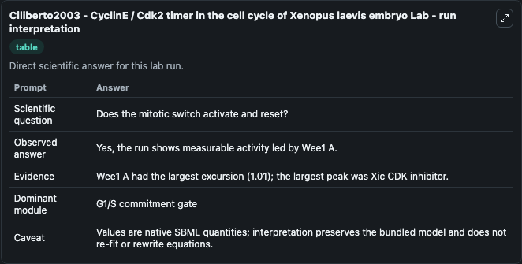
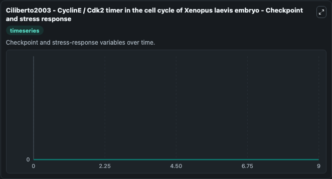
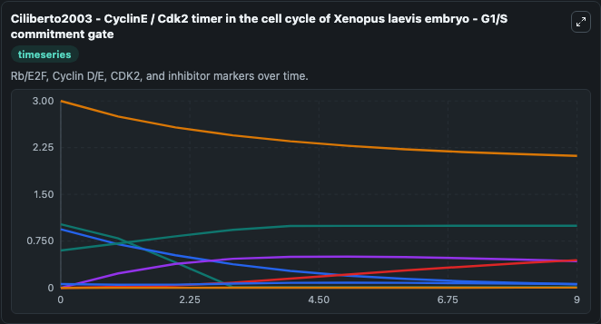
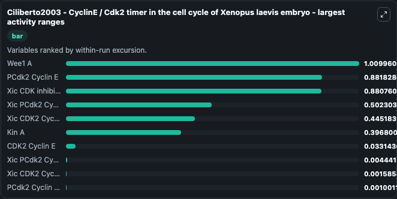
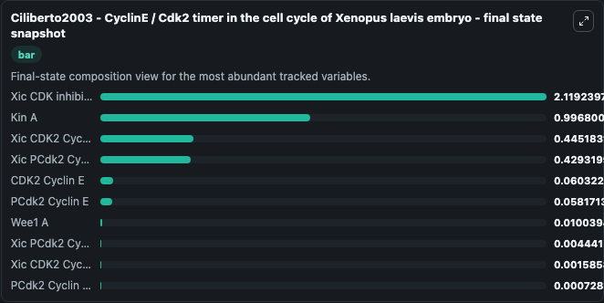
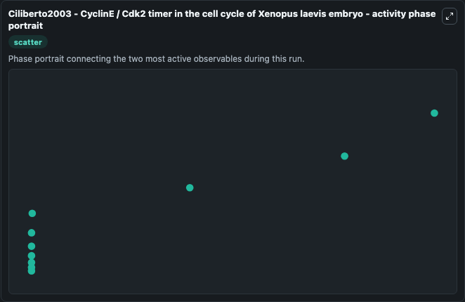

# Ciliberto2003 - CyclinE / Cdk2 timer in the cell cycle of Xenopus laevis embryo Lab

Single-model lab wrapper for Ciliberto2003 - CyclinE / Cdk2 timer in the cell cycle of Xenopus laevis embryo. Ciliberto2003 - CyclinE / Cdk2 timer in thecell cycle of Xenopus laevis embryo This model is described in the article: A kinetic model of the cyclin E/Cdk2 developmental timer in Xenopus laevis embryo. It can be used to explore cell-cycle regulation dynamics and compare checkpoint behavior across conditions.

This lab is a single-model Biosimulant wrapper for a cell-cycle simulation. The captured run uses the lab defaults and renders the model outputs as dark-mode visualizations for quick inspection and README embedding.

## Model Context

Ciliberto2003 - CyclinE / Cdk2 timer in thecell cycle of Xenopus laevis embryo This model is described in the article: A kinetic model of the cyclin E/Cdk2 developmental timer in Xenopus laevis embryo. It can be used to explore cell-cycle regulation dynamics and compare checkpoint behavior across conditions.

- Core model: Ciliberto2003 - CyclinE / Cdk2 timer in the cell cycle of Xenopus laevis embryo
- Runtime used by the lab: duration 10, step 1
- Controllable inputs: Wee1 Total, Cyclin Total, Xic Total
- Primary outputs: PCdk2 Cyclin E, CDK2 Cyclin E, Wee1 A, CDK2 Cyclin Erem, PCdk2 Cyclin Erem, Oxygen-dependent degradation factor Cyclin E, Xic CDK inhibitor, Xic CDK2 Cyclin E, Xic PCdk2 Cyclin E, Xic CDK2 Cyclin Erem, and 3 more
- Tags: cellcycle, sbml, biomodels_ebi, faithful

## Output Visualizations

The images below were generated from a Biosimulant lab run in dark mode. Each capture corresponds to one rendered visualization from the run output panel.

<!-- BIOSIMULANT_VISUALS_START -->

### 1. Ciliberto2003 Cycline Cdk2 Timer In The Cell Cycle Of Xenopus Laevis Embryo Lab 

Time-course visualization for PCdk2 Cyclin E, CDK2 Cyclin E, Wee1 A, CDK2 Cyclin Erem, PCdk2 Cyclin Erem, Oxygen-dependent degradation factor Cyclin E, and 7 additional outputs, showing how the model evolves across the captured run.

### 2. Ciliberto2003 Cycline Cdk2 Timer In The Cell Cycle Of Xenopus Laevis Embryo Chec

Time-course visualization for PCdk2 Cyclin E, CDK2 Cyclin E, Wee1 A, CDK2 Cyclin Erem, PCdk2 Cyclin Erem, Oxygen-dependent degradation factor Cyclin E, and 7 additional outputs, showing how the model evolves across the captured run.

### 3. Ciliberto2003 Cycline Cdk2 Timer In The Cell Cycle Of Xenopus Laevis Embryo G1 S

G1/S commitment view, focused on the regulatory variables that gate entry into DNA synthesis and cell-cycle progression.

### 4. Ciliberto2003 Cycline Cdk2 Timer In The Cell Cycle Of Xenopus Laevis Embryo Larg

Time-course visualization for PCdk2 Cyclin E, CDK2 Cyclin E, Wee1 A, CDK2 Cyclin Erem, PCdk2 Cyclin Erem, Oxygen-dependent degradation factor Cyclin E, and 7 additional outputs, showing how the model evolves across the captured run.

### 5. Ciliberto2003 Cycline Cdk2 Timer In The Cell Cycle Of Xenopus Laevis Embryo Fina

Time-course visualization for PCdk2 Cyclin E, CDK2 Cyclin E, Wee1 A, CDK2 Cyclin Erem, PCdk2 Cyclin Erem, Oxygen-dependent degradation factor Cyclin E, and 7 additional outputs, showing how the model evolves across the captured run.

### 6. Ciliberto2003 Cycline Cdk2 Timer In The Cell Cycle Of Xenopus Laevis Embryo Acti

Time-course visualization for PCdk2 Cyclin E, CDK2 Cyclin E, Wee1 A, CDK2 Cyclin Erem, PCdk2 Cyclin Erem, Oxygen-dependent degradation factor Cyclin E, and 7 additional outputs, showing how the model evolves across the captured run.

<!-- BIOSIMULANT_VISUALS_END -->

## How to Read This Run

Use the time-course plots to see transient and steady-state behavior, the range or snapshot charts to identify the variables with the strongest response, and any phase-portrait view to inspect coupled regulator movement through the simulated trajectory. For this cell-cycle lab, the most useful comparison is usually between checkpoint, commitment, and mitotic-exit variables because those signals define where the simulated system sits in the cycle.

## Inputs

| Input | Context |
| --- | --- |
| Wee1 Total | Controls Wee1 Total in the lab model via `cellcycle_sbml_ciliberto2003_cycline_cdk2_timer_in_the_cell_cyc_biomd0000000697_model.wee1_total`. |
| Cyclin Total | Controls Cyclin Total in the lab model via `cellcycle_sbml_ciliberto2003_cycline_cdk2_timer_in_the_cell_cyc_biomd0000000697_model.cyclin_total`. |
| Xic Total | Controls Xic Total in the lab model via `cellcycle_sbml_ciliberto2003_cycline_cdk2_timer_in_the_cell_cyc_biomd0000000697_model.xic_total`. |

## Outputs

| Output | Context |
| --- | --- |
| PCdk2 Cyclin E | Tracks PCdk2 Cyclin E in the lab model via `cellcycle_sbml_ciliberto2003_cycline_cdk2_timer_in_the_cell_cyc_biomd0000000697_model.pcdk2_cyclin_e`. |
| CDK2 Cyclin E | Tracks CDK2 Cyclin E in the lab model via `cellcycle_sbml_ciliberto2003_cycline_cdk2_timer_in_the_cell_cyc_biomd0000000697_model.cdk2_cyclin_e`. |
| Wee1 A | Tracks Wee1 A in the lab model via `cellcycle_sbml_ciliberto2003_cycline_cdk2_timer_in_the_cell_cyc_biomd0000000697_model.wee1_a`. |
| CDK2 Cyclin Erem | Tracks CDK2 Cyclin Erem in the lab model via `cellcycle_sbml_ciliberto2003_cycline_cdk2_timer_in_the_cell_cyc_biomd0000000697_model.cdk2_cyclin_erem`. |
| PCdk2 Cyclin Erem | Tracks PCdk2 Cyclin Erem in the lab model via `cellcycle_sbml_ciliberto2003_cycline_cdk2_timer_in_the_cell_cyc_biomd0000000697_model.pcdk2_cyclin_erem`. |
| Oxygen-dependent degradation factor Cyclin E | Tracks Oxygen-dependent degradation factor Cyclin E in the lab model via `cellcycle_sbml_ciliberto2003_cycline_cdk2_timer_in_the_cell_cyc_biomd0000000697_model.oxygen_dependent_degradation_factor_cyclin_e`. |
| Xic CDK inhibitor | Tracks Xic CDK inhibitor in the lab model via `cellcycle_sbml_ciliberto2003_cycline_cdk2_timer_in_the_cell_cyc_biomd0000000697_model.xic_cdk_inhibitor`. |
| Xic CDK2 Cyclin E | Tracks Xic CDK2 Cyclin E in the lab model via `cellcycle_sbml_ciliberto2003_cycline_cdk2_timer_in_the_cell_cyc_biomd0000000697_model.xic_cdk2_cyclin_e`. |
| Xic PCdk2 Cyclin E | Tracks Xic PCdk2 Cyclin E in the lab model via `cellcycle_sbml_ciliberto2003_cycline_cdk2_timer_in_the_cell_cyc_biomd0000000697_model.xic_pcdk2_cyclin_e`. |
| Xic CDK2 Cyclin Erem | Tracks Xic CDK2 Cyclin Erem in the lab model via `cellcycle_sbml_ciliberto2003_cycline_cdk2_timer_in_the_cell_cyc_biomd0000000697_model.xic_cdk2_cyclin_erem`. |
| Xic PCdk2 Cyclin Erem | Tracks Xic PCdk2 Cyclin Erem in the lab model via `cellcycle_sbml_ciliberto2003_cycline_cdk2_timer_in_the_cell_cyc_biomd0000000697_model.xic_pcdk2_cyclin_erem`. |
| Removed Xic inhibitor pool | Tracks Removed Xic inhibitor pool in the lab model via `cellcycle_sbml_ciliberto2003_cycline_cdk2_timer_in_the_cell_cyc_biomd0000000697_model.removed_xic_inhibitor_pool`. |
| Kin A | Tracks Kin A in the lab model via `cellcycle_sbml_ciliberto2003_cycline_cdk2_timer_in_the_cell_cyc_biomd0000000697_model.kin_a`. |

## Lab Files

- `lab.yaml` defines the Biosimulant lab wrapper, exposed inputs, outputs, and runtime settings.
- `wiring-layout.json` stores the canvas layout used by the lab UI.
- `models/core/model.yaml` contains the wrapped simulation model metadata.
- `models/core/README.md` contains the source model notes and provenance.
- `models/visualisation/model.yaml` defines the visualization model used to render the run outputs.
- `assets/` contains the generated dark-mode visualization captures embedded above.
