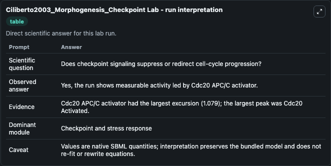
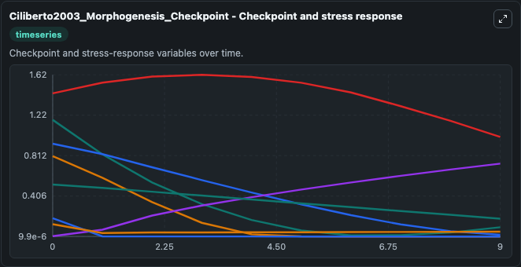
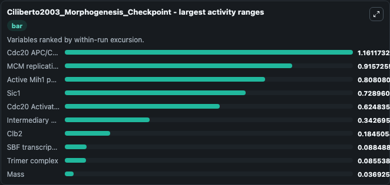
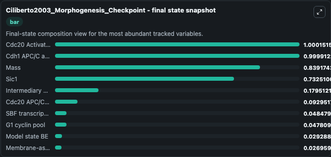
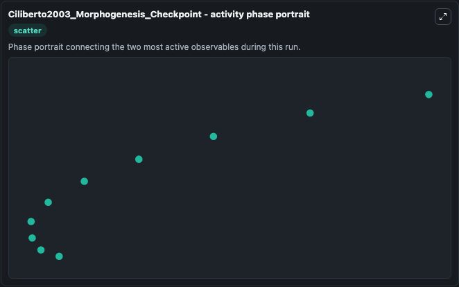

# Ciliberto2003_Morphogenesis_Checkpoint Lab

Single-model lab wrapper for Ciliberto2003_Morphogenesis_Checkpoint. This a model from the article: Mathematical model of the morphogenesis checkpoint in budding yeast. It can be used to explore cell-cycle regulation dynamics and compare checkpoint behavior across conditions.

This lab is a single-model Biosimulant wrapper for a cell-cycle simulation. The captured run uses the lab defaults and renders the model outputs as dark-mode visualizations for quick inspection and README embedding.

## Model Context

This a model from the article: Mathematical model of the morphogenesis checkpoint in budding yeast. It can be used to explore cell-cycle regulation dynamics and compare checkpoint behavior across conditions.

- Core model: Ciliberto2003_Morphogenesis_Checkpoint
- Runtime used by the lab: duration 10, step 1
- Controllable inputs: none declared
- Primary outputs: Trimer complex, Clb2, Sic1, Phosphorylated trimer complex, Phosphorylated Clb2, SBF transcription factor, Intermediary Enzyme, Cdc20 Activated, Cdc20 APC/C activator, Cdh1 APC/C activator, and 9 more
- Tags: cellcycle, sbml, biomodels_ebi, faithful

## Output Visualizations

The images below were generated from a Biosimulant lab run in dark mode. Each capture corresponds to one rendered visualization from the run output panel.

<!-- BIOSIMULANT_VISUALS_START -->

### 1. Ciliberto2003 Morphogenesis Checkpoint Lab Run Interpretation

Run interpretation view that anchors the captured simulation: it summarizes the lab purpose, runtime, and how to read the generated cell-cycle outputs.

### 2. Ciliberto2003 Morphogenesis Checkpoint Checkpoint And Stress Response

Checkpoint and stress-response time courses, showing how the configured run moves through DNA damage, surveillance, and arrest-related signals.

### 3. Ciliberto2003 Morphogenesis Checkpoint Largest Activity Ranges

Checkpoint and stress-response time courses, showing how the configured run moves through DNA damage, surveillance, and arrest-related signals.

### 4. Ciliberto2003 Morphogenesis Checkpoint Final State Snapshot

Checkpoint and stress-response time courses, showing how the configured run moves through DNA damage, surveillance, and arrest-related signals.

### 5. Ciliberto2003 Morphogenesis Checkpoint Activity Phase Portrait

Checkpoint and stress-response time courses, showing how the configured run moves through DNA damage, surveillance, and arrest-related signals.

<!-- BIOSIMULANT_VISUALS_END -->

## How to Read This Run

Use the time-course plots to see transient and steady-state behavior, the range or snapshot charts to identify the variables with the strongest response, and any phase-portrait view to inspect coupled regulator movement through the simulated trajectory. For this cell-cycle lab, the most useful comparison is usually between checkpoint, commitment, and mitotic-exit variables because those signals define where the simulated system sits in the cycle.

## Inputs

| Input | Context |
| --- | --- |
| - | No entries declared in `lab.yaml`. |

## Outputs

| Output | Context |
| --- | --- |
| Trimer complex | Tracks Trimer complex in the lab model via `cellcycle_sbml_ciliberto2003_morphogenesis_checkpoint_biomd0000000297_model.trimer_complex`. |
| Clb2 | Tracks Clb2 in the lab model via `cellcycle_sbml_ciliberto2003_morphogenesis_checkpoint_biomd0000000297_model.clb2`. |
| Sic1 | Tracks Sic1 in the lab model via `cellcycle_sbml_ciliberto2003_morphogenesis_checkpoint_biomd0000000297_model.sic1`. |
| Phosphorylated trimer complex | Tracks Phosphorylated trimer complex in the lab model via `cellcycle_sbml_ciliberto2003_morphogenesis_checkpoint_biomd0000000297_model.phosphorylated_trimer_complex`. |
| Phosphorylated Clb2 | Tracks Phosphorylated Clb2 in the lab model via `cellcycle_sbml_ciliberto2003_morphogenesis_checkpoint_biomd0000000297_model.phosphorylated_clb2`. |
| SBF transcription factor | Tracks SBF transcription factor in the lab model via `cellcycle_sbml_ciliberto2003_morphogenesis_checkpoint_biomd0000000297_model.sbf_transcription_factor`. |
| Intermediary Enzyme | Tracks Intermediary Enzyme in the lab model via `cellcycle_sbml_ciliberto2003_morphogenesis_checkpoint_biomd0000000297_model.intermediary_enzyme`. |
| Cdc20 Activated | Tracks Cdc20 Activated in the lab model via `cellcycle_sbml_ciliberto2003_morphogenesis_checkpoint_biomd0000000297_model.cdc20_activated`. |
| Cdc20 APC/C activator | Tracks Cdc20 APC/C activator in the lab model via `cellcycle_sbml_ciliberto2003_morphogenesis_checkpoint_biomd0000000297_model.cdc20_apc_c_activator`. |
| Cdh1 APC/C activator | Tracks Cdh1 APC/C activator in the lab model via `cellcycle_sbml_ciliberto2003_morphogenesis_checkpoint_biomd0000000297_model.cdh1_apc_c_activator`. |
| Swe1 inhibitory kinase | Tracks Swe1 inhibitory kinase in the lab model via `cellcycle_sbml_ciliberto2003_morphogenesis_checkpoint_biomd0000000297_model.swe1_inhibitory_kinase`. |
| Membrane-associated Swe1 | Tracks Membrane-associated Swe1 in the lab model via `cellcycle_sbml_ciliberto2003_morphogenesis_checkpoint_biomd0000000297_model.membrane_associated_swe1`. |
| Phosphorylated Swe1 | Tracks Phosphorylated Swe1 in the lab model via `cellcycle_sbml_ciliberto2003_morphogenesis_checkpoint_biomd0000000297_model.phosphorylated_swe1`. |
| Membrane-associated phosphorylated Swe1 | Tracks Membrane-associated phosphorylated Swe1 in the lab model via `cellcycle_sbml_ciliberto2003_morphogenesis_checkpoint_biomd0000000297_model.membrane_associated_phosphorylated_swe1`. |
| Active Mih1 phosphatase | Tracks Active Mih1 phosphatase in the lab model via `cellcycle_sbml_ciliberto2003_morphogenesis_checkpoint_biomd0000000297_model.active_mih1_phosphatase`. |
| MCM replication licensing complex | Tracks MCM replication licensing complex in the lab model via `cellcycle_sbml_ciliberto2003_morphogenesis_checkpoint_biomd0000000297_model.mcm_replication_licensing_complex`. |
| Model state BE | Tracks Model state BE in the lab model via `cellcycle_sbml_ciliberto2003_morphogenesis_checkpoint_biomd0000000297_model.model_state_be`. |
| G1 cyclin pool | Tracks G1 cyclin pool in the lab model via `cellcycle_sbml_ciliberto2003_morphogenesis_checkpoint_biomd0000000297_model.g1_cyclin_pool`. |
| Mass | Tracks Mass in the lab model via `cellcycle_sbml_ciliberto2003_morphogenesis_checkpoint_biomd0000000297_model.mass`. |

## Lab Files

- `lab.yaml` defines the Biosimulant lab wrapper, exposed inputs, outputs, and runtime settings.
- `wiring-layout.json` stores the canvas layout used by the lab UI.
- `models/core/model.yaml` contains the wrapped simulation model metadata.
- `models/core/README.md` contains the source model notes and provenance.
- `models/visualisation/model.yaml` defines the visualization model used to render the run outputs.
- `assets/` contains the generated dark-mode visualization captures embedded above.
