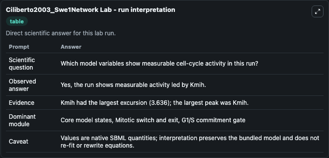
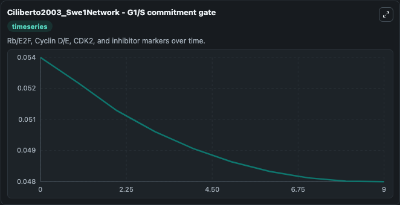
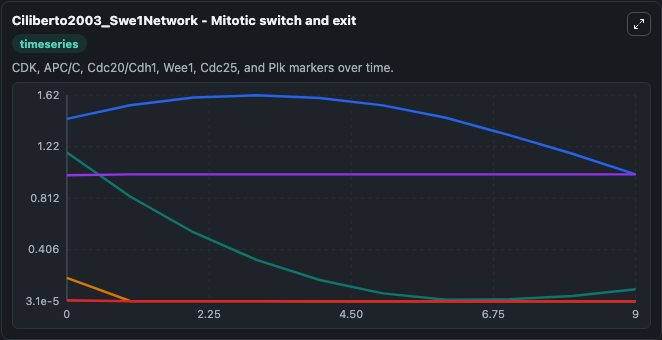
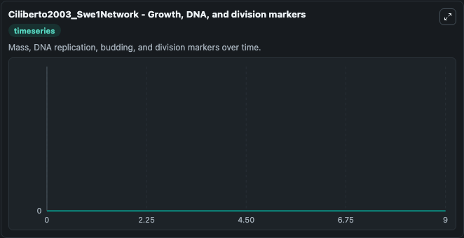
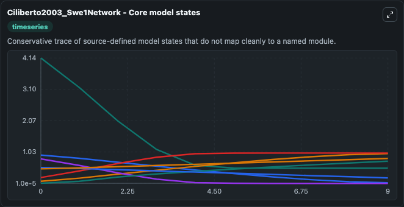
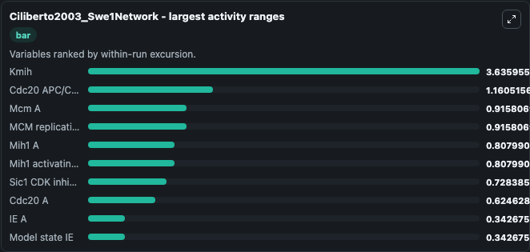
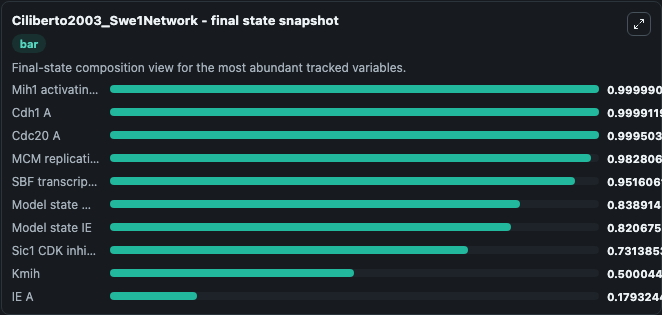
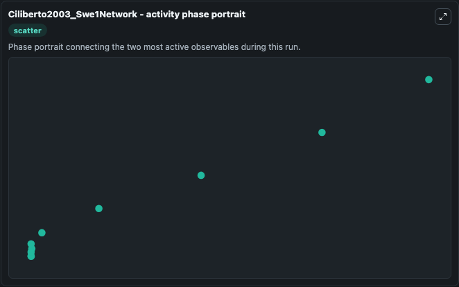

# Ciliberto2003_Swe1Network Lab

Single-model lab wrapper for Ciliberto2003_Swe1Network. This a model from the article: Mathematical model of the morphogenesis checkpoint in budding yeast. It can be used to explore cell-cycle regulation dynamics and compare checkpoint behavior across conditions.

This lab is a single-model Biosimulant wrapper for a cell-cycle simulation. The captured run uses the lab defaults and renders the model outputs as dark-mode visualizations for quick inspection and README embedding.

## Model Context

This a model from the article: Mathematical model of the morphogenesis checkpoint in budding yeast. It can be used to explore cell-cycle regulation dynamics and compare checkpoint behavior across conditions.

- Core model: Ciliberto2003_Swe1Network
- Runtime used by the lab: duration 10, step 1
- Controllable inputs: none declared
- Primary outputs: Clb2 mitotic cyclin, Phosphorylated Clb2, Trimer complex, Phosphorylated trimer complex, Mcm A, Sic1 CDK inhibitor, Mih1 A, IE A, Cdc20 A, Cdc20 APC/C activator, and 18 more
- Tags: cellcycle, sbml, biomodels_ebi, faithful

## Output Visualizations

The images below were generated from a Biosimulant lab run in dark mode. Each capture corresponds to one rendered visualization from the run output panel.

<!-- BIOSIMULANT_VISUALS_START -->

### 1. Ciliberto2003 Swe1network Lab Run Interpretation

Run interpretation view that anchors the captured simulation: it summarizes the lab purpose, runtime, and how to read the generated cell-cycle outputs.

### 2. Ciliberto2003 Swe1network G1 S Commitment Gate

G1/S commitment view, focused on the regulatory variables that gate entry into DNA synthesis and cell-cycle progression.

### 3. Ciliberto2003 Swe1network Mitotic Switch And Exit

Mitotic switch and exit view, capturing late-cycle regulators and the transition out of mitosis.

### 4. Ciliberto2003 Swe1network Growth Dna And Division Markers

Growth, DNA, and division markers, linking mass accumulation and replication signals to cell-cycle state changes.

### 5. Ciliberto2003 Swe1network Core Model States

Core model state trajectories for Clb2 mitotic cyclin, Phosphorylated Clb2, Trimer complex, Phosphorylated trimer complex, Mcm A, Sic1 CDK inhibitor, and 22 additional outputs, using the lab default initial conditions and runtime.

### 6. Ciliberto2003 Swe1network Largest Activity Ranges

Largest activity ranges chart, ranking the variables with the widest simulated movement so the dominant responses are easy to spot.

### 7. Ciliberto2003 Swe1network Final State Snapshot

Final state snapshot, comparing the end-of-run values for the selected cell-cycle variables.

### 8. Ciliberto2003 Swe1network Activity Phase Portrait

Activity phase portrait, showing pairwise movement between selected variables across the simulated trajectory.

<!-- BIOSIMULANT_VISUALS_END -->

## How to Read This Run

Use the time-course plots to see transient and steady-state behavior, the range or snapshot charts to identify the variables with the strongest response, and any phase-portrait view to inspect coupled regulator movement through the simulated trajectory. For this cell-cycle lab, the most useful comparison is usually between checkpoint, commitment, and mitotic-exit variables because those signals define where the simulated system sits in the cycle.

## Inputs

| Input | Context |
| --- | --- |
| - | No entries declared in `lab.yaml`. |

## Outputs

| Output | Context |
| --- | --- |
| Clb2 mitotic cyclin | Tracks Clb2 mitotic cyclin in the lab model via `cellcycle_sbml_ciliberto2003_swe1network_model0913285268_model.clb2_mitotic_cyclin`. |
| Phosphorylated Clb2 | Tracks Phosphorylated Clb2 in the lab model via `cellcycle_sbml_ciliberto2003_swe1network_model0913285268_model.phosphorylated_clb2`. |
| Trimer complex | Tracks Trimer complex in the lab model via `cellcycle_sbml_ciliberto2003_swe1network_model0913285268_model.trimer_complex`. |
| Phosphorylated trimer complex | Tracks Phosphorylated trimer complex in the lab model via `cellcycle_sbml_ciliberto2003_swe1network_model0913285268_model.phosphorylated_trimer_complex`. |
| Mcm A | Tracks Mcm A in the lab model via `cellcycle_sbml_ciliberto2003_swe1network_model0913285268_model.mcm_a`. |
| Sic1 CDK inhibitor | Tracks Sic1 CDK inhibitor in the lab model via `cellcycle_sbml_ciliberto2003_swe1network_model0913285268_model.sic1_cdk_inhibitor`. |
| Mih1 A | Tracks Mih1 A in the lab model via `cellcycle_sbml_ciliberto2003_swe1network_model0913285268_model.mih1_a`. |
| IE A | Tracks IE A in the lab model via `cellcycle_sbml_ciliberto2003_swe1network_model0913285268_model.ie_a`. |
| Cdc20 A | Tracks Cdc20 A in the lab model via `cellcycle_sbml_ciliberto2003_swe1network_model0913285268_model.cdc20_a`. |
| Cdc20 APC/C activator | Tracks Cdc20 APC/C activator in the lab model via `cellcycle_sbml_ciliberto2003_swe1network_model0913285268_model.cdc20_apc_c_activator`. |
| Cdh1 A | Tracks Cdh1 A in the lab model via `cellcycle_sbml_ciliberto2003_swe1network_model0913285268_model.cdh1_a`. |
| G1 cyclin pool | Tracks G1 cyclin pool in the lab model via `cellcycle_sbml_ciliberto2003_swe1network_model0913285268_model.g1_cyclin_pool`. |
| SBF A | Tracks SBF A in the lab model via `cellcycle_sbml_ciliberto2003_swe1network_model0913285268_model.sbf_a`. |
| Swe1 inhibitory kinase | Tracks Swe1 inhibitory kinase in the lab model via `cellcycle_sbml_ciliberto2003_swe1network_model0913285268_model.swe1_inhibitory_kinase`. |
| Phosphorylated Swe1 | Tracks Phosphorylated Swe1 in the lab model via `cellcycle_sbml_ciliberto2003_swe1network_model0913285268_model.phosphorylated_swe1`. |
| Membrane-associated Swe1 | Tracks Membrane-associated Swe1 in the lab model via `cellcycle_sbml_ciliberto2003_swe1network_model0913285268_model.membrane_associated_swe1`. |
| Membrane-associated phosphorylated Swe1 | Tracks Membrane-associated phosphorylated Swe1 in the lab model via `cellcycle_sbml_ciliberto2003_swe1network_model0913285268_model.membrane_associated_phosphorylated_swe1`. |
| Model state BE | Tracks Model state BE in the lab model via `cellcycle_sbml_ciliberto2003_swe1network_model0913285268_model.model_state_be`. |
| Model state M (M) | Tracks Model state M (M) in the lab model via `cellcycle_sbml_ciliberto2003_swe1network_model0913285268_model.model_state_m_m`. |
| Budding index | Tracks Budding index in the lab model via `cellcycle_sbml_ciliberto2003_swe1network_model0913285268_model.budding_index`. |
| Cdh1 APC/C activator | Tracks Cdh1 APC/C activator in the lab model via `cellcycle_sbml_ciliberto2003_swe1network_model0913285268_model.cdh1_apc_c_activator`. |
| Model state IE | Tracks Model state IE in the lab model via `cellcycle_sbml_ciliberto2003_swe1network_model0913285268_model.model_state_ie`. |
| MCM replication licensing complex | Tracks MCM replication licensing complex in the lab model via `cellcycle_sbml_ciliberto2003_swe1network_model0913285268_model.mcm_replication_licensing_complex`. |
| Mih1 activating phosphatase | Tracks Mih1 activating phosphatase in the lab model via `cellcycle_sbml_ciliberto2003_swe1network_model0913285268_model.mih1_activating_phosphatase`. |
| SBF transcription factor | Tracks SBF transcription factor in the lab model via `cellcycle_sbml_ciliberto2003_swe1network_model0913285268_model.sbf_transcription_factor`. |
| Swe1 Total | Tracks Swe1 Total in the lab model via `cellcycle_sbml_ciliberto2003_swe1network_model0913285268_model.swe1_total`. |
| Kmih | Tracks Kmih in the lab model via `cellcycle_sbml_ciliberto2003_swe1network_model0913285268_model.kmih`. |
| Kswe | Tracks Kswe in the lab model via `cellcycle_sbml_ciliberto2003_swe1network_model0913285268_model.kswe`. |

## Lab Files

- `lab.yaml` defines the Biosimulant lab wrapper, exposed inputs, outputs, and runtime settings.
- `wiring-layout.json` stores the canvas layout used by the lab UI.
- `models/core/model.yaml` contains the wrapped simulation model metadata.
- `models/core/README.md` contains the source model notes and provenance.
- `models/visualisation/model.yaml` defines the visualization model used to render the run outputs.
- `assets/` contains the generated dark-mode visualization captures embedded above.
