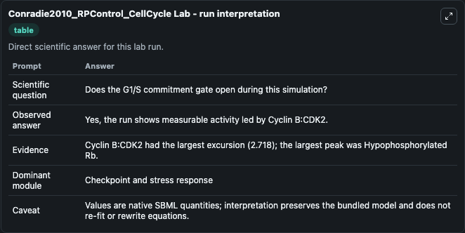
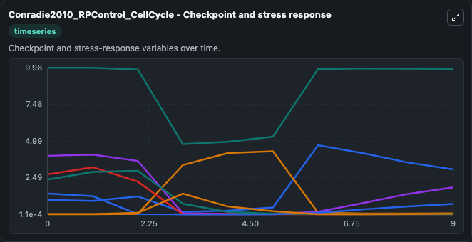
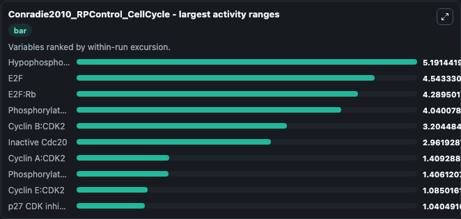
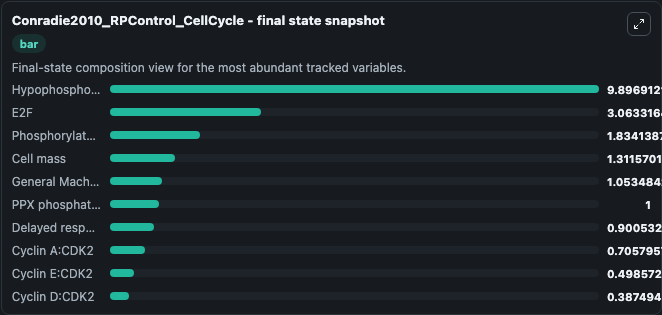
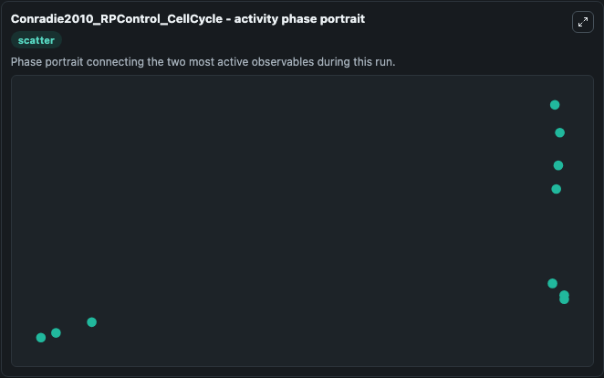

# Conradie2010_RPControl_CellCycle Lab

Single-model lab wrapper for Conradie2010_RPControl_CellCycle. This model is from the article: Restriction point control of the mammalian cell cycle via the cyclin E/Cdk2:p27 complex. Conradie R, Bruggeman FJ, Ciliberto A, Csik\u00e1sz-Nagy A, Nov\u00e1k B, Westerhoff HV,.

This lab is a single-model Biosimulant wrapper for a cell-cycle simulation. The captured run uses the lab defaults and renders the model outputs as dark-mode visualizations for quick inspection and README embedding.

## Model Context

This model is from the article: Restriction point control of the mammalian cell cycle via the cyclin E/Cdk2:p27 complex. Conradie R, Bruggeman FJ, Ciliberto A, Csikász-Nagy A, Novák B, Westerhoff HV,.

- Core model: Conradie2010_RPControl_CellCycle
- Runtime used by the lab: duration 10, step 1
- Controllable inputs: none declared
- Primary outputs: Cdc20, Cdh1, Cyclin A:CDK2, Cyclin B:CDK2, Cyclin D:CDK2, Cyclin E:CDK2, Delayed response gene module, E2F, E2F:Rb, Early response gene module, and 13 more
- Tags: cellcycle, sbml, biomodels_ebi, faithful

## Output Visualizations

The images below were generated from a Biosimulant lab run in dark mode. Each capture corresponds to one rendered visualization from the run output panel.

<!-- BIOSIMULANT_VISUALS_START -->

### 1. Conradie2010 Rpcontrol Cellcycle Lab Run Interpretation

Run interpretation view that anchors the captured simulation: it summarizes the lab purpose, runtime, and how to read the generated cell-cycle outputs.

### 2. Conradie2010 Rpcontrol Cellcycle Checkpoint And Stress Response

Checkpoint and stress-response time courses, showing how the configured run moves through DNA damage, surveillance, and arrest-related signals.

### 3. Conradie2010 Rpcontrol Cellcycle Largest Activity Ranges

Largest activity ranges chart, ranking the variables with the widest simulated movement so the dominant responses are easy to spot.

### 4. Conradie2010 Rpcontrol Cellcycle Final State Snapshot

Final state snapshot, comparing the end-of-run values for the selected cell-cycle variables.

### 5. Conradie2010 Rpcontrol Cellcycle Activity Phase Portrait

Activity phase portrait, showing pairwise movement between selected variables across the simulated trajectory.

<!-- BIOSIMULANT_VISUALS_END -->

## How to Read This Run

Use the time-course plots to see transient and steady-state behavior, the range or snapshot charts to identify the variables with the strongest response, and any phase-portrait view to inspect coupled regulator movement through the simulated trajectory. For this cell-cycle lab, the most useful comparison is usually between checkpoint, commitment, and mitotic-exit variables because those signals define where the simulated system sits in the cycle.

## Inputs

| Input | Context |
| --- | --- |
| - | No entries declared in `lab.yaml`. |

## Outputs

| Output | Context |
| --- | --- |
| Cdc20 | Tracks Cdc20 in the lab model via `cellcycle_sbml_conradie2010_rpcontrol_cellcycle_biomd0000000265_model.cdc20`. |
| Cdh1 | Tracks Cdh1 in the lab model via `cellcycle_sbml_conradie2010_rpcontrol_cellcycle_biomd0000000265_model.cdh1`. |
| Cyclin A:CDK2 | Tracks Cyclin A:CDK2 in the lab model via `cellcycle_sbml_conradie2010_rpcontrol_cellcycle_biomd0000000265_model.cyclin_a_cdk2`. |
| Cyclin B:CDK2 | Tracks Cyclin B:CDK2 in the lab model via `cellcycle_sbml_conradie2010_rpcontrol_cellcycle_biomd0000000265_model.cyclin_b_cdk2`. |
| Cyclin D:CDK2 | Tracks Cyclin D:CDK2 in the lab model via `cellcycle_sbml_conradie2010_rpcontrol_cellcycle_biomd0000000265_model.cyclin_d_cdk2`. |
| Cyclin E:CDK2 | Tracks Cyclin E:CDK2 in the lab model via `cellcycle_sbml_conradie2010_rpcontrol_cellcycle_biomd0000000265_model.cyclin_e_cdk2`. |
| Delayed response gene module | Tracks Delayed response gene module in the lab model via `cellcycle_sbml_conradie2010_rpcontrol_cellcycle_biomd0000000265_model.delayed_response_gene_module`. |
| E2F | Tracks E2F in the lab model via `cellcycle_sbml_conradie2010_rpcontrol_cellcycle_biomd0000000265_model.e2f`. |
| E2F:Rb | Tracks E2F:Rb in the lab model via `cellcycle_sbml_conradie2010_rpcontrol_cellcycle_biomd0000000265_model.e2f_rb`. |
| Early response gene module | Tracks Early response gene module in the lab model via `cellcycle_sbml_conradie2010_rpcontrol_cellcycle_biomd0000000265_model.early_response_gene_module`. |
| General Machinery For Protein Synthesis | Tracks General Machinery For Protein Synthesis in the lab model via `cellcycle_sbml_conradie2010_rpcontrol_cellcycle_biomd0000000265_model.general_machinery_for_protein_synthesis`. |
| Hypophosphorylated Rb | Tracks Hypophosphorylated Rb in the lab model via `cellcycle_sbml_conradie2010_rpcontrol_cellcycle_biomd0000000265_model.hypophosphorylated_rb`. |
| Inactive Cdc20 | Tracks Inactive Cdc20 in the lab model via `cellcycle_sbml_conradie2010_rpcontrol_cellcycle_biomd0000000265_model.inactive_cdc20`. |
| Cell mass | Tracks Cell mass in the lab model via `cellcycle_sbml_conradie2010_rpcontrol_cellcycle_biomd0000000265_model.cell_mass`. |
| p27 CDK inhibitor | Tracks p27 CDK inhibitor in the lab model via `cellcycle_sbml_conradie2010_rpcontrol_cellcycle_biomd0000000265_model.p27_cdk_inhibitor`. |
| P27:cyclin A:CDK2 | Tracks P27:cyclin A:CDK2 in the lab model via `cellcycle_sbml_conradie2010_rpcontrol_cellcycle_biomd0000000265_model.p27_cyclin_a_cdk2`. |
| P27:cyclin D:CDK2 | Tracks P27:cyclin D:CDK2 in the lab model via `cellcycle_sbml_conradie2010_rpcontrol_cellcycle_biomd0000000265_model.p27_cyclin_d_cdk2`. |
| P27:cyclin E:CDK2 | Tracks P27:cyclin E:CDK2 in the lab model via `cellcycle_sbml_conradie2010_rpcontrol_cellcycle_biomd0000000265_model.p27_cyclin_e_cdk2`. |
| Phosphorylated E2F | Tracks Phosphorylated E2F in the lab model via `cellcycle_sbml_conradie2010_rpcontrol_cellcycle_biomd0000000265_model.phosphorylated_e2f`. |
| Phosphorylated E2F:Rb | Tracks Phosphorylated E2F:Rb in the lab model via `cellcycle_sbml_conradie2010_rpcontrol_cellcycle_biomd0000000265_model.phosphorylated_e2f_rb`. |
| Phosphorylated IE | Tracks Phosphorylated IE in the lab model via `cellcycle_sbml_conradie2010_rpcontrol_cellcycle_biomd0000000265_model.phosphorylated_ie`. |
| PPX phosphatase | Tracks PPX phosphatase in the lab model via `cellcycle_sbml_conradie2010_rpcontrol_cellcycle_biomd0000000265_model.ppx_phosphatase`. |
| Retinoblastoma Protein (Rb) | Tracks Retinoblastoma Protein (Rb) in the lab model via `cellcycle_sbml_conradie2010_rpcontrol_cellcycle_biomd0000000265_model.retinoblastoma_protein_rb`. |

## Lab Files

- `lab.yaml` defines the Biosimulant lab wrapper, exposed inputs, outputs, and runtime settings.
- `wiring-layout.json` stores the canvas layout used by the lab UI.
- `models/core/model.yaml` contains the wrapped simulation model metadata.
- `models/core/README.md` contains the source model notes and provenance.
- `models/visualisation/model.yaml` defines the visualization model used to render the run outputs.
- `assets/` contains the generated dark-mode visualization captures embedded above.
