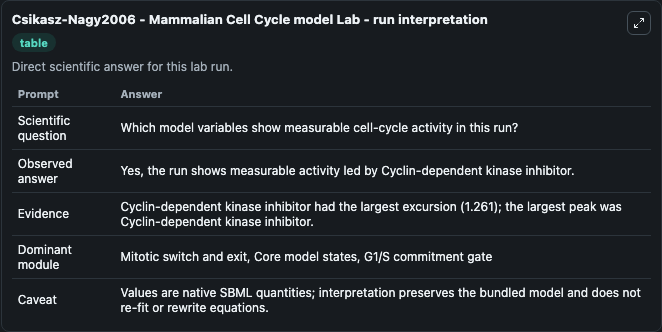
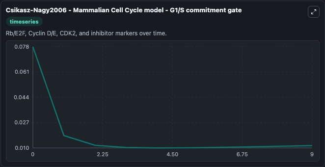
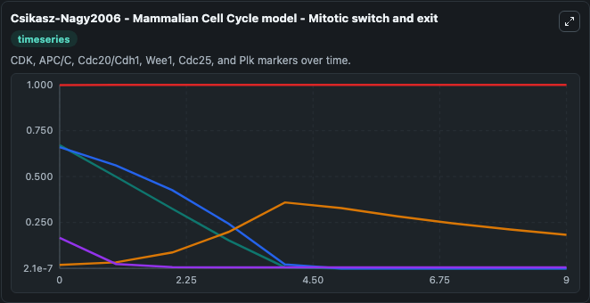
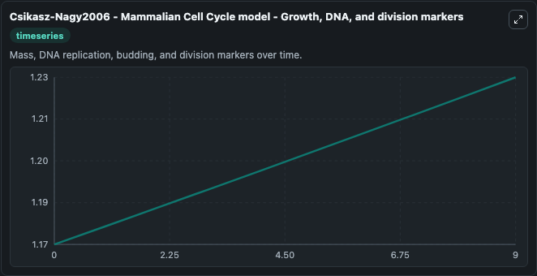
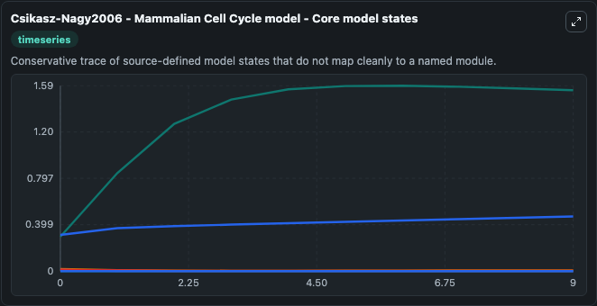
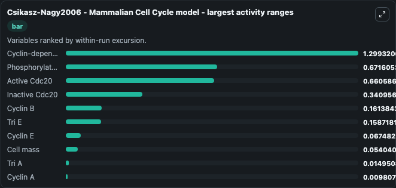
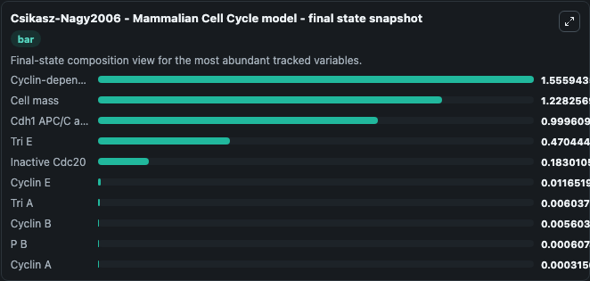
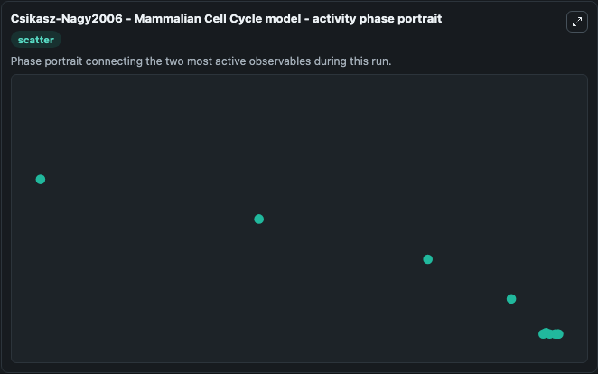

# Csikasz-Nagy2006 - Mammalian Cell Cycle model Lab

Single-model lab wrapper for Csikasz-Nagy2006 - Mammalian Cell Cycle model. This model originates from the Cell Cycle Database . It is described in: Analysis of a generic model of eukaryotic cell-cycle regulation.

This lab is a single-model Biosimulant wrapper for a cell-cycle simulation. The captured run uses the lab defaults and renders the model outputs as dark-mode visualizations for quick inspection and README embedding.

## Model Context

This model originates from the Cell Cycle Database . It is described in: Analysis of a generic model of eukaryotic cell-cycle regulation.

- Core model: Csikasz-Nagy2006 - Mammalian Cell Cycle model
- Runtime used by the lab: duration 10, step 1
- Controllable inputs: APC/C, Cdc14, Total Cdc20 APC/C activator, Phosphorylated Cdc25, Inactive Cdh1, Total cyclin-dependent kinase inhibitor
- Primary outputs: Phosphorylated APC/C/C, B-type cyclin CDK inhibitor, Active Cdc20, Inactive Cdc20, Cdh1 APC/C activator, Cyclin-dependent kinase inhibitor, Cyclin A, Cyclin B, Cyclin E, Cell mass, and 4 more
- Tags: cellcycle, sbml, biomodels_ebi, faithful

## Output Visualizations

The images below were generated from a Biosimulant lab run in dark mode. Each capture corresponds to one rendered visualization from the run output panel.

<!-- BIOSIMULANT_VISUALS_START -->

### 1. Csikasz Nagy2006 Mammalian Cell Cycle Model Lab Run Interpretation

Run interpretation view that anchors the captured simulation: it summarizes the lab purpose, runtime, and how to read the generated cell-cycle outputs.

### 2. Csikasz Nagy2006 Mammalian Cell Cycle Model G1 S Commitment Gate

G1/S commitment view, focused on the regulatory variables that gate entry into DNA synthesis and cell-cycle progression.

### 3. Csikasz Nagy2006 Mammalian Cell Cycle Model Mitotic Switch And Exit

Mitotic switch and exit view, capturing late-cycle regulators and the transition out of mitosis.

### 4. Csikasz Nagy2006 Mammalian Cell Cycle Model Growth Dna And Division Markers

Growth, DNA, and division markers, linking mass accumulation and replication signals to cell-cycle state changes.

### 5. Csikasz Nagy2006 Mammalian Cell Cycle Model Core Model States

Core model state trajectories for Phosphorylated APC/C/C, B-type cyclin CDK inhibitor, Active Cdc20, Inactive Cdc20, Cdh1 APC/C activator, Cyclin-dependent kinase inhibitor, and 8 additional outputs, using the lab default initial conditions and runtime.

### 6. Csikasz Nagy2006 Mammalian Cell Cycle Model Largest Activity Ranges

Largest activity ranges chart, ranking the variables with the widest simulated movement so the dominant responses are easy to spot.

### 7. Csikasz Nagy2006 Mammalian Cell Cycle Model Final State Snapshot

Final state snapshot, comparing the end-of-run values for the selected cell-cycle variables.

### 8. Csikasz Nagy2006 Mammalian Cell Cycle Model Activity Phase Portrait

Activity phase portrait, showing pairwise movement between selected variables across the simulated trajectory.

<!-- BIOSIMULANT_VISUALS_END -->

## How to Read This Run

Use the time-course plots to see transient and steady-state behavior, the range or snapshot charts to identify the variables with the strongest response, and any phase-portrait view to inspect coupled regulator movement through the simulated trajectory. For this cell-cycle lab, the most useful comparison is usually between checkpoint, commitment, and mitotic-exit variables because those signals define where the simulated system sits in the cycle.

## Inputs

| Input | Context |
| --- | --- |
| APC/C | Controls APC/C in the lab model via `cellcycle_sbml_csikasz_nagy2006_mammalian_cell_cycle_model_biomd0000001044_model.apc_c`. |
| Cdc14 | Controls Cdc14 in the lab model via `cellcycle_sbml_csikasz_nagy2006_mammalian_cell_cycle_model_biomd0000001044_model.cdc14`. |
| Total Cdc20 APC/C activator | Controls Total Cdc20 APC/C activator in the lab model via `cellcycle_sbml_csikasz_nagy2006_mammalian_cell_cycle_model_biomd0000001044_model.total_cdc20_apc_c_activator`. |
| Phosphorylated Cdc25 | Controls Phosphorylated Cdc25 in the lab model via `cellcycle_sbml_csikasz_nagy2006_mammalian_cell_cycle_model_biomd0000001044_model.phosphorylated_cdc25`. |
| Inactive Cdh1 | Controls Inactive Cdh1 in the lab model via `cellcycle_sbml_csikasz_nagy2006_mammalian_cell_cycle_model_biomd0000001044_model.inactive_cdh1`. |
| Total cyclin-dependent kinase inhibitor | Controls Total cyclin-dependent kinase inhibitor in the lab model via `cellcycle_sbml_csikasz_nagy2006_mammalian_cell_cycle_model_biomd0000001044_model.total_cyclin_dependent_kinase_inhibitor`. |

## Outputs

| Output | Context |
| --- | --- |
| Phosphorylated APC/C/C | Tracks Phosphorylated APC/C/C in the lab model via `cellcycle_sbml_csikasz_nagy2006_mammalian_cell_cycle_model_biomd0000001044_model.phosphorylated_apc_c_c`. |
| B-type cyclin CDK inhibitor | Tracks B-type cyclin CDK inhibitor in the lab model via `cellcycle_sbml_csikasz_nagy2006_mammalian_cell_cycle_model_biomd0000001044_model.b_type_cyclin_cdk_inhibitor`. |
| Active Cdc20 | Tracks Active Cdc20 in the lab model via `cellcycle_sbml_csikasz_nagy2006_mammalian_cell_cycle_model_biomd0000001044_model.active_cdc20`. |
| Inactive Cdc20 | Tracks Inactive Cdc20 in the lab model via `cellcycle_sbml_csikasz_nagy2006_mammalian_cell_cycle_model_biomd0000001044_model.inactive_cdc20`. |
| Cdh1 APC/C activator | Tracks Cdh1 APC/C activator in the lab model via `cellcycle_sbml_csikasz_nagy2006_mammalian_cell_cycle_model_biomd0000001044_model.cdh1_apc_c_activator`. |
| Cyclin-dependent kinase inhibitor | Tracks Cyclin-dependent kinase inhibitor in the lab model via `cellcycle_sbml_csikasz_nagy2006_mammalian_cell_cycle_model_biomd0000001044_model.cyclin_dependent_kinase_inhibitor`. |
| Cyclin A | Tracks Cyclin A in the lab model via `cellcycle_sbml_csikasz_nagy2006_mammalian_cell_cycle_model_biomd0000001044_model.cyclin_a`. |
| Cyclin B | Tracks Cyclin B in the lab model via `cellcycle_sbml_csikasz_nagy2006_mammalian_cell_cycle_model_biomd0000001044_model.cyclin_b`. |
| Cyclin E | Tracks Cyclin E in the lab model via `cellcycle_sbml_csikasz_nagy2006_mammalian_cell_cycle_model_biomd0000001044_model.cyclin_e`. |
| Cell mass | Tracks Cell mass in the lab model via `cellcycle_sbml_csikasz_nagy2006_mammalian_cell_cycle_model_biomd0000001044_model.cell_mass`. |
| P B | Tracks P B in the lab model via `cellcycle_sbml_csikasz_nagy2006_mammalian_cell_cycle_model_biomd0000001044_model.p_b`. |
| P BCKI | Tracks P BCKI in the lab model via `cellcycle_sbml_csikasz_nagy2006_mammalian_cell_cycle_model_biomd0000001044_model.p_bcki`. |
| Tri A | Tracks Tri A in the lab model via `cellcycle_sbml_csikasz_nagy2006_mammalian_cell_cycle_model_biomd0000001044_model.tri_a`. |
| Tri E | Tracks Tri E in the lab model via `cellcycle_sbml_csikasz_nagy2006_mammalian_cell_cycle_model_biomd0000001044_model.tri_e`. |

## Lab Files

- `lab.yaml` defines the Biosimulant lab wrapper, exposed inputs, outputs, and runtime settings.
- `wiring-layout.json` stores the canvas layout used by the lab UI.
- `models/core/model.yaml` contains the wrapped simulation model metadata.
- `models/core/README.md` contains the source model notes and provenance.
- `models/visualisation/model.yaml` defines the visualization model used to render the run outputs.
- `assets/` contains the generated dark-mode visualization captures embedded above.
