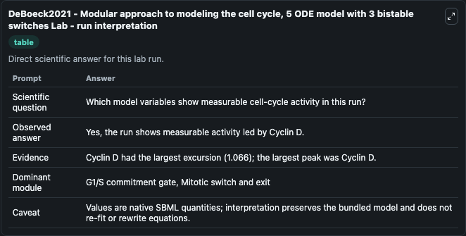
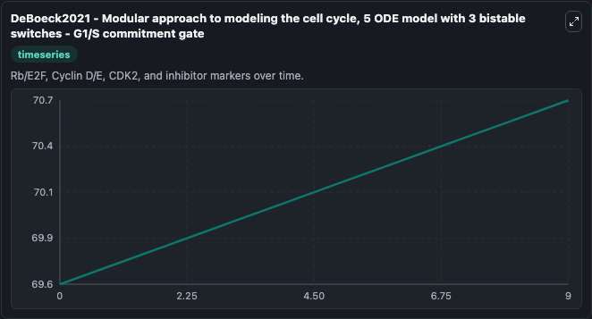
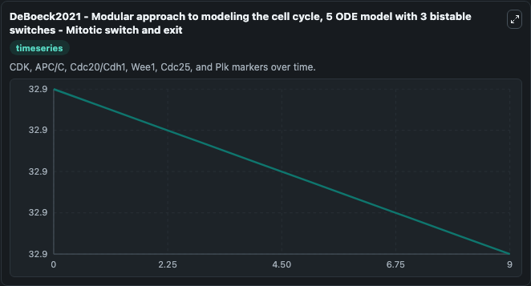
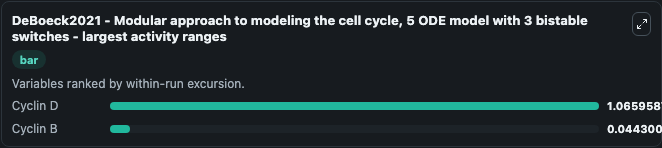
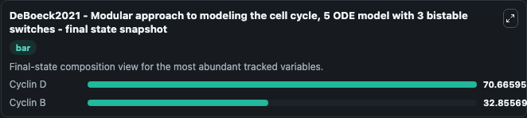
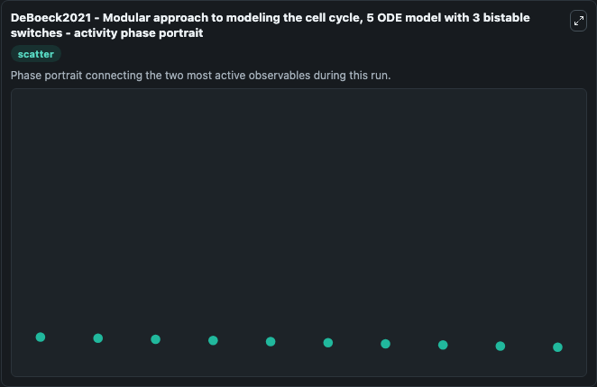

# DeBoeck2021 - Modular approach to modeling the cell cycle, 5 ODE model with 3 bistable switches Lab

Single-model lab wrapper for DeBoeck2021 - Modular approach to modeling the cell cycle, 5 ODE model with 3 bistable switches. Model of the mammalian cell cycle as a chain of bistable switches. There are three bistable responses: response of E2F to Cyclin D, of Cdk1 to Cyclin B and of APC/C to Cdk1 activity.

This lab is a single-model Biosimulant wrapper for a cell-cycle simulation. The captured run uses the lab defaults and renders the model outputs as dark-mode visualizations for quick inspection and README embedding.

## Model Context

Model of the mammalian cell cycle as a chain of bistable switches. There are three bistable responses: response of E2F to Cyclin D, of Cdk1 to Cyclin B and of APC/C to Cdk1 activity.

- Core model: DeBoeck2021 - Modular approach to modeling the cell cycle, 5 ODE model with 3 bistable switches
- Runtime used by the lab: duration 10, step 1
- Controllable inputs: none declared
- Primary outputs: Cyclin D, Cyclin B
- Tags: cellcycle, sbml, biomodels_ebi, faithful

## Output Visualizations

The images below were generated from a Biosimulant lab run in dark mode. Each capture corresponds to one rendered visualization from the run output panel.

<!-- BIOSIMULANT_VISUALS_START -->

### 1. Deboeck2021 Modular Approach To Modeling The Cell Cycle 5 Ode Model With 3 Bista

Deboeck2021 Modular Approach To Modeling The Cell Cycle 5 Ode Model With 3 Bista visualization captured from the dark-mode Biosimulant run for DeBoeck2021 - Modular approach to modeling the cell cycle, 5 ODE model with 3 bistable switches Lab.

### 2. Deboeck2021 Modular Approach To Modeling The Cell Cycle 5 Ode Model With 3 Bista

Deboeck2021 Modular Approach To Modeling The Cell Cycle 5 Ode Model With 3 Bista visualization captured from the dark-mode Biosimulant run for DeBoeck2021 - Modular approach to modeling the cell cycle, 5 ODE model with 3 bistable switches Lab.

### 3. Deboeck2021 Modular Approach To Modeling The Cell Cycle 5 Ode Model With 3 Bista

Deboeck2021 Modular Approach To Modeling The Cell Cycle 5 Ode Model With 3 Bista visualization captured from the dark-mode Biosimulant run for DeBoeck2021 - Modular approach to modeling the cell cycle, 5 ODE model with 3 bistable switches Lab.

### 4. Deboeck2021 Modular Approach To Modeling The Cell Cycle 5 Ode Model With 3 Bista

Deboeck2021 Modular Approach To Modeling The Cell Cycle 5 Ode Model With 3 Bista visualization captured from the dark-mode Biosimulant run for DeBoeck2021 - Modular approach to modeling the cell cycle, 5 ODE model with 3 bistable switches Lab.

### 5. Deboeck2021 Modular Approach To Modeling The Cell Cycle 5 Ode Model With 3 Bista

Deboeck2021 Modular Approach To Modeling The Cell Cycle 5 Ode Model With 3 Bista visualization captured from the dark-mode Biosimulant run for DeBoeck2021 - Modular approach to modeling the cell cycle, 5 ODE model with 3 bistable switches Lab.

### 6. Deboeck2021 Modular Approach To Modeling The Cell Cycle 5 Ode Model With 3 Bista

Deboeck2021 Modular Approach To Modeling The Cell Cycle 5 Ode Model With 3 Bista visualization captured from the dark-mode Biosimulant run for DeBoeck2021 - Modular approach to modeling the cell cycle, 5 ODE model with 3 bistable switches Lab.

<!-- BIOSIMULANT_VISUALS_END -->

## How to Read This Run

Use the time-course plots to see transient and steady-state behavior, the range or snapshot charts to identify the variables with the strongest response, and any phase-portrait view to inspect coupled regulator movement through the simulated trajectory. For this cell-cycle lab, the most useful comparison is usually between checkpoint, commitment, and mitotic-exit variables because those signals define where the simulated system sits in the cycle.

## Inputs

| Input | Context |
| --- | --- |
| - | No entries declared in `lab.yaml`. |

## Outputs

| Output | Context |
| --- | --- |
| Cyclin D | Tracks Cyclin D in the lab model via `cellcycle_sbml_deboeck2021_modular_approach_to_modeling_the_cel_biomd0000001080_model.cyclin_d`. |
| Cyclin B | Tracks Cyclin B in the lab model via `cellcycle_sbml_deboeck2021_modular_approach_to_modeling_the_cel_biomd0000001080_model.cyclin_b`. |

## Lab Files

- `lab.yaml` defines the Biosimulant lab wrapper, exposed inputs, outputs, and runtime settings.
- `wiring-layout.json` stores the canvas layout used by the lab UI.
- `models/core/model.yaml` contains the wrapped simulation model metadata.
- `models/core/README.md` contains the source model notes and provenance.
- `models/visualisation/model.yaml` defines the visualization model used to render the run outputs.
- `assets/` contains the generated dark-mode visualization captures embedded above.
