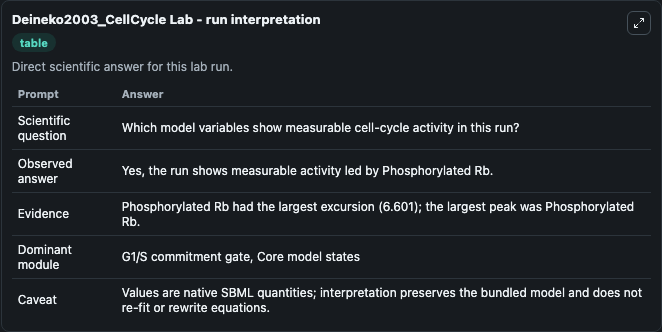
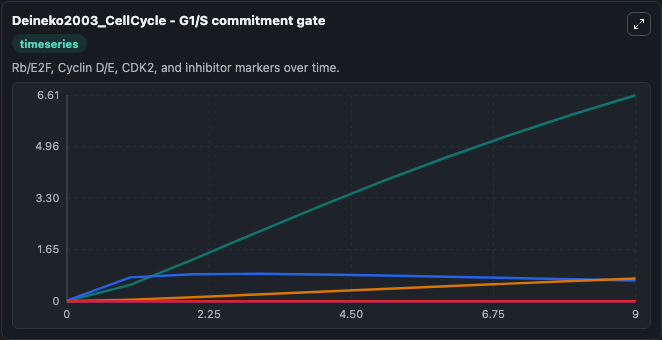
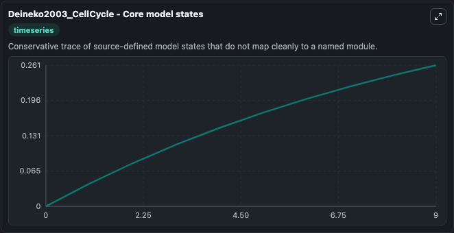
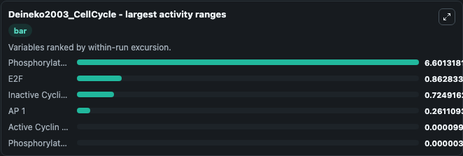
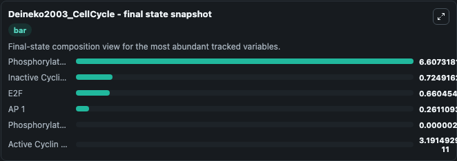
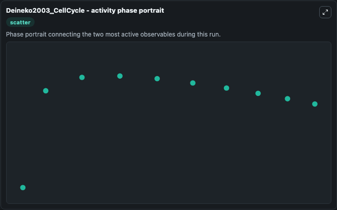

# Deineko2003_CellCycle Lab

Single-model lab wrapper for Deineko2003_CellCycle. The model reproduces Fig 3 of the paper corresponding to the transition to S phase. Units have not been defined for this model because the paper mentions the use of arbitrary units for the various spe.

This lab is a single-model Biosimulant wrapper for a cell-cycle simulation. The captured run uses the lab defaults and renders the model outputs as dark-mode visualizations for quick inspection and README embedding.

## Model Context

The model reproduces Fig 3 of the paper corresponding to the transition to S phase. Units have not been defined for this model because the paper mentions the use of arbitrary units for the various spe.

- Core model: Deineko2003_CellCycle
- Runtime used by the lab: duration 10, step 1
- Controllable inputs: none declared
- Primary outputs: E2F, Phosphorylated Rb, Phosphorylated Phosphorylated Rb, Inactive Cyclin E CDK2, Active Cyclin E CDK2, AP 1
- Tags: cellcycle, sbml, biomodels_ebi, faithful

## Output Visualizations

The images below were generated from a Biosimulant lab run in dark mode. Each capture corresponds to one rendered visualization from the run output panel.

<!-- BIOSIMULANT_VISUALS_START -->

### 1. Deineko2003 Cellcycle Lab Run Interpretation

Run interpretation view that anchors the captured simulation: it summarizes the lab purpose, runtime, and how to read the generated cell-cycle outputs.

### 2. Deineko2003 Cellcycle G1 S Commitment Gate

G1/S commitment view, focused on the regulatory variables that gate entry into DNA synthesis and cell-cycle progression.

### 3. Deineko2003 Cellcycle Core Model States

Core model state trajectories for E2F, Phosphorylated Rb, Phosphorylated Phosphorylated Rb, Inactive Cyclin E CDK2, Active Cyclin E CDK2, AP 1, using the lab default initial conditions and runtime.

### 4. Deineko2003 Cellcycle Largest Activity Ranges

Largest activity ranges chart, ranking the variables with the widest simulated movement so the dominant responses are easy to spot.

### 5. Deineko2003 Cellcycle Final State Snapshot

Final state snapshot, comparing the end-of-run values for the selected cell-cycle variables.

### 6. Deineko2003 Cellcycle Activity Phase Portrait

Activity phase portrait, showing pairwise movement between selected variables across the simulated trajectory.

<!-- BIOSIMULANT_VISUALS_END -->

## How to Read This Run

Use the time-course plots to see transient and steady-state behavior, the range or snapshot charts to identify the variables with the strongest response, and any phase-portrait view to inspect coupled regulator movement through the simulated trajectory. For this cell-cycle lab, the most useful comparison is usually between checkpoint, commitment, and mitotic-exit variables because those signals define where the simulated system sits in the cycle.

## Inputs

| Input | Context |
| --- | --- |
| - | No entries declared in `lab.yaml`. |

## Outputs

| Output | Context |
| --- | --- |
| E2F | Tracks E2F in the lab model via `cellcycle_sbml_deineko2003_cellcycle_biomd0000000208_model.e2f`. |
| Phosphorylated Rb | Tracks Phosphorylated Rb in the lab model via `cellcycle_sbml_deineko2003_cellcycle_biomd0000000208_model.phosphorylated_rb`. |
| Phosphorylated Phosphorylated Rb | Tracks Phosphorylated Phosphorylated Rb in the lab model via `cellcycle_sbml_deineko2003_cellcycle_biomd0000000208_model.phosphorylated_phosphorylated_rb`. |
| Inactive Cyclin E CDK2 | Tracks Inactive Cyclin E CDK2 in the lab model via `cellcycle_sbml_deineko2003_cellcycle_biomd0000000208_model.inactive_cyclin_e_cdk2`. |
| Active Cyclin E CDK2 | Tracks Active Cyclin E CDK2 in the lab model via `cellcycle_sbml_deineko2003_cellcycle_biomd0000000208_model.active_cyclin_e_cdk2`. |
| AP 1 | Tracks AP 1 in the lab model via `cellcycle_sbml_deineko2003_cellcycle_biomd0000000208_model.ap_1`. |

## Lab Files

- `lab.yaml` defines the Biosimulant lab wrapper, exposed inputs, outputs, and runtime settings.
- `wiring-layout.json` stores the canvas layout used by the lab UI.
- `models/core/model.yaml` contains the wrapped simulation model metadata.
- `models/core/README.md` contains the source model notes and provenance.
- `models/visualisation/model.yaml` defines the visualization model used to render the run outputs.
- `assets/` contains the generated dark-mode visualization captures embedded above.
