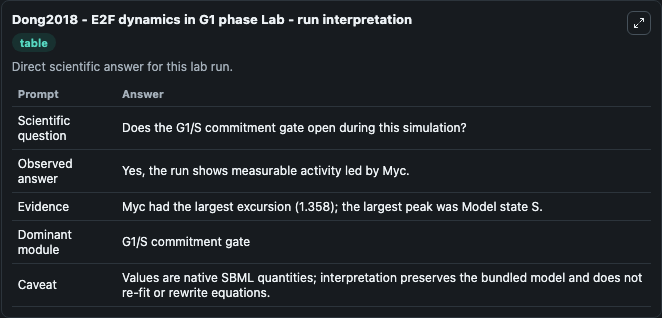
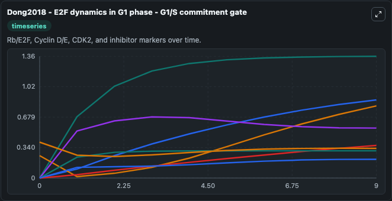
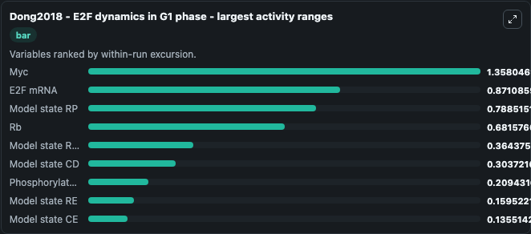
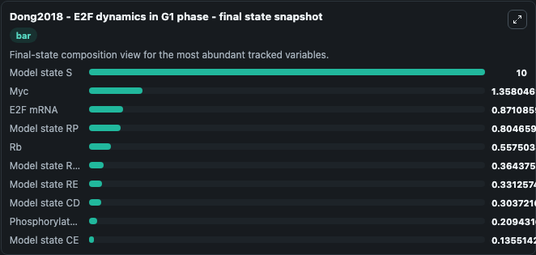
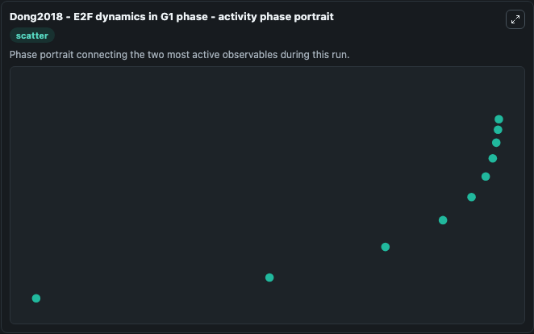

# Dong2018 - E2F dynamics in G1 phase Lab

Single-model lab wrapper for Dong2018 - E2F dynamics in G1 phase. The length of the G1 phase in the cell cycle shows significant variability in different cell types and tissue types. To gain insights into the control of G1 length, we generated an E2F activity report.

This lab is a single-model Biosimulant wrapper for a cell-cycle simulation. The captured run uses the lab defaults and renders the model outputs as dark-mode visualizations for quick inspection and README embedding.

## Model Context

The length of the G1 phase in the cell cycle shows significant variability in different cell types and tissue types. To gain insights into the control of G1 length, we generated an E2F activity report.

- Core model: Dong2018 - E2F dynamics in G1 phase
- Runtime used by the lab: duration 10, step 1
- Controllable inputs: none declared
- Primary outputs: Myc, Model state S, Phosphorylated E2F, E2F mRNA, Rb, Model state RE, Model state R (R), Model state CD, Model state CE, Model state RP
- Tags: cellcycle, sbml, biomodels_ebi, faithful

## Output Visualizations

The images below were generated from a Biosimulant lab run in dark mode. Each capture corresponds to one rendered visualization from the run output panel.

<!-- BIOSIMULANT_VISUALS_START -->

### 1. Dong2018 E2f Dynamics In G1 Phase Lab Run Interpretation

Run interpretation view that anchors the captured simulation: it summarizes the lab purpose, runtime, and how to read the generated cell-cycle outputs.

### 2. Dong2018 E2f Dynamics In G1 Phase G1 S Commitment Gate

G1/S commitment view, focused on the regulatory variables that gate entry into DNA synthesis and cell-cycle progression.

### 3. Dong2018 E2f Dynamics In G1 Phase Largest Activity Ranges

G1/S commitment view, focused on the regulatory variables that gate entry into DNA synthesis and cell-cycle progression.

### 4. Dong2018 E2f Dynamics In G1 Phase Final State Snapshot

G1/S commitment view, focused on the regulatory variables that gate entry into DNA synthesis and cell-cycle progression.

### 5. Dong2018 E2f Dynamics In G1 Phase Activity Phase Portrait

G1/S commitment view, focused on the regulatory variables that gate entry into DNA synthesis and cell-cycle progression.

<!-- BIOSIMULANT_VISUALS_END -->

## How to Read This Run

Use the time-course plots to see transient and steady-state behavior, the range or snapshot charts to identify the variables with the strongest response, and any phase-portrait view to inspect coupled regulator movement through the simulated trajectory. For this cell-cycle lab, the most useful comparison is usually between checkpoint, commitment, and mitotic-exit variables because those signals define where the simulated system sits in the cycle.

## Inputs

| Input | Context |
| --- | --- |
| - | No entries declared in `lab.yaml`. |

## Outputs

| Output | Context |
| --- | --- |
| Myc | Tracks Myc in the lab model via `cellcycle_sbml_dong2018_e2f_dynamics_in_g1_phase_model1811050001_model.myc`. |
| Model state S | Tracks Model state S in the lab model via `cellcycle_sbml_dong2018_e2f_dynamics_in_g1_phase_model1811050001_model.model_state_s`. |
| Phosphorylated E2F | Tracks Phosphorylated E2F in the lab model via `cellcycle_sbml_dong2018_e2f_dynamics_in_g1_phase_model1811050001_model.phosphorylated_e2f`. |
| E2F mRNA | Tracks E2F mRNA in the lab model via `cellcycle_sbml_dong2018_e2f_dynamics_in_g1_phase_model1811050001_model.e2f_m_rna`. |
| Rb | Tracks Rb in the lab model via `cellcycle_sbml_dong2018_e2f_dynamics_in_g1_phase_model1811050001_model.rb`. |
| Model state RE | Tracks Model state RE in the lab model via `cellcycle_sbml_dong2018_e2f_dynamics_in_g1_phase_model1811050001_model.model_state_re`. |
| Model state R (R) | Tracks Model state R (R) in the lab model via `cellcycle_sbml_dong2018_e2f_dynamics_in_g1_phase_model1811050001_model.model_state_r_r`. |
| Model state CD | Tracks Model state CD in the lab model via `cellcycle_sbml_dong2018_e2f_dynamics_in_g1_phase_model1811050001_model.model_state_cd`. |
| Model state CE | Tracks Model state CE in the lab model via `cellcycle_sbml_dong2018_e2f_dynamics_in_g1_phase_model1811050001_model.model_state_ce`. |
| Model state RP | Tracks Model state RP in the lab model via `cellcycle_sbml_dong2018_e2f_dynamics_in_g1_phase_model1811050001_model.model_state_rp`. |

## Lab Files

- `lab.yaml` defines the Biosimulant lab wrapper, exposed inputs, outputs, and runtime settings.
- `wiring-layout.json` stores the canvas layout used by the lab UI.
- `models/core/model.yaml` contains the wrapped simulation model metadata.
- `models/core/README.md` contains the source model notes and provenance.
- `models/visualisation/model.yaml` defines the visualization model used to render the run outputs.
- `assets/` contains the generated dark-mode visualization captures embedded above.
