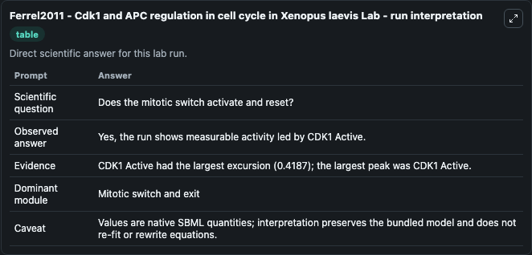
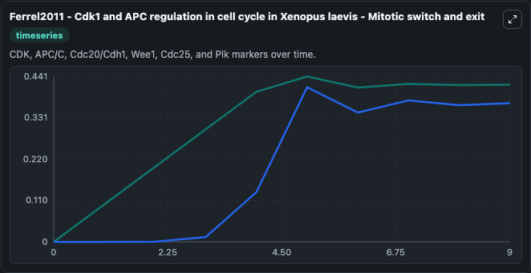
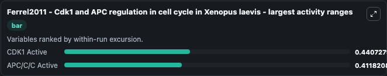
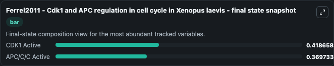
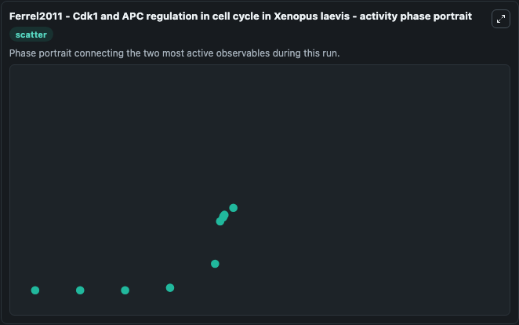

# Ferrel2011 - Cdk1 and APC regulation in cell cycle in Xenopus laevis Lab

Single-model lab wrapper for Ferrel2011 - Cdk1 and APC regulation in cell cycle in Xenopus laevis. Mathematical model of the regulation of Cdk1 and APC in cell cycle in Xenopus Laevis. It can be used to explore cell-cycle regulation dynamics and compare checkpoint behavior across conditions.

This lab is a single-model Biosimulant wrapper for a cell-cycle simulation. The captured run uses the lab defaults and renders the model outputs as dark-mode visualizations for quick inspection and README embedding.

## Model Context

Mathematical model of the regulation of Cdk1 and APC in cell cycle in Xenopus Laevis. It can be used to explore cell-cycle regulation dynamics and compare checkpoint behavior across conditions.

- Core model: Ferrel2011 - Cdk1 and APC regulation in cell cycle in Xenopus laevis
- Runtime used by the lab: duration 10, step 1
- Controllable inputs: none declared
- Primary outputs: CDK1 Active, APC/C/C Active
- Tags: cellcycle, sbml, biomodels_ebi, faithful

## Output Visualizations

The images below were generated from a Biosimulant lab run in dark mode. Each capture corresponds to one rendered visualization from the run output panel.

<!-- BIOSIMULANT_VISUALS_START -->

### 1. Ferrel2011 Cdk1 And Apc Regulation In Cell Cycle In Xenopus Laevis Lab Run Inter

Ferrel2011 Cdk1 And Apc Regulation In Cell Cycle In Xenopus Laevis Lab Run Inter visualization captured from the dark-mode Biosimulant run for Ferrel2011 - Cdk1 and APC regulation in cell cycle in Xenopus laevis Lab.

### 2. Ferrel2011 Cdk1 And Apc Regulation In Cell Cycle In Xenopus Laevis Mitotic Switc

Mitotic switch and exit view, capturing late-cycle regulators and the transition out of mitosis.

### 3. Ferrel2011 Cdk1 And Apc Regulation In Cell Cycle In Xenopus Laevis Largest Activ

Largest activity ranges chart, ranking the variables with the widest simulated movement so the dominant responses are easy to spot.

### 4. Ferrel2011 Cdk1 And Apc Regulation In Cell Cycle In Xenopus Laevis Final State S

Final state snapshot, comparing the end-of-run values for the selected cell-cycle variables.

### 5. Ferrel2011 Cdk1 And Apc Regulation In Cell Cycle In Xenopus Laevis Activity Phas

Ferrel2011 Cdk1 And Apc Regulation In Cell Cycle In Xenopus Laevis Activity Phas visualization captured from the dark-mode Biosimulant run for Ferrel2011 - Cdk1 and APC regulation in cell cycle in Xenopus laevis Lab.

<!-- BIOSIMULANT_VISUALS_END -->

## How to Read This Run

Use the time-course plots to see transient and steady-state behavior, the range or snapshot charts to identify the variables with the strongest response, and any phase-portrait view to inspect coupled regulator movement through the simulated trajectory. For this cell-cycle lab, the most useful comparison is usually between checkpoint, commitment, and mitotic-exit variables because those signals define where the simulated system sits in the cycle.

## Inputs

| Input | Context |
| --- | --- |
| - | No entries declared in `lab.yaml`. |

## Outputs

| Output | Context |
| --- | --- |
| CDK1 Active | Tracks CDK1 Active in the lab model via `cellcycle_sbml_ferrel2011_cdk1_and_apc_regulation_in_cell_cycle_biomd0000000935_model.cdk1_active`. |
| APC/C/C Active | Tracks APC/C/C Active in the lab model via `cellcycle_sbml_ferrel2011_cdk1_and_apc_regulation_in_cell_cycle_biomd0000000935_model.apc_c_c_active`. |

## Lab Files

- `lab.yaml` defines the Biosimulant lab wrapper, exposed inputs, outputs, and runtime settings.
- `wiring-layout.json` stores the canvas layout used by the lab UI.
- `models/core/model.yaml` contains the wrapped simulation model metadata.
- `models/core/README.md` contains the source model notes and provenance.
- `models/visualisation/model.yaml` defines the visualization model used to render the run outputs.
- `assets/` contains the generated dark-mode visualization captures embedded above.
