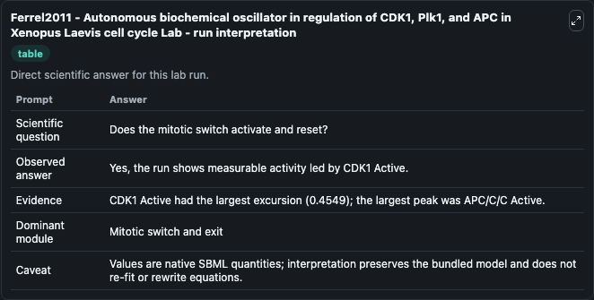
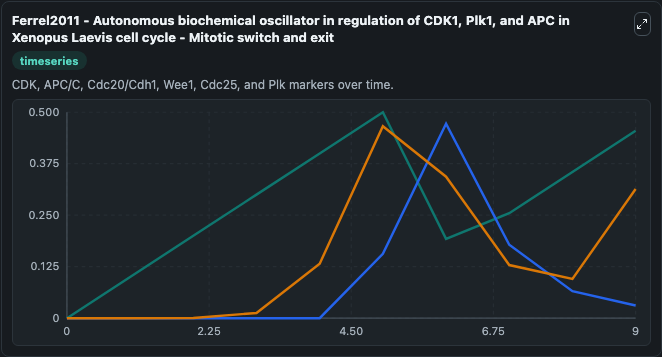
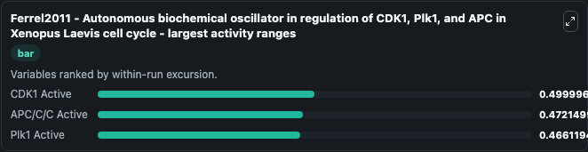
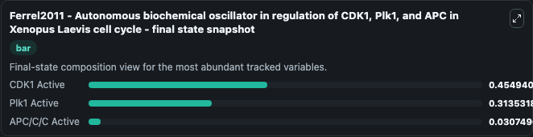
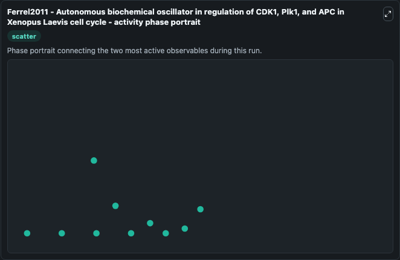

# Ferrel2011 - Autonomous biochemical oscillator in regulation of CDK1, Plk1, and APC in Xenopus Laevis cell cycle Lab

Single-model lab wrapper for Ferrel2011 - Autonomous biochemical oscillator in regulation of CDK1, Plk1, and APC in Xenopus Laevis cell cycle. Computational modeling and the theory of nonlinear dynamical systems allow one to not simply describe the events of the cell cycle, but also to understand why these events occur, just as the theory of. It can be used to explore cell-cycle regulation dynamics and compare checkpoint behavior across conditions.

This lab is a single-model Biosimulant wrapper for a cell-cycle simulation. The captured run uses the lab defaults and renders the model outputs as dark-mode visualizations for quick inspection and README embedding.

## Model Context

Computational modeling and the theory of nonlinear dynamical systems allow one to not simply describe the events of the cell cycle, but also to understand why these events occur, just as the theory of. It can be used to explore cell-cycle regulation dynamics and compare checkpoint behavior across conditions.

- Core model: Ferrel2011 - Autonomous biochemical oscillator in regulation of CDK1, Plk1, and APC in Xenopus Laevis cell cycle
- Runtime used by the lab: duration 10, step 1
- Controllable inputs: none declared
- Primary outputs: CDK1 Active, APC/C/C Active, Plk1 Active
- Tags: cellcycle, sbml, biomodels_ebi, faithful

## Output Visualizations

The images below were generated from a Biosimulant lab run in dark mode. Each capture corresponds to one rendered visualization from the run output panel.

<!-- BIOSIMULANT_VISUALS_START -->

### 1. Ferrel2011 Autonomous Biochemical Oscillator In Regulation Of Cdk1 Plk1 And Apc 

Ferrel2011 Autonomous Biochemical Oscillator In Regulation Of Cdk1 Plk1 And Apc  visualization captured from the dark-mode Biosimulant run for Ferrel2011 - Autonomous biochemical oscillator in regulation of CDK1, Plk1, and APC in Xenopus Laevis cell cycle Lab.

### 2. Ferrel2011 Autonomous Biochemical Oscillator In Regulation Of Cdk1 Plk1 And Apc 

Ferrel2011 Autonomous Biochemical Oscillator In Regulation Of Cdk1 Plk1 And Apc  visualization captured from the dark-mode Biosimulant run for Ferrel2011 - Autonomous biochemical oscillator in regulation of CDK1, Plk1, and APC in Xenopus Laevis cell cycle Lab.

### 3. Ferrel2011 Autonomous Biochemical Oscillator In Regulation Of Cdk1 Plk1 And Apc 

Ferrel2011 Autonomous Biochemical Oscillator In Regulation Of Cdk1 Plk1 And Apc  visualization captured from the dark-mode Biosimulant run for Ferrel2011 - Autonomous biochemical oscillator in regulation of CDK1, Plk1, and APC in Xenopus Laevis cell cycle Lab.

### 4. Ferrel2011 Autonomous Biochemical Oscillator In Regulation Of Cdk1 Plk1 And Apc 

Ferrel2011 Autonomous Biochemical Oscillator In Regulation Of Cdk1 Plk1 And Apc  visualization captured from the dark-mode Biosimulant run for Ferrel2011 - Autonomous biochemical oscillator in regulation of CDK1, Plk1, and APC in Xenopus Laevis cell cycle Lab.

### 5. Ferrel2011 Autonomous Biochemical Oscillator In Regulation Of Cdk1 Plk1 And Apc 

Ferrel2011 Autonomous Biochemical Oscillator In Regulation Of Cdk1 Plk1 And Apc  visualization captured from the dark-mode Biosimulant run for Ferrel2011 - Autonomous biochemical oscillator in regulation of CDK1, Plk1, and APC in Xenopus Laevis cell cycle Lab.

<!-- BIOSIMULANT_VISUALS_END -->

## How to Read This Run

Use the time-course plots to see transient and steady-state behavior, the range or snapshot charts to identify the variables with the strongest response, and any phase-portrait view to inspect coupled regulator movement through the simulated trajectory. For this cell-cycle lab, the most useful comparison is usually between checkpoint, commitment, and mitotic-exit variables because those signals define where the simulated system sits in the cycle.

## Inputs

| Input | Context |
| --- | --- |
| - | No entries declared in `lab.yaml`. |

## Outputs

| Output | Context |
| --- | --- |
| CDK1 Active | Tracks CDK1 Active in the lab model via `cellcycle_sbml_ferrel2011_autonomous_biochemical_oscillator_in_biomd0000000937_model.cdk1_active`. |
| APC/C/C Active | Tracks APC/C/C Active in the lab model via `cellcycle_sbml_ferrel2011_autonomous_biochemical_oscillator_in_biomd0000000937_model.apc_c_c_active`. |
| Plk1 Active | Tracks Plk1 Active in the lab model via `cellcycle_sbml_ferrel2011_autonomous_biochemical_oscillator_in_biomd0000000937_model.plk1_active`. |

## Lab Files

- `lab.yaml` defines the Biosimulant lab wrapper, exposed inputs, outputs, and runtime settings.
- `wiring-layout.json` stores the canvas layout used by the lab UI.
- `models/core/model.yaml` contains the wrapped simulation model metadata.
- `models/core/README.md` contains the source model notes and provenance.
- `models/visualisation/model.yaml` defines the visualization model used to render the run outputs.
- `assets/` contains the generated dark-mode visualization captures embedded above.
