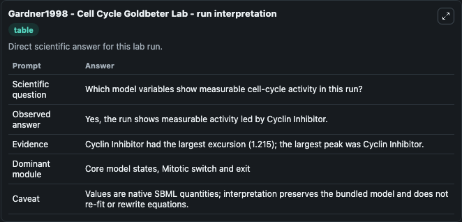
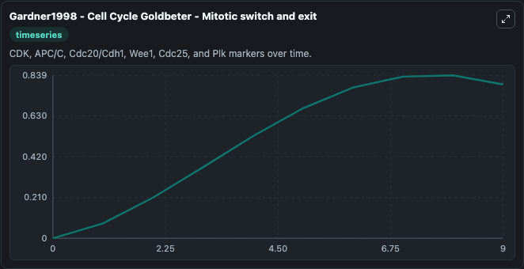
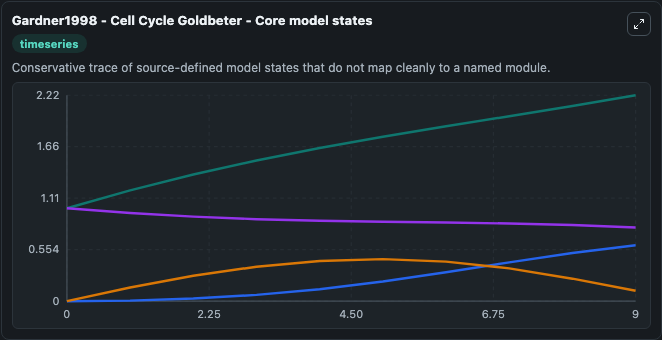
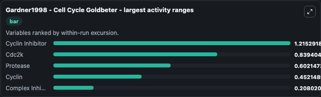
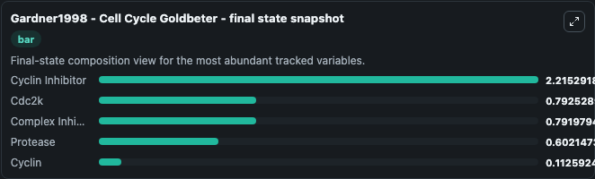
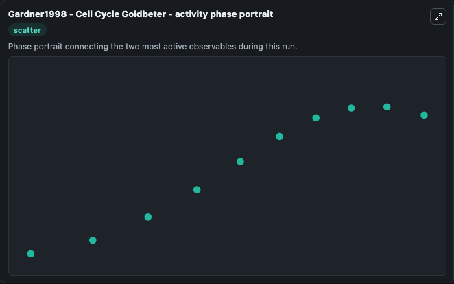

# Gardner1998 - Cell Cycle Goldbeter Lab

Single-model lab wrapper for Gardner1998 - Cell Cycle Goldbeter. Gardner1998 - Cell Cycle Goldbeter Mathematical modeling of cell division cycle (CDC) dynamics. The SBML file has been generated by MathSBML 2.6.0.p960929 (Prerelease Version of 29-Sept-2006) 1-Octobe.

This lab is a single-model Biosimulant wrapper for a cell-cycle simulation. The captured run uses the lab defaults and renders the model outputs as dark-mode visualizations for quick inspection and README embedding.

## Model Context

Gardner1998 - Cell Cycle Goldbeter Mathematical modeling of cell division cycle (CDC) dynamics. The SBML file has been generated by MathSBML 2.6.0.p960929 (Prerelease Version of 29-Sept-2006) 1-Octobe.

- Core model: Gardner1998 - Cell Cycle Goldbeter
- Runtime used by the lab: duration 10, step 1
- Controllable inputs: none declared
- Primary outputs: Cyclin, Protease, Cdc2k, Cyclin Inhibitor, Complex Inhibitor Cyclin
- Tags: cellcycle, sbml, biomodels_ebi, faithful

## Output Visualizations

The images below were generated from a Biosimulant lab run in dark mode. Each capture corresponds to one rendered visualization from the run output panel.

<!-- BIOSIMULANT_VISUALS_START -->

### 1. Gardner1998 Cell Cycle Goldbeter Lab Run Interpretation

Run interpretation view that anchors the captured simulation: it summarizes the lab purpose, runtime, and how to read the generated cell-cycle outputs.

### 2. Gardner1998 Cell Cycle Goldbeter Mitotic Switch And Exit

Mitotic switch and exit view, capturing late-cycle regulators and the transition out of mitosis.

### 3. Gardner1998 Cell Cycle Goldbeter Core Model States

Core model state trajectories for Cyclin, Protease, Cdc2k, Cyclin Inhibitor, Complex Inhibitor Cyclin, using the lab default initial conditions and runtime.

### 4. Gardner1998 Cell Cycle Goldbeter Largest Activity Ranges

Largest activity ranges chart, ranking the variables with the widest simulated movement so the dominant responses are easy to spot.

### 5. Gardner1998 Cell Cycle Goldbeter Final State Snapshot

Final state snapshot, comparing the end-of-run values for the selected cell-cycle variables.

### 6. Gardner1998 Cell Cycle Goldbeter Activity Phase Portrait

Activity phase portrait, showing pairwise movement between selected variables across the simulated trajectory.

<!-- BIOSIMULANT_VISUALS_END -->

## How to Read This Run

Use the time-course plots to see transient and steady-state behavior, the range or snapshot charts to identify the variables with the strongest response, and any phase-portrait view to inspect coupled regulator movement through the simulated trajectory. For this cell-cycle lab, the most useful comparison is usually between checkpoint, commitment, and mitotic-exit variables because those signals define where the simulated system sits in the cycle.

## Inputs

| Input | Context |
| --- | --- |
| - | No entries declared in `lab.yaml`. |

## Outputs

| Output | Context |
| --- | --- |
| Cyclin | Tracks Cyclin in the lab model via `cellcycle_sbml_gardner1998_cell_cycle_goldbeter_biomd0000000008_model.cyclin`. |
| Protease | Tracks Protease in the lab model via `cellcycle_sbml_gardner1998_cell_cycle_goldbeter_biomd0000000008_model.protease`. |
| Cdc2k | Tracks Cdc2k in the lab model via `cellcycle_sbml_gardner1998_cell_cycle_goldbeter_biomd0000000008_model.cdc2k`. |
| Cyclin Inhibitor | Tracks Cyclin Inhibitor in the lab model via `cellcycle_sbml_gardner1998_cell_cycle_goldbeter_biomd0000000008_model.cyclin_inhibitor`. |
| Complex Inhibitor Cyclin | Tracks Complex Inhibitor Cyclin in the lab model via `cellcycle_sbml_gardner1998_cell_cycle_goldbeter_biomd0000000008_model.complex_inhibitor_cyclin`. |

## Lab Files

- `lab.yaml` defines the Biosimulant lab wrapper, exposed inputs, outputs, and runtime settings.
- `wiring-layout.json` stores the canvas layout used by the lab UI.
- `models/core/model.yaml` contains the wrapped simulation model metadata.
- `models/core/README.md` contains the source model notes and provenance.
- `models/visualisation/model.yaml` defines the visualization model used to render the run outputs.
- `assets/` contains the generated dark-mode visualization captures embedded above.
