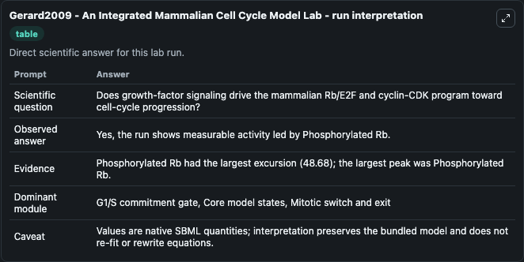
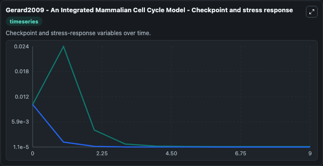
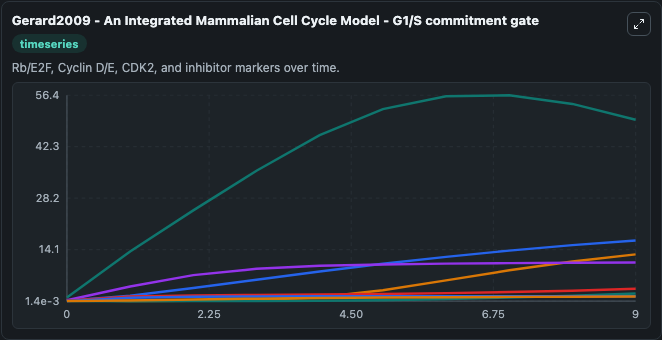
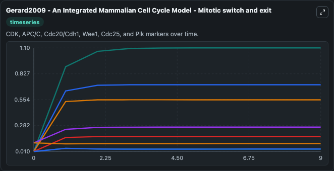
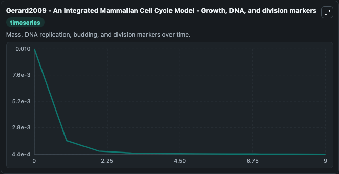
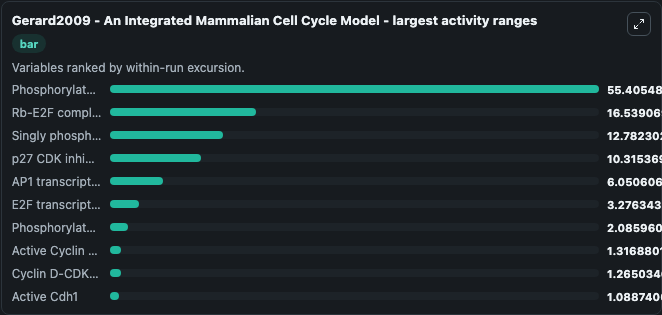
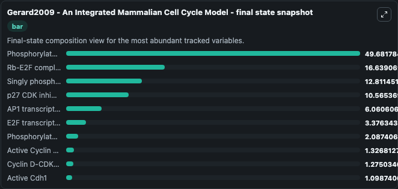
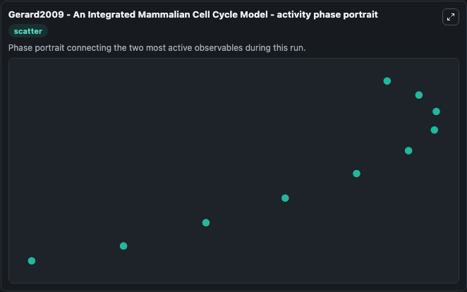

# Gerard2009 - An Integrated Mammalian Cell Cycle Model Lab

Single-model lab wrapper for Gerard2009 - An Integrated Mammalian Cell Cycle Model. We propose an integrated computational model for the network of cyclin-dependent kinases (Cdks) that controls the dynamics of the mammalian cell cycle. It can be used to explore cell-cycle regulation dynamics and compare checkpoint behavior across conditions.

This lab is a single-model Biosimulant wrapper for a cell-cycle simulation. The captured run uses the lab defaults and renders the model outputs as dark-mode visualizations for quick inspection and README embedding.

## Model Context

We propose an integrated computational model for the network of cyclin-dependent kinases (Cdks) that controls the dynamics of the mammalian cell cycle. It can be used to explore cell-cycle regulation dynamics and compare checkpoint behavior across conditions.

- Core model: Gerard2009 - An Integrated Mammalian Cell Cycle Model
- Runtime used by the lab: duration 10, step 1
- Controllable inputs: Growth factor, Growth factor activation rate
- Primary outputs: Phosphorylated Rb, Singly phosphorylated Rb, Hyperphosphorylated Rb, E2F transcription factor, Phosphorylated E2F, Rb-E2F complex, Phosphorylated Rb-E2F complex, Cyclin D, Inactive Cyclin D-CDK4/6 complex, Active Cyclin D-CDK4/6 complex, and 35 more
- Tags: cellcycle, sbml, biomodels_ebi, faithful

## Output Visualizations

The images below were generated from a Biosimulant lab run in dark mode. Each capture corresponds to one rendered visualization from the run output panel.

<!-- BIOSIMULANT_VISUALS_START -->

### 1. Gerard2009 An Integrated Mammalian Cell Cycle Model Lab Run Interpretation

Run interpretation view that anchors the captured simulation: it summarizes the lab purpose, runtime, and how to read the generated cell-cycle outputs.

### 2. Gerard2009 An Integrated Mammalian Cell Cycle Model Checkpoint And Stress Respon

Checkpoint and stress-response time courses, showing how the configured run moves through DNA damage, surveillance, and arrest-related signals.

### 3. Gerard2009 An Integrated Mammalian Cell Cycle Model G1 S Commitment Gate

G1/S commitment view, focused on the regulatory variables that gate entry into DNA synthesis and cell-cycle progression.

### 4. Gerard2009 An Integrated Mammalian Cell Cycle Model Mitotic Switch And Exit

Mitotic switch and exit view, capturing late-cycle regulators and the transition out of mitosis.

### 5. Gerard2009 An Integrated Mammalian Cell Cycle Model Growth Dna And Division Mark

Growth, DNA, and division markers, linking mass accumulation and replication signals to cell-cycle state changes.

### 6. Gerard2009 An Integrated Mammalian Cell Cycle Model Largest Activity Ranges

Largest activity ranges chart, ranking the variables with the widest simulated movement so the dominant responses are easy to spot.

### 7. Gerard2009 An Integrated Mammalian Cell Cycle Model Final State Snapshot

Final state snapshot, comparing the end-of-run values for the selected cell-cycle variables.

### 8. Gerard2009 An Integrated Mammalian Cell Cycle Model Activity Phase Portrait

Activity phase portrait, showing pairwise movement between selected variables across the simulated trajectory.

<!-- BIOSIMULANT_VISUALS_END -->

## How to Read This Run

Use the time-course plots to see transient and steady-state behavior, the range or snapshot charts to identify the variables with the strongest response, and any phase-portrait view to inspect coupled regulator movement through the simulated trajectory. For this cell-cycle lab, the most useful comparison is usually between checkpoint, commitment, and mitotic-exit variables because those signals define where the simulated system sits in the cycle.

## Inputs

| Input | Context |
| --- | --- |
| Growth factor | Controls Growth factor in the lab model via `cellcycle_sbml_gerard2009_an_integrated_mammalian_cell_cycle_mo_biomd0000000730_model.growth_factor`. |
| Growth factor activation rate | Controls Growth factor activation rate in the lab model via `cellcycle_sbml_gerard2009_an_integrated_mammalian_cell_cycle_mo_biomd0000000730_model.growth_factor_activation_rate`. |

## Outputs

| Output | Context |
| --- | --- |
| Phosphorylated Rb | Tracks Phosphorylated Rb in the lab model via `cellcycle_sbml_gerard2009_an_integrated_mammalian_cell_cycle_mo_biomd0000000730_model.phosphorylated_rb`. |
| Singly phosphorylated Rb | Tracks Singly phosphorylated Rb in the lab model via `cellcycle_sbml_gerard2009_an_integrated_mammalian_cell_cycle_mo_biomd0000000730_model.singly_phosphorylated_rb`. |
| Hyperphosphorylated Rb | Tracks Hyperphosphorylated Rb in the lab model via `cellcycle_sbml_gerard2009_an_integrated_mammalian_cell_cycle_mo_biomd0000000730_model.hyperphosphorylated_rb`. |
| E2F transcription factor | Tracks E2F transcription factor in the lab model via `cellcycle_sbml_gerard2009_an_integrated_mammalian_cell_cycle_mo_biomd0000000730_model.e2f`. |
| Phosphorylated E2F | Tracks Phosphorylated E2F in the lab model via `cellcycle_sbml_gerard2009_an_integrated_mammalian_cell_cycle_mo_biomd0000000730_model.phosphorylated_e2f`. |
| Rb-E2F complex | Tracks Rb-E2F complex in the lab model via `cellcycle_sbml_gerard2009_an_integrated_mammalian_cell_cycle_mo_biomd0000000730_model.rb_e2f_complex`. |
| Phosphorylated Rb-E2F complex | Tracks Phosphorylated Rb-E2F complex in the lab model via `cellcycle_sbml_gerard2009_an_integrated_mammalian_cell_cycle_mo_biomd0000000730_model.phosphorylated_rb_e2f_complex`. |
| Cyclin D | Tracks Cyclin D in the lab model via `cellcycle_sbml_gerard2009_an_integrated_mammalian_cell_cycle_mo_biomd0000000730_model.cyclin_d`. |
| Inactive Cyclin D-CDK4/6 complex | Tracks Inactive Cyclin D-CDK4/6 complex in the lab model via `cellcycle_sbml_gerard2009_an_integrated_mammalian_cell_cycle_mo_biomd0000000730_model.inactive_cyclin_d_cdk_complex`. |
| Active Cyclin D-CDK4/6 complex | Tracks Active Cyclin D-CDK4/6 complex in the lab model via `cellcycle_sbml_gerard2009_an_integrated_mammalian_cell_cycle_mo_biomd0000000730_model.active_cyclin_d_cdk_complex`. |
| Cyclin D-CDK4/6-p27 complex | Tracks Cyclin D-CDK4/6-p27 complex in the lab model via `cellcycle_sbml_gerard2009_an_integrated_mammalian_cell_cycle_mo_biomd0000000730_model.cyclin_d_cdk_p27_complex`. |
| Cyclin E | Tracks Cyclin E in the lab model via `cellcycle_sbml_gerard2009_an_integrated_mammalian_cell_cycle_mo_biomd0000000730_model.cyclin_e`. |
| Inactive Cyclin E-CDK2 complex | Tracks Inactive Cyclin E-CDK2 complex in the lab model via `cellcycle_sbml_gerard2009_an_integrated_mammalian_cell_cycle_mo_biomd0000000730_model.inactive_cyclin_e_cdk2_complex`. |
| Active Cyclin E-CDK2 complex | Tracks Active Cyclin E-CDK2 complex in the lab model via `cellcycle_sbml_gerard2009_an_integrated_mammalian_cell_cycle_mo_biomd0000000730_model.active_cyclin_e_cdk2_complex`. |
| Skp2 ubiquitin-ligase adaptor | Tracks Skp2 ubiquitin-ligase adaptor in the lab model via `cellcycle_sbml_gerard2009_an_integrated_mammalian_cell_cycle_mo_biomd0000000730_model.skp2`. |
| Cyclin E-CDK2-p27 complex | Tracks Cyclin E-CDK2-p27 complex in the lab model via `cellcycle_sbml_gerard2009_an_integrated_mammalian_cell_cycle_mo_biomd0000000730_model.cyclin_e_cdk2_p27_complex`. |
| Inactive Cyclin E module regulator | Tracks Inactive Cyclin E module regulator in the lab model via `cellcycle_sbml_gerard2009_an_integrated_mammalian_cell_cycle_mo_biomd0000000730_model.inactive_cyclin_e_module_regulator`. |
| Active Cyclin E module regulator | Tracks Active Cyclin E module regulator in the lab model via `cellcycle_sbml_gerard2009_an_integrated_mammalian_cell_cycle_mo_biomd0000000730_model.active_cyclin_e_module_regulator`. |
| Cyclin A | Tracks Cyclin A in the lab model via `cellcycle_sbml_gerard2009_an_integrated_mammalian_cell_cycle_mo_biomd0000000730_model.cyclin_a`. |
| Inactive Cyclin A-CDK2 complex | Tracks Inactive Cyclin A-CDK2 complex in the lab model via `cellcycle_sbml_gerard2009_an_integrated_mammalian_cell_cycle_mo_biomd0000000730_model.inactive_cyclin_a_cdk2_complex`. |
| Active Cyclin A-CDK2 complex | Tracks Active Cyclin A-CDK2 complex in the lab model via `cellcycle_sbml_gerard2009_an_integrated_mammalian_cell_cycle_mo_biomd0000000730_model.active_cyclin_a_cdk2_complex`. |
| Cyclin A-CDK2-p27 complex | Tracks Cyclin A-CDK2-p27 complex in the lab model via `cellcycle_sbml_gerard2009_an_integrated_mammalian_cell_cycle_mo_biomd0000000730_model.cyclin_a_cdk2_p27_complex`. |
| p27 CDK inhibitor | Tracks p27 CDK inhibitor in the lab model via `cellcycle_sbml_gerard2009_an_integrated_mammalian_cell_cycle_mo_biomd0000000730_model.p27`. |
| Phosphorylated p27 | Tracks Phosphorylated p27 in the lab model via `cellcycle_sbml_gerard2009_an_integrated_mammalian_cell_cycle_mo_biomd0000000730_model.phosphorylated_p27`. |
| Inactive Cdh1 | Tracks Inactive Cdh1 in the lab model via `cellcycle_sbml_gerard2009_an_integrated_mammalian_cell_cycle_mo_biomd0000000730_model.inactive_cdh1`. |
| Active Cdh1 | Tracks Active Cdh1 in the lab model via `cellcycle_sbml_gerard2009_an_integrated_mammalian_cell_cycle_mo_biomd0000000730_model.active_cdh1`. |
| Inactive Cyclin A module regulator | Tracks Inactive Cyclin A module regulator in the lab model via `cellcycle_sbml_gerard2009_an_integrated_mammalian_cell_cycle_mo_biomd0000000730_model.inactive_cyclin_a_module_regulator`. |
| Active Cyclin A module regulator | Tracks Active Cyclin A module regulator in the lab model via `cellcycle_sbml_gerard2009_an_integrated_mammalian_cell_cycle_mo_biomd0000000730_model.active_cyclin_a_module_regulator`. |
| Cyclin B | Tracks Cyclin B in the lab model via `cellcycle_sbml_gerard2009_an_integrated_mammalian_cell_cycle_mo_biomd0000000730_model.cyclin_b`. |
| Inactive Cyclin B-CDK1 complex | Tracks Inactive Cyclin B-CDK1 complex in the lab model via `cellcycle_sbml_gerard2009_an_integrated_mammalian_cell_cycle_mo_biomd0000000730_model.inactive_cyclin_b_cdk1_complex`. |
| Active Cyclin B-CDK1 complex | Tracks Active Cyclin B-CDK1 complex in the lab model via `cellcycle_sbml_gerard2009_an_integrated_mammalian_cell_cycle_mo_biomd0000000730_model.active_cyclin_b_cdk1_complex`. |
| Cyclin B-CDK1-p27 complex | Tracks Cyclin B-CDK1-p27 complex in the lab model via `cellcycle_sbml_gerard2009_an_integrated_mammalian_cell_cycle_mo_biomd0000000730_model.cyclin_b_cdk1_p27_complex`. |
| Inactive Cdc20 | Tracks Inactive Cdc20 in the lab model via `cellcycle_sbml_gerard2009_an_integrated_mammalian_cell_cycle_mo_biomd0000000730_model.inactive_cdc20`. |
| Active Cdc20 | Tracks Active Cdc20 in the lab model via `cellcycle_sbml_gerard2009_an_integrated_mammalian_cell_cycle_mo_biomd0000000730_model.active_cdc20`. |
| Inactive Cyclin B module regulator | Tracks Inactive Cyclin B module regulator in the lab model via `cellcycle_sbml_gerard2009_an_integrated_mammalian_cell_cycle_mo_biomd0000000730_model.inactive_cyclin_b_module_regulator`. |
| Active Cyclin B module regulator | Tracks Active Cyclin B module regulator in the lab model via `cellcycle_sbml_gerard2009_an_integrated_mammalian_cell_cycle_mo_biomd0000000730_model.active_cyclin_b_module_regulator`. |
| Wee1 inhibitory kinase | Tracks Wee1 inhibitory kinase in the lab model via `cellcycle_sbml_gerard2009_an_integrated_mammalian_cell_cycle_mo_biomd0000000730_model.wee1`. |
| Phosphorylated Wee1 | Tracks Phosphorylated Wee1 in the lab model via `cellcycle_sbml_gerard2009_an_integrated_mammalian_cell_cycle_mo_biomd0000000730_model.phosphorylated_wee1`. |
| DNA polymerase | Tracks DNA polymerase in the lab model via `cellcycle_sbml_gerard2009_an_integrated_mammalian_cell_cycle_mo_biomd0000000730_model.dna_polymerase`. |
| Cdc45 replication factor | Tracks Cdc45 replication factor in the lab model via `cellcycle_sbml_gerard2009_an_integrated_mammalian_cell_cycle_mo_biomd0000000730_model.cdc45`. |
| Replication primer | Tracks Replication primer in the lab model via `cellcycle_sbml_gerard2009_an_integrated_mammalian_cell_cycle_mo_biomd0000000730_model.replication_primer`. |
| Chk1 checkpoint kinase | Tracks Chk1 checkpoint kinase in the lab model via `cellcycle_sbml_gerard2009_an_integrated_mammalian_cell_cycle_mo_biomd0000000730_model.chk1`. |
| ATR checkpoint kinase | Tracks ATR checkpoint kinase in the lab model via `cellcycle_sbml_gerard2009_an_integrated_mammalian_cell_cycle_mo_biomd0000000730_model.atr`. |
| AP1 transcription factor | Tracks AP1 transcription factor in the lab model via `cellcycle_sbml_gerard2009_an_integrated_mammalian_cell_cycle_mo_biomd0000000730_model.ap1`. |
| Wee1 module regulator | Tracks Wee1 module regulator in the lab model via `cellcycle_sbml_gerard2009_an_integrated_mammalian_cell_cycle_mo_biomd0000000730_model.wee1_module_regulator`. |

## Lab Files

- `lab.yaml` defines the Biosimulant lab wrapper, exposed inputs, outputs, and runtime settings.
- `wiring-layout.json` stores the canvas layout used by the lab UI.
- `models/core/model.yaml` contains the wrapped simulation model metadata.
- `models/core/README.md` contains the source model notes and provenance.
- `models/visualisation/model.yaml` defines the visualization model used to render the run outputs.
- `assets/` contains the generated dark-mode visualization captures embedded above.
