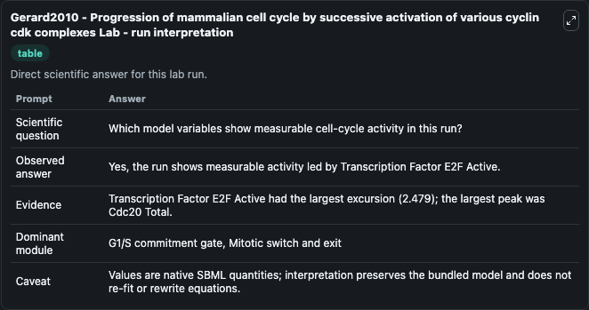
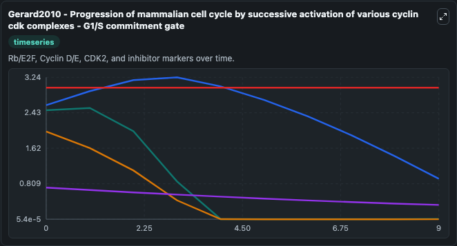
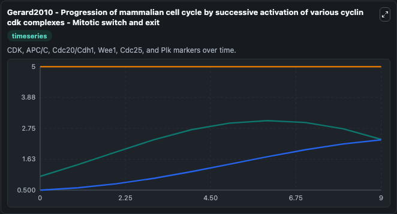
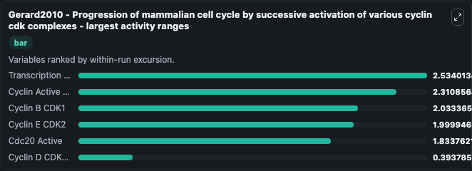
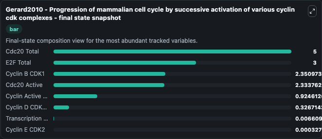
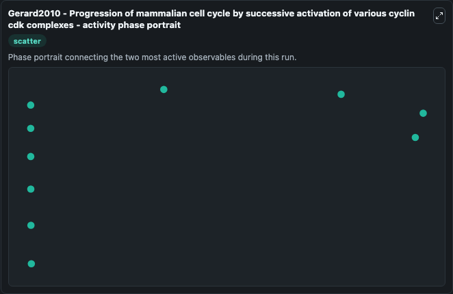

# Gerard2010 - Progression of mammalian cell cycle by successive activation of various cyclin cdk complexes Lab

Single-model lab wrapper for Gerard2010 - Progression of mammalian cell cycle by successive activation of various cyclin cdk complexes. We previously proposed a detailed, 39-variable model for the network of cyclin-dependent kinases (Cdks) that controls progression along the successive phases of the mammalian cell cycle. It can be used to explore cell-cycle regulation dynamics and compare checkpoint behavior across conditions.

This lab is a single-model Biosimulant wrapper for a cell-cycle simulation. The captured run uses the lab defaults and renders the model outputs as dark-mode visualizations for quick inspection and README embedding.

## Model Context

We previously proposed a detailed, 39-variable model for the network of cyclin-dependent kinases (Cdks) that controls progression along the successive phases of the mammalian cell cycle. It can be used to explore cell-cycle regulation dynamics and compare checkpoint behavior across conditions.

- Core model: Gerard2010 - Progression of mammalian cell cycle by successive activation of various cyclin cdk complexes
- Runtime used by the lab: duration 10, step 1
- Controllable inputs: Growth Factor, Kgf
- Primary outputs: Cyclin D CDK4 6, Transcription Factor E2F Active, Cyclin E CDK2, Cyclin Active CDK2, Cyclin B CDK1, Cdc20 Active, E2F Total, Cdc20 Total
- Tags: cellcycle, sbml, biomodels_ebi, faithful

## Output Visualizations

The images below were generated from a Biosimulant lab run in dark mode. Each capture corresponds to one rendered visualization from the run output panel.

<!-- BIOSIMULANT_VISUALS_START -->

### 1. Gerard2010 Progression Of Mammalian Cell Cycle By Successive Activation Of Vario

Gerard2010 Progression Of Mammalian Cell Cycle By Successive Activation Of Vario visualization captured from the dark-mode Biosimulant run for Gerard2010 - Progression of mammalian cell cycle by successive activation of various cyclin cdk complexes Lab.

### 2. Gerard2010 Progression Of Mammalian Cell Cycle By Successive Activation Of Vario

Gerard2010 Progression Of Mammalian Cell Cycle By Successive Activation Of Vario visualization captured from the dark-mode Biosimulant run for Gerard2010 - Progression of mammalian cell cycle by successive activation of various cyclin cdk complexes Lab.

### 3. Gerard2010 Progression Of Mammalian Cell Cycle By Successive Activation Of Vario

Gerard2010 Progression Of Mammalian Cell Cycle By Successive Activation Of Vario visualization captured from the dark-mode Biosimulant run for Gerard2010 - Progression of mammalian cell cycle by successive activation of various cyclin cdk complexes Lab.

### 4. Gerard2010 Progression Of Mammalian Cell Cycle By Successive Activation Of Vario

Gerard2010 Progression Of Mammalian Cell Cycle By Successive Activation Of Vario visualization captured from the dark-mode Biosimulant run for Gerard2010 - Progression of mammalian cell cycle by successive activation of various cyclin cdk complexes Lab.

### 5. Gerard2010 Progression Of Mammalian Cell Cycle By Successive Activation Of Vario

Gerard2010 Progression Of Mammalian Cell Cycle By Successive Activation Of Vario visualization captured from the dark-mode Biosimulant run for Gerard2010 - Progression of mammalian cell cycle by successive activation of various cyclin cdk complexes Lab.

### 6. Gerard2010 Progression Of Mammalian Cell Cycle By Successive Activation Of Vario

Gerard2010 Progression Of Mammalian Cell Cycle By Successive Activation Of Vario visualization captured from the dark-mode Biosimulant run for Gerard2010 - Progression of mammalian cell cycle by successive activation of various cyclin cdk complexes Lab.

<!-- BIOSIMULANT_VISUALS_END -->

## How to Read This Run

Use the time-course plots to see transient and steady-state behavior, the range or snapshot charts to identify the variables with the strongest response, and any phase-portrait view to inspect coupled regulator movement through the simulated trajectory. For this cell-cycle lab, the most useful comparison is usually between checkpoint, commitment, and mitotic-exit variables because those signals define where the simulated system sits in the cycle.

## Inputs

| Input | Context |
| --- | --- |
| Growth Factor | Controls Growth Factor in the lab model via `cellcycle_sbml_gerard2010_progression_of_mammalian_cell_cycle_b_biomd0000000941_model.growth_factor`. |
| Kgf | Controls Kgf in the lab model via `cellcycle_sbml_gerard2010_progression_of_mammalian_cell_cycle_b_biomd0000000941_model.kgf`. |

## Outputs

| Output | Context |
| --- | --- |
| Cyclin D CDK4 6 | Tracks Cyclin D CDK4 6 in the lab model via `cellcycle_sbml_gerard2010_progression_of_mammalian_cell_cycle_b_biomd0000000941_model.cyclin_d_cdk4_6`. |
| Transcription Factor E2F Active | Tracks Transcription Factor E2F Active in the lab model via `cellcycle_sbml_gerard2010_progression_of_mammalian_cell_cycle_b_biomd0000000941_model.transcription_factor_e2f_active`. |
| Cyclin E CDK2 | Tracks Cyclin E CDK2 in the lab model via `cellcycle_sbml_gerard2010_progression_of_mammalian_cell_cycle_b_biomd0000000941_model.cyclin_e_cdk2`. |
| Cyclin Active CDK2 | Tracks Cyclin Active CDK2 in the lab model via `cellcycle_sbml_gerard2010_progression_of_mammalian_cell_cycle_b_biomd0000000941_model.cyclin_active_cdk2`. |
| Cyclin B CDK1 | Tracks Cyclin B CDK1 in the lab model via `cellcycle_sbml_gerard2010_progression_of_mammalian_cell_cycle_b_biomd0000000941_model.cyclin_b_cdk1`. |
| Cdc20 Active | Tracks Cdc20 Active in the lab model via `cellcycle_sbml_gerard2010_progression_of_mammalian_cell_cycle_b_biomd0000000941_model.cdc20_active`. |
| E2F Total | Tracks E2F Total in the lab model via `cellcycle_sbml_gerard2010_progression_of_mammalian_cell_cycle_b_biomd0000000941_model.e2f_total`. |
| Cdc20 Total | Tracks Cdc20 Total in the lab model via `cellcycle_sbml_gerard2010_progression_of_mammalian_cell_cycle_b_biomd0000000941_model.cdc20_total`. |

## Lab Files

- `lab.yaml` defines the Biosimulant lab wrapper, exposed inputs, outputs, and runtime settings.
- `wiring-layout.json` stores the canvas layout used by the lab UI.
- `models/core/model.yaml` contains the wrapped simulation model metadata.
- `models/core/README.md` contains the source model notes and provenance.
- `models/visualisation/model.yaml` defines the visualization model used to render the run outputs.
- `assets/` contains the generated dark-mode visualization captures embedded above.
