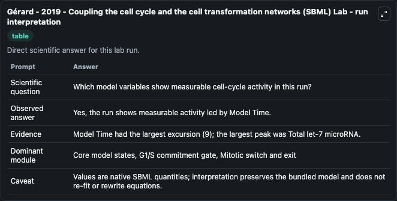
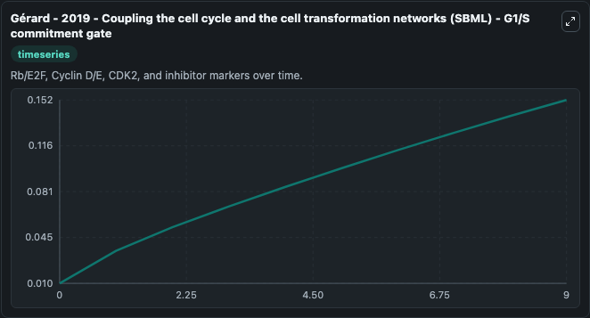
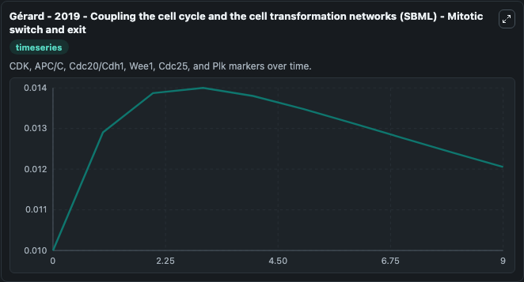
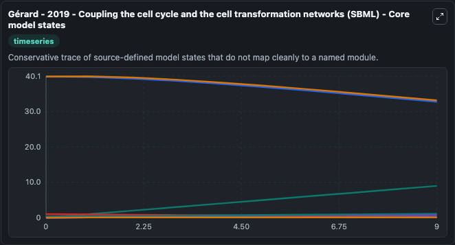
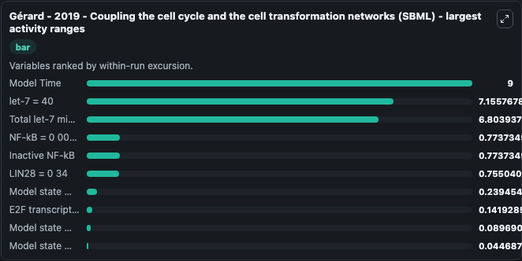
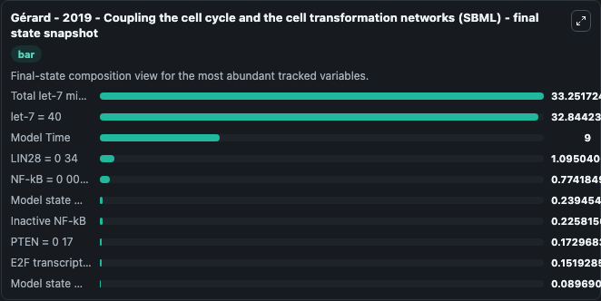
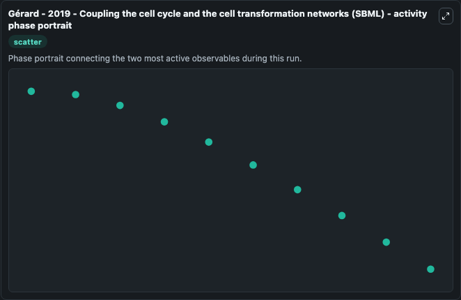

# Gérard - 2019 - Coupling the cell cycle and the cell transformation networks (SBML) Lab

Single-model lab wrapper for Gérard - 2019 - Coupling the cell cycle and the cell transformation networks (SBML). Model for the Let-7-mediated coupling between the CDK network driving the cell cycle and the malignant cell transformation network. It can be used to explore cell-cycle regulation dynamics and compare checkpoint behavior across conditions.

This lab is a single-model Biosimulant wrapper for a cell-cycle simulation. The captured run uses the lab defaults and renders the model outputs as dark-mode visualizations for quick inspection and README embedding.

## Model Context

Model for the Let-7-mediated coupling between the CDK network driving the cell cycle and the malignant cell transformation network. It can be used to explore cell-cycle regulation dynamics and compare checkpoint behavior across conditions.

- Core model: Gérard - 2019 - Coupling the cell cycle and the cell transformation networks (SBML)
- Runtime used by the lab: duration 10, step 1
- Controllable inputs: none declared
- Primary outputs: NF-kB = 0 00045, LIN28 = 0 34, let-7 = 40, Model state M IL6 = 0 0003, Model state M IL6let7, IL6 = 0 001, Model state M Ras = 0 00001, Model state M Raslet7, Ras = 0 0001, STAT3 = 0 0001, and 21 more
- Tags: cellcycle, sbml, biomodels_ebi, faithful

## Output Visualizations

The images below were generated from a Biosimulant lab run in dark mode. Each capture corresponds to one rendered visualization from the run output panel.

<!-- BIOSIMULANT_VISUALS_START -->

### 1. G Rard 2019 Coupling The Cell Cycle And The Cell Transformation Networks Sbml La

G Rard 2019 Coupling The Cell Cycle And The Cell Transformation Networks Sbml La visualization captured from the dark-mode Biosimulant run for Gérard - 2019 - Coupling the cell cycle and the cell transformation networks (SBML) Lab.

### 2. G Rard 2019 Coupling The Cell Cycle And The Cell Transformation Networks Sbml G1

G1/S commitment view, focused on the regulatory variables that gate entry into DNA synthesis and cell-cycle progression.

### 3. G Rard 2019 Coupling The Cell Cycle And The Cell Transformation Networks Sbml Mi

G Rard 2019 Coupling The Cell Cycle And The Cell Transformation Networks Sbml Mi visualization captured from the dark-mode Biosimulant run for Gérard - 2019 - Coupling the cell cycle and the cell transformation networks (SBML) Lab.

### 4. G Rard 2019 Coupling The Cell Cycle And The Cell Transformation Networks Sbml Co

G Rard 2019 Coupling The Cell Cycle And The Cell Transformation Networks Sbml Co visualization captured from the dark-mode Biosimulant run for Gérard - 2019 - Coupling the cell cycle and the cell transformation networks (SBML) Lab.

### 5. G Rard 2019 Coupling The Cell Cycle And The Cell Transformation Networks Sbml La

G Rard 2019 Coupling The Cell Cycle And The Cell Transformation Networks Sbml La visualization captured from the dark-mode Biosimulant run for Gérard - 2019 - Coupling the cell cycle and the cell transformation networks (SBML) Lab.

### 6. G Rard 2019 Coupling The Cell Cycle And The Cell Transformation Networks Sbml Fi

G Rard 2019 Coupling The Cell Cycle And The Cell Transformation Networks Sbml Fi visualization captured from the dark-mode Biosimulant run for Gérard - 2019 - Coupling the cell cycle and the cell transformation networks (SBML) Lab.

### 7. G Rard 2019 Coupling The Cell Cycle And The Cell Transformation Networks Sbml Ac

G Rard 2019 Coupling The Cell Cycle And The Cell Transformation Networks Sbml Ac visualization captured from the dark-mode Biosimulant run for Gérard - 2019 - Coupling the cell cycle and the cell transformation networks (SBML) Lab.

<!-- BIOSIMULANT_VISUALS_END -->

## How to Read This Run

Use the time-course plots to see transient and steady-state behavior, the range or snapshot charts to identify the variables with the strongest response, and any phase-portrait view to inspect coupled regulator movement through the simulated trajectory. For this cell-cycle lab, the most useful comparison is usually between checkpoint, commitment, and mitotic-exit variables because those signals define where the simulated system sits in the cycle.

## Inputs

| Input | Context |
| --- | --- |
| - | No entries declared in `lab.yaml`. |

## Outputs

| Output | Context |
| --- | --- |
| NF-kB = 0 00045 | Tracks NF-kB = 0 00045 in the lab model via `cellcycle_sbml_g_rard_2019_coupling_the_cell_cycle_and_the_cell_model1906070001_model.nf_k_b_0_00045`. |
| LIN28 = 0 34 | Tracks LIN28 = 0 34 in the lab model via `cellcycle_sbml_g_rard_2019_coupling_the_cell_cycle_and_the_cell_model1906070001_model.lin28_0_34`. |
| let-7 = 40 | Tracks let-7 = 40 in the lab model via `cellcycle_sbml_g_rard_2019_coupling_the_cell_cycle_and_the_cell_model1906070001_model.let_7_40`. |
| Model state M IL6 = 0 0003 | Tracks Model state M IL6 = 0 0003 in the lab model via `cellcycle_sbml_g_rard_2019_coupling_the_cell_cycle_and_the_cell_model1906070001_model.model_state_m_il6_0_0003`. |
| Model state M IL6let7 | Tracks Model state M IL6let7 in the lab model via `cellcycle_sbml_g_rard_2019_coupling_the_cell_cycle_and_the_cell_model1906070001_model.model_state_m_il6let7`. |
| IL6 = 0 001 | Tracks IL6 = 0 001 in the lab model via `cellcycle_sbml_g_rard_2019_coupling_the_cell_cycle_and_the_cell_model1906070001_model.il6_0_001`. |
| Model state M Ras = 0 00001 | Tracks Model state M Ras = 0 00001 in the lab model via `cellcycle_sbml_g_rard_2019_coupling_the_cell_cycle_and_the_cell_model1906070001_model.model_state_m_ras_0_00001`. |
| Model state M Raslet7 | Tracks Model state M Raslet7 in the lab model via `cellcycle_sbml_g_rard_2019_coupling_the_cell_cycle_and_the_cell_model1906070001_model.model_state_m_raslet7`. |
| Ras = 0 0001 | Tracks Ras = 0 0001 in the lab model via `cellcycle_sbml_g_rard_2019_coupling_the_cell_cycle_and_the_cell_model1906070001_model.ras_0_0001`. |
| STAT3 = 0 0001 | Tracks STAT3 = 0 0001 in the lab model via `cellcycle_sbml_g_rard_2019_coupling_the_cell_cycle_and_the_cell_model1906070001_model.stat3_0_0001`. |
| Mi Model state R21 = 0 0003 | Tracks Mi Model state R21 = 0 0003 in the lab model via `cellcycle_sbml_g_rard_2019_coupling_the_cell_cycle_and_the_cell_model1906070001_model.mi_model_state_r21_0_0003`. |
| Model state M PTEN = 0 01 | Tracks Model state M PTEN = 0 01 in the lab model via `cellcycle_sbml_g_rard_2019_coupling_the_cell_cycle_and_the_cell_model1906070001_model.model_state_m_pten_0_01`. |
| Mi Rmpten | Tracks Mi Rmpten in the lab model via `cellcycle_sbml_g_rard_2019_coupling_the_cell_cycle_and_the_cell_model1906070001_model.mi_rmpten`. |
| PTEN = 0 17 | Tracks PTEN = 0 17 in the lab model via `cellcycle_sbml_g_rard_2019_coupling_the_cell_cycle_and_the_cell_model1906070001_model.pten_0_17`. |
| Model state M Md | Tracks Model state M Md in the lab model via `cellcycle_sbml_g_rard_2019_coupling_the_cell_cycle_and_the_cell_model1906070001_model.model_state_m_md`. |
| Md = 0 01 | Tracks Md = 0 01 in the lab model via `cellcycle_sbml_g_rard_2019_coupling_the_cell_cycle_and_the_cell_model1906070001_model.md_0_01`. |
| Model state M Mdlet7 | Tracks Model state M Mdlet7 in the lab model via `cellcycle_sbml_g_rard_2019_coupling_the_cell_cycle_and_the_cell_model1906070001_model.model_state_m_mdlet7`. |
| E2F transcription factor | Tracks E2F transcription factor in the lab model via `cellcycle_sbml_g_rard_2019_coupling_the_cell_cycle_and_the_cell_model1906070001_model.e2f_transcription_factor`. |
| Model state M Me | Tracks Model state M Me in the lab model via `cellcycle_sbml_g_rard_2019_coupling_the_cell_cycle_and_the_cell_model1906070001_model.model_state_m_me`. |
| Me = 0 01 | Tracks Me = 0 01 in the lab model via `cellcycle_sbml_g_rard_2019_coupling_the_cell_cycle_and_the_cell_model1906070001_model.me_0_01`. |
| Model state M Melet7 | Tracks Model state M Melet7 in the lab model via `cellcycle_sbml_g_rard_2019_coupling_the_cell_cycle_and_the_cell_model1906070001_model.model_state_m_melet7`. |
| Model state M Ma | Tracks Model state M Ma in the lab model via `cellcycle_sbml_g_rard_2019_coupling_the_cell_cycle_and_the_cell_model1906070001_model.model_state_m_ma`. |
| Ma = 0 01 | Tracks Ma = 0 01 in the lab model via `cellcycle_sbml_g_rard_2019_coupling_the_cell_cycle_and_the_cell_model1906070001_model.ma_0_01`. |
| Model state M Malet7 | Tracks Model state M Malet7 in the lab model via `cellcycle_sbml_g_rard_2019_coupling_the_cell_cycle_and_the_cell_model1906070001_model.model_state_m_malet7`. |
| Model state M Mb | Tracks Model state M Mb in the lab model via `cellcycle_sbml_g_rard_2019_coupling_the_cell_cycle_and_the_cell_model1906070001_model.model_state_m_mb`. |
| Mb = 0 01 | Tracks Mb = 0 01 in the lab model via `cellcycle_sbml_g_rard_2019_coupling_the_cell_cycle_and_the_cell_model1906070001_model.mb_0_01`. |
| Model state M Mblet7 | Tracks Model state M Mblet7 in the lab model via `cellcycle_sbml_g_rard_2019_coupling_the_cell_cycle_and_the_cell_model1906070001_model.model_state_m_mblet7`. |
| APC/C/C = 0 01 | Tracks APC/C/C = 0 01 in the lab model via `cellcycle_sbml_g_rard_2019_coupling_the_cell_cycle_and_the_cell_model1906070001_model.apc_c_c_0_01`. |
| Total let-7 microRNA | Tracks Total let-7 microRNA in the lab model via `cellcycle_sbml_g_rard_2019_coupling_the_cell_cycle_and_the_cell_model1906070001_model.total_let_7_micro_rna`. |
| Inactive NF-kB | Tracks Inactive NF-kB in the lab model via `cellcycle_sbml_g_rard_2019_coupling_the_cell_cycle_and_the_cell_model1906070001_model.inactive_nf_k_b`. |
| Model Time | Tracks Model Time in the lab model via `cellcycle_sbml_g_rard_2019_coupling_the_cell_cycle_and_the_cell_model1906070001_model.model_time`. |

## Lab Files

- `lab.yaml` defines the Biosimulant lab wrapper, exposed inputs, outputs, and runtime settings.
- `wiring-layout.json` stores the canvas layout used by the lab UI.
- `models/core/model.yaml` contains the wrapped simulation model metadata.
- `models/core/README.md` contains the source model notes and provenance.
- `models/visualisation/model.yaml` defines the visualization model used to render the run outputs.
- `assets/` contains the generated dark-mode visualization captures embedded above.
