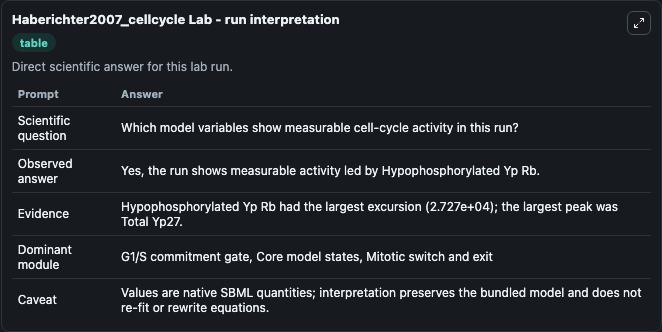
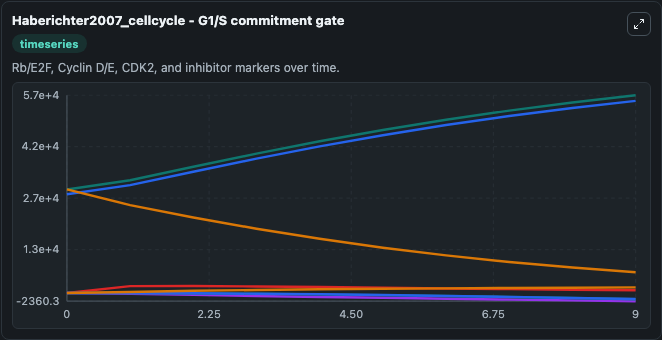
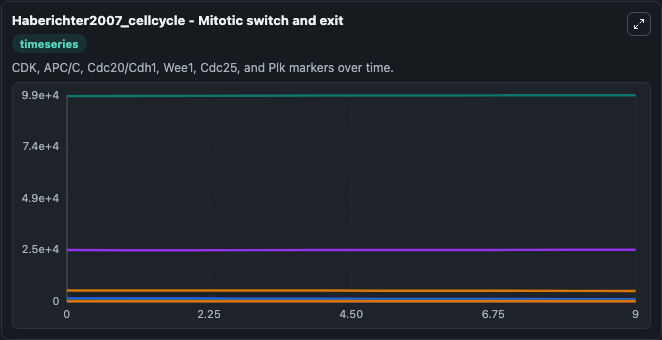
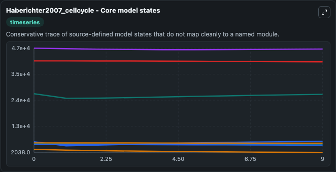
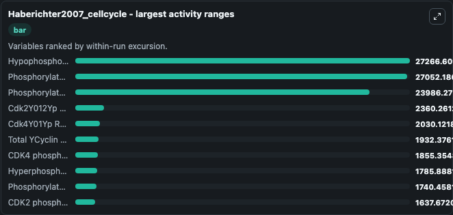
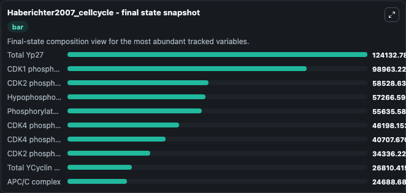
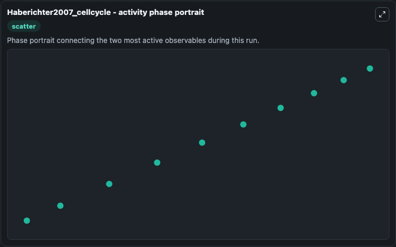

# Haberichter2007_cellcycle Lab

Single-model lab wrapper for Haberichter2007_cellcycle. This model is according to the paper A systems biology dynamical model of mammalian G1 cell cycle progression. Supplementary Figure 2A has been reproduced by the MathSBML and CellDesigner.

This lab is a single-model Biosimulant wrapper for a cell-cycle simulation. The captured run uses the lab defaults and renders the model outputs as dark-mode visualizations for quick inspection and README embedding.

## Model Context

This model is according to the paper A systems biology dynamical model of mammalian G1 cell cycle progression. Supplementary Figure 2A has been reproduced by the MathSBML and CellDesigner.

- Core model: Haberichter2007_cellcycle
- Runtime used by the lab: duration 10, step 1
- Controllable inputs: none declared
- Primary outputs: APC/C complex, APC/C-CDK interaction state APCCYCdk1Y00YCdk1Y01YInt, APC/C-CDK interaction state APCCYCdk1Y10YCdk1Y11YInt, APC/C-CDK interaction state APCCYCdk2Y000YCdk2Y002YInt, APC/C-CDK interaction state APCCYCdk2Y010YCdk2Y012YInt, APC/C-CDK interaction state APCCYCdk2Y100YCdk2Y102YInt, APC/C-CDK interaction state APCCYCdk2Y110YCdk2Y112YInt, APC/C-bound CyclinAYInt state, APC/C-bound Emi1 state, CDK1 phosphorylation state 00, and 47 more
- Tags: cellcycle, sbml, biomodels_ebi, faithful

## Output Visualizations

The images below were generated from a Biosimulant lab run in dark mode. Each capture corresponds to one rendered visualization from the run output panel.

<!-- BIOSIMULANT_VISUALS_START -->

### 1. Haberichter2007 Cellcycle Lab Run Interpretation

Run interpretation view that anchors the captured simulation: it summarizes the lab purpose, runtime, and how to read the generated cell-cycle outputs.

### 2. Haberichter2007 Cellcycle G1 S Commitment Gate

G1/S commitment view, focused on the regulatory variables that gate entry into DNA synthesis and cell-cycle progression.

### 3. Haberichter2007 Cellcycle Mitotic Switch And Exit

Mitotic switch and exit view, capturing late-cycle regulators and the transition out of mitosis.

### 4. Haberichter2007 Cellcycle Core Model States

Core model state trajectories for APC/C complex, APC/C-CDK interaction state APCCYCdk1Y00YCdk1Y01YInt, APC/C-CDK interaction state APCCYCdk1Y10YCdk1Y11YInt, APC/C-CDK interaction state APCCYCdk2Y000YCdk2Y002YInt, APC/C-CDK interaction state APCCYCdk2Y010YCdk2Y012YInt, APC/C-CDK interaction state APCCYCdk2Y100YCdk2Y102YInt, and 51 additional outputs, using the lab default initial conditions and runtime.

### 5. Haberichter2007 Cellcycle Largest Activity Ranges

Largest activity ranges chart, ranking the variables with the widest simulated movement so the dominant responses are easy to spot.

### 6. Haberichter2007 Cellcycle Final State Snapshot

Final state snapshot, comparing the end-of-run values for the selected cell-cycle variables.

### 7. Haberichter2007 Cellcycle Activity Phase Portrait

Activity phase portrait, showing pairwise movement between selected variables across the simulated trajectory.

<!-- BIOSIMULANT_VISUALS_END -->

## How to Read This Run

Use the time-course plots to see transient and steady-state behavior, the range or snapshot charts to identify the variables with the strongest response, and any phase-portrait view to inspect coupled regulator movement through the simulated trajectory. For this cell-cycle lab, the most useful comparison is usually between checkpoint, commitment, and mitotic-exit variables because those signals define where the simulated system sits in the cycle.

## Inputs

| Input | Context |
| --- | --- |
| - | No entries declared in `lab.yaml`. |

## Outputs

| Output | Context |
| --- | --- |
| APC/C complex | Tracks APC/C complex in the lab model via `cellcycle_sbml_haberichter2007_cellcycle_biomd0000000109_model.apc_c_complex`. |
| APC/C-CDK interaction state APCCYCdk1Y00YCdk1Y01YInt | Tracks APC/C-CDK interaction state APCCYCdk1Y00YCdk1Y01YInt in the lab model via `cellcycle_sbml_haberichter2007_cellcycle_biomd0000000109_model.apc_c_cdk_interaction_state_apccycdk1y00ycdk1y01yint`. |
| APC/C-CDK interaction state APCCYCdk1Y10YCdk1Y11YInt | Tracks APC/C-CDK interaction state APCCYCdk1Y10YCdk1Y11YInt in the lab model via `cellcycle_sbml_haberichter2007_cellcycle_biomd0000000109_model.apc_c_cdk_interaction_state_apccycdk1y10ycdk1y11yint`. |
| APC/C-CDK interaction state APCCYCdk2Y000YCdk2Y002YInt | Tracks APC/C-CDK interaction state APCCYCdk2Y000YCdk2Y002YInt in the lab model via `cellcycle_sbml_haberichter2007_cellcycle_biomd0000000109_model.apc_c_cdk_interaction_state_apccycdk2y000ycdk2y002yint`. |
| APC/C-CDK interaction state APCCYCdk2Y010YCdk2Y012YInt | Tracks APC/C-CDK interaction state APCCYCdk2Y010YCdk2Y012YInt in the lab model via `cellcycle_sbml_haberichter2007_cellcycle_biomd0000000109_model.apc_c_cdk_interaction_state_apccycdk2y010ycdk2y012yint`. |
| APC/C-CDK interaction state APCCYCdk2Y100YCdk2Y102YInt | Tracks APC/C-CDK interaction state APCCYCdk2Y100YCdk2Y102YInt in the lab model via `cellcycle_sbml_haberichter2007_cellcycle_biomd0000000109_model.apc_c_cdk_interaction_state_apccycdk2y100ycdk2y102yint`. |
| APC/C-CDK interaction state APCCYCdk2Y110YCdk2Y112YInt | Tracks APC/C-CDK interaction state APCCYCdk2Y110YCdk2Y112YInt in the lab model via `cellcycle_sbml_haberichter2007_cellcycle_biomd0000000109_model.apc_c_cdk_interaction_state_apccycdk2y110ycdk2y112yint`. |
| APC/C-bound CyclinAYInt state | Tracks APC/C-bound CyclinAYInt state in the lab model via `cellcycle_sbml_haberichter2007_cellcycle_biomd0000000109_model.apc_c_bound_cyclin_ayint_state`. |
| APC/C-bound Emi1 state | Tracks APC/C-bound Emi1 state in the lab model via `cellcycle_sbml_haberichter2007_cellcycle_biomd0000000109_model.apc_c_bound_emi1_state`. |
| CDK1 phosphorylation state 00 | Tracks CDK1 phosphorylation state 00 in the lab model via `cellcycle_sbml_haberichter2007_cellcycle_biomd0000000109_model.cdk1_phosphorylation_state_00`. |
| CDK1 phosphorylation state 01 | Tracks CDK1 phosphorylation state 01 in the lab model via `cellcycle_sbml_haberichter2007_cellcycle_biomd0000000109_model.cdk1_phosphorylation_state_01`. |
| CDK1 phosphorylation state 10 | Tracks CDK1 phosphorylation state 10 in the lab model via `cellcycle_sbml_haberichter2007_cellcycle_biomd0000000109_model.cdk1_phosphorylation_state_10`. |
| CDK1 phosphorylation state 11 | Tracks CDK1 phosphorylation state 11 in the lab model via `cellcycle_sbml_haberichter2007_cellcycle_biomd0000000109_model.cdk1_phosphorylation_state_11`. |
| Cdk1Y11Yp Rb Y10Yp Rb Y20YInt | Tracks Cdk1Y11Yp Rb Y10Yp Rb Y20YInt in the lab model via `cellcycle_sbml_haberichter2007_cellcycle_biomd0000000109_model.cdk1y11yp_rb_y10yp_rb_y20yint`. |
| Cdk1Y11Yp Rb Y11Yp Rb Y21YInt | Tracks Cdk1Y11Yp Rb Y11Yp Rb Y21YInt in the lab model via `cellcycle_sbml_haberichter2007_cellcycle_biomd0000000109_model.cdk1y11yp_rb_y11yp_rb_y21yint`. |
| CDK2 phosphorylation state 000 | Tracks CDK2 phosphorylation state 000 in the lab model via `cellcycle_sbml_haberichter2007_cellcycle_biomd0000000109_model.cdk2_phosphorylation_state_000`. |
| CDK2 phosphorylation state 001 | Tracks CDK2 phosphorylation state 001 in the lab model via `cellcycle_sbml_haberichter2007_cellcycle_biomd0000000109_model.cdk2_phosphorylation_state_001`. |
| CDK2 phosphorylation state 002 | Tracks CDK2 phosphorylation state 002 in the lab model via `cellcycle_sbml_haberichter2007_cellcycle_biomd0000000109_model.cdk2_phosphorylation_state_002`. |
| CDK2 phosphorylation state 010 | Tracks CDK2 phosphorylation state 010 in the lab model via `cellcycle_sbml_haberichter2007_cellcycle_biomd0000000109_model.cdk2_phosphorylation_state_010`. |
| CDK2 phosphorylation state 011 | Tracks CDK2 phosphorylation state 011 in the lab model via `cellcycle_sbml_haberichter2007_cellcycle_biomd0000000109_model.cdk2_phosphorylation_state_011`. |
| Cdk2Y011Yp Rb Y10Yp Rb Y20YInt | Tracks Cdk2Y011Yp Rb Y10Yp Rb Y20YInt in the lab model via `cellcycle_sbml_haberichter2007_cellcycle_biomd0000000109_model.cdk2y011yp_rb_y10yp_rb_y20yint`. |
| Cdk2Y011Yp Rb Y11Yp Rb Y21YInt | Tracks Cdk2Y011Yp Rb Y11Yp Rb Y21YInt in the lab model via `cellcycle_sbml_haberichter2007_cellcycle_biomd0000000109_model.cdk2y011yp_rb_y11yp_rb_y21yint`. |
| CDK2 phosphorylation state 012 | Tracks CDK2 phosphorylation state 012 in the lab model via `cellcycle_sbml_haberichter2007_cellcycle_biomd0000000109_model.cdk2_phosphorylation_state_012`. |
| Cdk2Y012Yp Rb Y10Yp Rb Y20YInt | Tracks Cdk2Y012Yp Rb Y10Yp Rb Y20YInt in the lab model via `cellcycle_sbml_haberichter2007_cellcycle_biomd0000000109_model.cdk2y012yp_rb_y10yp_rb_y20yint`. |
| Cdk2Y012Yp Rb Y11Yp Rb Y21YInt | Tracks Cdk2Y012Yp Rb Y11Yp Rb Y21YInt in the lab model via `cellcycle_sbml_haberichter2007_cellcycle_biomd0000000109_model.cdk2y012yp_rb_y11yp_rb_y21yint`. |
| CDK2 phosphorylation state 100 | Tracks CDK2 phosphorylation state 100 in the lab model via `cellcycle_sbml_haberichter2007_cellcycle_biomd0000000109_model.cdk2_phosphorylation_state_100`. |
| CDK2 phosphorylation state 101 | Tracks CDK2 phosphorylation state 101 in the lab model via `cellcycle_sbml_haberichter2007_cellcycle_biomd0000000109_model.cdk2_phosphorylation_state_101`. |
| CDK2 phosphorylation state 102 | Tracks CDK2 phosphorylation state 102 in the lab model via `cellcycle_sbml_haberichter2007_cellcycle_biomd0000000109_model.cdk2_phosphorylation_state_102`. |
| CDK2 phosphorylation state 110 | Tracks CDK2 phosphorylation state 110 in the lab model via `cellcycle_sbml_haberichter2007_cellcycle_biomd0000000109_model.cdk2_phosphorylation_state_110`. |
| CDK2 phosphorylation state 111 | Tracks CDK2 phosphorylation state 111 in the lab model via `cellcycle_sbml_haberichter2007_cellcycle_biomd0000000109_model.cdk2_phosphorylation_state_111`. |
| CDK2 phosphorylation state 112 | Tracks CDK2 phosphorylation state 112 in the lab model via `cellcycle_sbml_haberichter2007_cellcycle_biomd0000000109_model.cdk2_phosphorylation_state_112`. |
| CDK4 phosphorylation state 00 | Tracks CDK4 phosphorylation state 00 in the lab model via `cellcycle_sbml_haberichter2007_cellcycle_biomd0000000109_model.cdk4_phosphorylation_state_00`. |
| CDK4 phosphorylation state 01 | Tracks CDK4 phosphorylation state 01 in the lab model via `cellcycle_sbml_haberichter2007_cellcycle_biomd0000000109_model.cdk4_phosphorylation_state_01`. |
| Cdk4Y01Yp Rb Y00Yp Rb Y10YInt | Tracks Cdk4Y01Yp Rb Y00Yp Rb Y10YInt in the lab model via `cellcycle_sbml_haberichter2007_cellcycle_biomd0000000109_model.cdk4y01yp_rb_y00yp_rb_y10yint`. |
| Cdk4Y01Yp Rb Y01Yp Rb Y11YInt | Tracks Cdk4Y01Yp Rb Y01Yp Rb Y11YInt in the lab model via `cellcycle_sbml_haberichter2007_cellcycle_biomd0000000109_model.cdk4y01yp_rb_y01yp_rb_y11yint`. |
| CDK4 phosphorylation state 10 | Tracks CDK4 phosphorylation state 10 in the lab model via `cellcycle_sbml_haberichter2007_cellcycle_biomd0000000109_model.cdk4_phosphorylation_state_10`. |
| CDK4 phosphorylation state 11 | Tracks CDK4 phosphorylation state 11 in the lab model via `cellcycle_sbml_haberichter2007_cellcycle_biomd0000000109_model.cdk4_phosphorylation_state_11`. |
| Cyclin A | Tracks Cyclin A in the lab model via `cellcycle_sbml_haberichter2007_cellcycle_biomd0000000109_model.cyclin_a`. |
| Cyclin D | Tracks Cyclin D in the lab model via `cellcycle_sbml_haberichter2007_cellcycle_biomd0000000109_model.cyclin_d`. |
| Cyclin E | Tracks Cyclin E in the lab model via `cellcycle_sbml_haberichter2007_cellcycle_biomd0000000109_model.cyclin_e`. |
| E2F transcription factor | Tracks E2F transcription factor in the lab model via `cellcycle_sbml_haberichter2007_cellcycle_biomd0000000109_model.e2f_transcription_factor`. |
| Emi1 APC/C inhibitor | Tracks Emi1 APC/C inhibitor in the lab model via `cellcycle_sbml_haberichter2007_cellcycle_biomd0000000109_model.emi1_apc_c_inhibitor`. |
| p27 CDK inhibitor | Tracks p27 CDK inhibitor in the lab model via `cellcycle_sbml_haberichter2007_cellcycle_biomd0000000109_model.p27_cdk_inhibitor`. |
| Phosphorylated Rb Model state Y00 | Tracks Phosphorylated Rb Model state Y00 in the lab model via `cellcycle_sbml_haberichter2007_cellcycle_biomd0000000109_model.phosphorylated_rb_model_state_y00`. |
| Phosphorylated Rb Model state Y01 | Tracks Phosphorylated Rb Model state Y01 in the lab model via `cellcycle_sbml_haberichter2007_cellcycle_biomd0000000109_model.phosphorylated_rb_model_state_y01`. |
| Phosphorylated Rb Model state Y10 | Tracks Phosphorylated Rb Model state Y10 in the lab model via `cellcycle_sbml_haberichter2007_cellcycle_biomd0000000109_model.phosphorylated_rb_model_state_y10`. |
| Phosphorylated Rb Model state Y11 | Tracks Phosphorylated Rb Model state Y11 in the lab model via `cellcycle_sbml_haberichter2007_cellcycle_biomd0000000109_model.phosphorylated_rb_model_state_y11`. |
| Phosphorylated Rb Model state Y20 | Tracks Phosphorylated Rb Model state Y20 in the lab model via `cellcycle_sbml_haberichter2007_cellcycle_biomd0000000109_model.phosphorylated_rb_model_state_y20`. |
| Phosphorylated Rb Model state Y21 | Tracks Phosphorylated Rb Model state Y21 in the lab model via `cellcycle_sbml_haberichter2007_cellcycle_biomd0000000109_model.phosphorylated_rb_model_state_y21`. |
| Total YCyclin YD | Tracks Total YCyclin YD in the lab model via `cellcycle_sbml_haberichter2007_cellcycle_biomd0000000109_model.total_ycyclin_yd`. |
| Total YCyclin YE | Tracks Total YCyclin YE in the lab model via `cellcycle_sbml_haberichter2007_cellcycle_biomd0000000109_model.total_ycyclin_ye`. |
| Total YCyclin YA | Tracks Total YCyclin YA in the lab model via `cellcycle_sbml_haberichter2007_cellcycle_biomd0000000109_model.total_ycyclin_ya`. |
| Total Yp27 | Tracks Total Yp27 in the lab model via `cellcycle_sbml_haberichter2007_cellcycle_biomd0000000109_model.total_yp27`. |
| Hypophosphorylated Yp Rb | Tracks Hypophosphorylated Yp Rb in the lab model via `cellcycle_sbml_haberichter2007_cellcycle_biomd0000000109_model.hypophosphorylated_yp_rb`. |
| Hyperphosphorylated Yp Rb | Tracks Hyperphosphorylated Yp Rb in the lab model via `cellcycle_sbml_haberichter2007_cellcycle_biomd0000000109_model.hyperphosphorylated_yp_rb`. |
| Total YEmi1 | Tracks Total YEmi1 in the lab model via `cellcycle_sbml_haberichter2007_cellcycle_biomd0000000109_model.total_yemi1`. |
| Active YCdk2 | Tracks Active YCdk2 in the lab model via `cellcycle_sbml_haberichter2007_cellcycle_biomd0000000109_model.active_ycdk2`. |

## Lab Files

- `lab.yaml` defines the Biosimulant lab wrapper, exposed inputs, outputs, and runtime settings.
- `wiring-layout.json` stores the canvas layout used by the lab UI.
- `models/core/model.yaml` contains the wrapped simulation model metadata.
- `models/core/README.md` contains the source model notes and provenance.
- `models/visualisation/model.yaml` defines the visualization model used to render the run outputs.
- `assets/` contains the generated dark-mode visualization captures embedded above.
