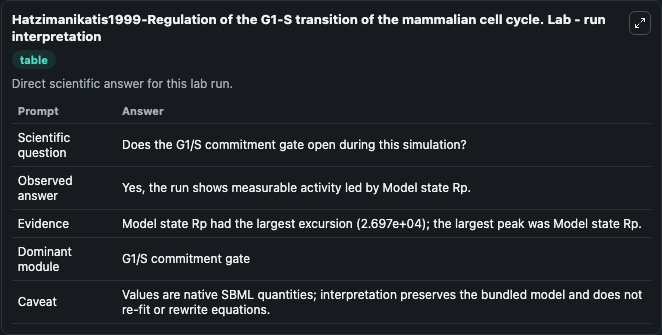
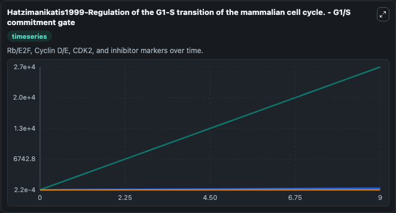
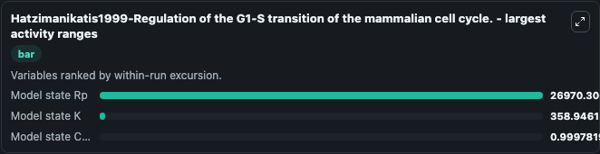
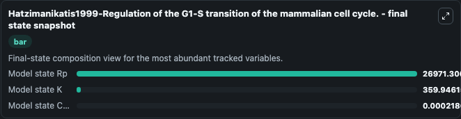
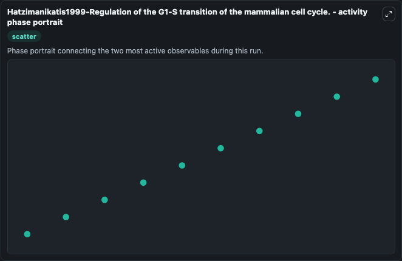

# Hatzimanikatis1999-Regulation of the G1-S transition of the mammalian cell cycle. Lab

Single-model lab wrapper for Hatzimanikatis1999-Regulation of the G1-S transition of the mammalian cell cycle.. A mathematical model of regulation of the G1-S transition of the mammalian cell cycle has been formulated to organize available experimental molecular-level information in a systematic quantitative fr. It can be used to explore cell-cycle regulation dynamics and compare checkpoint behavior across conditions.

This lab is a single-model Biosimulant wrapper for a cell-cycle simulation. The captured run uses the lab defaults and renders the model outputs as dark-mode visualizations for quick inspection and README embedding.

## Model Context

A mathematical model of regulation of the G1-S transition of the mammalian cell cycle has been formulated to organize available experimental molecular-level information in a systematic quantitative fr. It can be used to explore cell-cycle regulation dynamics and compare checkpoint behavior across conditions.

- Core model: Hatzimanikatis1999-Regulation of the G1-S transition of the mammalian cell cycle.
- Runtime used by the lab: duration 10, step 1
- Controllable inputs: Model state E, Model state Kp, Model state RE
- Primary outputs: Model state C (C), Model state K, Model state Rp
- Tags: cellcycle, sbml, biomodels_ebi, faithful

## Output Visualizations

The images below were generated from a Biosimulant lab run in dark mode. Each capture corresponds to one rendered visualization from the run output panel.

<!-- BIOSIMULANT_VISUALS_START -->

### 1. Hatzimanikatis1999 Regulation Of The G1 S Transition Of The Mammalian Cell Cycle

G1/S commitment view, focused on the regulatory variables that gate entry into DNA synthesis and cell-cycle progression.

### 2. Hatzimanikatis1999 Regulation Of The G1 S Transition Of The Mammalian Cell Cycle

G1/S commitment view, focused on the regulatory variables that gate entry into DNA synthesis and cell-cycle progression.

### 3. Hatzimanikatis1999 Regulation Of The G1 S Transition Of The Mammalian Cell Cycle

G1/S commitment view, focused on the regulatory variables that gate entry into DNA synthesis and cell-cycle progression.

### 4. Hatzimanikatis1999 Regulation Of The G1 S Transition Of The Mammalian Cell Cycle

G1/S commitment view, focused on the regulatory variables that gate entry into DNA synthesis and cell-cycle progression.

### 5. Hatzimanikatis1999 Regulation Of The G1 S Transition Of The Mammalian Cell Cycle

G1/S commitment view, focused on the regulatory variables that gate entry into DNA synthesis and cell-cycle progression.

<!-- BIOSIMULANT_VISUALS_END -->

## How to Read This Run

Use the time-course plots to see transient and steady-state behavior, the range or snapshot charts to identify the variables with the strongest response, and any phase-portrait view to inspect coupled regulator movement through the simulated trajectory. For this cell-cycle lab, the most useful comparison is usually between checkpoint, commitment, and mitotic-exit variables because those signals define where the simulated system sits in the cycle.

## Inputs

| Input | Context |
| --- | --- |
| Model state E | Controls Model state E in the lab model via `cellcycle_sbml_hatzimanikatis1999_regulation_of_the_g1_s_transi_model2005070001_model.model_state_e`. |
| Model state Kp | Controls Model state Kp in the lab model via `cellcycle_sbml_hatzimanikatis1999_regulation_of_the_g1_s_transi_model2005070001_model.model_state_kp`. |
| Model state RE | Controls Model state RE in the lab model via `cellcycle_sbml_hatzimanikatis1999_regulation_of_the_g1_s_transi_model2005070001_model.model_state_re`. |

## Outputs

| Output | Context |
| --- | --- |
| Model state C (C) | Tracks Model state C (C) in the lab model via `cellcycle_sbml_hatzimanikatis1999_regulation_of_the_g1_s_transi_model2005070001_model.model_state_c_c`. |
| Model state K | Tracks Model state K in the lab model via `cellcycle_sbml_hatzimanikatis1999_regulation_of_the_g1_s_transi_model2005070001_model.model_state_k`. |
| Model state Rp | Tracks Model state Rp in the lab model via `cellcycle_sbml_hatzimanikatis1999_regulation_of_the_g1_s_transi_model2005070001_model.model_state_rp`. |

## Lab Files

- `lab.yaml` defines the Biosimulant lab wrapper, exposed inputs, outputs, and runtime settings.
- `wiring-layout.json` stores the canvas layout used by the lab UI.
- `models/core/model.yaml` contains the wrapped simulation model metadata.
- `models/core/README.md` contains the source model notes and provenance.
- `models/visualisation/model.yaml` defines the visualization model used to render the run outputs.
- `assets/` contains the generated dark-mode visualization captures embedded above.
