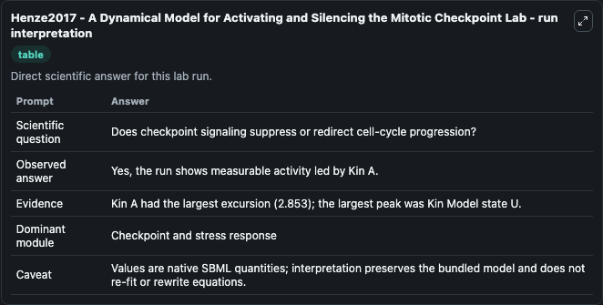
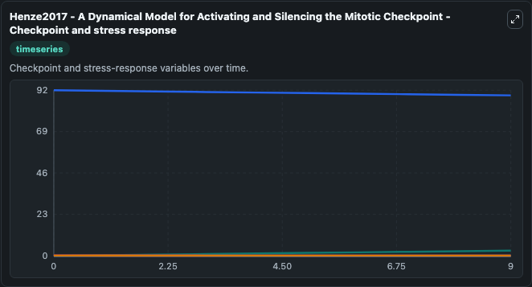
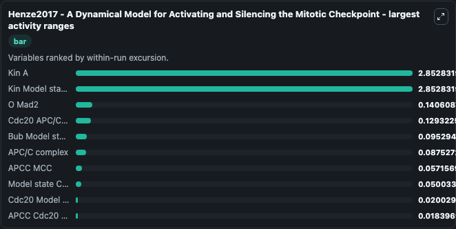
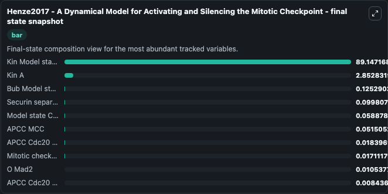
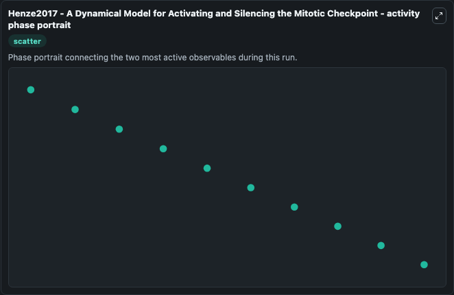

# Henze2017 - A Dynamical Model for Activating and Silencing the Mitotic Checkpoint Lab

Single-model lab wrapper for Henze2017 - A Dynamical Model for Activating and Silencing the Mitotic Checkpoint. The spindle assembly checkpoint (SAC) is an evolutionarily conserved mechanism, exclusively sensitive to the states of kinetochores attached to microtubules. It can be used to explore cell-cycle regulation dynamics and compare checkpoint behavior across conditions.

This lab is a single-model Biosimulant wrapper for a cell-cycle simulation. The captured run uses the lab defaults and renders the model outputs as dark-mode visualizations for quick inspection and README embedding.

## Model Context

The spindle assembly checkpoint (SAC) is an evolutionarily conserved mechanism, exclusively sensitive to the states of kinetochores attached to microtubules. It can be used to explore cell-cycle regulation dynamics and compare checkpoint behavior across conditions.

- Core model: Henze2017 - A Dynamical Model for Activating and Silencing the Mitotic Checkpoint
- Runtime used by the lab: duration 10, step 1
- Controllable inputs: none declared
- Primary outputs: Kin A, Kin Model state U, APCC Cdc20, Securin separase inhibitor, APC/C complex, Cdc20 APC/C activator, Cyclin B, APCC MCC, Mitotic checkpoint complex, Model state C Mad2, and 9 more
- Tags: cellcycle, sbml, biomodels_ebi, faithful

## Output Visualizations

The images below were generated from a Biosimulant lab run in dark mode. Each capture corresponds to one rendered visualization from the run output panel.

<!-- BIOSIMULANT_VISUALS_START -->

### 1. Henze2017 A Dynamical Model For Activating And Silencing The Mitotic Checkpoint 

Checkpoint and stress-response time courses, showing how the configured run moves through DNA damage, surveillance, and arrest-related signals.

### 2. Henze2017 A Dynamical Model For Activating And Silencing The Mitotic Checkpoint 

Checkpoint and stress-response time courses, showing how the configured run moves through DNA damage, surveillance, and arrest-related signals.

### 3. Henze2017 A Dynamical Model For Activating And Silencing The Mitotic Checkpoint 

Checkpoint and stress-response time courses, showing how the configured run moves through DNA damage, surveillance, and arrest-related signals.

### 4. Henze2017 A Dynamical Model For Activating And Silencing The Mitotic Checkpoint 

Checkpoint and stress-response time courses, showing how the configured run moves through DNA damage, surveillance, and arrest-related signals.

### 5. Henze2017 A Dynamical Model For Activating And Silencing The Mitotic Checkpoint 

Checkpoint and stress-response time courses, showing how the configured run moves through DNA damage, surveillance, and arrest-related signals.

<!-- BIOSIMULANT_VISUALS_END -->

## How to Read This Run

Use the time-course plots to see transient and steady-state behavior, the range or snapshot charts to identify the variables with the strongest response, and any phase-portrait view to inspect coupled regulator movement through the simulated trajectory. For this cell-cycle lab, the most useful comparison is usually between checkpoint, commitment, and mitotic-exit variables because those signals define where the simulated system sits in the cycle.

## Inputs

| Input | Context |
| --- | --- |
| - | No entries declared in `lab.yaml`. |

## Outputs

| Output | Context |
| --- | --- |
| Kin A | Tracks Kin A in the lab model via `cellcycle_sbml_henze2017_a_dynamical_model_for_activating_and_s_model1812210002_model.kin_a`. |
| Kin Model state U | Tracks Kin Model state U in the lab model via `cellcycle_sbml_henze2017_a_dynamical_model_for_activating_and_s_model1812210002_model.kin_model_state_u`. |
| APCC Cdc20 | Tracks APCC Cdc20 in the lab model via `cellcycle_sbml_henze2017_a_dynamical_model_for_activating_and_s_model1812210002_model.apcc_cdc20`. |
| Securin separase inhibitor | Tracks Securin separase inhibitor in the lab model via `cellcycle_sbml_henze2017_a_dynamical_model_for_activating_and_s_model1812210002_model.securin_separase_inhibitor`. |
| APC/C complex | Tracks APC/C complex in the lab model via `cellcycle_sbml_henze2017_a_dynamical_model_for_activating_and_s_model1812210002_model.apc_c_complex`. |
| Cdc20 APC/C activator | Tracks Cdc20 APC/C activator in the lab model via `cellcycle_sbml_henze2017_a_dynamical_model_for_activating_and_s_model1812210002_model.cdc20_apc_c_activator`. |
| Cyclin B | Tracks Cyclin B in the lab model via `cellcycle_sbml_henze2017_a_dynamical_model_for_activating_and_s_model1812210002_model.cyclin_b`. |
| APCC MCC | Tracks APCC MCC in the lab model via `cellcycle_sbml_henze2017_a_dynamical_model_for_activating_and_s_model1812210002_model.apcc_mcc`. |
| Mitotic checkpoint complex | Tracks Mitotic checkpoint complex in the lab model via `cellcycle_sbml_henze2017_a_dynamical_model_for_activating_and_s_model1812210002_model.mitotic_checkpoint_complex`. |
| Model state C Mad2 | Tracks Model state C Mad2 in the lab model via `cellcycle_sbml_henze2017_a_dynamical_model_for_activating_and_s_model1812210002_model.model_state_c_mad2`. |
| O Mad2 | Tracks O Mad2 in the lab model via `cellcycle_sbml_henze2017_a_dynamical_model_for_activating_and_s_model1812210002_model.o_mad2`. |
| Cdc20 Model state C Mad2 | Tracks Cdc20 Model state C Mad2 in the lab model via `cellcycle_sbml_henze2017_a_dynamical_model_for_activating_and_s_model1812210002_model.cdc20_model_state_c_mad2`. |
| Bub Model state R1 Bub3 | Tracks Bub Model state R1 Bub3 in the lab model via `cellcycle_sbml_henze2017_a_dynamical_model_for_activating_and_s_model1812210002_model.bub_model_state_r1_bub3`. |
| Mad1 Mad2 | Tracks Mad1 Mad2 in the lab model via `cellcycle_sbml_henze2017_a_dynamical_model_for_activating_and_s_model1812210002_model.mad1_mad2`. |
| Mad1 Mad2 Model state C Mad2 | Tracks Mad1 Mad2 Model state C Mad2 in the lab model via `cellcycle_sbml_henze2017_a_dynamical_model_for_activating_and_s_model1812210002_model.mad1_mad2_model_state_c_mad2`. |
| BubR1-Cdc20 checkpoint complex | Tracks BubR1-Cdc20 checkpoint complex in the lab model via `cellcycle_sbml_henze2017_a_dynamical_model_for_activating_and_s_model1812210002_model.bub_r1_cdc20_checkpoint_complex`. |
| APCC Cdc20 Model state C Mad2 | Tracks APCC Cdc20 Model state C Mad2 in the lab model via `cellcycle_sbml_henze2017_a_dynamical_model_for_activating_and_s_model1812210002_model.apcc_cdc20_model_state_c_mad2`. |
| APCC BCC | Tracks APCC BCC in the lab model via `cellcycle_sbml_henze2017_a_dynamical_model_for_activating_and_s_model1812210002_model.apcc_bcc`. |
| APCC Cdc20 MCC | Tracks APCC Cdc20 MCC in the lab model via `cellcycle_sbml_henze2017_a_dynamical_model_for_activating_and_s_model1812210002_model.apcc_cdc20_mcc`. |

## Lab Files

- `lab.yaml` defines the Biosimulant lab wrapper, exposed inputs, outputs, and runtime settings.
- `wiring-layout.json` stores the canvas layout used by the lab UI.
- `models/core/model.yaml` contains the wrapped simulation model metadata.
- `models/core/README.md` contains the source model notes and provenance.
- `models/visualisation/model.yaml` defines the visualization model used to render the run outputs.
- `assets/` contains the generated dark-mode visualization captures embedded above.
