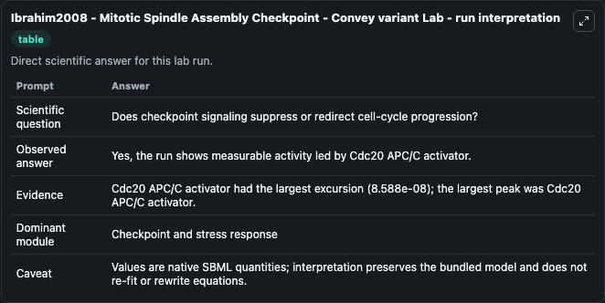
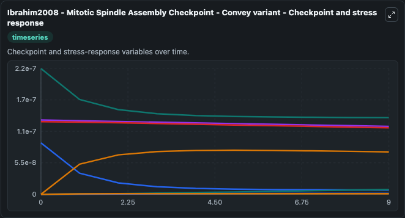
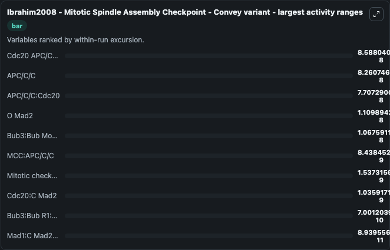
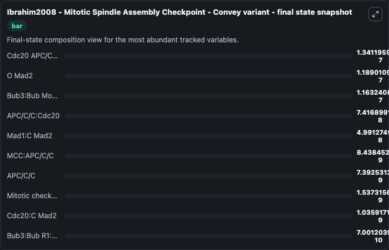
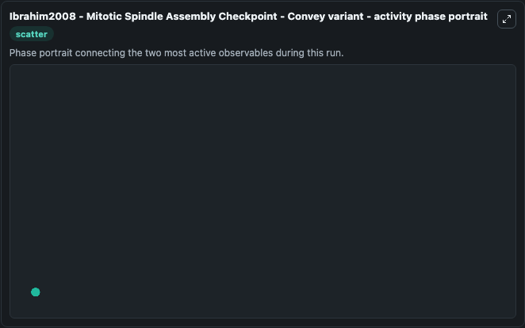

# Ibrahim2008 - Mitotic Spindle Assembly Checkpoint - Convey variant Lab

Single-model lab wrapper for Ibrahim2008 - Mitotic Spindle Assembly Checkpoint - Convey variant. Ibrahim2008 - Mitotic Spindle Assembly Checkpoint - Convey variant The Mitotic Spindle Assembly Checkpoint ((M)SAC) is an evolutionary conserved mechanism. It can be used to explore cell-cycle regulation dynamics and compare checkpoint behavior across conditions.

This lab is a single-model Biosimulant wrapper for a cell-cycle simulation. The captured run uses the lab defaults and renders the model outputs as dark-mode visualizations for quick inspection and README embedding.

## Model Context

Ibrahim2008 - Mitotic Spindle Assembly Checkpoint - Convey variant The Mitotic Spindle Assembly Checkpoint ((M)SAC) is an evolutionary conserved mechanism. It can be used to explore cell-cycle regulation dynamics and compare checkpoint behavior across conditions.

- Core model: Ibrahim2008 - Mitotic Spindle Assembly Checkpoint - Convey variant
- Runtime used by the lab: duration 10, step 1
- Controllable inputs: none declared
- Primary outputs: Mad1:C Mad2, O Mad2, Mad1:C Mad2:O Mad2*, Cdc20 APC/C activator, Cdc20:C Mad2, Bub3:Bub Model state R1, Mitotic checkpoint complex, Bub3:Bub R1:Cdc20, APC/C/C, MCC:APC/C/C, and 1 more
- Tags: cellcycle, sbml, biomodels_ebi, faithful

## Output Visualizations

The images below were generated from a Biosimulant lab run in dark mode. Each capture corresponds to one rendered visualization from the run output panel.

<!-- BIOSIMULANT_VISUALS_START -->

### 1. Ibrahim2008 Mitotic Spindle Assembly Checkpoint Convey Variant Lab Run Interpret

Checkpoint and stress-response time courses, showing how the configured run moves through DNA damage, surveillance, and arrest-related signals.

### 2. Ibrahim2008 Mitotic Spindle Assembly Checkpoint Convey Variant Checkpoint And St

Checkpoint and stress-response time courses, showing how the configured run moves through DNA damage, surveillance, and arrest-related signals.

### 3. Ibrahim2008 Mitotic Spindle Assembly Checkpoint Convey Variant Largest Activity 

Checkpoint and stress-response time courses, showing how the configured run moves through DNA damage, surveillance, and arrest-related signals.

### 4. Ibrahim2008 Mitotic Spindle Assembly Checkpoint Convey Variant Final State Snaps

Checkpoint and stress-response time courses, showing how the configured run moves through DNA damage, surveillance, and arrest-related signals.

### 5. Ibrahim2008 Mitotic Spindle Assembly Checkpoint Convey Variant Activity Phase Po

Checkpoint and stress-response time courses, showing how the configured run moves through DNA damage, surveillance, and arrest-related signals.

<!-- BIOSIMULANT_VISUALS_END -->

## How to Read This Run

Use the time-course plots to see transient and steady-state behavior, the range or snapshot charts to identify the variables with the strongest response, and any phase-portrait view to inspect coupled regulator movement through the simulated trajectory. For this cell-cycle lab, the most useful comparison is usually between checkpoint, commitment, and mitotic-exit variables because those signals define where the simulated system sits in the cycle.

## Inputs

| Input | Context |
| --- | --- |
| - | No entries declared in `lab.yaml`. |

## Outputs

| Output | Context |
| --- | --- |
| Mad1:C Mad2 | Tracks Mad1:C Mad2 in the lab model via `cellcycle_sbml_ibrahim2008_mitotic_spindle_assembly_checkpoint_biomd0000000187_model.mad1_c_mad2`. |
| O Mad2 | Tracks O Mad2 in the lab model via `cellcycle_sbml_ibrahim2008_mitotic_spindle_assembly_checkpoint_biomd0000000187_model.o_mad2`. |
| Mad1:C Mad2:O Mad2* | Tracks Mad1:C Mad2:O Mad2* in the lab model via `cellcycle_sbml_ibrahim2008_mitotic_spindle_assembly_checkpoint_biomd0000000187_model.mad1_c_mad2_o_mad2`. |
| Cdc20 APC/C activator | Tracks Cdc20 APC/C activator in the lab model via `cellcycle_sbml_ibrahim2008_mitotic_spindle_assembly_checkpoint_biomd0000000187_model.cdc20_apc_c_activator`. |
| Cdc20:C Mad2 | Tracks Cdc20:C Mad2 in the lab model via `cellcycle_sbml_ibrahim2008_mitotic_spindle_assembly_checkpoint_biomd0000000187_model.cdc20_c_mad2`. |
| Bub3:Bub Model state R1 | Tracks Bub3:Bub Model state R1 in the lab model via `cellcycle_sbml_ibrahim2008_mitotic_spindle_assembly_checkpoint_biomd0000000187_model.bub3_bub_model_state_r1`. |
| Mitotic checkpoint complex | Tracks Mitotic checkpoint complex in the lab model via `cellcycle_sbml_ibrahim2008_mitotic_spindle_assembly_checkpoint_biomd0000000187_model.mitotic_checkpoint_complex`. |
| Bub3:Bub R1:Cdc20 | Tracks Bub3:Bub R1:Cdc20 in the lab model via `cellcycle_sbml_ibrahim2008_mitotic_spindle_assembly_checkpoint_biomd0000000187_model.bub3_bub_r1_cdc20`. |
| APC/C/C | Tracks APC/C/C in the lab model via `cellcycle_sbml_ibrahim2008_mitotic_spindle_assembly_checkpoint_biomd0000000187_model.apc_c_c`. |
| MCC:APC/C/C | Tracks MCC:APC/C/C in the lab model via `cellcycle_sbml_ibrahim2008_mitotic_spindle_assembly_checkpoint_biomd0000000187_model.mcc_apc_c_c`. |
| APC/C/C:Cdc20 | Tracks APC/C/C:Cdc20 in the lab model via `cellcycle_sbml_ibrahim2008_mitotic_spindle_assembly_checkpoint_biomd0000000187_model.apc_c_c_cdc20`. |

## Lab Files

- `lab.yaml` defines the Biosimulant lab wrapper, exposed inputs, outputs, and runtime settings.
- `wiring-layout.json` stores the canvas layout used by the lab UI.
- `models/core/model.yaml` contains the wrapped simulation model metadata.
- `models/core/README.md` contains the source model notes and provenance.
- `models/visualisation/model.yaml` defines the visualization model used to render the run outputs.
- `assets/` contains the generated dark-mode visualization captures embedded above.
