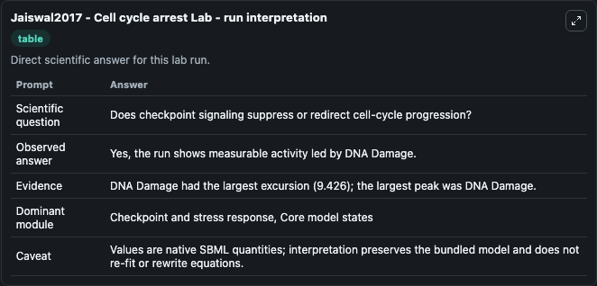
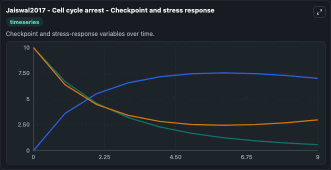
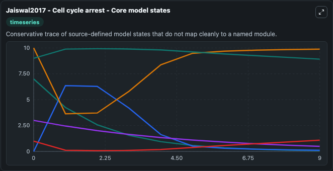
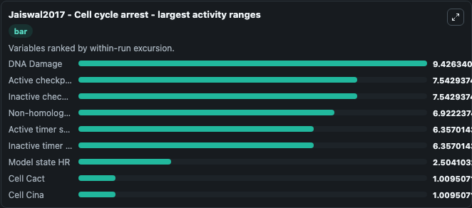
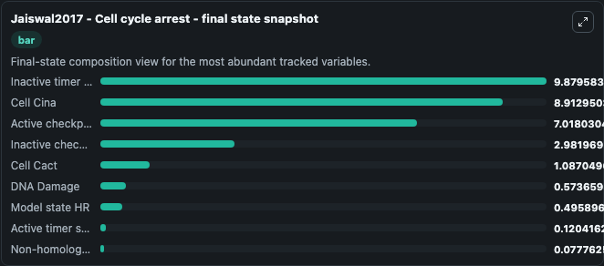
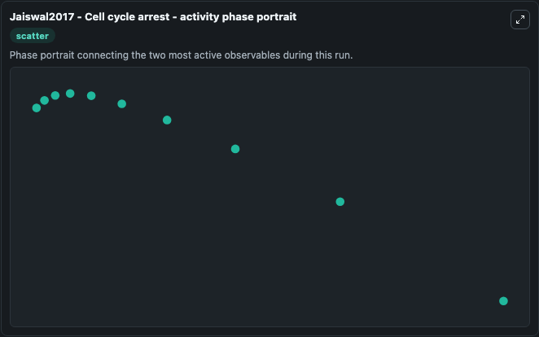

# Jaiswal2017 - Cell cycle arrest Lab

Single-model lab wrapper for Jaiswal2017 - Cell cycle arrest. Jaiswal2017 - Cell cycle arrest This model is described in the article: ATM/Wip1 activities at chromatin control Plk1 re-activation to determine G2 checkpoint duration. It can be used to explore cell-cycle regulation dynamics and compare checkpoint behavior across conditions.

This lab is a single-model Biosimulant wrapper for a cell-cycle simulation. The captured run uses the lab defaults and renders the model outputs as dark-mode visualizations for quick inspection and README embedding.

## Model Context

Jaiswal2017 - Cell cycle arrest This model is described in the article: ATM/Wip1 activities at chromatin control Plk1 re-activation to determine G2 checkpoint duration. It can be used to explore cell-cycle regulation dynamics and compare checkpoint behavior across conditions.

- Core model: Jaiswal2017 - Cell cycle arrest
- Runtime used by the lab: duration 10, step 1
- Controllable inputs: Cell Cycletot, Effectortot, Timertot
- Primary outputs: Active timer state, Cell Cact, Active checkpoint effector, Model state HR, Non-homologous end joining repair state, Cell Cina, DNA Damage, Inactive checkpoint effector, Inactive timer state
- Tags: cellcycle, sbml, biomodels_ebi, faithful

## Output Visualizations

The images below were generated from a Biosimulant lab run in dark mode. Each capture corresponds to one rendered visualization from the run output panel.

<!-- BIOSIMULANT_VISUALS_START -->

### 1. Jaiswal2017 Cell Cycle Arrest Lab Run Interpretation

Run interpretation view that anchors the captured simulation: it summarizes the lab purpose, runtime, and how to read the generated cell-cycle outputs.

### 2. Jaiswal2017 Cell Cycle Arrest Checkpoint And Stress Response

Checkpoint and stress-response time courses, showing how the configured run moves through DNA damage, surveillance, and arrest-related signals.

### 3. Jaiswal2017 Cell Cycle Arrest Core Model States

Core model state trajectories for Active timer state, Cell Cact, Active checkpoint effector, Model state HR, Non-homologous end joining repair state, Cell Cina, and 3 additional outputs, using the lab default initial conditions and runtime.

### 4. Jaiswal2017 Cell Cycle Arrest Largest Activity Ranges

Largest activity ranges chart, ranking the variables with the widest simulated movement so the dominant responses are easy to spot.

### 5. Jaiswal2017 Cell Cycle Arrest Final State Snapshot

Final state snapshot, comparing the end-of-run values for the selected cell-cycle variables.

### 6. Jaiswal2017 Cell Cycle Arrest Activity Phase Portrait

Activity phase portrait, showing pairwise movement between selected variables across the simulated trajectory.

<!-- BIOSIMULANT_VISUALS_END -->

## How to Read This Run

Use the time-course plots to see transient and steady-state behavior, the range or snapshot charts to identify the variables with the strongest response, and any phase-portrait view to inspect coupled regulator movement through the simulated trajectory. For this cell-cycle lab, the most useful comparison is usually between checkpoint, commitment, and mitotic-exit variables because those signals define where the simulated system sits in the cycle.

## Inputs

| Input | Context |
| --- | --- |
| Cell Cycletot | Controls Cell Cycletot in the lab model via `cellcycle_sbml_jaiswal2017_cell_cycle_arrest_biomd0000000641_model.cell_cycletot`. |
| Effectortot | Controls Effectortot in the lab model via `cellcycle_sbml_jaiswal2017_cell_cycle_arrest_biomd0000000641_model.effectortot`. |
| Timertot | Controls Timertot in the lab model via `cellcycle_sbml_jaiswal2017_cell_cycle_arrest_biomd0000000641_model.timertot`. |

## Outputs

| Output | Context |
| --- | --- |
| Active timer state | Tracks Active timer state in the lab model via `cellcycle_sbml_jaiswal2017_cell_cycle_arrest_biomd0000000641_model.active_timer_state`. |
| Cell Cact | Tracks Cell Cact in the lab model via `cellcycle_sbml_jaiswal2017_cell_cycle_arrest_biomd0000000641_model.cell_cact`. |
| Active checkpoint effector | Tracks Active checkpoint effector in the lab model via `cellcycle_sbml_jaiswal2017_cell_cycle_arrest_biomd0000000641_model.active_checkpoint_effector`. |
| Model state HR | Tracks Model state HR in the lab model via `cellcycle_sbml_jaiswal2017_cell_cycle_arrest_biomd0000000641_model.model_state_hr`. |
| Non-homologous end joining repair state | Tracks Non-homologous end joining repair state in the lab model via `cellcycle_sbml_jaiswal2017_cell_cycle_arrest_biomd0000000641_model.non_homologous_end_joining_repair_state`. |
| Cell Cina | Tracks Cell Cina in the lab model via `cellcycle_sbml_jaiswal2017_cell_cycle_arrest_biomd0000000641_model.cell_cina`. |
| DNA Damage | Tracks DNA Damage in the lab model via `cellcycle_sbml_jaiswal2017_cell_cycle_arrest_biomd0000000641_model.dna_damage`. |
| Inactive checkpoint effector | Tracks Inactive checkpoint effector in the lab model via `cellcycle_sbml_jaiswal2017_cell_cycle_arrest_biomd0000000641_model.inactive_checkpoint_effector`. |
| Inactive timer state | Tracks Inactive timer state in the lab model via `cellcycle_sbml_jaiswal2017_cell_cycle_arrest_biomd0000000641_model.inactive_timer_state`. |

## Lab Files

- `lab.yaml` defines the Biosimulant lab wrapper, exposed inputs, outputs, and runtime settings.
- `wiring-layout.json` stores the canvas layout used by the lab UI.
- `models/core/model.yaml` contains the wrapped simulation model metadata.
- `models/core/README.md` contains the source model notes and provenance.
- `models/visualisation/model.yaml` defines the visualization model used to render the run outputs.
- `assets/` contains the generated dark-mode visualization captures embedded above.
