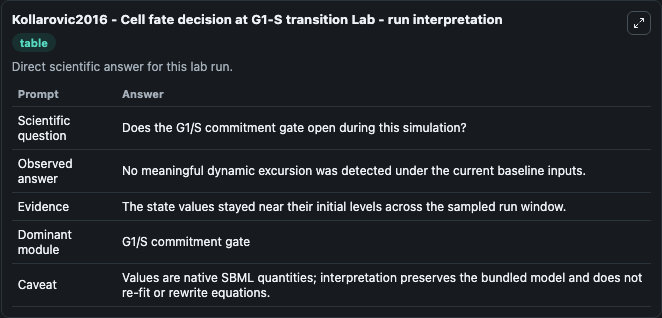
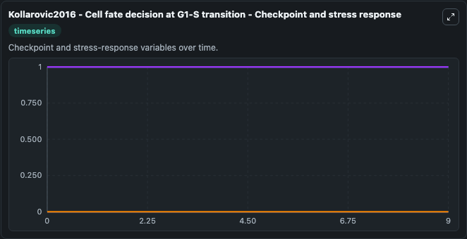
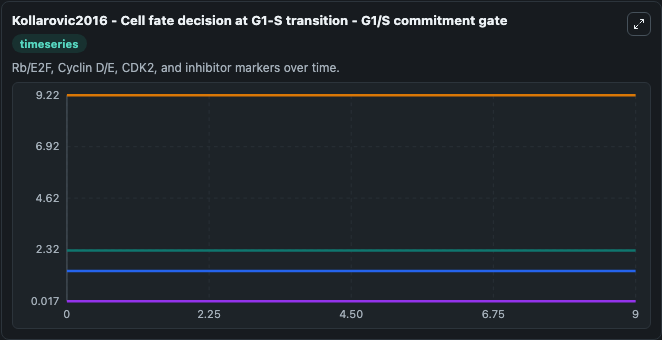
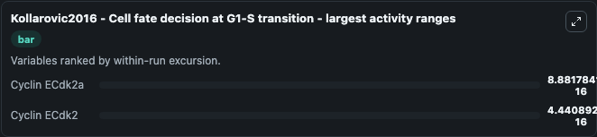
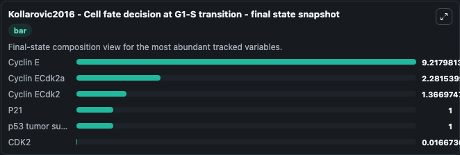
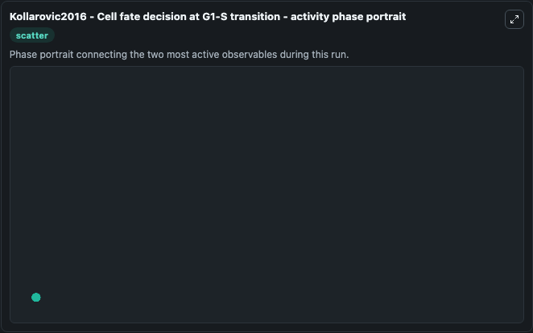

# Kollarovic2016 - Cell fate decision at G1-S transition Lab

Single-model lab wrapper for Kollarovic2016 - Cell fate decision at G1-S transition. Kollarovic2016 - Cell fate decision at G1-Stransition This model is described in the article: To senesce or not to senesce: how primary human fibroblasts decide their cell fate after DNA damage. It can be used to explore cell-cycle regulation dynamics and compare checkpoint behavior across conditions.

This lab is a single-model Biosimulant wrapper for a cell-cycle simulation. The captured run uses the lab defaults and renders the model outputs as dark-mode visualizations for quick inspection and README embedding.

## Model Context

Kollarovic2016 - Cell fate decision at G1-Stransition This model is described in the article: To senesce or not to senesce: how primary human fibroblasts decide their cell fate after DNA damage. It can be used to explore cell-cycle regulation dynamics and compare checkpoint behavior across conditions.

- Core model: Kollarovic2016 - Cell fate decision at G1-S transition
- Runtime used by the lab: duration 10, step 1
- Controllable inputs: DDR, DNA damagefoci 0, Base DNA damage
- Primary outputs: Cyclin E, CDK2, Cyclin ECdk2, Cyclin ECdk2a, P21, DNA damage Model state C, DNA damage S, p53 tumor suppressor
- Tags: cellcycle, sbml, biomodels_ebi, faithful

## Output Visualizations

The images below were generated from a Biosimulant lab run in dark mode. Each capture corresponds to one rendered visualization from the run output panel.

<!-- BIOSIMULANT_VISUALS_START -->

### 1. Kollarovic2016 Cell Fate Decision At G1 S Transition Lab Run Interpretation

Run interpretation view that anchors the captured simulation: it summarizes the lab purpose, runtime, and how to read the generated cell-cycle outputs.

### 2. Kollarovic2016 Cell Fate Decision At G1 S Transition Checkpoint And Stress Respo

Checkpoint and stress-response time courses, showing how the configured run moves through DNA damage, surveillance, and arrest-related signals.

### 3. Kollarovic2016 Cell Fate Decision At G1 S Transition G1 S Commitment Gate

G1/S commitment view, focused on the regulatory variables that gate entry into DNA synthesis and cell-cycle progression.

### 4. Kollarovic2016 Cell Fate Decision At G1 S Transition Largest Activity Ranges

G1/S commitment view, focused on the regulatory variables that gate entry into DNA synthesis and cell-cycle progression.

### 5. Kollarovic2016 Cell Fate Decision At G1 S Transition Final State Snapshot

G1/S commitment view, focused on the regulatory variables that gate entry into DNA synthesis and cell-cycle progression.

### 6. Kollarovic2016 Cell Fate Decision At G1 S Transition Activity Phase Portrait

G1/S commitment view, focused on the regulatory variables that gate entry into DNA synthesis and cell-cycle progression.

<!-- BIOSIMULANT_VISUALS_END -->

## How to Read This Run

Use the time-course plots to see transient and steady-state behavior, the range or snapshot charts to identify the variables with the strongest response, and any phase-portrait view to inspect coupled regulator movement through the simulated trajectory. For this cell-cycle lab, the most useful comparison is usually between checkpoint, commitment, and mitotic-exit variables because those signals define where the simulated system sits in the cycle.

## Inputs

| Input | Context |
| --- | --- |
| DDR | Controls DDR in the lab model via `cellcycle_sbml_kollarovic2016_cell_fate_decision_at_g1_s_transi_biomd0000000632_model.ddr`. |
| DNA damagefoci 0 | Controls DNA damagefoci 0 in the lab model via `cellcycle_sbml_kollarovic2016_cell_fate_decision_at_g1_s_transi_biomd0000000632_model.dna_damagefoci_0`. |
| Base DNA damage | Controls Base DNA damage in the lab model via `cellcycle_sbml_kollarovic2016_cell_fate_decision_at_g1_s_transi_biomd0000000632_model.base_dna_damage`. |

## Outputs

| Output | Context |
| --- | --- |
| Cyclin E | Tracks Cyclin E in the lab model via `cellcycle_sbml_kollarovic2016_cell_fate_decision_at_g1_s_transi_biomd0000000632_model.cyclin_e`. |
| CDK2 | Tracks CDK2 in the lab model via `cellcycle_sbml_kollarovic2016_cell_fate_decision_at_g1_s_transi_biomd0000000632_model.cdk2`. |
| Cyclin ECdk2 | Tracks Cyclin ECdk2 in the lab model via `cellcycle_sbml_kollarovic2016_cell_fate_decision_at_g1_s_transi_biomd0000000632_model.cyclin_ecdk2`. |
| Cyclin ECdk2a | Tracks Cyclin ECdk2a in the lab model via `cellcycle_sbml_kollarovic2016_cell_fate_decision_at_g1_s_transi_biomd0000000632_model.cyclin_ecdk2a`. |
| P21 | Tracks P21 in the lab model via `cellcycle_sbml_kollarovic2016_cell_fate_decision_at_g1_s_transi_biomd0000000632_model.p21`. |
| DNA damage Model state C | Tracks DNA damage Model state C in the lab model via `cellcycle_sbml_kollarovic2016_cell_fate_decision_at_g1_s_transi_biomd0000000632_model.dna_damage_model_state_c`. |
| DNA damage S | Tracks DNA damage S in the lab model via `cellcycle_sbml_kollarovic2016_cell_fate_decision_at_g1_s_transi_biomd0000000632_model.dna_damage_s`. |
| p53 tumor suppressor | Tracks p53 tumor suppressor in the lab model via `cellcycle_sbml_kollarovic2016_cell_fate_decision_at_g1_s_transi_biomd0000000632_model.p53_tumor_suppressor`. |

## Lab Files

- `lab.yaml` defines the Biosimulant lab wrapper, exposed inputs, outputs, and runtime settings.
- `wiring-layout.json` stores the canvas layout used by the lab UI.
- `models/core/model.yaml` contains the wrapped simulation model metadata.
- `models/core/README.md` contains the source model notes and provenance.
- `models/visualisation/model.yaml` defines the visualization model used to render the run outputs.
- `assets/` contains the generated dark-mode visualization captures embedded above.
