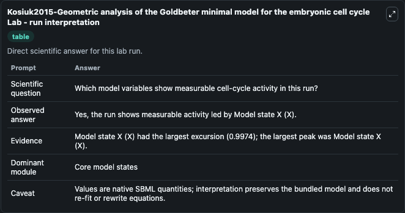
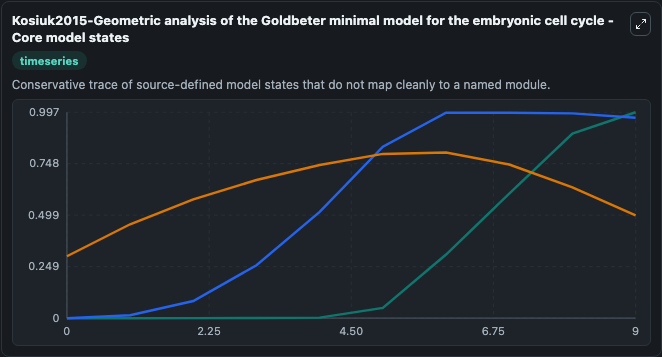
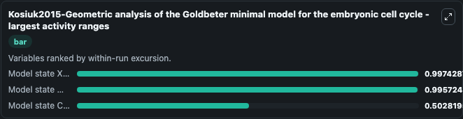
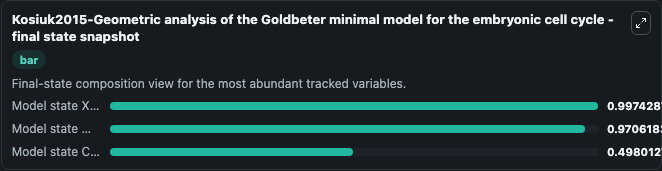
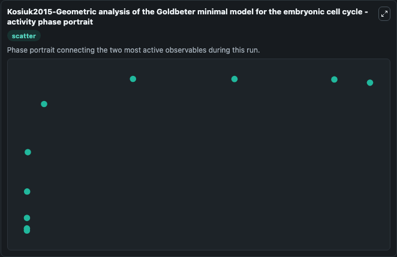

# Kosiuk2015-Geometric analysis of the Goldbeter minimal model for the embryonic cell cycle Lab

Single-model lab wrapper for Kosiuk2015-Geometric analysis of the Goldbeter minimal model for the embryonic cell cycle. A minimal model describing the embryonic cell division cycle at the molecular level in eukaryotes is analyzed mathematically. It is known from numerical simulations that the corresponding three-dimens.

This lab is a single-model Biosimulant wrapper for a cell-cycle simulation. The captured run uses the lab defaults and renders the model outputs as dark-mode visualizations for quick inspection and README embedding.

## Model Context

A minimal model describing the embryonic cell division cycle at the molecular level in eukaryotes is analyzed mathematically. It is known from numerical simulations that the corresponding three-dimens.

- Core model: Kosiuk2015-Geometric analysis of the Goldbeter minimal model for the embryonic cell cycle
- Runtime used by the lab: duration 10, step 1
- Controllable inputs: none declared
- Primary outputs: Model state C (C), Model state M (M), Model state X (X)
- Tags: cellcycle, sbml, biomodels_ebi, faithful

## Output Visualizations

The images below were generated from a Biosimulant lab run in dark mode. Each capture corresponds to one rendered visualization from the run output panel.

<!-- BIOSIMULANT_VISUALS_START -->

### 1. Kosiuk2015 Geometric Analysis Of The Goldbeter Minimal Model For The Embryonic C

Kosiuk2015 Geometric Analysis Of The Goldbeter Minimal Model For The Embryonic C visualization captured from the dark-mode Biosimulant run for Kosiuk2015-Geometric analysis of the Goldbeter minimal model for the embryonic cell cycle Lab.

### 2. Kosiuk2015 Geometric Analysis Of The Goldbeter Minimal Model For The Embryonic C

Kosiuk2015 Geometric Analysis Of The Goldbeter Minimal Model For The Embryonic C visualization captured from the dark-mode Biosimulant run for Kosiuk2015-Geometric analysis of the Goldbeter minimal model for the embryonic cell cycle Lab.

### 3. Kosiuk2015 Geometric Analysis Of The Goldbeter Minimal Model For The Embryonic C

Kosiuk2015 Geometric Analysis Of The Goldbeter Minimal Model For The Embryonic C visualization captured from the dark-mode Biosimulant run for Kosiuk2015-Geometric analysis of the Goldbeter minimal model for the embryonic cell cycle Lab.

### 4. Kosiuk2015 Geometric Analysis Of The Goldbeter Minimal Model For The Embryonic C

Kosiuk2015 Geometric Analysis Of The Goldbeter Minimal Model For The Embryonic C visualization captured from the dark-mode Biosimulant run for Kosiuk2015-Geometric analysis of the Goldbeter minimal model for the embryonic cell cycle Lab.

### 5. Kosiuk2015 Geometric Analysis Of The Goldbeter Minimal Model For The Embryonic C

Kosiuk2015 Geometric Analysis Of The Goldbeter Minimal Model For The Embryonic C visualization captured from the dark-mode Biosimulant run for Kosiuk2015-Geometric analysis of the Goldbeter minimal model for the embryonic cell cycle Lab.

<!-- BIOSIMULANT_VISUALS_END -->

## How to Read This Run

Use the time-course plots to see transient and steady-state behavior, the range or snapshot charts to identify the variables with the strongest response, and any phase-portrait view to inspect coupled regulator movement through the simulated trajectory. For this cell-cycle lab, the most useful comparison is usually between checkpoint, commitment, and mitotic-exit variables because those signals define where the simulated system sits in the cycle.

## Inputs

| Input | Context |
| --- | --- |
| - | No entries declared in `lab.yaml`. |

## Outputs

| Output | Context |
| --- | --- |
| Model state C (C) | Tracks Model state C (C) in the lab model via `cellcycle_sbml_kosiuk2015_geometric_analysis_of_the_goldbeter_m_biomd0000000933_model.model_state_c_c`. |
| Model state M (M) | Tracks Model state M (M) in the lab model via `cellcycle_sbml_kosiuk2015_geometric_analysis_of_the_goldbeter_m_biomd0000000933_model.model_state_m_m`. |
| Model state X (X) | Tracks Model state X (X) in the lab model via `cellcycle_sbml_kosiuk2015_geometric_analysis_of_the_goldbeter_m_biomd0000000933_model.model_state_x_x`. |

## Lab Files

- `lab.yaml` defines the Biosimulant lab wrapper, exposed inputs, outputs, and runtime settings.
- `wiring-layout.json` stores the canvas layout used by the lab UI.
- `models/core/model.yaml` contains the wrapped simulation model metadata.
- `models/core/README.md` contains the source model notes and provenance.
- `models/visualisation/model.yaml` defines the visualization model used to render the run outputs.
- `assets/` contains the generated dark-mode visualization captures embedded above.
