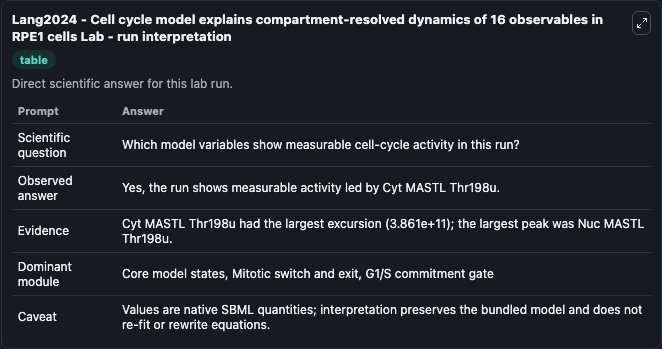
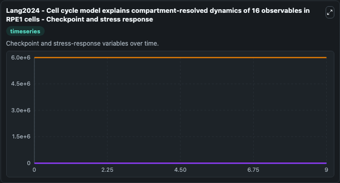
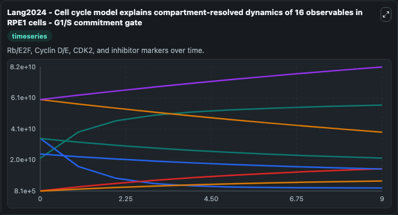
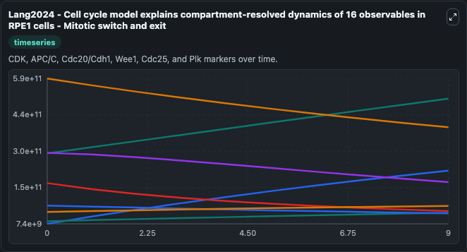
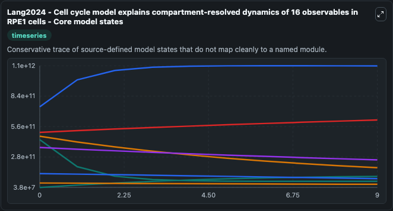
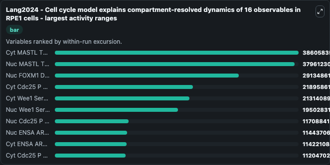
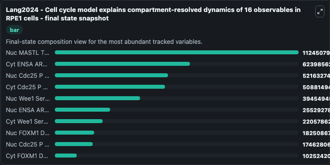
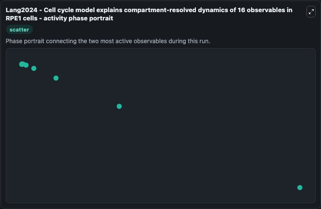

# Lang2024 - Cell cycle model explains compartment-resolved dynamics of 16 observables in RPE1 cells Lab

Single-model lab wrapper for Lang2024 - Cell cycle model explains compartment-resolved dynamics of 16 observables in RPE1 cells. This model provides a molecularly detailed description of the biochemical reaction networks governing the mammalian cell cycle, including the restriction point, the G1S, G2/M and metaphase/anaphase tr. It can be used to explore cell-cycle regulation dynamics and compare checkpoint behavior across conditions.

This lab is a single-model Biosimulant wrapper for a cell-cycle simulation. The captured run uses the lab defaults and renders the model outputs as dark-mode visualizations for quick inspection and README embedding.

## Model Context

This model provides a molecularly detailed description of the biochemical reaction networks governing the mammalian cell cycle, including the restriction point, the G1S, G2/M and metaphase/anaphase tr. It can be used to explore cell-cycle regulation dynamics and compare checkpoint behavior across conditions.

- Core model: Lang2024 - Cell cycle model explains compartment-resolved dynamics of 16 observables in RPE1 cells
- Runtime used by the lab: duration 10, step 1
- Controllable inputs: none declared
- Primary outputs: Cyt Cyclin D, Cyt Cyclin E CDKN1A B, Cyt E2F DBD Rb1 Ser332u, Cyt E2F DBD Rb1 Ser332p, Cyt Cyclin Active CDKN1A B, Cyt Cyclin B CDK1 Thr14 Tyr15u CDKN1A, Cyt E2F DBD Rb1 1 Ser332u Rb1 E2F 1 Ser807 Ser811u, Cyt E2F DBD Rb1 1 Ser332p Rb1 E2F 1 Ser807 Ser811u, Cyt Rb1 E2F Ser807 Ser811u, Cyt Rb1 E2F Ser807 Ser811p, and 114 more
- Tags: cellcycle, sbml, biomodels_ebi, faithful

## Output Visualizations

The images below were generated from a Biosimulant lab run in dark mode. Each capture corresponds to one rendered visualization from the run output panel.

<!-- BIOSIMULANT_VISUALS_START -->

### 1. Lang2024 Cell Cycle Model Explains Compartment Resolved Dynamics Of 16 Observabl

Lang2024 Cell Cycle Model Explains Compartment Resolved Dynamics Of 16 Observabl visualization captured from the dark-mode Biosimulant run for Lang2024 - Cell cycle model explains compartment-resolved dynamics of 16 observables in RPE1 cells Lab.

### 2. Lang2024 Cell Cycle Model Explains Compartment Resolved Dynamics Of 16 Observabl

Lang2024 Cell Cycle Model Explains Compartment Resolved Dynamics Of 16 Observabl visualization captured from the dark-mode Biosimulant run for Lang2024 - Cell cycle model explains compartment-resolved dynamics of 16 observables in RPE1 cells Lab.

### 3. Lang2024 Cell Cycle Model Explains Compartment Resolved Dynamics Of 16 Observabl

Lang2024 Cell Cycle Model Explains Compartment Resolved Dynamics Of 16 Observabl visualization captured from the dark-mode Biosimulant run for Lang2024 - Cell cycle model explains compartment-resolved dynamics of 16 observables in RPE1 cells Lab.

### 4. Lang2024 Cell Cycle Model Explains Compartment Resolved Dynamics Of 16 Observabl

Lang2024 Cell Cycle Model Explains Compartment Resolved Dynamics Of 16 Observabl visualization captured from the dark-mode Biosimulant run for Lang2024 - Cell cycle model explains compartment-resolved dynamics of 16 observables in RPE1 cells Lab.

### 5. Lang2024 Cell Cycle Model Explains Compartment Resolved Dynamics Of 16 Observabl

Lang2024 Cell Cycle Model Explains Compartment Resolved Dynamics Of 16 Observabl visualization captured from the dark-mode Biosimulant run for Lang2024 - Cell cycle model explains compartment-resolved dynamics of 16 observables in RPE1 cells Lab.

### 6. Lang2024 Cell Cycle Model Explains Compartment Resolved Dynamics Of 16 Observabl

Lang2024 Cell Cycle Model Explains Compartment Resolved Dynamics Of 16 Observabl visualization captured from the dark-mode Biosimulant run for Lang2024 - Cell cycle model explains compartment-resolved dynamics of 16 observables in RPE1 cells Lab.

### 7. Lang2024 Cell Cycle Model Explains Compartment Resolved Dynamics Of 16 Observabl

Lang2024 Cell Cycle Model Explains Compartment Resolved Dynamics Of 16 Observabl visualization captured from the dark-mode Biosimulant run for Lang2024 - Cell cycle model explains compartment-resolved dynamics of 16 observables in RPE1 cells Lab.

### 8. Lang2024 Cell Cycle Model Explains Compartment Resolved Dynamics Of 16 Observabl

Lang2024 Cell Cycle Model Explains Compartment Resolved Dynamics Of 16 Observabl visualization captured from the dark-mode Biosimulant run for Lang2024 - Cell cycle model explains compartment-resolved dynamics of 16 observables in RPE1 cells Lab.

<!-- BIOSIMULANT_VISUALS_END -->

## How to Read This Run

Use the time-course plots to see transient and steady-state behavior, the range or snapshot charts to identify the variables with the strongest response, and any phase-portrait view to inspect coupled regulator movement through the simulated trajectory. For this cell-cycle lab, the most useful comparison is usually between checkpoint, commitment, and mitotic-exit variables because those signals define where the simulated system sits in the cycle.

## Inputs

| Input | Context |
| --- | --- |
| - | No entries declared in `lab.yaml`. |

## Outputs

| Output | Context |
| --- | --- |
| Cyt Cyclin D | Tracks Cyt Cyclin D in the lab model via `cellcycle_sbml_lang2024_cell_cycle_model_explains_compartment_r_model2401050001_model.cyt_cyclin_d`. |
| Cyt Cyclin E CDKN1A B | Tracks Cyt Cyclin E CDKN1A B in the lab model via `cellcycle_sbml_lang2024_cell_cycle_model_explains_compartment_r_model2401050001_model.cyt_cyclin_e_cdkn1a_b`. |
| Cyt E2F DBD Rb1 Ser332u | Tracks Cyt E2F DBD Rb1 Ser332u in the lab model via `cellcycle_sbml_lang2024_cell_cycle_model_explains_compartment_r_model2401050001_model.cyt_e2f_dbd_rb1_ser332u`. |
| Cyt E2F DBD Rb1 Ser332p | Tracks Cyt E2F DBD Rb1 Ser332p in the lab model via `cellcycle_sbml_lang2024_cell_cycle_model_explains_compartment_r_model2401050001_model.cyt_e2f_dbd_rb1_ser332p`. |
| Cyt Cyclin Active CDKN1A B | Tracks Cyt Cyclin Active CDKN1A B in the lab model via `cellcycle_sbml_lang2024_cell_cycle_model_explains_compartment_r_model2401050001_model.cyt_cyclin_active_cdkn1a_b`. |
| Cyt Cyclin B CDK1 Thr14 Tyr15u CDKN1A | Tracks Cyt Cyclin B CDK1 Thr14 Tyr15u CDKN1A in the lab model via `cellcycle_sbml_lang2024_cell_cycle_model_explains_compartment_r_model2401050001_model.cyt_cyclin_b_cdk1_thr14_tyr15u_cdkn1a`. |
| Cyt E2F DBD Rb1 1 Ser332u Rb1 E2F 1 Ser807 Ser811u | Tracks Cyt E2F DBD Rb1 1 Ser332u Rb1 E2F 1 Ser807 Ser811u in the lab model via `cellcycle_sbml_lang2024_cell_cycle_model_explains_compartment_r_model2401050001_model.cyt_e2f_dbd_rb1_1_ser332u_rb1_e2f_1_ser807_ser811u`. |
| Cyt E2F DBD Rb1 1 Ser332p Rb1 E2F 1 Ser807 Ser811u | Tracks Cyt E2F DBD Rb1 1 Ser332p Rb1 E2F 1 Ser807 Ser811u in the lab model via `cellcycle_sbml_lang2024_cell_cycle_model_explains_compartment_r_model2401050001_model.cyt_e2f_dbd_rb1_1_ser332p_rb1_e2f_1_ser807_ser811u`. |
| Cyt Rb1 E2F Ser807 Ser811u | Tracks Cyt Rb1 E2F Ser807 Ser811u in the lab model via `cellcycle_sbml_lang2024_cell_cycle_model_explains_compartment_r_model2401050001_model.cyt_rb1_e2f_ser807_ser811u`. |
| Cyt Rb1 E2F Ser807 Ser811p | Tracks Cyt Rb1 E2F Ser807 Ser811p in the lab model via `cellcycle_sbml_lang2024_cell_cycle_model_explains_compartment_r_model2401050001_model.cyt_rb1_e2f_ser807_ser811p`. |
| Cyt PPP2R2B ENSA ARPP19 | Tracks Cyt PPP2R2B ENSA ARPP19 in the lab model via `cellcycle_sbml_lang2024_cell_cycle_model_explains_compartment_r_model2401050001_model.cyt_ppp2r2b_ensa_arpp19`. |
| Cyt APC/C/C FBXO5 FZR1 Cdc20 Ser355u | Tracks Cyt APC/C/C FBXO5 FZR1 Cdc20 Ser355u in the lab model via `cellcycle_sbml_lang2024_cell_cycle_model_explains_compartment_r_model2401050001_model.cyt_apc_c_c_fbxo5_fzr1_cdc20_ser355u`. |
| Cyt Cdc20 APC/C/C | Tracks Cyt Cdc20 APC/C/C in the lab model via `cellcycle_sbml_lang2024_cell_cycle_model_explains_compartment_r_model2401050001_model.cyt_cdc20_apc_c_c`. |
| Cyt APC/C/C FBXO5 FZR1 Cdc20 1 Ser355p Cdc20 APC/C/C 1 | Tracks Cyt APC/C/C FBXO5 FZR1 Cdc20 1 Ser355p Cdc20 APC/C/C 1 in the lab model via `cellcycle_sbml_lang2024_cell_cycle_model_explains_compartment_r_model2401050001_model.cyt_apc_c_c_fbxo5_fzr1_cdc20_1_ser355p_cdc20_apc_c_c_1`. |
| Cyt APC/C/C FBXO5 FZR1 Cdc20 Ser355p | Tracks Cyt APC/C/C FBXO5 FZR1 Cdc20 Ser355p in the lab model via `cellcycle_sbml_lang2024_cell_cycle_model_explains_compartment_r_model2401050001_model.cyt_apc_c_c_fbxo5_fzr1_cdc20_ser355p`. |
| Cyt APC/C/C FBXO5 FZR1 Cdc20 1 Ser355u FZR1 APC/C/C 1 FBXO5 N Termu | Tracks Cyt APC/C/C FBXO5 FZR1 Cdc20 1 Ser355u FZR1 APC/C/C 1 FBXO5 N Termu in the lab model via `cellcycle_sbml_lang2024_cell_cycle_model_explains_compartment_r_model2401050001_model.cyt_apc_c_c_fbxo5_fzr1_cdc20_1_ser355u_fzr1_apc_c_c_1_fbxo5_n_termu`. |
| Cyt FZR1 APC/C/C FBXO5 N Termu | Tracks Cyt FZR1 APC/C/C FBXO5 N Termu in the lab model via `cellcycle_sbml_lang2024_cell_cycle_model_explains_compartment_r_model2401050001_model.cyt_fzr1_apc_c_c_fbxo5_n_termu`. |
| Cyt FZR1 APC/C/C FBXO5 N Termp | Tracks Cyt FZR1 APC/C/C FBXO5 N Termp in the lab model via `cellcycle_sbml_lang2024_cell_cycle_model_explains_compartment_r_model2401050001_model.cyt_fzr1_apc_c_c_fbxo5_n_termp`. |
| Cyt APC/C/C FBXO5 1 FZR1 Cdc20 2 Ser355u FBXO5 APC/C/C 1 FZR1 3 Ser182u FZR1 APC/C/C 2 FBXO5 3 N Termu | Tracks Cyt APC/C/C FBXO5 1 FZR1 Cdc20 2 Ser355u FBXO5 APC/C/C 1 FZR1 3 Ser182u FZR1 APC/C/C 2 FBXO5 3 N Termu in the lab model via `cellcycle_sbml_lang2024_cell_cycle_model_explains_compartment_r_model2401050001_model.cyt_apc_c_c_fbxo5_1_fzr1_cdc20_2_ser355u_fbxo5_apc_c_c_1_fzr1_3_ser182u_fzr1_apc_c_c_2_fbxo5_3_n_termu`. |
| Cyt FBXO5 APC/C/C FZR1 Ser182u | Tracks Cyt FBXO5 APC/C/C FZR1 Ser182u in the lab model via `cellcycle_sbml_lang2024_cell_cycle_model_explains_compartment_r_model2401050001_model.cyt_fbxo5_apc_c_c_fzr1_ser182u`. |
| Cyt APC/C/C FBXO5 1 FZR1 Cdc20 2 Ser355p FBXO5 APC/C/C 1 FZR1 3 Ser182u FZR1 APC/C/C 2 FBXO5 3 N Termu | Tracks Cyt APC/C/C FBXO5 1 FZR1 Cdc20 2 Ser355p FBXO5 APC/C/C 1 FZR1 3 Ser182u FZR1 APC/C/C 2 FBXO5 3 N Termu in the lab model via `cellcycle_sbml_lang2024_cell_cycle_model_explains_compartment_r_model2401050001_model.cyt_apc_c_c_fbxo5_1_fzr1_cdc20_2_ser355p_fbxo5_apc_c_c_1_fzr1_3_ser182u_fzr1_apc_c_c_2_fbxo5_3_n_termu`. |
| Cyt APC/C/C FBXO5 FZR1 Cdc20 1 Ser355p FZR1 APC/C/C 1 FBXO5 N Termu | Tracks Cyt APC/C/C FBXO5 FZR1 Cdc20 1 Ser355p FZR1 APC/C/C 1 FBXO5 N Termu in the lab model via `cellcycle_sbml_lang2024_cell_cycle_model_explains_compartment_r_model2401050001_model.cyt_apc_c_c_fbxo5_fzr1_cdc20_1_ser355p_fzr1_apc_c_c_1_fbxo5_n_termu`. |
| Cyt FBXO5 APC/C/C FZR1 Ser182p | Tracks Cyt FBXO5 APC/C/C FZR1 Ser182p in the lab model via `cellcycle_sbml_lang2024_cell_cycle_model_explains_compartment_r_model2401050001_model.cyt_fbxo5_apc_c_c_fzr1_ser182p`. |
| Cyt FOXM1 DBD Thr600u | Tracks Cyt FOXM1 DBD Thr600u in the lab model via `cellcycle_sbml_lang2024_cell_cycle_model_explains_compartment_r_model2401050001_model.cyt_foxm1_dbd_thr600u`. |
| Cyt FOXM1 DBD Thr600p | Tracks Cyt FOXM1 DBD Thr600p in the lab model via `cellcycle_sbml_lang2024_cell_cycle_model_explains_compartment_r_model2401050001_model.cyt_foxm1_dbd_thr600p`. |
| Cyt Wee1 Ser123u | Tracks Cyt Wee1 Ser123u in the lab model via `cellcycle_sbml_lang2024_cell_cycle_model_explains_compartment_r_model2401050001_model.cyt_wee1_ser123u`. |
| Cyt Cyclin B CDK1 Thr14 Tyr15p CDKN1A | Tracks Cyt Cyclin B CDK1 Thr14 Tyr15p CDKN1A in the lab model via `cellcycle_sbml_lang2024_cell_cycle_model_explains_compartment_r_model2401050001_model.cyt_cyclin_b_cdk1_thr14_tyr15p_cdkn1a`. |
| Cyt Wee1 Ser123p | Tracks Cyt Wee1 Ser123p in the lab model via `cellcycle_sbml_lang2024_cell_cycle_model_explains_compartment_r_model2401050001_model.cyt_wee1_ser123p`. |
| Cyt Cdc25 P Sitesp | Tracks Cyt Cdc25 P Sitesp in the lab model via `cellcycle_sbml_lang2024_cell_cycle_model_explains_compartment_r_model2401050001_model.cyt_cdc25_p_sitesp`. |
| Cyt Cdc25 P Sitesu | Tracks Cyt Cdc25 P Sitesu in the lab model via `cellcycle_sbml_lang2024_cell_cycle_model_explains_compartment_r_model2401050001_model.cyt_cdc25_p_sitesu`. |
| Cyt MASTL Thr198u | Tracks Cyt MASTL Thr198u in the lab model via `cellcycle_sbml_lang2024_cell_cycle_model_explains_compartment_r_model2401050001_model.cyt_mastl_thr198u`. |
| Cyt MASTL Thr198p | Tracks Cyt MASTL Thr198p in the lab model via `cellcycle_sbml_lang2024_cell_cycle_model_explains_compartment_r_model2401050001_model.cyt_mastl_thr198p`. |
| Cyt ENSA ARPP19 PPP2R2B Ser62 Ser67u | Tracks Cyt ENSA ARPP19 PPP2R2B Ser62 Ser67u in the lab model via `cellcycle_sbml_lang2024_cell_cycle_model_explains_compartment_r_model2401050001_model.cyt_ensa_arpp19_ppp2r2b_ser62_ser67u`. |
| Cyt ENSA ARPP19 PPP2R2B Ser62 Ser67p | Tracks Cyt ENSA ARPP19 PPP2R2B Ser62 Ser67p in the lab model via `cellcycle_sbml_lang2024_cell_cycle_model_explains_compartment_r_model2401050001_model.cyt_ensa_arpp19_ppp2r2b_ser62_ser67p`. |
| Cyt ENSA ARPP19 PPP2R2B 1 Ser62 Ser67p PPP2R2B ENSA ARPP19 1 | Tracks Cyt ENSA ARPP19 PPP2R2B 1 Ser62 Ser67p PPP2R2B ENSA ARPP19 1 in the lab model via `cellcycle_sbml_lang2024_cell_cycle_model_explains_compartment_r_model2401050001_model.cyt_ensa_arpp19_ppp2r2b_1_ser62_ser67p_ppp2r2b_ensa_arpp19_1`. |
| Cyt SKP2 | Tracks Cyt SKP2 in the lab model via `cellcycle_sbml_lang2024_cell_cycle_model_explains_compartment_r_model2401050001_model.cyt_skp2`. |
| Cyt TP53 DBD Ser15p | Tracks Cyt TP53 DBD Ser15p in the lab model via `cellcycle_sbml_lang2024_cell_cycle_model_explains_compartment_r_model2401050001_model.cyt_tp53_dbd_ser15p`. |
| Cyt FOXO DBD | Tracks Cyt FOXO DBD in the lab model via `cellcycle_sbml_lang2024_cell_cycle_model_explains_compartment_r_model2401050001_model.cyt_foxo_dbd`. |
| Num NUP P Sitesu | Tracks Num NUP P Sitesu in the lab model via `cellcycle_sbml_lang2024_cell_cycle_model_explains_compartment_r_model2401050001_model.num_nup_p_sitesu`. |
| Nuc Cyclin D | Tracks Nuc Cyclin D in the lab model via `cellcycle_sbml_lang2024_cell_cycle_model_explains_compartment_r_model2401050001_model.nuc_cyclin_d`. |
| Nuc Cyclin E CDKN1A B | Tracks Nuc Cyclin E CDKN1A B in the lab model via `cellcycle_sbml_lang2024_cell_cycle_model_explains_compartment_r_model2401050001_model.nuc_cyclin_e_cdkn1a_b`. |
| Nuc E2F DBD Rb1 Ser332u | Tracks Nuc E2F DBD Rb1 Ser332u in the lab model via `cellcycle_sbml_lang2024_cell_cycle_model_explains_compartment_r_model2401050001_model.nuc_e2f_dbd_rb1_ser332u`. |
| Nuc E2F DBD Rb1 Ser332p | Tracks Nuc E2F DBD Rb1 Ser332p in the lab model via `cellcycle_sbml_lang2024_cell_cycle_model_explains_compartment_r_model2401050001_model.nuc_e2f_dbd_rb1_ser332p`. |
| Nuc Cyclin Active CDKN1A B | Tracks Nuc Cyclin Active CDKN1A B in the lab model via `cellcycle_sbml_lang2024_cell_cycle_model_explains_compartment_r_model2401050001_model.nuc_cyclin_active_cdkn1a_b`. |
| Nuc Cyclin B CDK1 Thr14 Tyr15u CDKN1A | Tracks Nuc Cyclin B CDK1 Thr14 Tyr15u CDKN1A in the lab model via `cellcycle_sbml_lang2024_cell_cycle_model_explains_compartment_r_model2401050001_model.nuc_cyclin_b_cdk1_thr14_tyr15u_cdkn1a`. |
| Nuc E2F DBD Rb1 1 Ser332u Rb1 E2F 1 Ser807 Ser811u | Tracks Nuc E2F DBD Rb1 1 Ser332u Rb1 E2F 1 Ser807 Ser811u in the lab model via `cellcycle_sbml_lang2024_cell_cycle_model_explains_compartment_r_model2401050001_model.nuc_e2f_dbd_rb1_1_ser332u_rb1_e2f_1_ser807_ser811u`. |
| Nuc E2F DBD Rb1 1 Ser332p Rb1 E2F 1 Ser807 Ser811u | Tracks Nuc E2F DBD Rb1 1 Ser332p Rb1 E2F 1 Ser807 Ser811u in the lab model via `cellcycle_sbml_lang2024_cell_cycle_model_explains_compartment_r_model2401050001_model.nuc_e2f_dbd_rb1_1_ser332p_rb1_e2f_1_ser807_ser811u`. |
| Nuc Rb1 E2F Ser807 Ser811u | Tracks Nuc Rb1 E2F Ser807 Ser811u in the lab model via `cellcycle_sbml_lang2024_cell_cycle_model_explains_compartment_r_model2401050001_model.nuc_rb1_e2f_ser807_ser811u`. |
| Nuc Rb1 E2F Ser807 Ser811p | Tracks Nuc Rb1 E2F Ser807 Ser811p in the lab model via `cellcycle_sbml_lang2024_cell_cycle_model_explains_compartment_r_model2401050001_model.nuc_rb1_e2f_ser807_ser811p`. |
| Nuc PPP2R2B ENSA ARPP19 | Tracks Nuc PPP2R2B ENSA ARPP19 in the lab model via `cellcycle_sbml_lang2024_cell_cycle_model_explains_compartment_r_model2401050001_model.nuc_ppp2r2b_ensa_arpp19`. |
| Nuc APC/C/C FBXO5 FZR1 Cdc20 Ser355u | Tracks Nuc APC/C/C FBXO5 FZR1 Cdc20 Ser355u in the lab model via `cellcycle_sbml_lang2024_cell_cycle_model_explains_compartment_r_model2401050001_model.nuc_apc_c_c_fbxo5_fzr1_cdc20_ser355u`. |
| Nuc Cdc20 APC/C/C | Tracks Nuc Cdc20 APC/C/C in the lab model via `cellcycle_sbml_lang2024_cell_cycle_model_explains_compartment_r_model2401050001_model.nuc_cdc20_apc_c_c`. |
| Nuc APC/C/C FBXO5 FZR1 Cdc20 1 Ser355p Cdc20 APC/C/C 1 | Tracks Nuc APC/C/C FBXO5 FZR1 Cdc20 1 Ser355p Cdc20 APC/C/C 1 in the lab model via `cellcycle_sbml_lang2024_cell_cycle_model_explains_compartment_r_model2401050001_model.nuc_apc_c_c_fbxo5_fzr1_cdc20_1_ser355p_cdc20_apc_c_c_1`. |
| Nuc APC/C/C FBXO5 FZR1 Cdc20 Ser355p | Tracks Nuc APC/C/C FBXO5 FZR1 Cdc20 Ser355p in the lab model via `cellcycle_sbml_lang2024_cell_cycle_model_explains_compartment_r_model2401050001_model.nuc_apc_c_c_fbxo5_fzr1_cdc20_ser355p`. |
| Nuc APC/C/C FBXO5 FZR1 Cdc20 1 Ser355u FZR1 APC/C/C 1 FBXO5 N Termu | Tracks Nuc APC/C/C FBXO5 FZR1 Cdc20 1 Ser355u FZR1 APC/C/C 1 FBXO5 N Termu in the lab model via `cellcycle_sbml_lang2024_cell_cycle_model_explains_compartment_r_model2401050001_model.nuc_apc_c_c_fbxo5_fzr1_cdc20_1_ser355u_fzr1_apc_c_c_1_fbxo5_n_termu`. |
| Nuc FZR1 APC/C/C FBXO5 N Termu | Tracks Nuc FZR1 APC/C/C FBXO5 N Termu in the lab model via `cellcycle_sbml_lang2024_cell_cycle_model_explains_compartment_r_model2401050001_model.nuc_fzr1_apc_c_c_fbxo5_n_termu`. |
| Nuc FZR1 APC/C/C FBXO5 N Termp | Tracks Nuc FZR1 APC/C/C FBXO5 N Termp in the lab model via `cellcycle_sbml_lang2024_cell_cycle_model_explains_compartment_r_model2401050001_model.nuc_fzr1_apc_c_c_fbxo5_n_termp`. |
| Nuc APC/C/C FBXO5 1 FZR1 Cdc20 2 Ser355u FBXO5 APC/C/C 1 FZR1 3 Ser182u FZR1 APC/C/C 2 FBXO5 3 N Termu | Tracks Nuc APC/C/C FBXO5 1 FZR1 Cdc20 2 Ser355u FBXO5 APC/C/C 1 FZR1 3 Ser182u FZR1 APC/C/C 2 FBXO5 3 N Termu in the lab model via `cellcycle_sbml_lang2024_cell_cycle_model_explains_compartment_r_model2401050001_model.nuc_apc_c_c_fbxo5_1_fzr1_cdc20_2_ser355u_fbxo5_apc_c_c_1_fzr1_3_ser182u_fzr1_apc_c_c_2_fbxo5_3_n_termu`. |
| Nuc FBXO5 APC/C/C FZR1 Ser182u | Tracks Nuc FBXO5 APC/C/C FZR1 Ser182u in the lab model via `cellcycle_sbml_lang2024_cell_cycle_model_explains_compartment_r_model2401050001_model.nuc_fbxo5_apc_c_c_fzr1_ser182u`. |
| Nuc APC/C/C FBXO5 1 FZR1 Cdc20 2 Ser355p FBXO5 APC/C/C 1 FZR1 3 Ser182u FZR1 APC/C/C 2 FBXO5 3 N Termu | Tracks Nuc APC/C/C FBXO5 1 FZR1 Cdc20 2 Ser355p FBXO5 APC/C/C 1 FZR1 3 Ser182u FZR1 APC/C/C 2 FBXO5 3 N Termu in the lab model via `cellcycle_sbml_lang2024_cell_cycle_model_explains_compartment_r_model2401050001_model.nuc_apc_c_c_fbxo5_1_fzr1_cdc20_2_ser355p_fbxo5_apc_c_c_1_fzr1_3_ser182u_fzr1_apc_c_c_2_fbxo5_3_n_termu`. |
| Nuc APC/C/C FBXO5 FZR1 Cdc20 1 Ser355p FZR1 APC/C/C 1 FBXO5 N Termu | Tracks Nuc APC/C/C FBXO5 FZR1 Cdc20 1 Ser355p FZR1 APC/C/C 1 FBXO5 N Termu in the lab model via `cellcycle_sbml_lang2024_cell_cycle_model_explains_compartment_r_model2401050001_model.nuc_apc_c_c_fbxo5_fzr1_cdc20_1_ser355p_fzr1_apc_c_c_1_fbxo5_n_termu`. |
| Nuc FBXO5 APC/C/C FZR1 Ser182p | Tracks Nuc FBXO5 APC/C/C FZR1 Ser182p in the lab model via `cellcycle_sbml_lang2024_cell_cycle_model_explains_compartment_r_model2401050001_model.nuc_fbxo5_apc_c_c_fzr1_ser182p`. |
| Nuc FOXM1 DBD Thr600u | Tracks Nuc FOXM1 DBD Thr600u in the lab model via `cellcycle_sbml_lang2024_cell_cycle_model_explains_compartment_r_model2401050001_model.nuc_foxm1_dbd_thr600u`. |
| Nuc FOXM1 DBD Thr600p | Tracks Nuc FOXM1 DBD Thr600p in the lab model via `cellcycle_sbml_lang2024_cell_cycle_model_explains_compartment_r_model2401050001_model.nuc_foxm1_dbd_thr600p`. |
| Nuc Cyclin B Promoter FOXM1 1 FOXM1 DBD 1 Thr600p | Tracks Nuc Cyclin B Promoter FOXM1 1 FOXM1 DBD 1 Thr600p in the lab model via `cellcycle_sbml_lang2024_cell_cycle_model_explains_compartment_r_model2401050001_model.nuc_cyclin_b_promoter_foxm1_1_foxm1_dbd_1_thr600p`. |
| Nuc Cyclin B Promoter FOXM1 | Tracks Nuc Cyclin B Promoter FOXM1 in the lab model via `cellcycle_sbml_lang2024_cell_cycle_model_explains_compartment_r_model2401050001_model.nuc_cyclin_b_promoter_foxm1`. |
| Nuc Cdc20 Promoter FOXM1 | Tracks Nuc Cdc20 Promoter FOXM1 in the lab model via `cellcycle_sbml_lang2024_cell_cycle_model_explains_compartment_r_model2401050001_model.nuc_cdc20_promoter_foxm1`. |
| Nuc Cdc20 Promoter FOXM1 1 FOXM1 DBD 1 Thr600p | Tracks Nuc Cdc20 Promoter FOXM1 1 FOXM1 DBD 1 Thr600p in the lab model via `cellcycle_sbml_lang2024_cell_cycle_model_explains_compartment_r_model2401050001_model.nuc_cdc20_promoter_foxm1_1_foxm1_dbd_1_thr600p`. |
| Nuc Wee1 Ser123u | Tracks Nuc Wee1 Ser123u in the lab model via `cellcycle_sbml_lang2024_cell_cycle_model_explains_compartment_r_model2401050001_model.nuc_wee1_ser123u`. |
| Nuc Cyclin B CDK1 Thr14 Tyr15p CDKN1A | Tracks Nuc Cyclin B CDK1 Thr14 Tyr15p CDKN1A in the lab model via `cellcycle_sbml_lang2024_cell_cycle_model_explains_compartment_r_model2401050001_model.nuc_cyclin_b_cdk1_thr14_tyr15p_cdkn1a`. |
| Nuc Wee1 Ser123p | Tracks Nuc Wee1 Ser123p in the lab model via `cellcycle_sbml_lang2024_cell_cycle_model_explains_compartment_r_model2401050001_model.nuc_wee1_ser123p`. |
| Nuc Cdc25 P Sitesp | Tracks Nuc Cdc25 P Sitesp in the lab model via `cellcycle_sbml_lang2024_cell_cycle_model_explains_compartment_r_model2401050001_model.nuc_cdc25_p_sitesp`. |
| Nuc Cdc25 P Sitesu | Tracks Nuc Cdc25 P Sitesu in the lab model via `cellcycle_sbml_lang2024_cell_cycle_model_explains_compartment_r_model2401050001_model.nuc_cdc25_p_sitesu`. |
| Nuc MASTL Thr198u | Tracks Nuc MASTL Thr198u in the lab model via `cellcycle_sbml_lang2024_cell_cycle_model_explains_compartment_r_model2401050001_model.nuc_mastl_thr198u`. |
| Nuc MASTL Thr198p | Tracks Nuc MASTL Thr198p in the lab model via `cellcycle_sbml_lang2024_cell_cycle_model_explains_compartment_r_model2401050001_model.nuc_mastl_thr198p`. |
| Nuc ENSA ARPP19 PPP2R2B Ser62 Ser67u | Tracks Nuc ENSA ARPP19 PPP2R2B Ser62 Ser67u in the lab model via `cellcycle_sbml_lang2024_cell_cycle_model_explains_compartment_r_model2401050001_model.nuc_ensa_arpp19_ppp2r2b_ser62_ser67u`. |
| Nuc ENSA ARPP19 PPP2R2B Ser62 Ser67p | Tracks Nuc ENSA ARPP19 PPP2R2B Ser62 Ser67p in the lab model via `cellcycle_sbml_lang2024_cell_cycle_model_explains_compartment_r_model2401050001_model.nuc_ensa_arpp19_ppp2r2b_ser62_ser67p`. |
| Nuc ENSA ARPP19 PPP2R2B 1 Ser62 Ser67p PPP2R2B ENSA ARPP19 1 | Tracks Nuc ENSA ARPP19 PPP2R2B 1 Ser62 Ser67p PPP2R2B ENSA ARPP19 1 in the lab model via `cellcycle_sbml_lang2024_cell_cycle_model_explains_compartment_r_model2401050001_model.nuc_ensa_arpp19_ppp2r2b_1_ser62_ser67p_ppp2r2b_ensa_arpp19_1`. |
| Nuc Cyclin E Promoter E2F | Tracks Nuc Cyclin E Promoter E2F in the lab model via `cellcycle_sbml_lang2024_cell_cycle_model_explains_compartment_r_model2401050001_model.nuc_cyclin_e_promoter_e2f`. |
| Nuc Cyclin Active Promoter E2F | Tracks Nuc Cyclin Active Promoter E2F in the lab model via `cellcycle_sbml_lang2024_cell_cycle_model_explains_compartment_r_model2401050001_model.nuc_cyclin_active_promoter_e2f`. |
| Nuc E2F Promoter E2F | Tracks Nuc E2F Promoter E2F in the lab model via `cellcycle_sbml_lang2024_cell_cycle_model_explains_compartment_r_model2401050001_model.nuc_e2f_promoter_e2f`. |
| Nuc FBXO5 Promoter E2F | Tracks Nuc FBXO5 Promoter E2F in the lab model via `cellcycle_sbml_lang2024_cell_cycle_model_explains_compartment_r_model2401050001_model.nuc_fbxo5_promoter_e2f`. |
| Nuc FOXM1 Promoter E2F | Tracks Nuc FOXM1 Promoter E2F in the lab model via `cellcycle_sbml_lang2024_cell_cycle_model_explains_compartment_r_model2401050001_model.nuc_foxm1_promoter_e2f`. |
| Nuc Cyclin E Promoter E2F 1 E2F DBD 1 Rb1 Ser332u | Tracks Nuc Cyclin E Promoter E2F 1 E2F DBD 1 Rb1 Ser332u in the lab model via `cellcycle_sbml_lang2024_cell_cycle_model_explains_compartment_r_model2401050001_model.nuc_cyclin_e_promoter_e2f_1_e2f_dbd_1_rb1_ser332u`. |
| Nuc Cyclin Active Promoter E2F 1 E2F DBD 1 Rb1 Ser332u | Tracks Nuc Cyclin Active Promoter E2F 1 E2F DBD 1 Rb1 Ser332u in the lab model via `cellcycle_sbml_lang2024_cell_cycle_model_explains_compartment_r_model2401050001_model.nuc_cyclin_active_promoter_e2f_1_e2f_dbd_1_rb1_ser332u`. |
| Nuc E2F DBD 1 Rb1 Ser332u E2F Promoter E2F 1 | Tracks Nuc E2F DBD 1 Rb1 Ser332u E2F Promoter E2F 1 in the lab model via `cellcycle_sbml_lang2024_cell_cycle_model_explains_compartment_r_model2401050001_model.nuc_e2f_dbd_1_rb1_ser332u_e2f_promoter_e2f_1`. |
| Nuc E2F DBD 1 Rb1 Ser332u FBXO5 Promoter E2F 1 | Tracks Nuc E2F DBD 1 Rb1 Ser332u FBXO5 Promoter E2F 1 in the lab model via `cellcycle_sbml_lang2024_cell_cycle_model_explains_compartment_r_model2401050001_model.nuc_e2f_dbd_1_rb1_ser332u_fbxo5_promoter_e2f_1`. |
| Nuc E2F DBD 1 Rb1 Ser332u FOXM1 Promoter E2F 1 | Tracks Nuc E2F DBD 1 Rb1 Ser332u FOXM1 Promoter E2F 1 in the lab model via `cellcycle_sbml_lang2024_cell_cycle_model_explains_compartment_r_model2401050001_model.nuc_e2f_dbd_1_rb1_ser332u_foxm1_promoter_e2f_1`. |
| Nuc Cyclin E Promoter E2F 1 E2F DBD 1 Rb1 Ser332p | Tracks Nuc Cyclin E Promoter E2F 1 E2F DBD 1 Rb1 Ser332p in the lab model via `cellcycle_sbml_lang2024_cell_cycle_model_explains_compartment_r_model2401050001_model.nuc_cyclin_e_promoter_e2f_1_e2f_dbd_1_rb1_ser332p`. |
| Nuc Cyclin Active Promoter E2F 1 E2F DBD 1 Rb1 Ser332p | Tracks Nuc Cyclin Active Promoter E2F 1 E2F DBD 1 Rb1 Ser332p in the lab model via `cellcycle_sbml_lang2024_cell_cycle_model_explains_compartment_r_model2401050001_model.nuc_cyclin_active_promoter_e2f_1_e2f_dbd_1_rb1_ser332p`. |
| Nuc E2F DBD 1 Rb1 Ser332p E2F Promoter E2F 1 | Tracks Nuc E2F DBD 1 Rb1 Ser332p E2F Promoter E2F 1 in the lab model via `cellcycle_sbml_lang2024_cell_cycle_model_explains_compartment_r_model2401050001_model.nuc_e2f_dbd_1_rb1_ser332p_e2f_promoter_e2f_1`. |
| Nuc E2F DBD 1 Rb1 Ser332p FBXO5 Promoter E2F 1 | Tracks Nuc E2F DBD 1 Rb1 Ser332p FBXO5 Promoter E2F 1 in the lab model via `cellcycle_sbml_lang2024_cell_cycle_model_explains_compartment_r_model2401050001_model.nuc_e2f_dbd_1_rb1_ser332p_fbxo5_promoter_e2f_1`. |
| Nuc E2F DBD 1 Rb1 Ser332p FOXM1 Promoter E2F 1 | Tracks Nuc E2F DBD 1 Rb1 Ser332p FOXM1 Promoter E2F 1 in the lab model via `cellcycle_sbml_lang2024_cell_cycle_model_explains_compartment_r_model2401050001_model.nuc_e2f_dbd_1_rb1_ser332p_foxm1_promoter_e2f_1`. |
| Nuc SKP2 | Tracks Nuc SKP2 in the lab model via `cellcycle_sbml_lang2024_cell_cycle_model_explains_compartment_r_model2401050001_model.nuc_skp2`. |
| Nuc TP53 DBD Ser15p | Tracks Nuc TP53 DBD Ser15p in the lab model via `cellcycle_sbml_lang2024_cell_cycle_model_explains_compartment_r_model2401050001_model.nuc_tp53_dbd_ser15p`. |
| Nuc CDKN1A Promoter TP53 | Tracks Nuc CDKN1A Promoter TP53 in the lab model via `cellcycle_sbml_lang2024_cell_cycle_model_explains_compartment_r_model2401050001_model.nuc_cdkn1a_promoter_tp53`. |
| Nuc FOXO DBD | Tracks Nuc FOXO DBD in the lab model via `cellcycle_sbml_lang2024_cell_cycle_model_explains_compartment_r_model2401050001_model.nuc_foxo_dbd`. |
| Nuc CDKN1B Promoter FOXO | Tracks Nuc CDKN1B Promoter FOXO in the lab model via `cellcycle_sbml_lang2024_cell_cycle_model_explains_compartment_r_model2401050001_model.nuc_cdkn1b_promoter_foxo`. |
| Nuc CDKN1A Promoter TP53 1 TP53 DBD 1 Ser15p | Tracks Nuc CDKN1A Promoter TP53 1 TP53 DBD 1 Ser15p in the lab model via `cellcycle_sbml_lang2024_cell_cycle_model_explains_compartment_r_model2401050001_model.nuc_cdkn1a_promoter_tp53_1_tp53_dbd_1_ser15p`. |
| Cyt CDKN1A Cyclin E Active B Ser130u | Tracks Cyt CDKN1A Cyclin E Active B Ser130u in the lab model via `cellcycle_sbml_lang2024_cell_cycle_model_explains_compartment_r_model2401050001_model.cyt_cdkn1a_cyclin_e_active_b_ser130u`. |
| Nuc CDKN1B Promoter FOXO 1 FOXO DBD 1 | Tracks Nuc CDKN1B Promoter FOXO 1 FOXO DBD 1 in the lab model via `cellcycle_sbml_lang2024_cell_cycle_model_explains_compartment_r_model2401050001_model.nuc_cdkn1b_promoter_foxo_1_foxo_dbd_1`. |
| Cyt CDKN1B Cyclin E Active Thr187u | Tracks Cyt CDKN1B Cyclin E Active Thr187u in the lab model via `cellcycle_sbml_lang2024_cell_cycle_model_explains_compartment_r_model2401050001_model.cyt_cdkn1b_cyclin_e_active_thr187u`. |
| Cyt Cyclin Active CDKN1A B 1 CDKN1A Cyclin E Active B 1 Ser130u | Tracks Cyt Cyclin Active CDKN1A B 1 CDKN1A Cyclin E Active B 1 Ser130u in the lab model via `cellcycle_sbml_lang2024_cell_cycle_model_explains_compartment_r_model2401050001_model.cyt_cyclin_active_cdkn1a_b_1_cdkn1a_cyclin_e_active_b_1_ser130u`. |
| Cyt Cyclin E CDKN1A B 1 CDKN1A Cyclin E Active B 1 Ser130u | Tracks Cyt Cyclin E CDKN1A B 1 CDKN1A Cyclin E Active B 1 Ser130u in the lab model via `cellcycle_sbml_lang2024_cell_cycle_model_explains_compartment_r_model2401050001_model.cyt_cyclin_e_cdkn1a_b_1_cdkn1a_cyclin_e_active_b_1_ser130u`. |
| Cyt Cyclin B CDK1 Thr14 Tyr15u CDKN1A 1 CDKN1A Cyclin E Active B 1 Ser130u | Tracks Cyt Cyclin B CDK1 Thr14 Tyr15u CDKN1A 1 CDKN1A Cyclin E Active B 1 Ser130u in the lab model via `cellcycle_sbml_lang2024_cell_cycle_model_explains_compartment_r_model2401050001_model.cyt_cyclin_b_cdk1_thr14_tyr15u_cdkn1a_1_cdkn1a_cyclin_e_active_b_1_ser130u`. |
| Cyt Cyclin B CDK1 Thr14 Tyr15p CDKN1A 1 CDKN1A Cyclin E Active B 1 Ser130u | Tracks Cyt Cyclin B CDK1 Thr14 Tyr15p CDKN1A 1 CDKN1A Cyclin E Active B 1 Ser130u in the lab model via `cellcycle_sbml_lang2024_cell_cycle_model_explains_compartment_r_model2401050001_model.cyt_cyclin_b_cdk1_thr14_tyr15p_cdkn1a_1_cdkn1a_cyclin_e_active_b_1_ser130u`. |
| Cyt CDKN1A Cyclin E Active B Ser130p | Tracks Cyt CDKN1A Cyclin E Active B Ser130p in the lab model via `cellcycle_sbml_lang2024_cell_cycle_model_explains_compartment_r_model2401050001_model.cyt_cdkn1a_cyclin_e_active_b_ser130p`. |
| Cyt Cyclin Active CDKN1A B 1 CDKN1B Cyclin E A 1 Thr187u | Tracks Cyt Cyclin Active CDKN1A B 1 CDKN1B Cyclin E A 1 Thr187u in the lab model via `cellcycle_sbml_lang2024_cell_cycle_model_explains_compartment_r_model2401050001_model.cyt_cyclin_active_cdkn1a_b_1_cdkn1b_cyclin_e_a_1_thr187u`. |
| Cyt Cyclin E CDKN1A B 1 CDKN1B Cyclin E A 1 Thr187u | Tracks Cyt Cyclin E CDKN1A B 1 CDKN1B Cyclin E A 1 Thr187u in the lab model via `cellcycle_sbml_lang2024_cell_cycle_model_explains_compartment_r_model2401050001_model.cyt_cyclin_e_cdkn1a_b_1_cdkn1b_cyclin_e_a_1_thr187u`. |
| Cyt CDKN1B Cyclin E Active Thr187p | Tracks Cyt CDKN1B Cyclin E Active Thr187p in the lab model via `cellcycle_sbml_lang2024_cell_cycle_model_explains_compartment_r_model2401050001_model.cyt_cdkn1b_cyclin_e_active_thr187p`. |
| Nuc CDKN1A Cyclin E Active B Ser130u | Tracks Nuc CDKN1A Cyclin E Active B Ser130u in the lab model via `cellcycle_sbml_lang2024_cell_cycle_model_explains_compartment_r_model2401050001_model.nuc_cdkn1a_cyclin_e_active_b_ser130u`. |
| Nuc CDKN1B Cyclin E Active Thr187u | Tracks Nuc CDKN1B Cyclin E Active Thr187u in the lab model via `cellcycle_sbml_lang2024_cell_cycle_model_explains_compartment_r_model2401050001_model.nuc_cdkn1b_cyclin_e_active_thr187u`. |
| Nuc Cyclin Active CDKN1A B 1 CDKN1A Cyclin E Active B 1 Ser130u | Tracks Nuc Cyclin Active CDKN1A B 1 CDKN1A Cyclin E Active B 1 Ser130u in the lab model via `cellcycle_sbml_lang2024_cell_cycle_model_explains_compartment_r_model2401050001_model.nuc_cyclin_active_cdkn1a_b_1_cdkn1a_cyclin_e_active_b_1_ser130u`. |
| Nuc Cyclin E CDKN1A B 1 CDKN1A Cyclin E Active B 1 Ser130u | Tracks Nuc Cyclin E CDKN1A B 1 CDKN1A Cyclin E Active B 1 Ser130u in the lab model via `cellcycle_sbml_lang2024_cell_cycle_model_explains_compartment_r_model2401050001_model.nuc_cyclin_e_cdkn1a_b_1_cdkn1a_cyclin_e_active_b_1_ser130u`. |
| Nuc Cyclin B CDK1 Thr14 Tyr15u CDKN1A 1 CDKN1A Cyclin E Active B 1 Ser130u | Tracks Nuc Cyclin B CDK1 Thr14 Tyr15u CDKN1A 1 CDKN1A Cyclin E Active B 1 Ser130u in the lab model via `cellcycle_sbml_lang2024_cell_cycle_model_explains_compartment_r_model2401050001_model.nuc_cyclin_b_cdk1_thr14_tyr15u_cdkn1a_1_cdkn1a_cyclin_e_active_b_1_ser130u`. |
| Nuc Cyclin B CDK1 Thr14 Tyr15p CDKN1A 1 CDKN1A Cyclin E Active B 1 Ser130u | Tracks Nuc Cyclin B CDK1 Thr14 Tyr15p CDKN1A 1 CDKN1A Cyclin E Active B 1 Ser130u in the lab model via `cellcycle_sbml_lang2024_cell_cycle_model_explains_compartment_r_model2401050001_model.nuc_cyclin_b_cdk1_thr14_tyr15p_cdkn1a_1_cdkn1a_cyclin_e_active_b_1_ser130u`. |
| Nuc CDKN1A Cyclin E Active B Ser130p | Tracks Nuc CDKN1A Cyclin E Active B Ser130p in the lab model via `cellcycle_sbml_lang2024_cell_cycle_model_explains_compartment_r_model2401050001_model.nuc_cdkn1a_cyclin_e_active_b_ser130p`. |
| Cyt Cyclin Active CDKN1A B 1 CDKN1B Cyclin E A 1 Thr187p | Tracks Cyt Cyclin Active CDKN1A B 1 CDKN1B Cyclin E A 1 Thr187p in the lab model via `cellcycle_sbml_lang2024_cell_cycle_model_explains_compartment_r_model2401050001_model.cyt_cyclin_active_cdkn1a_b_1_cdkn1b_cyclin_e_a_1_thr187p`. |
| Nuc Cyclin Active CDKN1A B 1 CDKN1B Cyclin E A 1 Thr187u | Tracks Nuc Cyclin Active CDKN1A B 1 CDKN1B Cyclin E A 1 Thr187u in the lab model via `cellcycle_sbml_lang2024_cell_cycle_model_explains_compartment_r_model2401050001_model.nuc_cyclin_active_cdkn1a_b_1_cdkn1b_cyclin_e_a_1_thr187u`. |
| Cyt Cyclin E CDKN1A B 1 CDKN1B Cyclin E A 1 Thr187p | Tracks Cyt Cyclin E CDKN1A B 1 CDKN1B Cyclin E A 1 Thr187p in the lab model via `cellcycle_sbml_lang2024_cell_cycle_model_explains_compartment_r_model2401050001_model.cyt_cyclin_e_cdkn1a_b_1_cdkn1b_cyclin_e_a_1_thr187p`. |
| Nuc Cyclin E CDKN1A B 1 CDKN1B Cyclin E A 1 Thr187u | Tracks Nuc Cyclin E CDKN1A B 1 CDKN1B Cyclin E A 1 Thr187u in the lab model via `cellcycle_sbml_lang2024_cell_cycle_model_explains_compartment_r_model2401050001_model.nuc_cyclin_e_cdkn1a_b_1_cdkn1b_cyclin_e_a_1_thr187u`. |
| Nuc CDKN1B Cyclin E Active Thr187p | Tracks Nuc CDKN1B Cyclin E Active Thr187p in the lab model via `cellcycle_sbml_lang2024_cell_cycle_model_explains_compartment_r_model2401050001_model.nuc_cdkn1b_cyclin_e_active_thr187p`. |
| Nuc Cyclin Active CDKN1A B 1 CDKN1B Cyclin E A 1 Thr187p | Tracks Nuc Cyclin Active CDKN1A B 1 CDKN1B Cyclin E A 1 Thr187p in the lab model via `cellcycle_sbml_lang2024_cell_cycle_model_explains_compartment_r_model2401050001_model.nuc_cyclin_active_cdkn1a_b_1_cdkn1b_cyclin_e_a_1_thr187p`. |
| Nuc Cyclin E CDKN1A B 1 CDKN1B Cyclin E A 1 Thr187p | Tracks Nuc Cyclin E CDKN1A B 1 CDKN1B Cyclin E A 1 Thr187p in the lab model via `cellcycle_sbml_lang2024_cell_cycle_model_explains_compartment_r_model2401050001_model.nuc_cyclin_e_cdkn1a_b_1_cdkn1b_cyclin_e_a_1_thr187p`. |

## Lab Files

- `lab.yaml` defines the Biosimulant lab wrapper, exposed inputs, outputs, and runtime settings.
- `wiring-layout.json` stores the canvas layout used by the lab UI.
- `models/core/model.yaml` contains the wrapped simulation model metadata.
- `models/core/README.md` contains the source model notes and provenance.
- `models/visualisation/model.yaml` defines the visualization model used to render the run outputs.
- `assets/` contains the generated dark-mode visualization captures embedded above.
