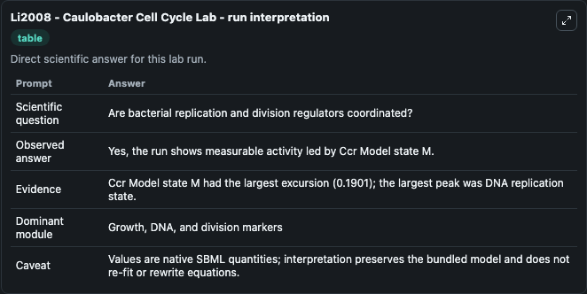
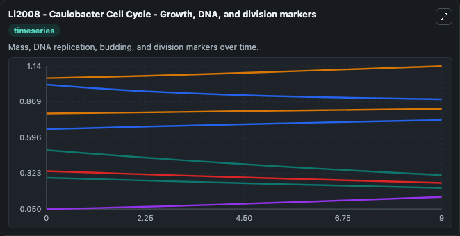
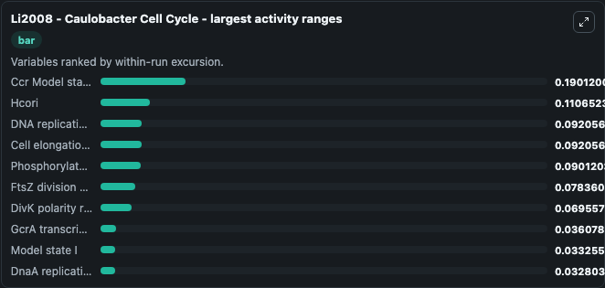
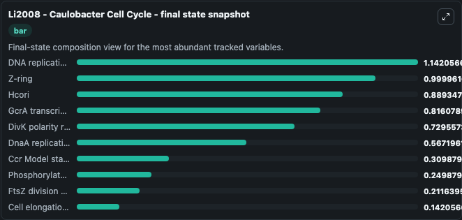
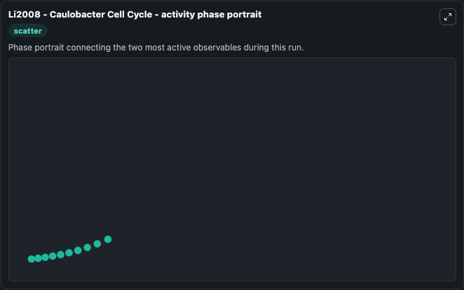

# Li2008 - Caulobacter Cell Cycle Lab

Single-model lab wrapper for Li2008 - Caulobacter Cell Cycle. This a model from the article: A Quantitative Study of the Division Cycle of Caulobacter crescentus Stalked Cells. Shenghua Li, Paul Brazhnik, Bruno Sobral, John J.

This lab is a single-model Biosimulant wrapper for a cell-cycle simulation. The captured run uses the lab defaults and renders the model outputs as dark-mode visualizations for quick inspection and README embedding.

## Model Context

This a model from the article: A Quantitative Study of the Division Cycle of Caulobacter crescentus Stalked Cells. Shenghua Li, Paul Brazhnik, Bruno Sobral, John J.

- Core model: Li2008 - Caulobacter Cell Cycle
- Runtime used by the lab: duration 10, step 1
- Controllable inputs: Ks,DnaA, Kd,DnaA, Ja,DNA Active CtrA, Theta DnaA, Ji,DNA Active GcrA
- Primary outputs: CtrA cell-cycle regulator, GcrA transcriptional regulator, DnaA replication initiator, FtsZ division marker, Z-ring, DivK polarity regulator, Phosphorylated DivK, Model state I, Ccr Model state M, Hcori, and 6 more
- Tags: cellcycle, sbml, biomodels_ebi, faithful

## Output Visualizations

The images below were generated from a Biosimulant lab run in dark mode. Each capture corresponds to one rendered visualization from the run output panel.

<!-- BIOSIMULANT_VISUALS_START -->

### 1. Li2008 Caulobacter Cell Cycle Lab Run Interpretation

Run interpretation view that anchors the captured simulation: it summarizes the lab purpose, runtime, and how to read the generated cell-cycle outputs.

### 2. Li2008 Caulobacter Cell Cycle Growth Dna And Division Markers

Growth, DNA, and division markers, linking mass accumulation and replication signals to cell-cycle state changes.

### 3. Li2008 Caulobacter Cell Cycle Largest Activity Ranges

Largest activity ranges chart, ranking the variables with the widest simulated movement so the dominant responses are easy to spot.

### 4. Li2008 Caulobacter Cell Cycle Final State Snapshot

Final state snapshot, comparing the end-of-run values for the selected cell-cycle variables.

### 5. Li2008 Caulobacter Cell Cycle Activity Phase Portrait

Activity phase portrait, showing pairwise movement between selected variables across the simulated trajectory.

<!-- BIOSIMULANT_VISUALS_END -->

## How to Read This Run

Use the time-course plots to see transient and steady-state behavior, the range or snapshot charts to identify the variables with the strongest response, and any phase-portrait view to inspect coupled regulator movement through the simulated trajectory. For this cell-cycle lab, the most useful comparison is usually between checkpoint, commitment, and mitotic-exit variables because those signals define where the simulated system sits in the cycle.

## Inputs

| Input | Context |
| --- | --- |
| Ks,DnaA | Controls Ks,DnaA in the lab model via `cellcycle_sbml_li2008_caulobacter_cell_cycle_biomd0000000718_model.ks_dna_a`. |
| Kd,DnaA | Controls Kd,DnaA in the lab model via `cellcycle_sbml_li2008_caulobacter_cell_cycle_biomd0000000718_model.kd_dna_a`. |
| Ja,DNA Active CtrA | Controls Ja,DNA Active CtrA in the lab model via `cellcycle_sbml_li2008_caulobacter_cell_cycle_biomd0000000718_model.ja_dna_active_ctr_a`. |
| Theta DnaA | Controls Theta DnaA in the lab model via `cellcycle_sbml_li2008_caulobacter_cell_cycle_biomd0000000718_model.theta_dna_a`. |
| Ji,DNA Active GcrA | Controls Ji,DNA Active GcrA in the lab model via `cellcycle_sbml_li2008_caulobacter_cell_cycle_biomd0000000718_model.ji_dna_active_gcr_a`. |

## Outputs

| Output | Context |
| --- | --- |
| CtrA cell-cycle regulator | Tracks CtrA cell-cycle regulator in the lab model via `cellcycle_sbml_li2008_caulobacter_cell_cycle_biomd0000000718_model.ctr_a_cell_cycle_regulator`. |
| GcrA transcriptional regulator | Tracks GcrA transcriptional regulator in the lab model via `cellcycle_sbml_li2008_caulobacter_cell_cycle_biomd0000000718_model.gcr_a_transcriptional_regulator`. |
| DnaA replication initiator | Tracks DnaA replication initiator in the lab model via `cellcycle_sbml_li2008_caulobacter_cell_cycle_biomd0000000718_model.dna_a_replication_initiator`. |
| FtsZ division marker | Tracks FtsZ division marker in the lab model via `cellcycle_sbml_li2008_caulobacter_cell_cycle_biomd0000000718_model.fts_z_division_marker`. |
| Z-ring | Tracks Z-ring in the lab model via `cellcycle_sbml_li2008_caulobacter_cell_cycle_biomd0000000718_model.z_ring`. |
| DivK polarity regulator | Tracks DivK polarity regulator in the lab model via `cellcycle_sbml_li2008_caulobacter_cell_cycle_biomd0000000718_model.div_k_polarity_regulator`. |
| Phosphorylated DivK | Tracks Phosphorylated DivK in the lab model via `cellcycle_sbml_li2008_caulobacter_cell_cycle_biomd0000000718_model.phosphorylated_div_k`. |
| Model state I | Tracks Model state I in the lab model via `cellcycle_sbml_li2008_caulobacter_cell_cycle_biomd0000000718_model.model_state_i`. |
| Ccr Model state M | Tracks Ccr Model state M in the lab model via `cellcycle_sbml_li2008_caulobacter_cell_cycle_biomd0000000718_model.ccr_model_state_m`. |
| Hcori | Tracks Hcori in the lab model via `cellcycle_sbml_li2008_caulobacter_cell_cycle_biomd0000000718_model.hcori`. |
| Hctr A | Tracks Hctr A in the lab model via `cellcycle_sbml_li2008_caulobacter_cell_cycle_biomd0000000718_model.hctr_a`. |
| Hccr Model state M | Tracks Hccr Model state M in the lab model via `cellcycle_sbml_li2008_caulobacter_cell_cycle_biomd0000000718_model.hccr_model_state_m`. |
| Hfts | Tracks Hfts in the lab model via `cellcycle_sbml_li2008_caulobacter_cell_cycle_biomd0000000718_model.hfts`. |
| Replication initiation state | Tracks Replication initiation state in the lab model via `cellcycle_sbml_li2008_caulobacter_cell_cycle_biomd0000000718_model.replication_initiation_state`. |
| Cell elongation state | Tracks Cell elongation state in the lab model via `cellcycle_sbml_li2008_caulobacter_cell_cycle_biomd0000000718_model.cell_elongation_state`. |
| DNA replication state | Tracks DNA replication state in the lab model via `cellcycle_sbml_li2008_caulobacter_cell_cycle_biomd0000000718_model.dna_replication_state`. |

## Lab Files

- `lab.yaml` defines the Biosimulant lab wrapper, exposed inputs, outputs, and runtime settings.
- `wiring-layout.json` stores the canvas layout used by the lab UI.
- `models/core/model.yaml` contains the wrapped simulation model metadata.
- `models/core/README.md` contains the source model notes and provenance.
- `models/visualisation/model.yaml` defines the visualization model used to render the run outputs.
- `assets/` contains the generated dark-mode visualization captures embedded above.
