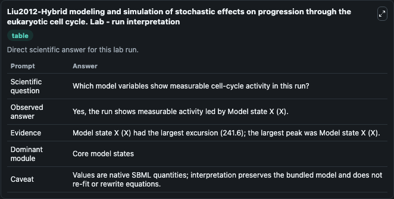
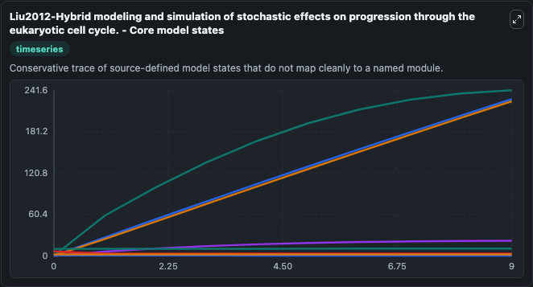
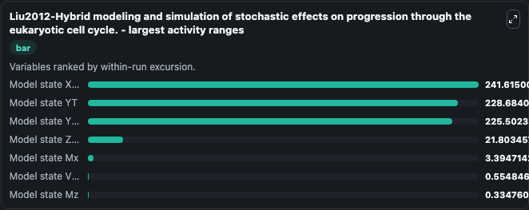
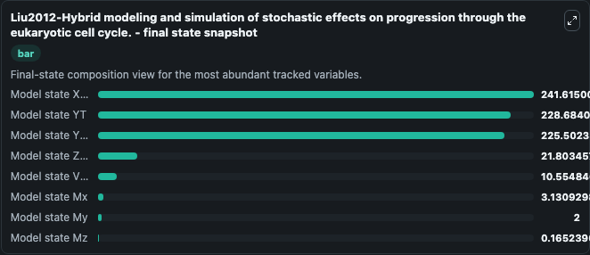
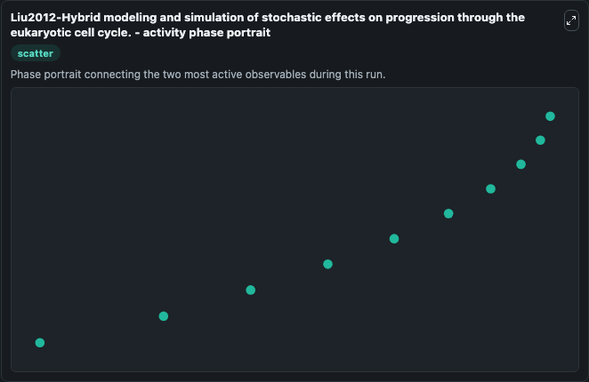

# Liu2012-Hybrid modeling and simulation of stochastic effects on progression through the eukaryotic cell cycle. Lab

Single-model lab wrapper for Liu2012-Hybrid modeling and simulation of stochastic effects on progression through the eukaryotic cell cycle.. The eukaryotic cell cycle is regulated by a complicated chemical reaction network. Although many deterministic models have been proposed, stochastic models are desired to capture noise in the cell res.

This lab is a single-model Biosimulant wrapper for a cell-cycle simulation. The captured run uses the lab defaults and renders the model outputs as dark-mode visualizations for quick inspection and README embedding.

## Model Context

The eukaryotic cell cycle is regulated by a complicated chemical reaction network. Although many deterministic models have been proposed, stochastic models are desired to capture noise in the cell res.

- Core model: Liu2012-Hybrid modeling and simulation of stochastic effects on progression through the eukaryotic cell cycle.
- Runtime used by the lab: duration 10, step 1
- Controllable inputs: none declared
- Primary outputs: Model state X (X), Model state V (V), Model state Y (Y), Model state Z (Z), Model state YT, Model state Mx, Model state My, Model state Mz
- Tags: cellcycle, sbml, biomodels_ebi, faithful

## Output Visualizations

The images below were generated from a Biosimulant lab run in dark mode. Each capture corresponds to one rendered visualization from the run output panel.

<!-- BIOSIMULANT_VISUALS_START -->

### 1. Liu2012 Hybrid Modeling And Simulation Of Stochastic Effects On Progression Thro

Liu2012 Hybrid Modeling And Simulation Of Stochastic Effects On Progression Thro visualization captured from the dark-mode Biosimulant run for Liu2012-Hybrid modeling and simulation of stochastic effects on progression through the eukaryotic cell cycle. Lab.

### 2. Liu2012 Hybrid Modeling And Simulation Of Stochastic Effects On Progression Thro

Liu2012 Hybrid Modeling And Simulation Of Stochastic Effects On Progression Thro visualization captured from the dark-mode Biosimulant run for Liu2012-Hybrid modeling and simulation of stochastic effects on progression through the eukaryotic cell cycle. Lab.

### 3. Liu2012 Hybrid Modeling And Simulation Of Stochastic Effects On Progression Thro

Liu2012 Hybrid Modeling And Simulation Of Stochastic Effects On Progression Thro visualization captured from the dark-mode Biosimulant run for Liu2012-Hybrid modeling and simulation of stochastic effects on progression through the eukaryotic cell cycle. Lab.

### 4. Liu2012 Hybrid Modeling And Simulation Of Stochastic Effects On Progression Thro

Liu2012 Hybrid Modeling And Simulation Of Stochastic Effects On Progression Thro visualization captured from the dark-mode Biosimulant run for Liu2012-Hybrid modeling and simulation of stochastic effects on progression through the eukaryotic cell cycle. Lab.

### 5. Liu2012 Hybrid Modeling And Simulation Of Stochastic Effects On Progression Thro

Liu2012 Hybrid Modeling And Simulation Of Stochastic Effects On Progression Thro visualization captured from the dark-mode Biosimulant run for Liu2012-Hybrid modeling and simulation of stochastic effects on progression through the eukaryotic cell cycle. Lab.

<!-- BIOSIMULANT_VISUALS_END -->

## How to Read This Run

Use the time-course plots to see transient and steady-state behavior, the range or snapshot charts to identify the variables with the strongest response, and any phase-portrait view to inspect coupled regulator movement through the simulated trajectory. For this cell-cycle lab, the most useful comparison is usually between checkpoint, commitment, and mitotic-exit variables because those signals define where the simulated system sits in the cycle.

## Inputs

| Input | Context |
| --- | --- |
| - | No entries declared in `lab.yaml`. |

## Outputs

| Output | Context |
| --- | --- |
| Model state X (X) | Tracks Model state X (X) in the lab model via `cellcycle_sbml_liu2012_hybrid_modeling_and_simulation_of_stocha_model2004140002_model.model_state_x_x`. |
| Model state V (V) | Tracks Model state V (V) in the lab model via `cellcycle_sbml_liu2012_hybrid_modeling_and_simulation_of_stocha_model2004140002_model.model_state_v_v`. |
| Model state Y (Y) | Tracks Model state Y (Y) in the lab model via `cellcycle_sbml_liu2012_hybrid_modeling_and_simulation_of_stocha_model2004140002_model.model_state_y_y`. |
| Model state Z (Z) | Tracks Model state Z (Z) in the lab model via `cellcycle_sbml_liu2012_hybrid_modeling_and_simulation_of_stocha_model2004140002_model.model_state_z_z`. |
| Model state YT | Tracks Model state YT in the lab model via `cellcycle_sbml_liu2012_hybrid_modeling_and_simulation_of_stocha_model2004140002_model.model_state_yt`. |
| Model state Mx | Tracks Model state Mx in the lab model via `cellcycle_sbml_liu2012_hybrid_modeling_and_simulation_of_stocha_model2004140002_model.model_state_mx`. |
| Model state My | Tracks Model state My in the lab model via `cellcycle_sbml_liu2012_hybrid_modeling_and_simulation_of_stocha_model2004140002_model.model_state_my`. |
| Model state Mz | Tracks Model state Mz in the lab model via `cellcycle_sbml_liu2012_hybrid_modeling_and_simulation_of_stocha_model2004140002_model.model_state_mz`. |

## Lab Files

- `lab.yaml` defines the Biosimulant lab wrapper, exposed inputs, outputs, and runtime settings.
- `wiring-layout.json` stores the canvas layout used by the lab UI.
- `models/core/model.yaml` contains the wrapped simulation model metadata.
- `models/core/README.md` contains the source model notes and provenance.
- `models/visualisation/model.yaml` defines the visualization model used to render the run outputs.
- `assets/` contains the generated dark-mode visualization captures embedded above.
