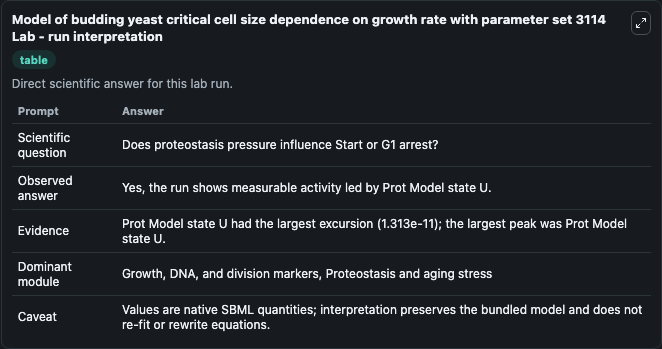
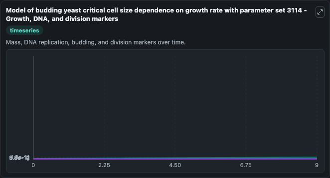
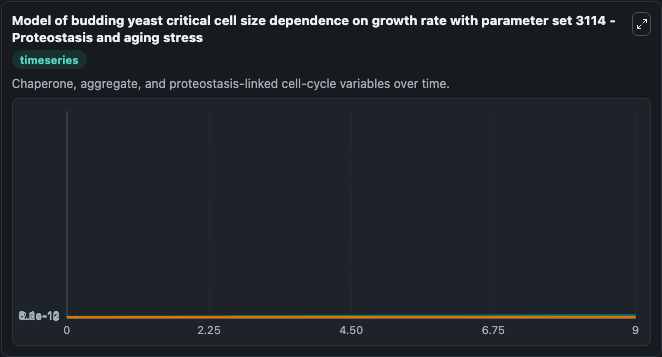
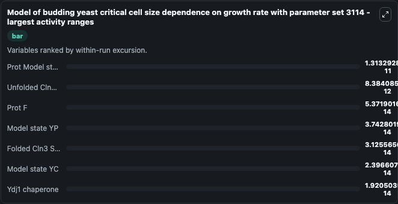
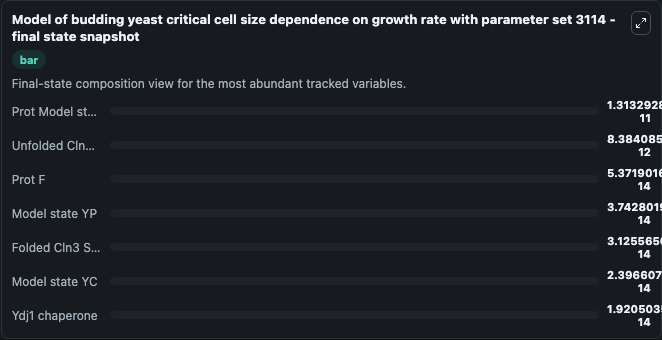
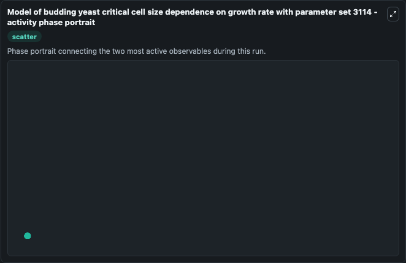

# Model of budding yeast critical cell size dependence on growth rate with parameter set 3114 Lab

Single-model lab wrapper for Model of budding yeast critical cell size dependence on growth rate with parameter set 3114. Model published in the paperChaperone availability subordinates cell cycle entry to growth and stressbyDavid F. Moreno1, Eva Parisi1, Galal Yahya, Federico Vaggi, Attila Csik\u00e1sz-Nagy, Mart\u00ed Aldea.

This lab is a single-model Biosimulant wrapper for a cell-cycle simulation. The captured run uses the lab defaults and renders the model outputs as dark-mode visualizations for quick inspection and README embedding.

## Model Context

Model published in the paperChaperone availability subordinates cell cycle entry to growth and stressbyDavid F. Moreno1, Eva Parisi1, Galal Yahya, Federico Vaggi, Attila Csikász-Nagy, Martí Aldea.

- Core model: Model of budding yeast critical cell size dependence on growth rate with parameter set 3114
- Runtime used by the lab: duration 10, step 1
- Controllable inputs: none declared
- Primary outputs: Folded Cln3 Start cyclin, Unfolded Cln3 Start cyclin, Ydj1 chaperone, Model state YP, Model state YC, Prot Model state U, Prot F
- Tags: cellcycle, sbml, biomodels_ebi, faithful

## Output Visualizations

The images below were generated from a Biosimulant lab run in dark mode. Each capture corresponds to one rendered visualization from the run output panel.

<!-- BIOSIMULANT_VISUALS_START -->

### 1. Model Of Budding Yeast Critical Cell Size Dependence On Growth Rate With Paramet

Growth, DNA, and division markers, linking mass accumulation and replication signals to cell-cycle state changes.

### 2. Model Of Budding Yeast Critical Cell Size Dependence On Growth Rate With Paramet

Growth, DNA, and division markers, linking mass accumulation and replication signals to cell-cycle state changes.

### 3. Model Of Budding Yeast Critical Cell Size Dependence On Growth Rate With Paramet

Growth, DNA, and division markers, linking mass accumulation and replication signals to cell-cycle state changes.

### 4. Model Of Budding Yeast Critical Cell Size Dependence On Growth Rate With Paramet

Growth, DNA, and division markers, linking mass accumulation and replication signals to cell-cycle state changes.

### 5. Model Of Budding Yeast Critical Cell Size Dependence On Growth Rate With Paramet

Growth, DNA, and division markers, linking mass accumulation and replication signals to cell-cycle state changes.

### 6. Model Of Budding Yeast Critical Cell Size Dependence On Growth Rate With Paramet

Growth, DNA, and division markers, linking mass accumulation and replication signals to cell-cycle state changes.

<!-- BIOSIMULANT_VISUALS_END -->

## How to Read This Run

Use the time-course plots to see transient and steady-state behavior, the range or snapshot charts to identify the variables with the strongest response, and any phase-portrait view to inspect coupled regulator movement through the simulated trajectory. For this cell-cycle lab, the most useful comparison is usually between checkpoint, commitment, and mitotic-exit variables because those signals define where the simulated system sits in the cycle.

## Inputs

| Input | Context |
| --- | --- |
| - | No entries declared in `lab.yaml`. |

## Outputs

| Output | Context |
| --- | --- |
| Folded Cln3 Start cyclin | Tracks Folded Cln3 Start cyclin in the lab model via `cellcycle_sbml_model_of_budding_yeast_critical_cell_size_depend_model1808310001_model.folded_cln3_start_cyclin`. |
| Unfolded Cln3 Start cyclin | Tracks Unfolded Cln3 Start cyclin in the lab model via `cellcycle_sbml_model_of_budding_yeast_critical_cell_size_depend_model1808310001_model.unfolded_cln3_start_cyclin`. |
| Ydj1 chaperone | Tracks Ydj1 chaperone in the lab model via `cellcycle_sbml_model_of_budding_yeast_critical_cell_size_depend_model1808310001_model.ydj1_chaperone`. |
| Model state YP | Tracks Model state YP in the lab model via `cellcycle_sbml_model_of_budding_yeast_critical_cell_size_depend_model1808310001_model.model_state_yp`. |
| Model state YC | Tracks Model state YC in the lab model via `cellcycle_sbml_model_of_budding_yeast_critical_cell_size_depend_model1808310001_model.model_state_yc`. |
| Prot Model state U | Tracks Prot Model state U in the lab model via `cellcycle_sbml_model_of_budding_yeast_critical_cell_size_depend_model1808310001_model.prot_model_state_u`. |
| Prot F | Tracks Prot F in the lab model via `cellcycle_sbml_model_of_budding_yeast_critical_cell_size_depend_model1808310001_model.prot_f`. |

## Lab Files

- `lab.yaml` defines the Biosimulant lab wrapper, exposed inputs, outputs, and runtime settings.
- `wiring-layout.json` stores the canvas layout used by the lab UI.
- `models/core/model.yaml` contains the wrapped simulation model metadata.
- `models/core/README.md` contains the source model notes and provenance.
- `models/visualisation/model.yaml` defines the visualization model used to render the run outputs.
- `assets/` contains the generated dark-mode visualization captures embedded above.
