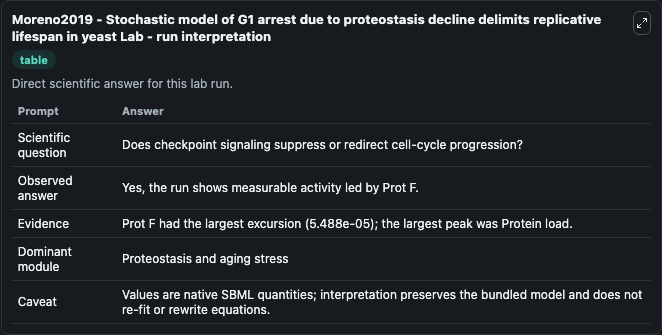
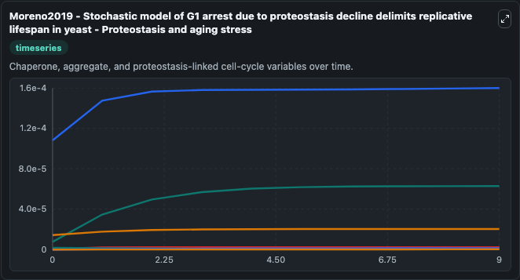
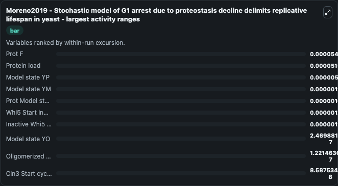
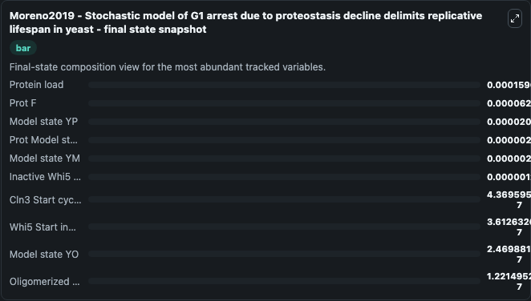
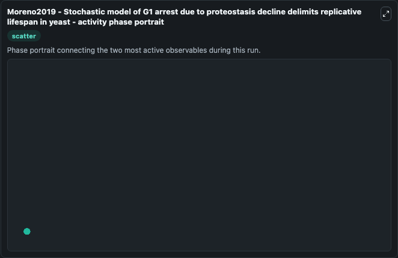

# Moreno2019 - Stochastic model of G1 arrest due to proteostasis decline delimits replicative lifespan in yeast Lab

Single-model lab wrapper for Moreno2019 - Stochastic model of G1 arrest due to proteostasis decline delimits replicative lifespan in yeast. This model is described within the paper: A G1 arrest due to proteostasis decline delimits replicative lifespan in yeastDavid F. Moreno, Kirsten Jenkins, Sandrine Morlot, Gilles Charvin, Attila Csik\u00e1s.

This lab is a single-model Biosimulant wrapper for a cell-cycle simulation. The captured run uses the lab defaults and renders the model outputs as dark-mode visualizations for quick inspection and README embedding.

## Model Context

This model is described within the paper: A G1 arrest due to proteostasis decline delimits replicative lifespan in yeastDavid F. Moreno, Kirsten Jenkins, Sandrine Morlot, Gilles Charvin, Attila Csikás.

- Core model: Moreno2019 - Stochastic model of G1 arrest due to proteostasis decline delimits replicative lifespan in yeast
- Runtime used by the lab: duration 10, step 1
- Controllable inputs: Hsp104
- Primary outputs: Protein load, Model state YP, Ydj1 chaperone, Prot F, Prot Model state M, Oligomerized proteostasis species, Protein aggregate burden, Ydj1-oligomer aggregate complex, Model state YM, Model state YO, and 5 more
- Tags: cellcycle, sbml, biomodels_ebi, faithful

## Output Visualizations

The images below were generated from a Biosimulant lab run in dark mode. Each capture corresponds to one rendered visualization from the run output panel.

<!-- BIOSIMULANT_VISUALS_START -->

### 1. Moreno2019 Stochastic Model Of G1 Arrest Due To Proteostasis Decline Delimits Re

G1/S commitment view, focused on the regulatory variables that gate entry into DNA synthesis and cell-cycle progression.

### 2. Moreno2019 Stochastic Model Of G1 Arrest Due To Proteostasis Decline Delimits Re

G1/S commitment view, focused on the regulatory variables that gate entry into DNA synthesis and cell-cycle progression.

### 3. Moreno2019 Stochastic Model Of G1 Arrest Due To Proteostasis Decline Delimits Re

G1/S commitment view, focused on the regulatory variables that gate entry into DNA synthesis and cell-cycle progression.

### 4. Moreno2019 Stochastic Model Of G1 Arrest Due To Proteostasis Decline Delimits Re

G1/S commitment view, focused on the regulatory variables that gate entry into DNA synthesis and cell-cycle progression.

### 5. Moreno2019 Stochastic Model Of G1 Arrest Due To Proteostasis Decline Delimits Re

G1/S commitment view, focused on the regulatory variables that gate entry into DNA synthesis and cell-cycle progression.

<!-- BIOSIMULANT_VISUALS_END -->

## How to Read This Run

Use the time-course plots to see transient and steady-state behavior, the range or snapshot charts to identify the variables with the strongest response, and any phase-portrait view to inspect coupled regulator movement through the simulated trajectory. For this cell-cycle lab, the most useful comparison is usually between checkpoint, commitment, and mitotic-exit variables because those signals define where the simulated system sits in the cycle.

## Inputs

| Input | Context |
| --- | --- |
| Hsp104 | Controls Hsp104 in the lab model via `cellcycle_sbml_moreno2019_stochastic_model_of_g1_arrest_due_to_model1901210001_model.hsp104`. |

## Outputs

| Output | Context |
| --- | --- |
| Protein load | Tracks Protein load in the lab model via `cellcycle_sbml_moreno2019_stochastic_model_of_g1_arrest_due_to_model1901210001_model.protein_load`. |
| Model state YP | Tracks Model state YP in the lab model via `cellcycle_sbml_moreno2019_stochastic_model_of_g1_arrest_due_to_model1901210001_model.model_state_yp`. |
| Ydj1 chaperone | Tracks Ydj1 chaperone in the lab model via `cellcycle_sbml_moreno2019_stochastic_model_of_g1_arrest_due_to_model1901210001_model.ydj1_chaperone`. |
| Prot F | Tracks Prot F in the lab model via `cellcycle_sbml_moreno2019_stochastic_model_of_g1_arrest_due_to_model1901210001_model.prot_f`. |
| Prot Model state M | Tracks Prot Model state M in the lab model via `cellcycle_sbml_moreno2019_stochastic_model_of_g1_arrest_due_to_model1901210001_model.prot_model_state_m`. |
| Oligomerized proteostasis species | Tracks Oligomerized proteostasis species in the lab model via `cellcycle_sbml_moreno2019_stochastic_model_of_g1_arrest_due_to_model1901210001_model.oligomerized_proteostasis_species`. |
| Protein aggregate burden | Tracks Protein aggregate burden in the lab model via `cellcycle_sbml_moreno2019_stochastic_model_of_g1_arrest_due_to_model1901210001_model.protein_aggregate_burden`. |
| Ydj1-oligomer aggregate complex | Tracks Ydj1-oligomer aggregate complex in the lab model via `cellcycle_sbml_moreno2019_stochastic_model_of_g1_arrest_due_to_model1901210001_model.ydj1_oligomer_aggregate_complex`. |
| Model state YM | Tracks Model state YM in the lab model via `cellcycle_sbml_moreno2019_stochastic_model_of_g1_arrest_due_to_model1901210001_model.model_state_ym`. |
| Model state YO | Tracks Model state YO in the lab model via `cellcycle_sbml_moreno2019_stochastic_model_of_g1_arrest_due_to_model1901210001_model.model_state_yo`. |
| Cln3 Start cyclin | Tracks Cln3 Start cyclin in the lab model via `cellcycle_sbml_moreno2019_stochastic_model_of_g1_arrest_due_to_model1901210001_model.cln3_start_cyclin`. |
| Model state YC | Tracks Model state YC in the lab model via `cellcycle_sbml_moreno2019_stochastic_model_of_g1_arrest_due_to_model1901210001_model.model_state_yc`. |
| Folded Cln3 Start cyclin | Tracks Folded Cln3 Start cyclin in the lab model via `cellcycle_sbml_moreno2019_stochastic_model_of_g1_arrest_due_to_model1901210001_model.folded_cln3_start_cyclin`. |
| Whi5 Start inhibitor | Tracks Whi5 Start inhibitor in the lab model via `cellcycle_sbml_moreno2019_stochastic_model_of_g1_arrest_due_to_model1901210001_model.whi5_start_inhibitor`. |
| Inactive Whi5 Start inhibitor | Tracks Inactive Whi5 Start inhibitor in the lab model via `cellcycle_sbml_moreno2019_stochastic_model_of_g1_arrest_due_to_model1901210001_model.inactive_whi5_start_inhibitor`. |

## Lab Files

- `lab.yaml` defines the Biosimulant lab wrapper, exposed inputs, outputs, and runtime settings.
- `wiring-layout.json` stores the canvas layout used by the lab UI.
- `models/core/model.yaml` contains the wrapped simulation model metadata.
- `models/core/README.md` contains the source model notes and provenance.
- `models/visualisation/model.yaml` defines the visualization model used to render the run outputs.
- `assets/` contains the generated dark-mode visualization captures embedded above.
