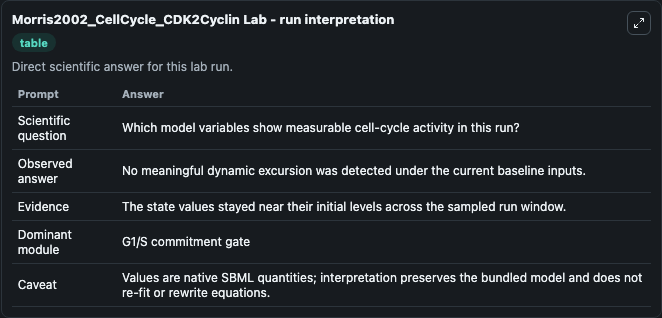
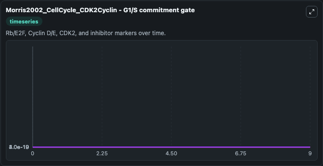
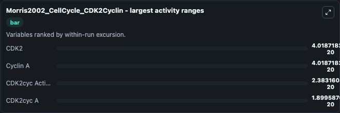
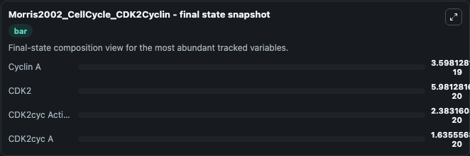
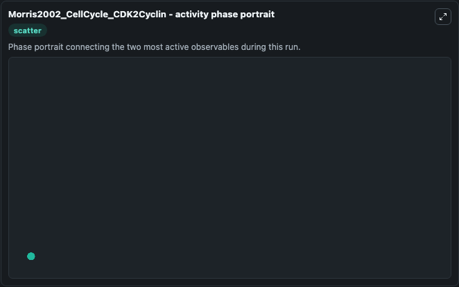

# Morris2002_CellCycle_CDK2Cyclin Lab

Single-model lab wrapper for Morris2002_CellCycle_CDK2Cyclin. Notes from the original DOCQS curator: In this version of the CDK2/Cyclin A complex activation there is discrepancy in the first curve which plots the binding reaction of CDK2 and Cyclin A expressed i. It can be used to explore cell-cycle regulation dynamics and compare checkpoint behavior across conditions.

This lab is a single-model Biosimulant wrapper for a cell-cycle simulation. The captured run uses the lab defaults and renders the model outputs as dark-mode visualizations for quick inspection and README embedding.

## Model Context

Notes from the original DOCQS curator: In this version of the CDK2/Cyclin A complex activation there is discrepancy in the first curve which plots the binding reaction of CDK2 and Cyclin A expressed i. It can be used to explore cell-cycle regulation dynamics and compare checkpoint behavior across conditions.

- Core model: Morris2002_CellCycle_CDK2Cyclin
- Runtime used by the lab: duration 10, step 1
- Controllable inputs: none declared
- Primary outputs: CDK2cyc A, Cyclin A, CDK2, CDK2cyc Active Star
- Tags: cellcycle, sbml, biomodels_ebi, faithful

## Output Visualizations

The images below were generated from a Biosimulant lab run in dark mode. Each capture corresponds to one rendered visualization from the run output panel.

<!-- BIOSIMULANT_VISUALS_START -->

### 1. Morris2002 Cellcycle Cdk2cyclin Lab Run Interpretation

Run interpretation view that anchors the captured simulation: it summarizes the lab purpose, runtime, and how to read the generated cell-cycle outputs.

### 2. Morris2002 Cellcycle Cdk2cyclin G1 S Commitment Gate

G1/S commitment view, focused on the regulatory variables that gate entry into DNA synthesis and cell-cycle progression.

### 3. Morris2002 Cellcycle Cdk2cyclin Largest Activity Ranges

Largest activity ranges chart, ranking the variables with the widest simulated movement so the dominant responses are easy to spot.

### 4. Morris2002 Cellcycle Cdk2cyclin Final State Snapshot

Final state snapshot, comparing the end-of-run values for the selected cell-cycle variables.

### 5. Morris2002 Cellcycle Cdk2cyclin Activity Phase Portrait

Activity phase portrait, showing pairwise movement between selected variables across the simulated trajectory.

<!-- BIOSIMULANT_VISUALS_END -->

## How to Read This Run

Use the time-course plots to see transient and steady-state behavior, the range or snapshot charts to identify the variables with the strongest response, and any phase-portrait view to inspect coupled regulator movement through the simulated trajectory. For this cell-cycle lab, the most useful comparison is usually between checkpoint, commitment, and mitotic-exit variables because those signals define where the simulated system sits in the cycle.

## Inputs

| Input | Context |
| --- | --- |
| - | No entries declared in `lab.yaml`. |

## Outputs

| Output | Context |
| --- | --- |
| CDK2cyc A | Tracks CDK2cyc A in the lab model via `cellcycle_sbml_morris2002_cellcycle_cdk2cyclin_biomd0000000150_model.cdk2cyc_a`. |
| Cyclin A | Tracks Cyclin A in the lab model via `cellcycle_sbml_morris2002_cellcycle_cdk2cyclin_biomd0000000150_model.cyclin_a`. |
| CDK2 | Tracks CDK2 in the lab model via `cellcycle_sbml_morris2002_cellcycle_cdk2cyclin_biomd0000000150_model.cdk2`. |
| CDK2cyc Active Star | Tracks CDK2cyc Active Star in the lab model via `cellcycle_sbml_morris2002_cellcycle_cdk2cyclin_biomd0000000150_model.cdk2cyc_active_star`. |

## Lab Files

- `lab.yaml` defines the Biosimulant lab wrapper, exposed inputs, outputs, and runtime settings.
- `wiring-layout.json` stores the canvas layout used by the lab UI.
- `models/core/model.yaml` contains the wrapped simulation model metadata.
- `models/core/README.md` contains the source model notes and provenance.
- `models/visualisation/model.yaml` defines the visualization model used to render the run outputs.
- `assets/` contains the generated dark-mode visualization captures embedded above.
