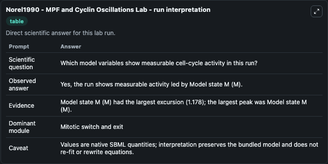
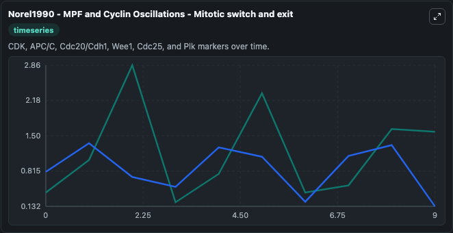
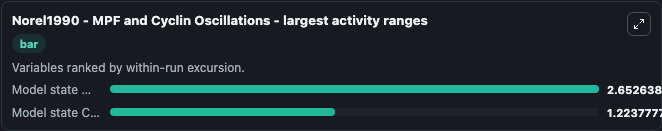
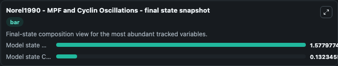
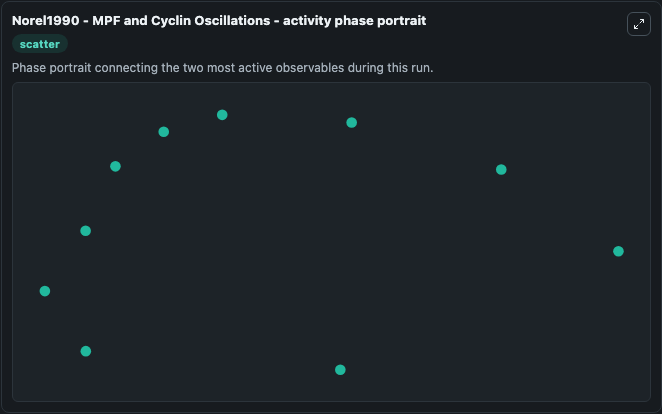

# Norel1990 - MPF and Cyclin Oscillations Lab

Single-model lab wrapper for Norel1990 - MPF and Cyclin Oscillations. A mathematical model of cell cycle progression is presented, which integrates recent biochemical information on the interaction of the maturation promotion factor (MPF) and cyclin. It can be used to explore cell-cycle regulation dynamics and compare checkpoint behavior across conditions.

This lab is a single-model Biosimulant wrapper for a cell-cycle simulation. The captured run uses the lab defaults and renders the model outputs as dark-mode visualizations for quick inspection and README embedding.

## Model Context

A mathematical model of cell cycle progression is presented, which integrates recent biochemical information on the interaction of the maturation promotion factor (MPF) and cyclin. It can be used to explore cell-cycle regulation dynamics and compare checkpoint behavior across conditions.

- Core model: Norel1990 - MPF and Cyclin Oscillations
- Runtime used by the lab: duration 10, step 1
- Controllable inputs: none declared
- Primary outputs: Model state M (M), Model state C (C)
- Tags: cellcycle, sbml, biomodels_ebi, faithful

## Output Visualizations

The images below were generated from a Biosimulant lab run in dark mode. Each capture corresponds to one rendered visualization from the run output panel.

<!-- BIOSIMULANT_VISUALS_START -->

### 1. Norel1990 Mpf And Cyclin Oscillations Lab Run Interpretation

Run interpretation view that anchors the captured simulation: it summarizes the lab purpose, runtime, and how to read the generated cell-cycle outputs.

### 2. Norel1990 Mpf And Cyclin Oscillations Mitotic Switch And Exit

Mitotic switch and exit view, capturing late-cycle regulators and the transition out of mitosis.

### 3. Norel1990 Mpf And Cyclin Oscillations Largest Activity Ranges

Largest activity ranges chart, ranking the variables with the widest simulated movement so the dominant responses are easy to spot.

### 4. Norel1990 Mpf And Cyclin Oscillations Final State Snapshot

Final state snapshot, comparing the end-of-run values for the selected cell-cycle variables.

### 5. Norel1990 Mpf And Cyclin Oscillations Activity Phase Portrait

Activity phase portrait, showing pairwise movement between selected variables across the simulated trajectory.

<!-- BIOSIMULANT_VISUALS_END -->

## How to Read This Run

Use the time-course plots to see transient and steady-state behavior, the range or snapshot charts to identify the variables with the strongest response, and any phase-portrait view to inspect coupled regulator movement through the simulated trajectory. For this cell-cycle lab, the most useful comparison is usually between checkpoint, commitment, and mitotic-exit variables because those signals define where the simulated system sits in the cycle.

## Inputs

| Input | Context |
| --- | --- |
| - | No entries declared in `lab.yaml`. |

## Outputs

| Output | Context |
| --- | --- |
| Model state M (M) | Tracks Model state M (M) in the lab model via `cellcycle_sbml_norel1990_mpf_and_cyclin_oscillations_biomd0000000728_model.model_state_m_m`. |
| Model state C (C) | Tracks Model state C (C) in the lab model via `cellcycle_sbml_norel1990_mpf_and_cyclin_oscillations_biomd0000000728_model.model_state_c_c`. |

## Lab Files

- `lab.yaml` defines the Biosimulant lab wrapper, exposed inputs, outputs, and runtime settings.
- `wiring-layout.json` stores the canvas layout used by the lab UI.
- `models/core/model.yaml` contains the wrapped simulation model metadata.
- `models/core/README.md` contains the source model notes and provenance.
- `models/visualisation/model.yaml` defines the visualization model used to render the run outputs.
- `assets/` contains the generated dark-mode visualization captures embedded above.
