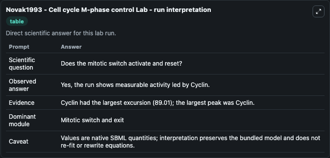
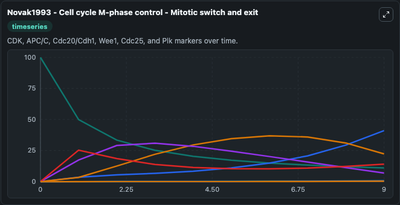
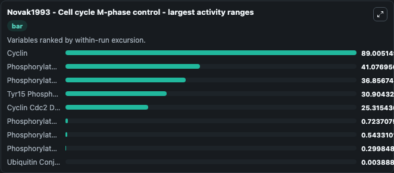
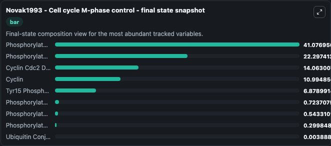
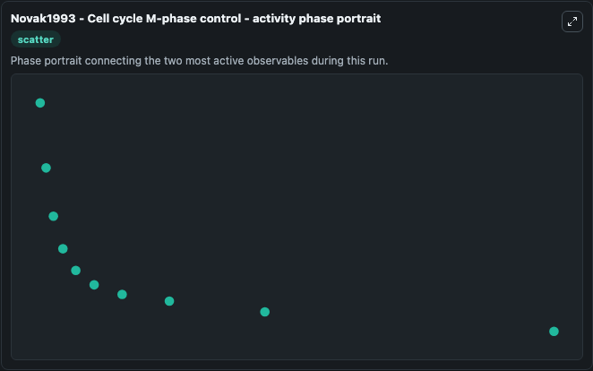

# Novak1993 - Cell cycle M-phase control Lab

Single-model lab wrapper for Novak1993 - Cell cycle M-phase control. Novak1993 - Cell cycle M-phase control The model reproduces Figure 9 of the paper. It can be used to explore cell-cycle regulation dynamics and compare checkpoint behavior across conditions.

This lab is a single-model Biosimulant wrapper for a cell-cycle simulation. The captured run uses the lab defaults and renders the model outputs as dark-mode visualizations for quick inspection and README embedding.

## Model Context

Novak1993 - Cell cycle M-phase control The model reproduces Figure 9 of the paper. It can be used to explore cell-cycle regulation dynamics and compare checkpoint behavior across conditions.

- Core model: Novak1993 - Cell cycle M-phase control
- Runtime used by the lab: duration 10, step 1
- Controllable inputs: Cdc2, Cdc25, Wee1, Intermediary Enzyme, Ubiquitin Conjugating Enzyme
- Primary outputs: Cyclin, Cyclin Cdc2 Dimer, Phosphorylated Dimer, Tyr15 Phosphorylated Dimer, Phosphorylated P Dimer, Phosphorylated Cdc25, Phosphorylated Wee1, Phosphorylated IE, Ubiquitin Conjugating Enzyme
- Tags: cellcycle, sbml, biomodels_ebi, faithful

## Output Visualizations

The images below were generated from a Biosimulant lab run in dark mode. Each capture corresponds to one rendered visualization from the run output panel.

<!-- BIOSIMULANT_VISUALS_START -->

### 1. Novak1993 Cell Cycle M Phase Control Lab Run Interpretation

Run interpretation view that anchors the captured simulation: it summarizes the lab purpose, runtime, and how to read the generated cell-cycle outputs.

### 2. Novak1993 Cell Cycle M Phase Control Mitotic Switch And Exit

Mitotic switch and exit view, capturing late-cycle regulators and the transition out of mitosis.

### 3. Novak1993 Cell Cycle M Phase Control Largest Activity Ranges

Largest activity ranges chart, ranking the variables with the widest simulated movement so the dominant responses are easy to spot.

### 4. Novak1993 Cell Cycle M Phase Control Final State Snapshot

Final state snapshot, comparing the end-of-run values for the selected cell-cycle variables.

### 5. Novak1993 Cell Cycle M Phase Control Activity Phase Portrait

Activity phase portrait, showing pairwise movement between selected variables across the simulated trajectory.

<!-- BIOSIMULANT_VISUALS_END -->

## How to Read This Run

Use the time-course plots to see transient and steady-state behavior, the range or snapshot charts to identify the variables with the strongest response, and any phase-portrait view to inspect coupled regulator movement through the simulated trajectory. For this cell-cycle lab, the most useful comparison is usually between checkpoint, commitment, and mitotic-exit variables because those signals define where the simulated system sits in the cycle.

## Inputs

| Input | Context |
| --- | --- |
| Cdc2 | Controls Cdc2 in the lab model via `cellcycle_sbml_novak1993_cell_cycle_m_phase_control_biomd0000000107_model.cdc2`. |
| Cdc25 | Controls Cdc25 in the lab model via `cellcycle_sbml_novak1993_cell_cycle_m_phase_control_biomd0000000107_model.cdc25`. |
| Wee1 | Controls Wee1 in the lab model via `cellcycle_sbml_novak1993_cell_cycle_m_phase_control_biomd0000000107_model.wee1`. |
| Intermediary Enzyme | Controls Intermediary Enzyme in the lab model via `cellcycle_sbml_novak1993_cell_cycle_m_phase_control_biomd0000000107_model.intermediary_enzyme`. |
| Ubiquitin Conjugating Enzyme | Controls Ubiquitin Conjugating Enzyme in the lab model via `cellcycle_sbml_novak1993_cell_cycle_m_phase_control_biomd0000000107_model.ubiquitin_conjugating_enzyme`. |

## Outputs

| Output | Context |
| --- | --- |
| Cyclin | Tracks Cyclin in the lab model via `cellcycle_sbml_novak1993_cell_cycle_m_phase_control_biomd0000000107_model.cyclin`. |
| Cyclin Cdc2 Dimer | Tracks Cyclin Cdc2 Dimer in the lab model via `cellcycle_sbml_novak1993_cell_cycle_m_phase_control_biomd0000000107_model.cyclin_cdc2_dimer`. |
| Phosphorylated Dimer | Tracks Phosphorylated Dimer in the lab model via `cellcycle_sbml_novak1993_cell_cycle_m_phase_control_biomd0000000107_model.phosphorylated_dimer`. |
| Tyr15 Phosphorylated Dimer | Tracks Tyr15 Phosphorylated Dimer in the lab model via `cellcycle_sbml_novak1993_cell_cycle_m_phase_control_biomd0000000107_model.tyr15_phosphorylated_dimer`. |
| Phosphorylated P Dimer | Tracks Phosphorylated P Dimer in the lab model via `cellcycle_sbml_novak1993_cell_cycle_m_phase_control_biomd0000000107_model.phosphorylated_p_dimer`. |
| Phosphorylated Cdc25 | Tracks Phosphorylated Cdc25 in the lab model via `cellcycle_sbml_novak1993_cell_cycle_m_phase_control_biomd0000000107_model.phosphorylated_cdc25`. |
| Phosphorylated Wee1 | Tracks Phosphorylated Wee1 in the lab model via `cellcycle_sbml_novak1993_cell_cycle_m_phase_control_biomd0000000107_model.phosphorylated_wee1`. |
| Phosphorylated IE | Tracks Phosphorylated IE in the lab model via `cellcycle_sbml_novak1993_cell_cycle_m_phase_control_biomd0000000107_model.phosphorylated_ie`. |
| Ubiquitin Conjugating Enzyme | Tracks Ubiquitin Conjugating Enzyme in the lab model via `cellcycle_sbml_novak1993_cell_cycle_m_phase_control_biomd0000000107_model.ubiquitin_conjugating_enzyme`. |

## Lab Files

- `lab.yaml` defines the Biosimulant lab wrapper, exposed inputs, outputs, and runtime settings.
- `wiring-layout.json` stores the canvas layout used by the lab UI.
- `models/core/model.yaml` contains the wrapped simulation model metadata.
- `models/core/README.md` contains the source model notes and provenance.
- `models/visualisation/model.yaml` defines the visualization model used to render the run outputs.
- `assets/` contains the generated dark-mode visualization captures embedded above.
