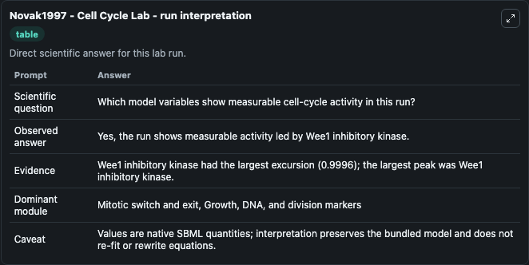
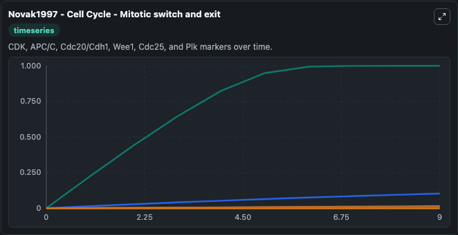
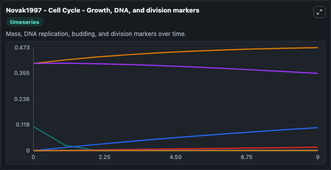
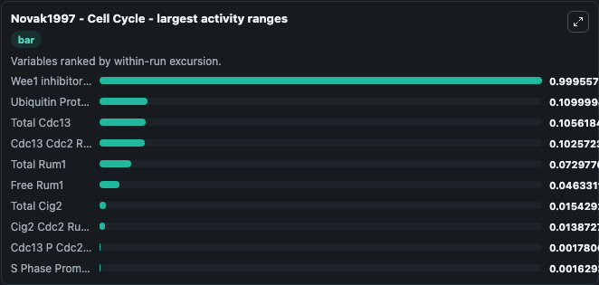
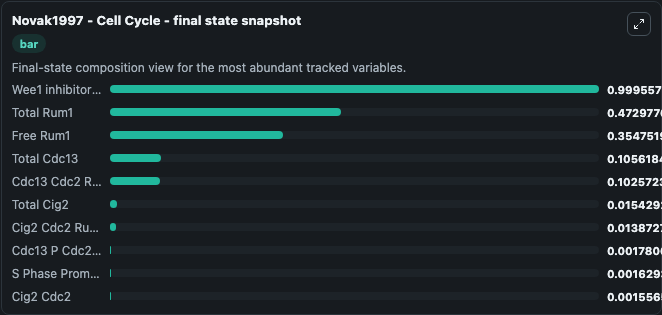
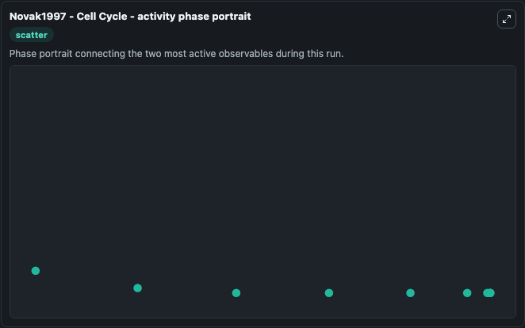

# Novak1997 - Cell Cycle Lab

Single-model lab wrapper for Novak1997 - Cell Cycle. Novak1997 - Cell Cycle Modeling the control of DNA replication in fission yeast. This model is described in the article: Modeling the control of DNA replication in fission yeast.

This lab is a single-model Biosimulant wrapper for a cell-cycle simulation. The captured run uses the lab defaults and renders the model outputs as dark-mode visualizations for quick inspection and README embedding.

## Model Context

Novak1997 - Cell Cycle Modeling the control of DNA replication in fission yeast. This model is described in the article: Modeling the control of DNA replication in fission yeast.

- Core model: Novak1997 - Cell Cycle
- Runtime used by the lab: duration 10, step 1
- Controllable inputs: Bound Intermediary Enzyme, Bound Ubiquitin Protease1, Bound Ubiquitin Protease2, Bound Wee1, Bound Cdc25, Cell mass
- Primary outputs: Ubiquitin Protease1, Ubiquitin Protease2, Wee1 inhibitory kinase, Cdc25 activating phosphatase, Cdc13 Cdc2, Free Rum1, Cig2 Cdc2, Intermediary Enzyme, Cdc13 P Cdc2, Cig2 Cdc2 Rum1, and 7 more
- Tags: cellcycle, sbml, biomodels_ebi, faithful

## Output Visualizations

The images below were generated from a Biosimulant lab run in dark mode. Each capture corresponds to one rendered visualization from the run output panel.

<!-- BIOSIMULANT_VISUALS_START -->

### 1. Novak1997 Cell Cycle Lab Run Interpretation

Run interpretation view that anchors the captured simulation: it summarizes the lab purpose, runtime, and how to read the generated cell-cycle outputs.

### 2. Novak1997 Cell Cycle Mitotic Switch And Exit

Mitotic switch and exit view, capturing late-cycle regulators and the transition out of mitosis.

### 3. Novak1997 Cell Cycle Growth Dna And Division Markers

Growth, DNA, and division markers, linking mass accumulation and replication signals to cell-cycle state changes.

### 4. Novak1997 Cell Cycle Largest Activity Ranges

Largest activity ranges chart, ranking the variables with the widest simulated movement so the dominant responses are easy to spot.

### 5. Novak1997 Cell Cycle Final State Snapshot

Final state snapshot, comparing the end-of-run values for the selected cell-cycle variables.

### 6. Novak1997 Cell Cycle Activity Phase Portrait

Activity phase portrait, showing pairwise movement between selected variables across the simulated trajectory.

<!-- BIOSIMULANT_VISUALS_END -->

## How to Read This Run

Use the time-course plots to see transient and steady-state behavior, the range or snapshot charts to identify the variables with the strongest response, and any phase-portrait view to inspect coupled regulator movement through the simulated trajectory. For this cell-cycle lab, the most useful comparison is usually between checkpoint, commitment, and mitotic-exit variables because those signals define where the simulated system sits in the cycle.

## Inputs

| Input | Context |
| --- | --- |
| Bound Intermediary Enzyme | Controls Bound Intermediary Enzyme in the lab model via `cellcycle_sbml_novak1997_cell_cycle_biomd0000000007_model.bound_intermediary_enzyme`. |
| Bound Ubiquitin Protease1 | Controls Bound Ubiquitin Protease1 in the lab model via `cellcycle_sbml_novak1997_cell_cycle_biomd0000000007_model.bound_ubiquitin_protease1`. |
| Bound Ubiquitin Protease2 | Controls Bound Ubiquitin Protease2 in the lab model via `cellcycle_sbml_novak1997_cell_cycle_biomd0000000007_model.bound_ubiquitin_protease2`. |
| Bound Wee1 | Controls Bound Wee1 in the lab model via `cellcycle_sbml_novak1997_cell_cycle_biomd0000000007_model.bound_wee1`. |
| Bound Cdc25 | Controls Bound Cdc25 in the lab model via `cellcycle_sbml_novak1997_cell_cycle_biomd0000000007_model.bound_cdc25`. |
| Cell mass | Controls Cell mass in the lab model via `cellcycle_sbml_novak1997_cell_cycle_biomd0000000007_model.cell_mass`. |

## Outputs

| Output | Context |
| --- | --- |
| Ubiquitin Protease1 | Tracks Ubiquitin Protease1 in the lab model via `cellcycle_sbml_novak1997_cell_cycle_biomd0000000007_model.ubiquitin_protease1`. |
| Ubiquitin Protease2 | Tracks Ubiquitin Protease2 in the lab model via `cellcycle_sbml_novak1997_cell_cycle_biomd0000000007_model.ubiquitin_protease2`. |
| Wee1 inhibitory kinase | Tracks Wee1 inhibitory kinase in the lab model via `cellcycle_sbml_novak1997_cell_cycle_biomd0000000007_model.wee1_inhibitory_kinase`. |
| Cdc25 activating phosphatase | Tracks Cdc25 activating phosphatase in the lab model via `cellcycle_sbml_novak1997_cell_cycle_biomd0000000007_model.cdc25_activating_phosphatase`. |
| Cdc13 Cdc2 | Tracks Cdc13 Cdc2 in the lab model via `cellcycle_sbml_novak1997_cell_cycle_biomd0000000007_model.cdc13_cdc2`. |
| Free Rum1 | Tracks Free Rum1 in the lab model via `cellcycle_sbml_novak1997_cell_cycle_biomd0000000007_model.free_rum1`. |
| Cig2 Cdc2 | Tracks Cig2 Cdc2 in the lab model via `cellcycle_sbml_novak1997_cell_cycle_biomd0000000007_model.cig2_cdc2`. |
| Intermediary Enzyme | Tracks Intermediary Enzyme in the lab model via `cellcycle_sbml_novak1997_cell_cycle_biomd0000000007_model.intermediary_enzyme`. |
| Cdc13 P Cdc2 | Tracks Cdc13 P Cdc2 in the lab model via `cellcycle_sbml_novak1997_cell_cycle_biomd0000000007_model.cdc13_p_cdc2`. |
| Cig2 Cdc2 Rum1 | Tracks Cig2 Cdc2 Rum1 in the lab model via `cellcycle_sbml_novak1997_cell_cycle_biomd0000000007_model.cig2_cdc2_rum1`. |
| Cdc13 Cdc2 Rum1 | Tracks Cdc13 Cdc2 Rum1 in the lab model via `cellcycle_sbml_novak1997_cell_cycle_biomd0000000007_model.cdc13_cdc2_rum1`. |
| Cdc13 P Cdc2 Rum1 | Tracks Cdc13 P Cdc2 Rum1 in the lab model via `cellcycle_sbml_novak1997_cell_cycle_biomd0000000007_model.cdc13_p_cdc2_rum1`. |
| S Phase Promoting Factor | Tracks S Phase Promoting Factor in the lab model via `cellcycle_sbml_novak1997_cell_cycle_biomd0000000007_model.s_phase_promoting_factor`. |
| Maturation-promoting factor | Tracks Maturation-promoting factor in the lab model via `cellcycle_sbml_novak1997_cell_cycle_biomd0000000007_model.maturation_promoting_factor`. |
| Total Rum1 | Tracks Total Rum1 in the lab model via `cellcycle_sbml_novak1997_cell_cycle_biomd0000000007_model.total_rum1`. |
| Total Cdc13 | Tracks Total Cdc13 in the lab model via `cellcycle_sbml_novak1997_cell_cycle_biomd0000000007_model.total_cdc13`. |
| Total Cig2 | Tracks Total Cig2 in the lab model via `cellcycle_sbml_novak1997_cell_cycle_biomd0000000007_model.total_cig2`. |

## Lab Files

- `lab.yaml` defines the Biosimulant lab wrapper, exposed inputs, outputs, and runtime settings.
- `wiring-layout.json` stores the canvas layout used by the lab UI.
- `models/core/model.yaml` contains the wrapped simulation model metadata.
- `models/core/README.md` contains the source model notes and provenance.
- `models/visualisation/model.yaml` defines the visualization model used to render the run outputs.
- `assets/` contains the generated dark-mode visualization captures embedded above.
