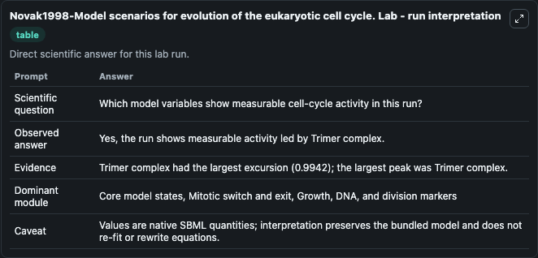
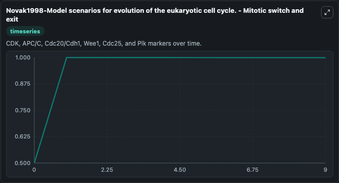
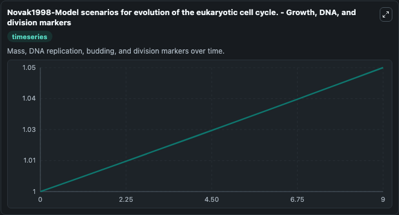
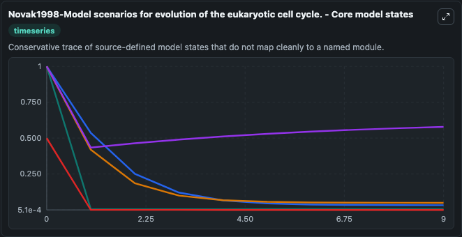
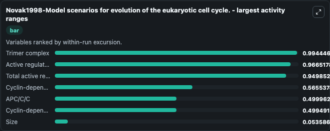
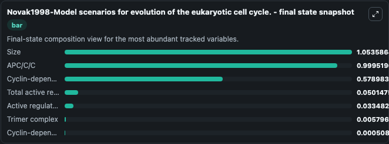
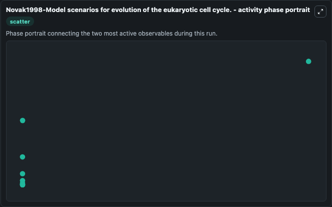

# Novak1998-Model scenarios for evolution of the eukaryotic cell cycle. Lab

Single-model lab wrapper for Novak1998-Model scenarios for evolution of the eukaryotic cell cycle.. Progress through the division cycle of present day eukaryotic cells is controlled by a complex network consisting of (i) cyclin-dependent kinases (CDKs) and their associated cyclins, (ii) kinases and. It can be used to explore cell-cycle regulation dynamics and compare checkpoint behavior across conditions.

This lab is a single-model Biosimulant wrapper for a cell-cycle simulation. The captured run uses the lab defaults and renders the model outputs as dark-mode visualizations for quick inspection and README embedding.

## Model Context

Progress through the division cycle of present day eukaryotic cells is controlled by a complex network consisting of (i) cyclin-dependent kinases (CDKs) and their associated cyclins, (ii) kinases and. It can be used to explore cell-cycle regulation dynamics and compare checkpoint behavior across conditions.

- Core model: Novak1998-Model scenarios for evolution of the eukaryotic cell cycle.
- Runtime used by the lab: duration 10, step 1
- Controllable inputs: none declared
- Primary outputs: Cyclin-dependent kinase activity, APC/C/C, Size, Total active regulatory state, Active regulatory state, Cyclin-dependent kinase inhibitor, Trimer complex
- Tags: cellcycle, sbml, biomodels_ebi, faithful

## Output Visualizations

The images below were generated from a Biosimulant lab run in dark mode. Each capture corresponds to one rendered visualization from the run output panel.

<!-- BIOSIMULANT_VISUALS_START -->

### 1. Novak1998 Model Scenarios For Evolution Of The Eukaryotic Cell Cycle Lab Run Int

Novak1998 Model Scenarios For Evolution Of The Eukaryotic Cell Cycle Lab Run Int visualization captured from the dark-mode Biosimulant run for Novak1998-Model scenarios for evolution of the eukaryotic cell cycle. Lab.

### 2. Novak1998 Model Scenarios For Evolution Of The Eukaryotic Cell Cycle Mitotic Swi

Mitotic switch and exit view, capturing late-cycle regulators and the transition out of mitosis.

### 3. Novak1998 Model Scenarios For Evolution Of The Eukaryotic Cell Cycle Growth Dna 

Growth, DNA, and division markers, linking mass accumulation and replication signals to cell-cycle state changes.

### 4. Novak1998 Model Scenarios For Evolution Of The Eukaryotic Cell Cycle Core Model 

Novak1998 Model Scenarios For Evolution Of The Eukaryotic Cell Cycle Core Model  visualization captured from the dark-mode Biosimulant run for Novak1998-Model scenarios for evolution of the eukaryotic cell cycle. Lab.

### 5. Novak1998 Model Scenarios For Evolution Of The Eukaryotic Cell Cycle Largest Act

Largest activity ranges chart, ranking the variables with the widest simulated movement so the dominant responses are easy to spot.

### 6. Novak1998 Model Scenarios For Evolution Of The Eukaryotic Cell Cycle Final State

Final state snapshot, comparing the end-of-run values for the selected cell-cycle variables.

### 7. Novak1998 Model Scenarios For Evolution Of The Eukaryotic Cell Cycle Activity Ph

Novak1998 Model Scenarios For Evolution Of The Eukaryotic Cell Cycle Activity Ph visualization captured from the dark-mode Biosimulant run for Novak1998-Model scenarios for evolution of the eukaryotic cell cycle. Lab.

<!-- BIOSIMULANT_VISUALS_END -->

## How to Read This Run

Use the time-course plots to see transient and steady-state behavior, the range or snapshot charts to identify the variables with the strongest response, and any phase-portrait view to inspect coupled regulator movement through the simulated trajectory. For this cell-cycle lab, the most useful comparison is usually between checkpoint, commitment, and mitotic-exit variables because those signals define where the simulated system sits in the cycle.

## Inputs

| Input | Context |
| --- | --- |
| - | No entries declared in `lab.yaml`. |

## Outputs

| Output | Context |
| --- | --- |
| Cyclin-dependent kinase activity | Tracks Cyclin-dependent kinase activity in the lab model via `cellcycle_sbml_novak1998_model_scenarios_for_evolution_of_the_e_model2005040001_model.cyclin_dependent_kinase_activity`. |
| APC/C/C | Tracks APC/C/C in the lab model via `cellcycle_sbml_novak1998_model_scenarios_for_evolution_of_the_e_model2005040001_model.apc_c_c`. |
| Size | Tracks Size in the lab model via `cellcycle_sbml_novak1998_model_scenarios_for_evolution_of_the_e_model2005040001_model.size`. |
| Total active regulatory state | Tracks Total active regulatory state in the lab model via `cellcycle_sbml_novak1998_model_scenarios_for_evolution_of_the_e_model2005040001_model.total_active_regulatory_state`. |
| Active regulatory state | Tracks Active regulatory state in the lab model via `cellcycle_sbml_novak1998_model_scenarios_for_evolution_of_the_e_model2005040001_model.active_regulatory_state`. |
| Cyclin-dependent kinase inhibitor | Tracks Cyclin-dependent kinase inhibitor in the lab model via `cellcycle_sbml_novak1998_model_scenarios_for_evolution_of_the_e_model2005040001_model.cyclin_dependent_kinase_inhibitor`. |
| Trimer complex | Tracks Trimer complex in the lab model via `cellcycle_sbml_novak1998_model_scenarios_for_evolution_of_the_e_model2005040001_model.trimer_complex`. |

## Lab Files

- `lab.yaml` defines the Biosimulant lab wrapper, exposed inputs, outputs, and runtime settings.
- `wiring-layout.json` stores the canvas layout used by the lab UI.
- `models/core/model.yaml` contains the wrapped simulation model metadata.
- `models/core/README.md` contains the source model notes and provenance.
- `models/visualisation/model.yaml` defines the visualization model used to render the run outputs.
- `assets/` contains the generated dark-mode visualization captures embedded above.
