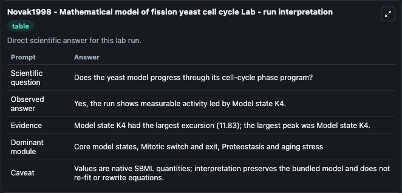
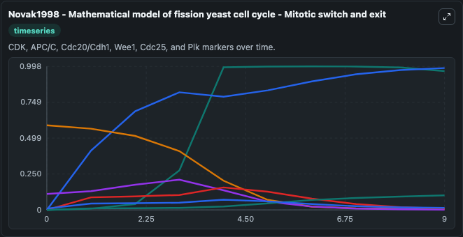
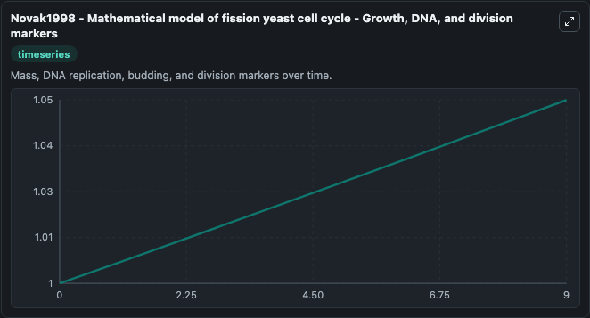
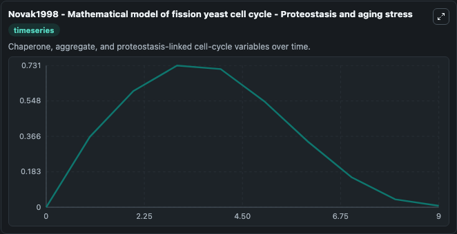
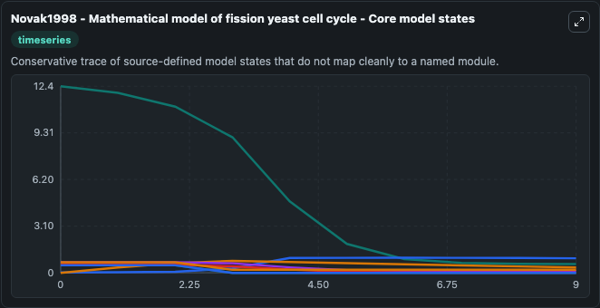
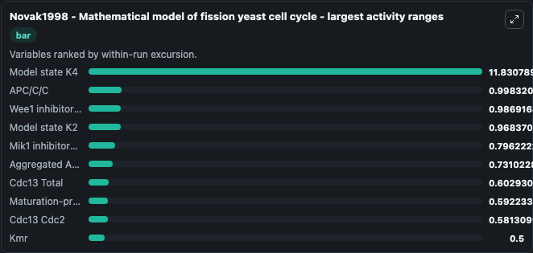
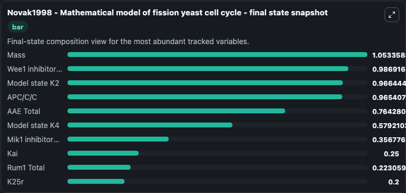
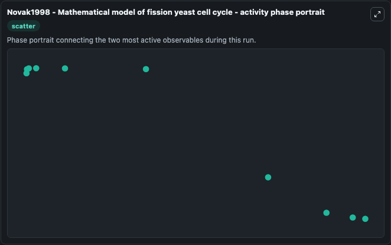

# Novak1998 - Mathematical model of fission yeast cell cycle Lab

Single-model lab wrapper for Novak1998 - Mathematical model of fission yeast cell cycle. Mathematical model of the fission yeast cell cycle with checkpointcontrols at the G1/S, G2/M and metaphase/anaphase transitions. Model encoded by Matthieu Maire and submitted to BioModels by Krishna k.

This lab is a single-model Biosimulant wrapper for a cell-cycle simulation. The captured run uses the lab defaults and renders the model outputs as dark-mode visualizations for quick inspection and README embedding.

## Model Context

Mathematical model of the fission yeast cell cycle with checkpointcontrols at the G1/S, G2/M and metaphase/anaphase transitions. Model encoded by Matthieu Maire and submitted to BioModels by Krishna k.

- Core model: Novak1998 - Mathematical model of fission yeast cell cycle
- Runtime used by the lab: duration 10, step 1
- Controllable inputs: none declared
- Primary outputs: Aggregated APC/C enzyme state, Cdc13 Cdc2, Mik1 inhibitory kinase, AAE Total, Wee1 inhibitory kinase, Rum1 CDK inhibitor, Mass, Cdc13 P Cdc2, Rum1 Cdc13 Cdc2, APC/C/C, and 14 more
- Tags: cellcycle, sbml, biomodels_ebi, faithful

## Output Visualizations

The images below were generated from a Biosimulant lab run in dark mode. Each capture corresponds to one rendered visualization from the run output panel.

<!-- BIOSIMULANT_VISUALS_START -->

### 1. Novak1998 Mathematical Model Of Fission Yeast Cell Cycle Lab Run Interpretation

Run interpretation view that anchors the captured simulation: it summarizes the lab purpose, runtime, and how to read the generated cell-cycle outputs.

### 2. Novak1998 Mathematical Model Of Fission Yeast Cell Cycle Mitotic Switch And Exit

Mitotic switch and exit view, capturing late-cycle regulators and the transition out of mitosis.

### 3. Novak1998 Mathematical Model Of Fission Yeast Cell Cycle Growth Dna And Division

Growth, DNA, and division markers, linking mass accumulation and replication signals to cell-cycle state changes.

### 4. Novak1998 Mathematical Model Of Fission Yeast Cell Cycle Proteostasis And Aging 

Novak1998 Mathematical Model Of Fission Yeast Cell Cycle Proteostasis And Aging  visualization captured from the dark-mode Biosimulant run for Novak1998 - Mathematical model of fission yeast cell cycle Lab.

### 5. Novak1998 Mathematical Model Of Fission Yeast Cell Cycle Core Model States

Core model state trajectories for Aggregated APC/C enzyme state, Cdc13 Cdc2, Mik1 inhibitory kinase, AAE Total, Wee1 inhibitory kinase, Rum1 CDK inhibitor, and 18 additional outputs, using the lab default initial conditions and runtime.

### 6. Novak1998 Mathematical Model Of Fission Yeast Cell Cycle Largest Activity Ranges

Largest activity ranges chart, ranking the variables with the widest simulated movement so the dominant responses are easy to spot.

### 7. Novak1998 Mathematical Model Of Fission Yeast Cell Cycle Final State Snapshot

Final state snapshot, comparing the end-of-run values for the selected cell-cycle variables.

### 8. Novak1998 Mathematical Model Of Fission Yeast Cell Cycle Activity Phase Portrait

Activity phase portrait, showing pairwise movement between selected variables across the simulated trajectory.

<!-- BIOSIMULANT_VISUALS_END -->

## How to Read This Run

Use the time-course plots to see transient and steady-state behavior, the range or snapshot charts to identify the variables with the strongest response, and any phase-portrait view to inspect coupled regulator movement through the simulated trajectory. For this cell-cycle lab, the most useful comparison is usually between checkpoint, commitment, and mitotic-exit variables because those signals define where the simulated system sits in the cycle.

## Inputs

| Input | Context |
| --- | --- |
| - | No entries declared in `lab.yaml`. |

## Outputs

| Output | Context |
| --- | --- |
| Aggregated APC/C enzyme state | Tracks Aggregated APC/C enzyme state in the lab model via `cellcycle_sbml_novak1998_mathematical_model_of_fission_yeast_ce_model2003190004_model.aggregated_apc_c_enzyme_state`. |
| Cdc13 Cdc2 | Tracks Cdc13 Cdc2 in the lab model via `cellcycle_sbml_novak1998_mathematical_model_of_fission_yeast_ce_model2003190004_model.cdc13_cdc2`. |
| Mik1 inhibitory kinase | Tracks Mik1 inhibitory kinase in the lab model via `cellcycle_sbml_novak1998_mathematical_model_of_fission_yeast_ce_model2003190004_model.mik1_inhibitory_kinase`. |
| AAE Total | Tracks AAE Total in the lab model via `cellcycle_sbml_novak1998_mathematical_model_of_fission_yeast_ce_model2003190004_model.aae_total`. |
| Wee1 inhibitory kinase | Tracks Wee1 inhibitory kinase in the lab model via `cellcycle_sbml_novak1998_mathematical_model_of_fission_yeast_ce_model2003190004_model.wee1_inhibitory_kinase`. |
| Rum1 CDK inhibitor | Tracks Rum1 CDK inhibitor in the lab model via `cellcycle_sbml_novak1998_mathematical_model_of_fission_yeast_ce_model2003190004_model.rum1_cdk_inhibitor`. |
| Mass | Tracks Mass in the lab model via `cellcycle_sbml_novak1998_mathematical_model_of_fission_yeast_ce_model2003190004_model.mass`. |
| Cdc13 P Cdc2 | Tracks Cdc13 P Cdc2 in the lab model via `cellcycle_sbml_novak1998_mathematical_model_of_fission_yeast_ce_model2003190004_model.cdc13_p_cdc2`. |
| Rum1 Cdc13 Cdc2 | Tracks Rum1 Cdc13 Cdc2 in the lab model via `cellcycle_sbml_novak1998_mathematical_model_of_fission_yeast_ce_model2003190004_model.rum1_cdc13_cdc2`. |
| APC/C/C | Tracks APC/C/C in the lab model via `cellcycle_sbml_novak1998_mathematical_model_of_fission_yeast_ce_model2003190004_model.apc_c_c`. |
| Phosphorylated Cdc25 | Tracks Phosphorylated Cdc25 in the lab model via `cellcycle_sbml_novak1998_mathematical_model_of_fission_yeast_ce_model2003190004_model.phosphorylated_cdc25`. |
| Cdc13 Total | Tracks Cdc13 Total in the lab model via `cellcycle_sbml_novak1998_mathematical_model_of_fission_yeast_ce_model2003190004_model.cdc13_total`. |
| Maturation-promoting factor | Tracks Maturation-promoting factor in the lab model via `cellcycle_sbml_novak1998_mathematical_model_of_fission_yeast_ce_model2003190004_model.maturation_promoting_factor`. |
| Rum1 Total | Tracks Rum1 Total in the lab model via `cellcycle_sbml_novak1998_mathematical_model_of_fission_yeast_ce_model2003190004_model.rum1_total`. |
| Model state K2 | Tracks Model state K2 in the lab model via `cellcycle_sbml_novak1998_mathematical_model_of_fission_yeast_ce_model2003190004_model.model_state_k2`. |
| K25r | Tracks K25r in the lab model via `cellcycle_sbml_novak1998_mathematical_model_of_fission_yeast_ce_model2003190004_model.k25r`. |
| K2c | Tracks K2c in the lab model via `cellcycle_sbml_novak1998_mathematical_model_of_fission_yeast_ce_model2003190004_model.k2c`. |
| Model state K4 | Tracks Model state K4 in the lab model via `cellcycle_sbml_novak1998_mathematical_model_of_fission_yeast_ce_model2003190004_model.model_state_k4`. |
| Kai | Tracks Kai in the lab model via `cellcycle_sbml_novak1998_mathematical_model_of_fission_yeast_ce_model2003190004_model.kai`. |
| Kcdc25 | Tracks Kcdc25 in the lab model via `cellcycle_sbml_novak1998_mathematical_model_of_fission_yeast_ce_model2003190004_model.kcdc25`. |
| Kmr | Tracks Kmr in the lab model via `cellcycle_sbml_novak1998_mathematical_model_of_fission_yeast_ce_model2003190004_model.kmr`. |
| Model state Ks | Tracks Model state Ks in the lab model via `cellcycle_sbml_novak1998_mathematical_model_of_fission_yeast_ce_model2003190004_model.model_state_ks`. |
| Kwee | Tracks Kwee in the lab model via `cellcycle_sbml_novak1998_mathematical_model_of_fission_yeast_ce_model2003190004_model.kwee`. |
| Kwr | Tracks Kwr in the lab model via `cellcycle_sbml_novak1998_mathematical_model_of_fission_yeast_ce_model2003190004_model.kwr`. |

## Lab Files

- `lab.yaml` defines the Biosimulant lab wrapper, exposed inputs, outputs, and runtime settings.
- `wiring-layout.json` stores the canvas layout used by the lab UI.
- `models/core/model.yaml` contains the wrapped simulation model metadata.
- `models/core/README.md` contains the source model notes and provenance.
- `models/visualisation/model.yaml` defines the visualization model used to render the run outputs.
- `assets/` contains the generated dark-mode visualization captures embedded above.
