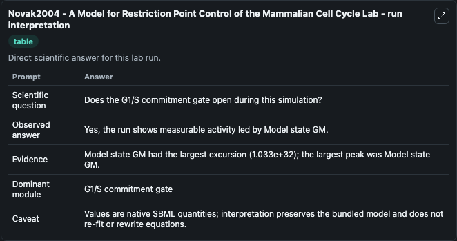
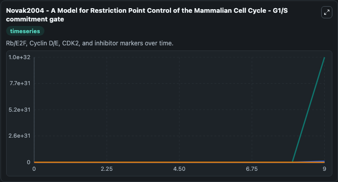
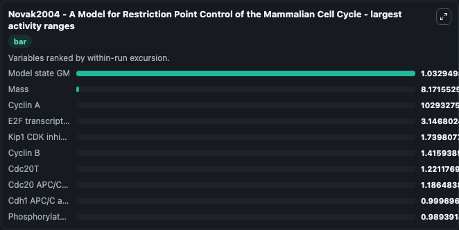
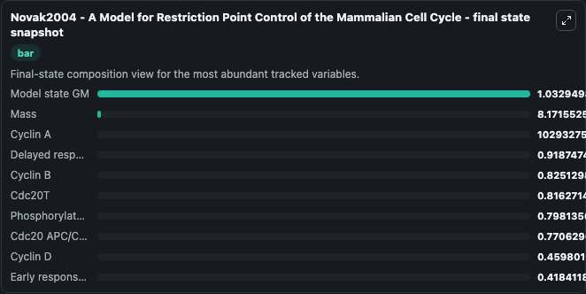
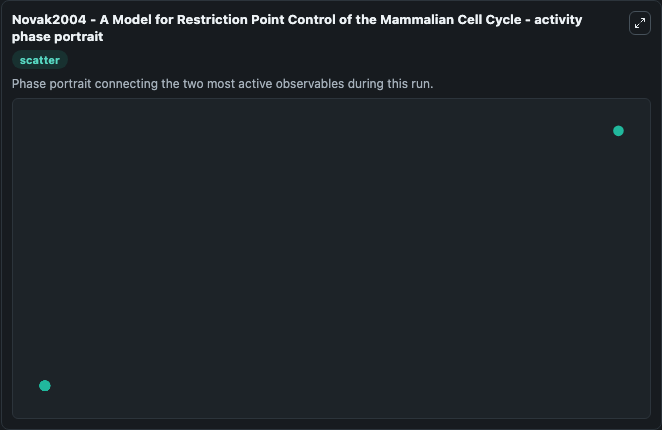

# Novak2004 - A Model for Restriction Point Control of the Mammalian Cell Cycle Lab

Single-model lab wrapper for Novak2004 - A Model for Restriction Point Control of the Mammalian Cell Cycle. &lt;notes xmlns='http://www.sbml.org/sbml/level2/version4'&gt; &lt;body xmlns='http://www.w3.org/1999/xhtml'&gt; &lt;pre&gt;Inhibition of protein synthesis by cycloheximide blocks subsequent division. It can be used to explore cell-cycle regulation dynamics and compare checkpoint behavior across conditions.

This lab is a single-model Biosimulant wrapper for a cell-cycle simulation. The captured run uses the lab defaults and renders the model outputs as dark-mode visualizations for quick inspection and README embedding.

## Model Context

&lt;notes xmlns='http://www.sbml.org/sbml/level2/version4'&gt; &lt;body xmlns='http://www.w3.org/1999/xhtml'&gt; &lt;pre&gt;Inhibition of protein synthesis by cycloheximide blocks subsequent division. It can be used to explore cell-cycle regulation dynamics and compare checkpoint behavior across conditions.

- Core model: Novak2004 - A Model for Restriction Point Control of the Mammalian Cell Cycle
- Runtime used by the lab: duration 10, step 1
- Controllable inputs: E2FT, PP1T, Rb T, Cyclin ET, PP1A, Rb Hypo
- Primary outputs: Early response gene module, Delayed response gene module, Cyclin D, Cyclin D:Kip1, Cyclin E, Cyclin E:Kip1, Cyclin A, Cyclin A:Kip1, Kip1 CDK inhibitor, E2F transcription factor, and 8 more
- Tags: cellcycle, sbml, biomodels_ebi, faithful

## Output Visualizations

The images below were generated from a Biosimulant lab run in dark mode. Each capture corresponds to one rendered visualization from the run output panel.

<!-- BIOSIMULANT_VISUALS_START -->

### 1. Novak2004 A Model For Restriction Point Control Of The Mammalian Cell Cycle Lab 

G1/S commitment view, focused on the regulatory variables that gate entry into DNA synthesis and cell-cycle progression.

### 2. Novak2004 A Model For Restriction Point Control Of The Mammalian Cell Cycle G1 S

G1/S commitment view, focused on the regulatory variables that gate entry into DNA synthesis and cell-cycle progression.

### 3. Novak2004 A Model For Restriction Point Control Of The Mammalian Cell Cycle Larg

G1/S commitment view, focused on the regulatory variables that gate entry into DNA synthesis and cell-cycle progression.

### 4. Novak2004 A Model For Restriction Point Control Of The Mammalian Cell Cycle Fina

G1/S commitment view, focused on the regulatory variables that gate entry into DNA synthesis and cell-cycle progression.

### 5. Novak2004 A Model For Restriction Point Control Of The Mammalian Cell Cycle Acti

G1/S commitment view, focused on the regulatory variables that gate entry into DNA synthesis and cell-cycle progression.

<!-- BIOSIMULANT_VISUALS_END -->

## How to Read This Run

Use the time-course plots to see transient and steady-state behavior, the range or snapshot charts to identify the variables with the strongest response, and any phase-portrait view to inspect coupled regulator movement through the simulated trajectory. For this cell-cycle lab, the most useful comparison is usually between checkpoint, commitment, and mitotic-exit variables because those signals define where the simulated system sits in the cycle.

## Inputs

| Input | Context |
| --- | --- |
| E2FT | Controls E2FT in the lab model via `cellcycle_sbml_novak2004_a_model_for_restriction_point_control_model2006080001_model.e2ft`. |
| PP1T | Controls PP1T in the lab model via `cellcycle_sbml_novak2004_a_model_for_restriction_point_control_model2006080001_model.pp1t`. |
| Rb T | Controls Rb T in the lab model via `cellcycle_sbml_novak2004_a_model_for_restriction_point_control_model2006080001_model.rb_t`. |
| Cyclin ET | Controls Cyclin ET in the lab model via `cellcycle_sbml_novak2004_a_model_for_restriction_point_control_model2006080001_model.cyclin_et`. |
| PP1A | Controls PP1A in the lab model via `cellcycle_sbml_novak2004_a_model_for_restriction_point_control_model2006080001_model.pp1a`. |
| Rb Hypo | Controls Rb Hypo in the lab model via `cellcycle_sbml_novak2004_a_model_for_restriction_point_control_model2006080001_model.rb_hypo`. |

## Outputs

| Output | Context |
| --- | --- |
| Early response gene module | Tracks Early response gene module in the lab model via `cellcycle_sbml_novak2004_a_model_for_restriction_point_control_model2006080001_model.early_response_gene_module`. |
| Delayed response gene module | Tracks Delayed response gene module in the lab model via `cellcycle_sbml_novak2004_a_model_for_restriction_point_control_model2006080001_model.delayed_response_gene_module`. |
| Cyclin D | Tracks Cyclin D in the lab model via `cellcycle_sbml_novak2004_a_model_for_restriction_point_control_model2006080001_model.cyclin_d`. |
| Cyclin D:Kip1 | Tracks Cyclin D:Kip1 in the lab model via `cellcycle_sbml_novak2004_a_model_for_restriction_point_control_model2006080001_model.cyclin_d_kip1`. |
| Cyclin E | Tracks Cyclin E in the lab model via `cellcycle_sbml_novak2004_a_model_for_restriction_point_control_model2006080001_model.cyclin_e`. |
| Cyclin E:Kip1 | Tracks Cyclin E:Kip1 in the lab model via `cellcycle_sbml_novak2004_a_model_for_restriction_point_control_model2006080001_model.cyclin_e_kip1`. |
| Cyclin A | Tracks Cyclin A in the lab model via `cellcycle_sbml_novak2004_a_model_for_restriction_point_control_model2006080001_model.cyclin_a`. |
| Cyclin A:Kip1 | Tracks Cyclin A:Kip1 in the lab model via `cellcycle_sbml_novak2004_a_model_for_restriction_point_control_model2006080001_model.cyclin_a_kip1`. |
| Kip1 CDK inhibitor | Tracks Kip1 CDK inhibitor in the lab model via `cellcycle_sbml_novak2004_a_model_for_restriction_point_control_model2006080001_model.kip1_cdk_inhibitor`. |
| E2F transcription factor | Tracks E2F transcription factor in the lab model via `cellcycle_sbml_novak2004_a_model_for_restriction_point_control_model2006080001_model.e2f_transcription_factor`. |
| Cyclin B | Tracks Cyclin B in the lab model via `cellcycle_sbml_novak2004_a_model_for_restriction_point_control_model2006080001_model.cyclin_b`. |
| Cdh1 APC/C activator | Tracks Cdh1 APC/C activator in the lab model via `cellcycle_sbml_novak2004_a_model_for_restriction_point_control_model2006080001_model.cdh1_apc_c_activator`. |
| Cdc20T | Tracks Cdc20T in the lab model via `cellcycle_sbml_novak2004_a_model_for_restriction_point_control_model2006080001_model.cdc20t`. |
| Cdc20 APC/C activator | Tracks Cdc20 APC/C activator in the lab model via `cellcycle_sbml_novak2004_a_model_for_restriction_point_control_model2006080001_model.cdc20_apc_c_activator`. |
| PPX phosphatase | Tracks PPX phosphatase in the lab model via `cellcycle_sbml_novak2004_a_model_for_restriction_point_control_model2006080001_model.ppx_phosphatase`. |
| Phosphorylated IE | Tracks Phosphorylated IE in the lab model via `cellcycle_sbml_novak2004_a_model_for_restriction_point_control_model2006080001_model.phosphorylated_ie`. |
| Model state GM | Tracks Model state GM in the lab model via `cellcycle_sbml_novak2004_a_model_for_restriction_point_control_model2006080001_model.model_state_gm`. |
| Mass | Tracks Mass in the lab model via `cellcycle_sbml_novak2004_a_model_for_restriction_point_control_model2006080001_model.mass`. |

## Lab Files

- `lab.yaml` defines the Biosimulant lab wrapper, exposed inputs, outputs, and runtime settings.
- `wiring-layout.json` stores the canvas layout used by the lab UI.
- `models/core/model.yaml` contains the wrapped simulation model metadata.
- `models/core/README.md` contains the source model notes and provenance.
- `models/visualisation/model.yaml` defines the visualization model used to render the run outputs.
- `assets/` contains the generated dark-mode visualization captures embedded above.
