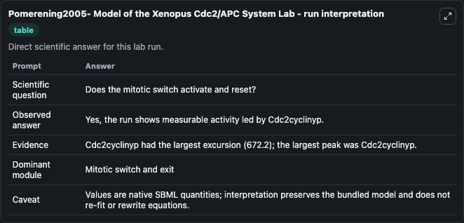
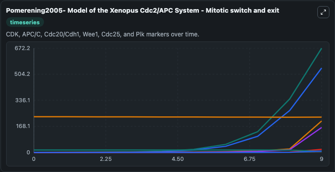
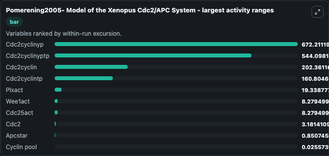
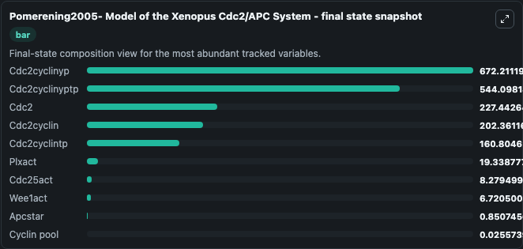
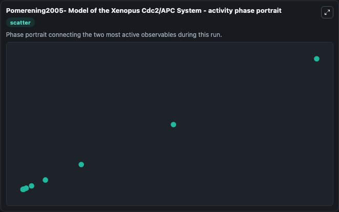

# Pomerening2005- Model of the Xenopus Cdc2/APC System Lab

Single-model lab wrapper for Pomerening2005- Model of the Xenopus Cdc2/APC System. The cell-cycle oscillator includes an essential negative-feedback loop: Cdc2 activates the anaphase-promoting complex (APC), which leads to cyclin destruction and Cdc2 inactivation. It can be used to explore cell-cycle regulation dynamics and compare checkpoint behavior across conditions.

This lab is a single-model Biosimulant wrapper for a cell-cycle simulation. The captured run uses the lab defaults and renders the model outputs as dark-mode visualizations for quick inspection and README embedding.

## Model Context

The cell-cycle oscillator includes an essential negative-feedback loop: Cdc2 activates the anaphase-promoting complex (APC), which leads to cyclin destruction and Cdc2 inactivation. It can be used to explore cell-cycle regulation dynamics and compare checkpoint behavior across conditions.

- Core model: Pomerening2005- Model of the Xenopus Cdc2/APC System
- Runtime used by the lab: duration 10, step 1
- Controllable inputs: none declared
- Primary outputs: Cyclin pool, Cdc2cyclin, Cdc2cyclinyp, Cdc2cyclinyptp, Cdc2cyclintp, Cdc2, Cdc2afcyclin, Cdc2afcyclintp, Cdc2af, Cdc25act, and 3 more
- Tags: cellcycle, sbml, biomodels_ebi, faithful

## Output Visualizations

The images below were generated from a Biosimulant lab run in dark mode. Each capture corresponds to one rendered visualization from the run output panel.

<!-- BIOSIMULANT_VISUALS_START -->

### 1. Pomerening2005 Model Of The Xenopus Cdc2 Apc System Lab Run Interpretation

Run interpretation view that anchors the captured simulation: it summarizes the lab purpose, runtime, and how to read the generated cell-cycle outputs.

### 2. Pomerening2005 Model Of The Xenopus Cdc2 Apc System Mitotic Switch And Exit

Mitotic switch and exit view, capturing late-cycle regulators and the transition out of mitosis.

### 3. Pomerening2005 Model Of The Xenopus Cdc2 Apc System Largest Activity Ranges

Largest activity ranges chart, ranking the variables with the widest simulated movement so the dominant responses are easy to spot.

### 4. Pomerening2005 Model Of The Xenopus Cdc2 Apc System Final State Snapshot

Final state snapshot, comparing the end-of-run values for the selected cell-cycle variables.

### 5. Pomerening2005 Model Of The Xenopus Cdc2 Apc System Activity Phase Portrait

Activity phase portrait, showing pairwise movement between selected variables across the simulated trajectory.

<!-- BIOSIMULANT_VISUALS_END -->

## How to Read This Run

Use the time-course plots to see transient and steady-state behavior, the range or snapshot charts to identify the variables with the strongest response, and any phase-portrait view to inspect coupled regulator movement through the simulated trajectory. For this cell-cycle lab, the most useful comparison is usually between checkpoint, commitment, and mitotic-exit variables because those signals define where the simulated system sits in the cycle.

## Inputs

| Input | Context |
| --- | --- |
| - | No entries declared in `lab.yaml`. |

## Outputs

| Output | Context |
| --- | --- |
| Cyclin pool | Tracks Cyclin pool in the lab model via `cellcycle_sbml_pomerening2005_model_of_the_xenopus_cdc2_apc_sys_model2005150001_model.cyclin_pool`. |
| Cdc2cyclin | Tracks Cdc2cyclin in the lab model via `cellcycle_sbml_pomerening2005_model_of_the_xenopus_cdc2_apc_sys_model2005150001_model.cdc2cyclin`. |
| Cdc2cyclinyp | Tracks Cdc2cyclinyp in the lab model via `cellcycle_sbml_pomerening2005_model_of_the_xenopus_cdc2_apc_sys_model2005150001_model.cdc2cyclinyp`. |
| Cdc2cyclinyptp | Tracks Cdc2cyclinyptp in the lab model via `cellcycle_sbml_pomerening2005_model_of_the_xenopus_cdc2_apc_sys_model2005150001_model.cdc2cyclinyptp`. |
| Cdc2cyclintp | Tracks Cdc2cyclintp in the lab model via `cellcycle_sbml_pomerening2005_model_of_the_xenopus_cdc2_apc_sys_model2005150001_model.cdc2cyclintp`. |
| Cdc2 | Tracks Cdc2 in the lab model via `cellcycle_sbml_pomerening2005_model_of_the_xenopus_cdc2_apc_sys_model2005150001_model.cdc2`. |
| Cdc2afcyclin | Tracks Cdc2afcyclin in the lab model via `cellcycle_sbml_pomerening2005_model_of_the_xenopus_cdc2_apc_sys_model2005150001_model.cdc2afcyclin`. |
| Cdc2afcyclintp | Tracks Cdc2afcyclintp in the lab model via `cellcycle_sbml_pomerening2005_model_of_the_xenopus_cdc2_apc_sys_model2005150001_model.cdc2afcyclintp`. |
| Cdc2af | Tracks Cdc2af in the lab model via `cellcycle_sbml_pomerening2005_model_of_the_xenopus_cdc2_apc_sys_model2005150001_model.cdc2af`. |
| Cdc25act | Tracks Cdc25act in the lab model via `cellcycle_sbml_pomerening2005_model_of_the_xenopus_cdc2_apc_sys_model2005150001_model.cdc25act`. |
| Wee1act | Tracks Wee1act in the lab model via `cellcycle_sbml_pomerening2005_model_of_the_xenopus_cdc2_apc_sys_model2005150001_model.wee1act`. |
| Plxact | Tracks Plxact in the lab model via `cellcycle_sbml_pomerening2005_model_of_the_xenopus_cdc2_apc_sys_model2005150001_model.plxact`. |
| Apcstar | Tracks Apcstar in the lab model via `cellcycle_sbml_pomerening2005_model_of_the_xenopus_cdc2_apc_sys_model2005150001_model.apcstar`. |

## Lab Files

- `lab.yaml` defines the Biosimulant lab wrapper, exposed inputs, outputs, and runtime settings.
- `wiring-layout.json` stores the canvas layout used by the lab UI.
- `models/core/model.yaml` contains the wrapped simulation model metadata.
- `models/core/README.md` contains the source model notes and provenance.
- `models/visualisation/model.yaml` defines the visualization model used to render the run outputs.
- `assets/` contains the generated dark-mode visualization captures embedded above.
