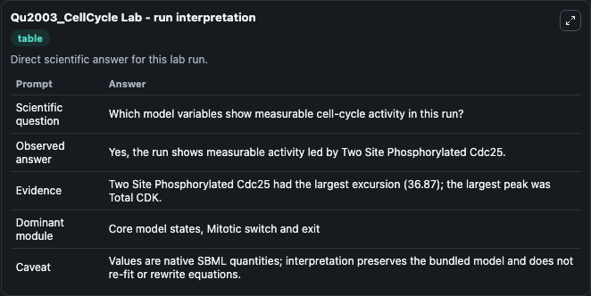
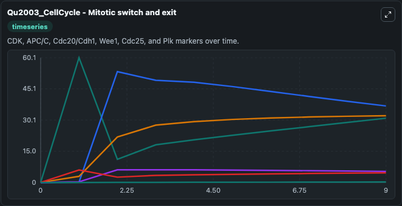
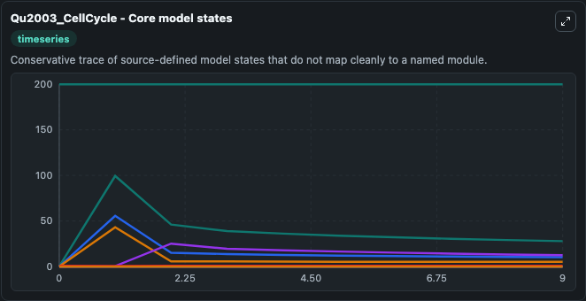
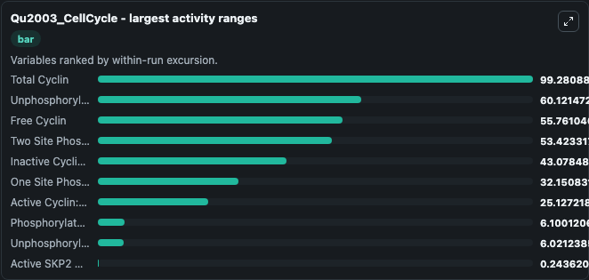
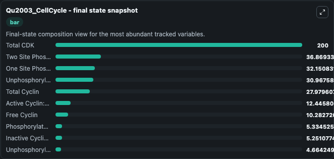
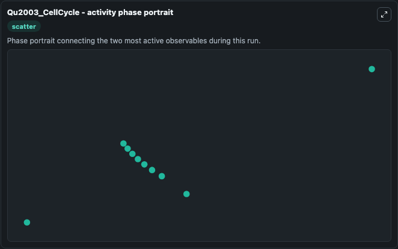

# Qu2003_CellCycle Lab

Single-model lab wrapper for Qu2003_CellCycle. This model is from the article: Dynamics of the cell cycle: checkpoints, sizers, and timers. It can be used to explore cell-cycle regulation dynamics and compare checkpoint behavior across conditions.

This lab is a single-model Biosimulant wrapper for a cell-cycle simulation. The captured run uses the lab defaults and renders the model outputs as dark-mode visualizations for quick inspection and README embedding.

## Model Context

This model is from the article: Dynamics of the cell cycle: checkpoints, sizers, and timers. It can be used to explore cell-cycle regulation dynamics and compare checkpoint behavior across conditions.

- Core model: Qu2003_CellCycle
- Runtime used by the lab: duration 10, step 1
- Controllable inputs: none declared
- Primary outputs: Inactive Cyclin:CDK Complex, Active Cyclin:CDK Complex, Total CDK, Unphosphorylated Cdc25, One Site Phosphorylated Cdc25, Two Site Phosphorylated Cdc25, Unphosphorylated Wee1, Phosphorylated Wee1, Active SKP2 Or APC/C/C, Free CKI, and 5 more
- Tags: cellcycle, sbml, biomodels_ebi, faithful

## Output Visualizations

The images below were generated from a Biosimulant lab run in dark mode. Each capture corresponds to one rendered visualization from the run output panel.

<!-- BIOSIMULANT_VISUALS_START -->

### 1. Qu2003 Cellcycle Lab Run Interpretation

Run interpretation view that anchors the captured simulation: it summarizes the lab purpose, runtime, and how to read the generated cell-cycle outputs.

### 2. Qu2003 Cellcycle Mitotic Switch And Exit

Mitotic switch and exit view, capturing late-cycle regulators and the transition out of mitosis.

### 3. Qu2003 Cellcycle Core Model States

Core model state trajectories for Inactive Cyclin:CDK Complex, Active Cyclin:CDK Complex, Total CDK, Unphosphorylated Cdc25, One Site Phosphorylated Cdc25, Two Site Phosphorylated Cdc25, and 9 additional outputs, using the lab default initial conditions and runtime.

### 4. Qu2003 Cellcycle Largest Activity Ranges

Largest activity ranges chart, ranking the variables with the widest simulated movement so the dominant responses are easy to spot.

### 5. Qu2003 Cellcycle Final State Snapshot

Final state snapshot, comparing the end-of-run values for the selected cell-cycle variables.

### 6. Qu2003 Cellcycle Activity Phase Portrait

Activity phase portrait, showing pairwise movement between selected variables across the simulated trajectory.

<!-- BIOSIMULANT_VISUALS_END -->

## How to Read This Run

Use the time-course plots to see transient and steady-state behavior, the range or snapshot charts to identify the variables with the strongest response, and any phase-portrait view to inspect coupled regulator movement through the simulated trajectory. For this cell-cycle lab, the most useful comparison is usually between checkpoint, commitment, and mitotic-exit variables because those signals define where the simulated system sits in the cycle.

## Inputs

| Input | Context |
| --- | --- |
| - | No entries declared in `lab.yaml`. |

## Outputs

| Output | Context |
| --- | --- |
| Inactive Cyclin:CDK Complex | Tracks Inactive Cyclin:CDK Complex in the lab model via `cellcycle_sbml_qu2003_cellcycle_biomd0000000110_model.inactive_cyclin_cdk_complex`. |
| Active Cyclin:CDK Complex | Tracks Active Cyclin:CDK Complex in the lab model via `cellcycle_sbml_qu2003_cellcycle_biomd0000000110_model.active_cyclin_cdk_complex`. |
| Total CDK | Tracks Total CDK in the lab model via `cellcycle_sbml_qu2003_cellcycle_biomd0000000110_model.total_cdk`. |
| Unphosphorylated Cdc25 | Tracks Unphosphorylated Cdc25 in the lab model via `cellcycle_sbml_qu2003_cellcycle_biomd0000000110_model.unphosphorylated_cdc25`. |
| One Site Phosphorylated Cdc25 | Tracks One Site Phosphorylated Cdc25 in the lab model via `cellcycle_sbml_qu2003_cellcycle_biomd0000000110_model.one_site_phosphorylated_cdc25`. |
| Two Site Phosphorylated Cdc25 | Tracks Two Site Phosphorylated Cdc25 in the lab model via `cellcycle_sbml_qu2003_cellcycle_biomd0000000110_model.two_site_phosphorylated_cdc25`. |
| Unphosphorylated Wee1 | Tracks Unphosphorylated Wee1 in the lab model via `cellcycle_sbml_qu2003_cellcycle_biomd0000000110_model.unphosphorylated_wee1`. |
| Phosphorylated Wee1 | Tracks Phosphorylated Wee1 in the lab model via `cellcycle_sbml_qu2003_cellcycle_biomd0000000110_model.phosphorylated_wee1`. |
| Active SKP2 Or APC/C/C | Tracks Active SKP2 Or APC/C/C in the lab model via `cellcycle_sbml_qu2003_cellcycle_biomd0000000110_model.active_skp2_or_apc_c_c`. |
| Free CKI | Tracks Free CKI in the lab model via `cellcycle_sbml_qu2003_cellcycle_biomd0000000110_model.free_cki`. |
| Cyclin:CDK:CKI Complex With CKI Unphosphorylated | Tracks Cyclin:CDK:CKI Complex With CKI Unphosphorylated in the lab model via `cellcycle_sbml_qu2003_cellcycle_biomd0000000110_model.cyclin_cdk_cki_complex_with_cki_unphosphorylated`. |
| Cyclin:CDK:CKI Complex With CKI Phosphorylated | Tracks Cyclin:CDK:CKI Complex With CKI Phosphorylated in the lab model via `cellcycle_sbml_qu2003_cellcycle_biomd0000000110_model.cyclin_cdk_cki_complex_with_cki_phosphorylated`. |
| Free Cyclin | Tracks Free Cyclin in the lab model via `cellcycle_sbml_qu2003_cellcycle_biomd0000000110_model.free_cyclin`. |
| Free CDK | Tracks Free CDK in the lab model via `cellcycle_sbml_qu2003_cellcycle_biomd0000000110_model.free_cdk`. |
| Total Cyclin | Tracks Total Cyclin in the lab model via `cellcycle_sbml_qu2003_cellcycle_biomd0000000110_model.total_cyclin`. |

## Lab Files

- `lab.yaml` defines the Biosimulant lab wrapper, exposed inputs, outputs, and runtime settings.
- `wiring-layout.json` stores the canvas layout used by the lab UI.
- `models/core/model.yaml` contains the wrapped simulation model metadata.
- `models/core/README.md` contains the source model notes and provenance.
- `models/visualisation/model.yaml` defines the visualization model used to render the run outputs.
- `assets/` contains the generated dark-mode visualization captures embedded above.
