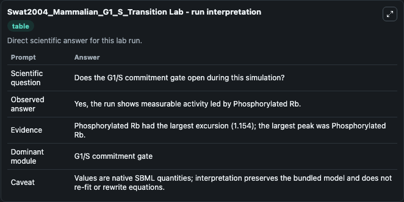
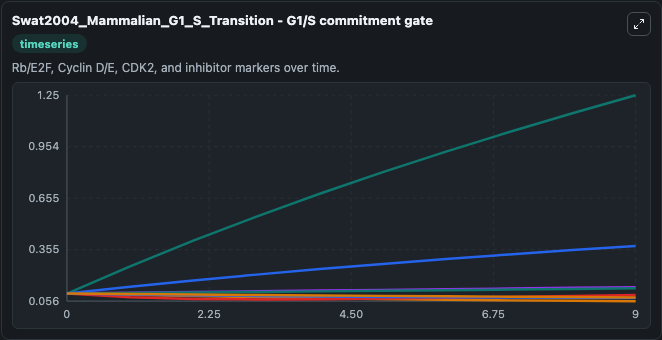
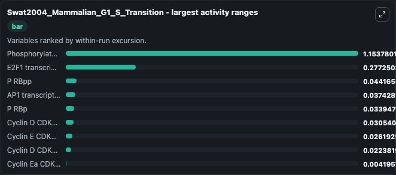
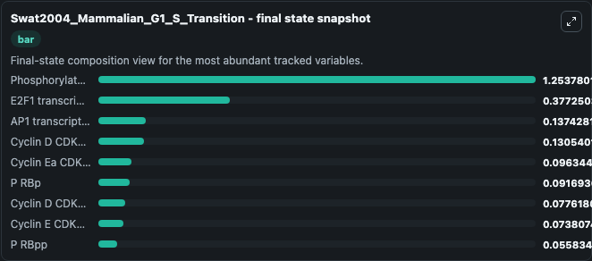
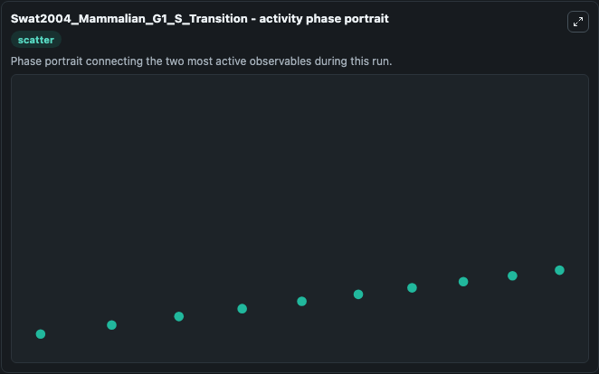

# Swat2004_Mammalian_G1_S_Transition Lab

Single-model lab wrapper for Swat2004_Mammalian_G1_S_Transition. This is the extended model described the article: Bifurcation analysis of the regulatory modules of the mammalian G1/S transition. It can be used to explore cell-cycle regulation dynamics and compare checkpoint behavior across conditions.

This lab is a single-model Biosimulant wrapper for a cell-cycle simulation. The captured run uses the lab defaults and renders the model outputs as dark-mode visualizations for quick inspection and README embedding.

## Model Context

This is the extended model described the article: Bifurcation analysis of the regulatory modules of the mammalian G1/S transition. It can be used to explore cell-cycle regulation dynamics and compare checkpoint behavior across conditions.

- Core model: Swat2004_Mammalian_G1_S_Transition
- Runtime used by the lab: duration 10, step 1
- Controllable inputs: none declared
- Primary outputs: Phosphorylated Rb, P RBp, E2F1 transcription factor, Cyclin D CDK4,6(i), Cyclin D CDK4,6(a), AP1 transcription factor, P RBpp, Cyclin E CDK2(i), Cyclin Ea CDK2(a)
- Tags: cellcycle, sbml, biomodels_ebi, faithful

## Output Visualizations

The images below were generated from a Biosimulant lab run in dark mode. Each capture corresponds to one rendered visualization from the run output panel.

<!-- BIOSIMULANT_VISUALS_START -->

### 1. Swat2004 Mammalian G1 S Transition Lab Run Interpretation

Run interpretation view that anchors the captured simulation: it summarizes the lab purpose, runtime, and how to read the generated cell-cycle outputs.

### 2. Swat2004 Mammalian G1 S Transition G1 S Commitment Gate

G1/S commitment view, focused on the regulatory variables that gate entry into DNA synthesis and cell-cycle progression.

### 3. Swat2004 Mammalian G1 S Transition Largest Activity Ranges

G1/S commitment view, focused on the regulatory variables that gate entry into DNA synthesis and cell-cycle progression.

### 4. Swat2004 Mammalian G1 S Transition Final State Snapshot

G1/S commitment view, focused on the regulatory variables that gate entry into DNA synthesis and cell-cycle progression.

### 5. Swat2004 Mammalian G1 S Transition Activity Phase Portrait

G1/S commitment view, focused on the regulatory variables that gate entry into DNA synthesis and cell-cycle progression.

<!-- BIOSIMULANT_VISUALS_END -->

## How to Read This Run

Use the time-course plots to see transient and steady-state behavior, the range or snapshot charts to identify the variables with the strongest response, and any phase-portrait view to inspect coupled regulator movement through the simulated trajectory. For this cell-cycle lab, the most useful comparison is usually between checkpoint, commitment, and mitotic-exit variables because those signals define where the simulated system sits in the cycle.

## Inputs

| Input | Context |
| --- | --- |
| - | No entries declared in `lab.yaml`. |

## Outputs

| Output | Context |
| --- | --- |
| Phosphorylated Rb | Tracks Phosphorylated Rb in the lab model via `cellcycle_sbml_swat2004_mammalian_g1_s_transition_biomd0000000228_model.phosphorylated_rb`. |
| P RBp | Tracks P RBp in the lab model via `cellcycle_sbml_swat2004_mammalian_g1_s_transition_biomd0000000228_model.p_rbp`. |
| E2F1 transcription factor | Tracks E2F1 transcription factor in the lab model via `cellcycle_sbml_swat2004_mammalian_g1_s_transition_biomd0000000228_model.e2f1_transcription_factor`. |
| Cyclin D CDK4,6(i) | Tracks Cyclin D CDK4,6(i) in the lab model via `cellcycle_sbml_swat2004_mammalian_g1_s_transition_biomd0000000228_model.cyclin_d_cdk4_6_i`. |
| Cyclin D CDK4,6(a) | Tracks Cyclin D CDK4,6(a) in the lab model via `cellcycle_sbml_swat2004_mammalian_g1_s_transition_biomd0000000228_model.cyclin_d_cdk4_6_a`. |
| AP1 transcription factor | Tracks AP1 transcription factor in the lab model via `cellcycle_sbml_swat2004_mammalian_g1_s_transition_biomd0000000228_model.ap1_transcription_factor`. |
| P RBpp | Tracks P RBpp in the lab model via `cellcycle_sbml_swat2004_mammalian_g1_s_transition_biomd0000000228_model.p_rbpp`. |
| Cyclin E CDK2(i) | Tracks Cyclin E CDK2(i) in the lab model via `cellcycle_sbml_swat2004_mammalian_g1_s_transition_biomd0000000228_model.cyclin_e_cdk2_i`. |
| Cyclin Ea CDK2(a) | Tracks Cyclin Ea CDK2(a) in the lab model via `cellcycle_sbml_swat2004_mammalian_g1_s_transition_biomd0000000228_model.cyclin_ea_cdk2_a`. |

## Lab Files

- `lab.yaml` defines the Biosimulant lab wrapper, exposed inputs, outputs, and runtime settings.
- `wiring-layout.json` stores the canvas layout used by the lab UI.
- `models/core/model.yaml` contains the wrapped simulation model metadata.
- `models/core/README.md` contains the source model notes and provenance.
- `models/visualisation/model.yaml` defines the visualization model used to render the run outputs.
- `assets/` contains the generated dark-mode visualization captures embedded above.
