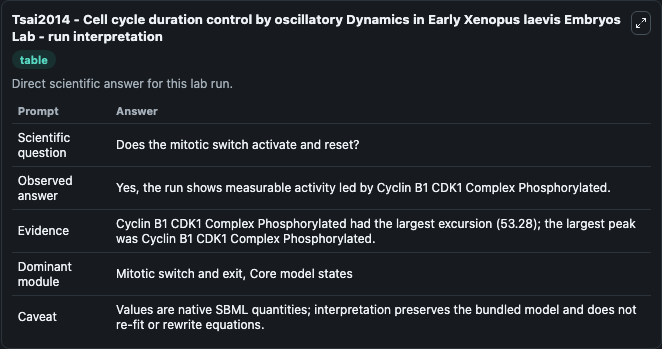
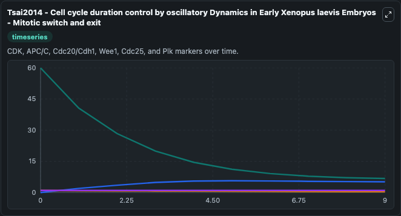
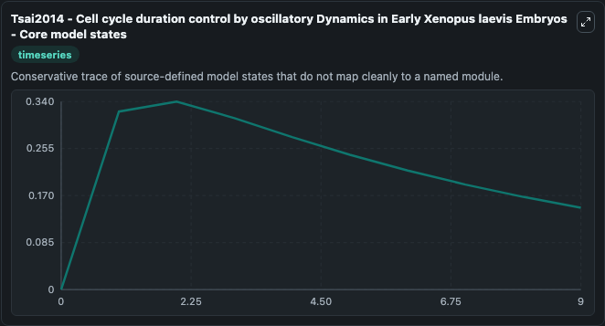
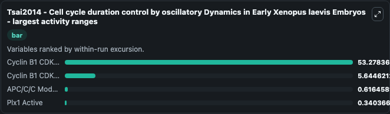
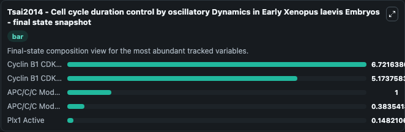
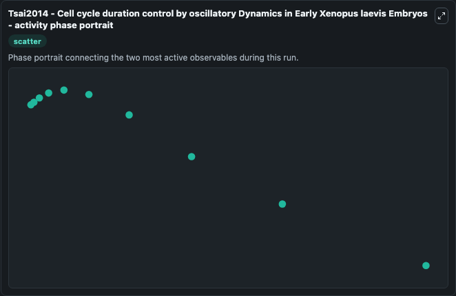

# Tsai2014 - Cell cycle duration control by oscillatory Dynamics in Early Xenopus laevis Embryos Lab

Single-model lab wrapper for Tsai2014 - Cell cycle duration control by oscillatory Dynamics in Early Xenopus laevis Embryos. During the early development of Xenopus laevis embryos, the first mitotic cell cycle is long (\u223c85 min) and the subsequent 11 cycles are short (\u223c30 min) and clock-like. It can be used to explore cell-cycle regulation dynamics and compare checkpoint behavior across conditions.

This lab is a single-model Biosimulant wrapper for a cell-cycle simulation. The captured run uses the lab defaults and renders the model outputs as dark-mode visualizations for quick inspection and README embedding.

## Model Context

During the early development of Xenopus laevis embryos, the first mitotic cell cycle is long (∼85 min) and the subsequent 11 cycles are short (∼30 min) and clock-like. It can be used to explore cell-cycle regulation dynamics and compare checkpoint behavior across conditions.

- Core model: Tsai2014 - Cell cycle duration control by oscillatory Dynamics in Early Xenopus laevis Embryos
- Runtime used by the lab: duration 10, step 1
- Controllable inputs: Plx1 Total, Cyclin B1 CDK1 Complex Total
- Primary outputs: Cyclin B1 CDK1 Complex Phosphorylated, Cyclin B1 CDK1 Complex Unphosphorylated, Plx1 Active, APC/C/C Model state C Active, APC/C/C Model state C Total
- Tags: cellcycle, sbml, biomodels_ebi, faithful

## Output Visualizations

The images below were generated from a Biosimulant lab run in dark mode. Each capture corresponds to one rendered visualization from the run output panel.

<!-- BIOSIMULANT_VISUALS_START -->

### 1. Tsai2014 Cell Cycle Duration Control By Oscillatory Dynamics In Early Xenopus La

Tsai2014 Cell Cycle Duration Control By Oscillatory Dynamics In Early Xenopus La visualization captured from the dark-mode Biosimulant run for Tsai2014 - Cell cycle duration control by oscillatory Dynamics in Early Xenopus laevis Embryos Lab.

### 2. Tsai2014 Cell Cycle Duration Control By Oscillatory Dynamics In Early Xenopus La

Tsai2014 Cell Cycle Duration Control By Oscillatory Dynamics In Early Xenopus La visualization captured from the dark-mode Biosimulant run for Tsai2014 - Cell cycle duration control by oscillatory Dynamics in Early Xenopus laevis Embryos Lab.

### 3. Tsai2014 Cell Cycle Duration Control By Oscillatory Dynamics In Early Xenopus La

Tsai2014 Cell Cycle Duration Control By Oscillatory Dynamics In Early Xenopus La visualization captured from the dark-mode Biosimulant run for Tsai2014 - Cell cycle duration control by oscillatory Dynamics in Early Xenopus laevis Embryos Lab.

### 4. Tsai2014 Cell Cycle Duration Control By Oscillatory Dynamics In Early Xenopus La

Tsai2014 Cell Cycle Duration Control By Oscillatory Dynamics In Early Xenopus La visualization captured from the dark-mode Biosimulant run for Tsai2014 - Cell cycle duration control by oscillatory Dynamics in Early Xenopus laevis Embryos Lab.

### 5. Tsai2014 Cell Cycle Duration Control By Oscillatory Dynamics In Early Xenopus La

Tsai2014 Cell Cycle Duration Control By Oscillatory Dynamics In Early Xenopus La visualization captured from the dark-mode Biosimulant run for Tsai2014 - Cell cycle duration control by oscillatory Dynamics in Early Xenopus laevis Embryos Lab.

### 6. Tsai2014 Cell Cycle Duration Control By Oscillatory Dynamics In Early Xenopus La

Tsai2014 Cell Cycle Duration Control By Oscillatory Dynamics In Early Xenopus La visualization captured from the dark-mode Biosimulant run for Tsai2014 - Cell cycle duration control by oscillatory Dynamics in Early Xenopus laevis Embryos Lab.

<!-- BIOSIMULANT_VISUALS_END -->

## How to Read This Run

Use the time-course plots to see transient and steady-state behavior, the range or snapshot charts to identify the variables with the strongest response, and any phase-portrait view to inspect coupled regulator movement through the simulated trajectory. For this cell-cycle lab, the most useful comparison is usually between checkpoint, commitment, and mitotic-exit variables because those signals define where the simulated system sits in the cycle.

## Inputs

| Input | Context |
| --- | --- |
| Plx1 Total | Controls Plx1 Total in the lab model via `cellcycle_sbml_tsai2014_cell_cycle_duration_control_by_oscillat_biomd0000000719_model.plx1_total`. |
| Cyclin B1 CDK1 Complex Total | Controls Cyclin B1 CDK1 Complex Total in the lab model via `cellcycle_sbml_tsai2014_cell_cycle_duration_control_by_oscillat_biomd0000000719_model.cyclin_b1_cdk1_complex_total`. |

## Outputs

| Output | Context |
| --- | --- |
| Cyclin B1 CDK1 Complex Phosphorylated | Tracks Cyclin B1 CDK1 Complex Phosphorylated in the lab model via `cellcycle_sbml_tsai2014_cell_cycle_duration_control_by_oscillat_biomd0000000719_model.cyclin_b1_cdk1_complex_phosphorylated`. |
| Cyclin B1 CDK1 Complex Unphosphorylated | Tracks Cyclin B1 CDK1 Complex Unphosphorylated in the lab model via `cellcycle_sbml_tsai2014_cell_cycle_duration_control_by_oscillat_biomd0000000719_model.cyclin_b1_cdk1_complex_unphosphorylated`. |
| Plx1 Active | Tracks Plx1 Active in the lab model via `cellcycle_sbml_tsai2014_cell_cycle_duration_control_by_oscillat_biomd0000000719_model.plx1_active`. |
| APC/C/C Model state C Active | Tracks APC/C/C Model state C Active in the lab model via `cellcycle_sbml_tsai2014_cell_cycle_duration_control_by_oscillat_biomd0000000719_model.apc_c_c_model_state_c_active`. |
| APC/C/C Model state C Total | Tracks APC/C/C Model state C Total in the lab model via `cellcycle_sbml_tsai2014_cell_cycle_duration_control_by_oscillat_biomd0000000719_model.apc_c_c_model_state_c_total`. |

## Lab Files

- `lab.yaml` defines the Biosimulant lab wrapper, exposed inputs, outputs, and runtime settings.
- `wiring-layout.json` stores the canvas layout used by the lab UI.
- `models/core/model.yaml` contains the wrapped simulation model metadata.
- `models/core/README.md` contains the source model notes and provenance.
- `models/visualisation/model.yaml` defines the visualization model used to render the run outputs.
- `assets/` contains the generated dark-mode visualization captures embedded above.
