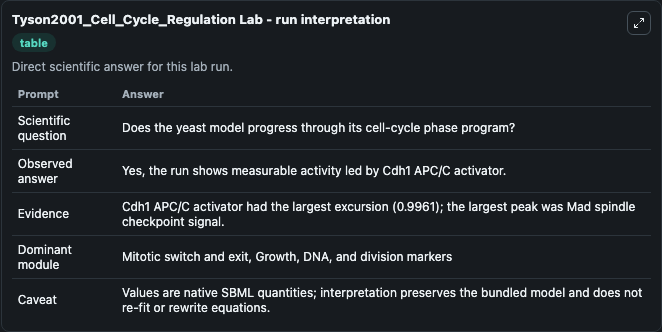
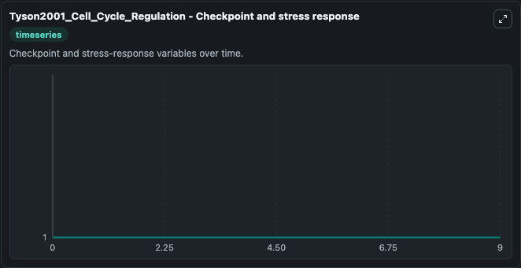
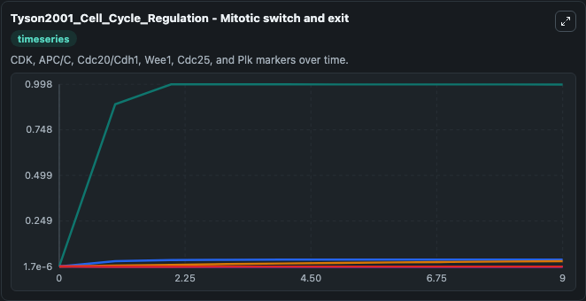
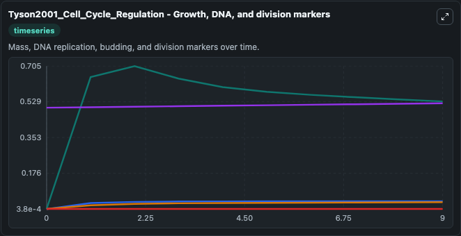
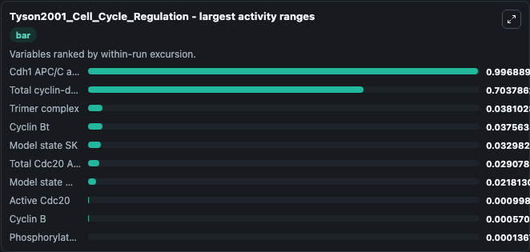
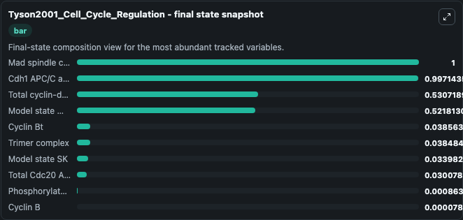
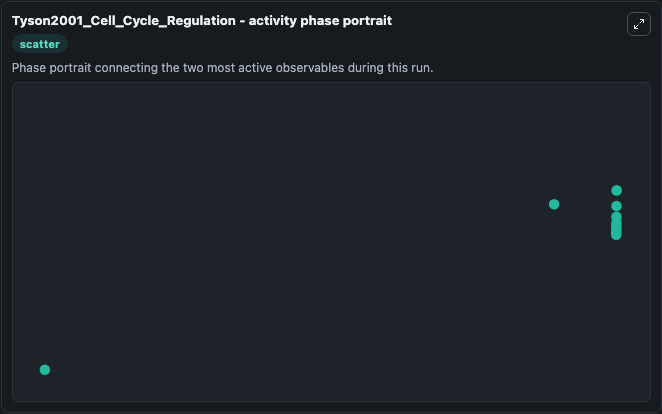

# Tyson2001_Cell_Cycle_Regulation Lab

Single-model lab wrapper for Tyson2001_Cell_Cycle_Regulation. This model describes the budding yeast cell cycle model used in fig 8 a in Regulation of the eukaryotic cell cycle: molecular antagonism, hysteresis, and irreversible transitions. It can be used to explore cell-cycle regulation dynamics and compare checkpoint behavior across conditions.

This lab is a single-model Biosimulant wrapper for a cell-cycle simulation. The captured run uses the lab defaults and renders the model outputs as dark-mode visualizations for quick inspection and README embedding.

## Model Context

This model describes the budding yeast cell cycle model used in fig 8 a in Regulation of the eukaryotic cell cycle: molecular antagonism, hysteresis, and irreversible transitions. It can be used to explore cell-cycle regulation dynamics and compare checkpoint behavior across conditions.

- Core model: Tyson2001_Cell_Cycle_Regulation
- Runtime used by the lab: duration 10, step 1
- Controllable inputs: none declared
- Primary outputs: Cyclin Bt, Active Cdc20, Cdh1 APC/C activator, Model state M (m), Total Cdc20 APC/C activator, Phosphorylated IE, Total cyclin-dependent kinase inhibitor, Model state SK, Cyclin B, Trimer complex, and 1 more
- Tags: cellcycle, sbml, biomodels_ebi, faithful

## Output Visualizations

The images below were generated from a Biosimulant lab run in dark mode. Each capture corresponds to one rendered visualization from the run output panel.

<!-- BIOSIMULANT_VISUALS_START -->

### 1. Tyson2001 Cell Cycle Regulation Lab Run Interpretation

Run interpretation view that anchors the captured simulation: it summarizes the lab purpose, runtime, and how to read the generated cell-cycle outputs.

### 2. Tyson2001 Cell Cycle Regulation Checkpoint And Stress Response

Checkpoint and stress-response time courses, showing how the configured run moves through DNA damage, surveillance, and arrest-related signals.

### 3. Tyson2001 Cell Cycle Regulation Mitotic Switch And Exit

Mitotic switch and exit view, capturing late-cycle regulators and the transition out of mitosis.

### 4. Tyson2001 Cell Cycle Regulation Growth Dna And Division Markers

Growth, DNA, and division markers, linking mass accumulation and replication signals to cell-cycle state changes.

### 5. Tyson2001 Cell Cycle Regulation Largest Activity Ranges

Largest activity ranges chart, ranking the variables with the widest simulated movement so the dominant responses are easy to spot.

### 6. Tyson2001 Cell Cycle Regulation Final State Snapshot

Final state snapshot, comparing the end-of-run values for the selected cell-cycle variables.

### 7. Tyson2001 Cell Cycle Regulation Activity Phase Portrait

Activity phase portrait, showing pairwise movement between selected variables across the simulated trajectory.

<!-- BIOSIMULANT_VISUALS_END -->

## How to Read This Run

Use the time-course plots to see transient and steady-state behavior, the range or snapshot charts to identify the variables with the strongest response, and any phase-portrait view to inspect coupled regulator movement through the simulated trajectory. For this cell-cycle lab, the most useful comparison is usually between checkpoint, commitment, and mitotic-exit variables because those signals define where the simulated system sits in the cycle.

## Inputs

| Input | Context |
| --- | --- |
| - | No entries declared in `lab.yaml`. |

## Outputs

| Output | Context |
| --- | --- |
| Cyclin Bt | Tracks Cyclin Bt in the lab model via `cellcycle_sbml_tyson2001_cell_cycle_regulation_biomd0000000195_model.cyclin_bt`. |
| Active Cdc20 | Tracks Active Cdc20 in the lab model via `cellcycle_sbml_tyson2001_cell_cycle_regulation_biomd0000000195_model.active_cdc20`. |
| Cdh1 APC/C activator | Tracks Cdh1 APC/C activator in the lab model via `cellcycle_sbml_tyson2001_cell_cycle_regulation_biomd0000000195_model.cdh1_apc_c_activator`. |
| Model state M (m) | Tracks Model state M (m) in the lab model via `cellcycle_sbml_tyson2001_cell_cycle_regulation_biomd0000000195_model.model_state_m_m`. |
| Total Cdc20 APC/C activator | Tracks Total Cdc20 APC/C activator in the lab model via `cellcycle_sbml_tyson2001_cell_cycle_regulation_biomd0000000195_model.total_cdc20_apc_c_activator`. |
| Phosphorylated IE | Tracks Phosphorylated IE in the lab model via `cellcycle_sbml_tyson2001_cell_cycle_regulation_biomd0000000195_model.phosphorylated_ie`. |
| Total cyclin-dependent kinase inhibitor | Tracks Total cyclin-dependent kinase inhibitor in the lab model via `cellcycle_sbml_tyson2001_cell_cycle_regulation_biomd0000000195_model.total_cyclin_dependent_kinase_inhibitor`. |
| Model state SK | Tracks Model state SK in the lab model via `cellcycle_sbml_tyson2001_cell_cycle_regulation_biomd0000000195_model.model_state_sk`. |
| Cyclin B | Tracks Cyclin B in the lab model via `cellcycle_sbml_tyson2001_cell_cycle_regulation_biomd0000000195_model.cyclin_b`. |
| Trimer complex | Tracks Trimer complex in the lab model via `cellcycle_sbml_tyson2001_cell_cycle_regulation_biomd0000000195_model.trimer_complex`. |
| Mad spindle checkpoint signal | Tracks Mad spindle checkpoint signal in the lab model via `cellcycle_sbml_tyson2001_cell_cycle_regulation_biomd0000000195_model.mad_spindle_checkpoint_signal`. |

## Lab Files

- `lab.yaml` defines the Biosimulant lab wrapper, exposed inputs, outputs, and runtime settings.
- `wiring-layout.json` stores the canvas layout used by the lab UI.
- `models/core/model.yaml` contains the wrapped simulation model metadata.
- `models/core/README.md` contains the source model notes and provenance.
- `models/visualisation/model.yaml` defines the visualization model used to render the run outputs.
- `assets/` contains the generated dark-mode visualization captures embedded above.
