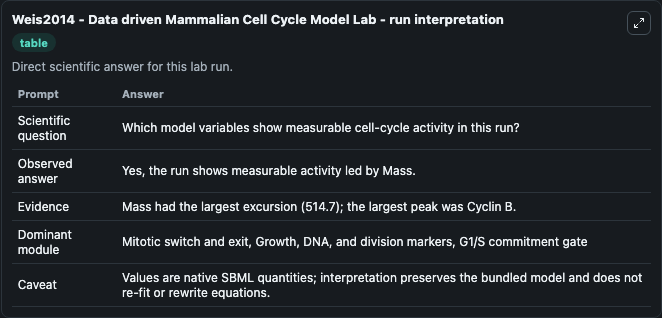
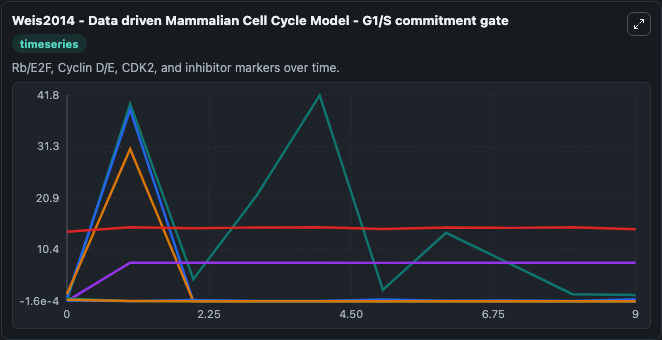
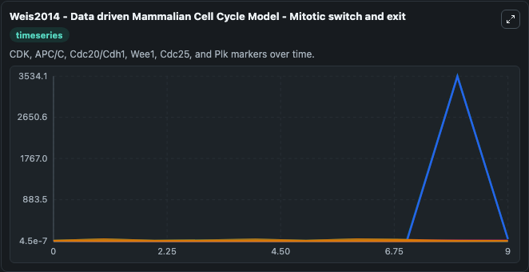
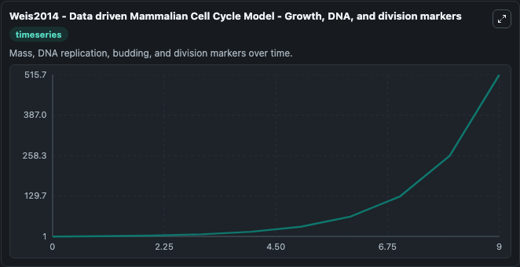
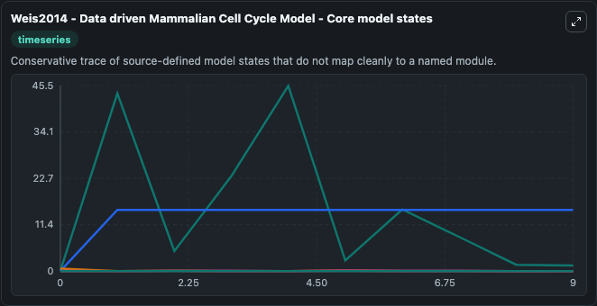
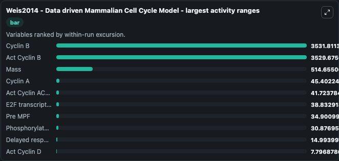
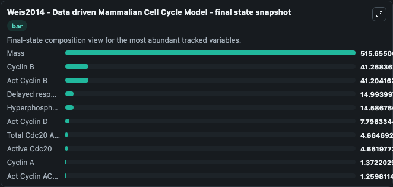
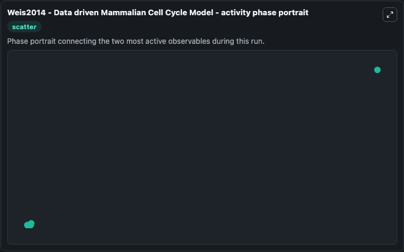

# Weis2014 - Data driven Mammalian Cell Cycle Model Lab

Single-model lab wrapper for Weis2014 - Data driven Mammalian Cell Cycle Model. This a model from the article: A Data-Driven, Mathematical Model of Mammalian Cell Cycle Regulation. It can be used to explore cell-cycle regulation dynamics and compare checkpoint behavior across conditions.

This lab is a single-model Biosimulant wrapper for a cell-cycle simulation. The captured run uses the lab defaults and renders the model outputs as dark-mode visualizations for quick inspection and README embedding.

## Model Context

This a model from the article: A Data-Driven, Mathematical Model of Mammalian Cell Cycle Regulation. It can be used to explore cell-cycle regulation dynamics and compare checkpoint behavior across conditions.

- Core model: Weis2014 - Data driven Mammalian Cell Cycle Model
- Runtime used by the lab: duration 10, step 1
- Controllable inputs: none declared
- Primary outputs: Early response gene module, Delayed response gene module, Hyperphosphorylated Rb, E2F transcription factor, Phosphorylated E2F, Rb tumor suppressor, E2F-Rb complex, P E2FRB, Act Cyclin D, Tri D, and 15 more
- Tags: cellcycle, sbml, biomodels_ebi, faithful

## Output Visualizations

The images below were generated from a Biosimulant lab run in dark mode. Each capture corresponds to one rendered visualization from the run output panel.

<!-- BIOSIMULANT_VISUALS_START -->

### 1. Weis2014 Data Driven Mammalian Cell Cycle Model Lab Run Interpretation

Run interpretation view that anchors the captured simulation: it summarizes the lab purpose, runtime, and how to read the generated cell-cycle outputs.

### 2. Weis2014 Data Driven Mammalian Cell Cycle Model G1 S Commitment Gate

G1/S commitment view, focused on the regulatory variables that gate entry into DNA synthesis and cell-cycle progression.

### 3. Weis2014 Data Driven Mammalian Cell Cycle Model Mitotic Switch And Exit

Mitotic switch and exit view, capturing late-cycle regulators and the transition out of mitosis.

### 4. Weis2014 Data Driven Mammalian Cell Cycle Model Growth Dna And Division Markers

Growth, DNA, and division markers, linking mass accumulation and replication signals to cell-cycle state changes.

### 5. Weis2014 Data Driven Mammalian Cell Cycle Model Core Model States

Core model state trajectories for Early response gene module, Delayed response gene module, Hyperphosphorylated Rb, E2F transcription factor, Phosphorylated E2F, Rb tumor suppressor, and 19 additional outputs, using the lab default initial conditions and runtime.

### 6. Weis2014 Data Driven Mammalian Cell Cycle Model Largest Activity Ranges

Largest activity ranges chart, ranking the variables with the widest simulated movement so the dominant responses are easy to spot.

### 7. Weis2014 Data Driven Mammalian Cell Cycle Model Final State Snapshot

Final state snapshot, comparing the end-of-run values for the selected cell-cycle variables.

### 8. Weis2014 Data Driven Mammalian Cell Cycle Model Activity Phase Portrait

Activity phase portrait, showing pairwise movement between selected variables across the simulated trajectory.

<!-- BIOSIMULANT_VISUALS_END -->

## How to Read This Run

Use the time-course plots to see transient and steady-state behavior, the range or snapshot charts to identify the variables with the strongest response, and any phase-portrait view to inspect coupled regulator movement through the simulated trajectory. For this cell-cycle lab, the most useful comparison is usually between checkpoint, commitment, and mitotic-exit variables because those signals define where the simulated system sits in the cycle.

## Inputs

| Input | Context |
| --- | --- |
| - | No entries declared in `lab.yaml`. |

## Outputs

| Output | Context |
| --- | --- |
| Early response gene module | Tracks Early response gene module in the lab model via `cellcycle_sbml_weis2014_data_driven_mammalian_cell_cycle_model_biomd0000000723_model.early_response_gene_module`. |
| Delayed response gene module | Tracks Delayed response gene module in the lab model via `cellcycle_sbml_weis2014_data_driven_mammalian_cell_cycle_model_biomd0000000723_model.delayed_response_gene_module`. |
| Hyperphosphorylated Rb | Tracks Hyperphosphorylated Rb in the lab model via `cellcycle_sbml_weis2014_data_driven_mammalian_cell_cycle_model_biomd0000000723_model.hyperphosphorylated_rb`. |
| E2F transcription factor | Tracks E2F transcription factor in the lab model via `cellcycle_sbml_weis2014_data_driven_mammalian_cell_cycle_model_biomd0000000723_model.e2f_transcription_factor`. |
| Phosphorylated E2F | Tracks Phosphorylated E2F in the lab model via `cellcycle_sbml_weis2014_data_driven_mammalian_cell_cycle_model_biomd0000000723_model.phosphorylated_e2f`. |
| Rb tumor suppressor | Tracks Rb tumor suppressor in the lab model via `cellcycle_sbml_weis2014_data_driven_mammalian_cell_cycle_model_biomd0000000723_model.rb_tumor_suppressor`. |
| E2F-Rb complex | Tracks E2F-Rb complex in the lab model via `cellcycle_sbml_weis2014_data_driven_mammalian_cell_cycle_model_biomd0000000723_model.e2f_rb_complex`. |
| P E2FRB | Tracks P E2FRB in the lab model via `cellcycle_sbml_weis2014_data_driven_mammalian_cell_cycle_model_biomd0000000723_model.p_e2frb`. |
| Act Cyclin D | Tracks Act Cyclin D in the lab model via `cellcycle_sbml_weis2014_data_driven_mammalian_cell_cycle_model_biomd0000000723_model.act_cyclin_d`. |
| Tri D | Tracks Tri D in the lab model via `cellcycle_sbml_weis2014_data_driven_mammalian_cell_cycle_model_biomd0000000723_model.tri_d`. |
| Act Cyclin ACdk1 | Tracks Act Cyclin ACdk1 in the lab model via `cellcycle_sbml_weis2014_data_driven_mammalian_cell_cycle_model_biomd0000000723_model.act_cyclin_acdk1`. |
| Act Cyclin ACdk2 | Tracks Act Cyclin ACdk2 in the lab model via `cellcycle_sbml_weis2014_data_driven_mammalian_cell_cycle_model_biomd0000000723_model.act_cyclin_acdk2`. |
| Act Cyclin B | Tracks Act Cyclin B in the lab model via `cellcycle_sbml_weis2014_data_driven_mammalian_cell_cycle_model_biomd0000000723_model.act_cyclin_b`. |
| Act Cyclin E | Tracks Act Cyclin E in the lab model via `cellcycle_sbml_weis2014_data_driven_mammalian_cell_cycle_model_biomd0000000723_model.act_cyclin_e`. |
| Cyclin A | Tracks Cyclin A in the lab model via `cellcycle_sbml_weis2014_data_driven_mammalian_cell_cycle_model_biomd0000000723_model.cyclin_a`. |
| Cyclin B | Tracks Cyclin B in the lab model via `cellcycle_sbml_weis2014_data_driven_mammalian_cell_cycle_model_biomd0000000723_model.cyclin_b`. |
| Cyclin E | Tracks Cyclin E in the lab model via `cellcycle_sbml_weis2014_data_driven_mammalian_cell_cycle_model_biomd0000000723_model.cyclin_e`. |
| Cyclin-dependent kinase inhibitor | Tracks Cyclin-dependent kinase inhibitor in the lab model via `cellcycle_sbml_weis2014_data_driven_mammalian_cell_cycle_model_biomd0000000723_model.cyclin_dependent_kinase_inhibitor`. |
| Cdh1 APC/C activator | Tracks Cdh1 APC/C activator in the lab model via `cellcycle_sbml_weis2014_data_driven_mammalian_cell_cycle_model_biomd0000000723_model.cdh1_apc_c_activator`. |
| Pre MPF | Tracks Pre MPF in the lab model via `cellcycle_sbml_weis2014_data_driven_mammalian_cell_cycle_model_biomd0000000723_model.pre_mpf`. |
| Tri A | Tracks Tri A in the lab model via `cellcycle_sbml_weis2014_data_driven_mammalian_cell_cycle_model_biomd0000000723_model.tri_a`. |
| Phosphorylated APC/C/C | Tracks Phosphorylated APC/C/C in the lab model via `cellcycle_sbml_weis2014_data_driven_mammalian_cell_cycle_model_biomd0000000723_model.phosphorylated_apc_c_c`. |
| Active Cdc20 | Tracks Active Cdc20 in the lab model via `cellcycle_sbml_weis2014_data_driven_mammalian_cell_cycle_model_biomd0000000723_model.active_cdc20`. |
| Total Cdc20 APC/C activator | Tracks Total Cdc20 APC/C activator in the lab model via `cellcycle_sbml_weis2014_data_driven_mammalian_cell_cycle_model_biomd0000000723_model.total_cdc20_apc_c_activator`. |
| Mass | Tracks Mass in the lab model via `cellcycle_sbml_weis2014_data_driven_mammalian_cell_cycle_model_biomd0000000723_model.mass`. |

## Lab Files

- `lab.yaml` defines the Biosimulant lab wrapper, exposed inputs, outputs, and runtime settings.
- `wiring-layout.json` stores the canvas layout used by the lab UI.
- `models/core/model.yaml` contains the wrapped simulation model metadata.
- `models/core/README.md` contains the source model notes and provenance.
- `models/visualisation/model.yaml` defines the visualization model used to render the run outputs.
- `assets/` contains the generated dark-mode visualization captures embedded above.
