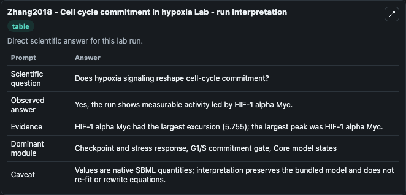
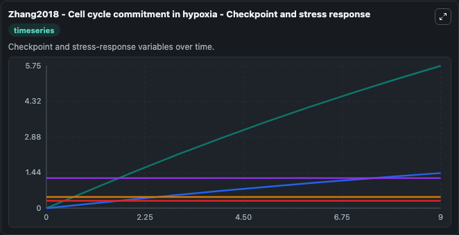
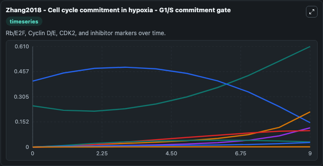
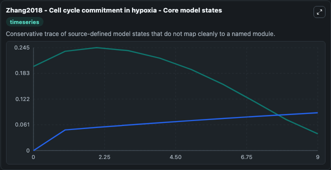
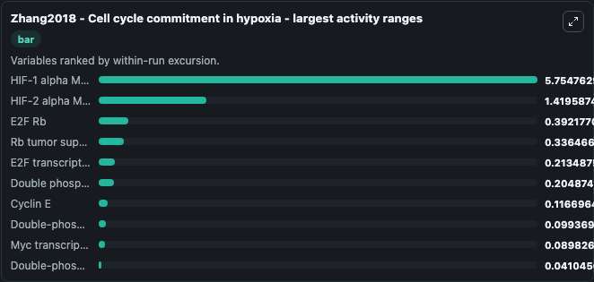
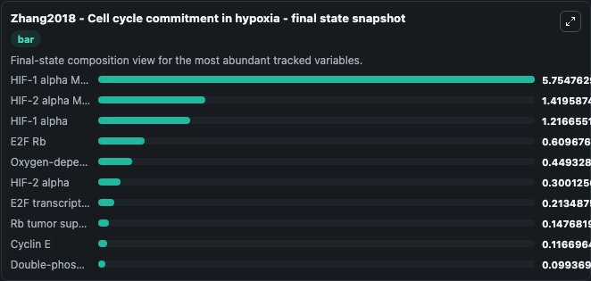
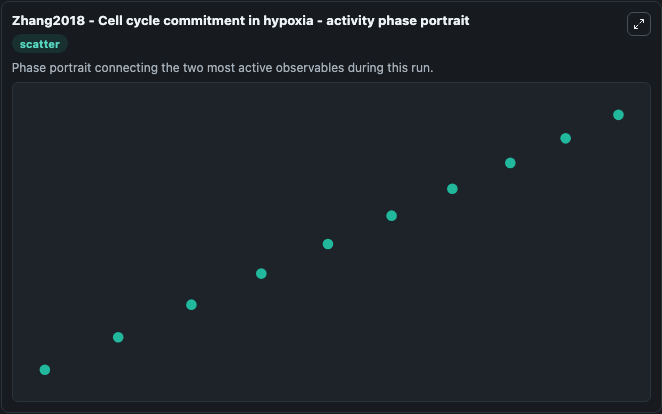

# Zhang2018 - Cell cycle commitment in hypoxia Lab

Single-model lab wrapper for Zhang2018 - Cell cycle commitment in hypoxia. Cell Cycle Zhang2018Cell Cycle Commitment In Hypoxia Model1812060002Model represents core biological mechanisms from biomodels_ebi reference biomodels_ebi:MODEL1812060002. When you run it, you can inspect state and compare temporal behavior between baseline and adjusted inputs.

This lab is a single-model Biosimulant wrapper for a cell-cycle simulation. The captured run uses the lab defaults and renders the model outputs as dark-mode visualizations for quick inspection and README embedding.

## Model Context

Cell Cycle Zhang2018Cell Cycle Commitment In Hypoxia Model1812060002Model represents core biological mechanisms from biomodels_ebi reference biomodels_ebi:MODEL1812060002. When you run it, you can inspect state and compare temporal behavior between baseline and adjusted inputs.

- Core model: Zhang2018 - Cell cycle commitment in hypoxia
- Runtime used by the lab: duration 10, step 1
- Controllable inputs: Oxygen
- Primary outputs: HIF-1 alpha Myc, HIF-2 alpha Myc, E2F transcription factor, Double-phosphorylated Cyclin D, Cyclin D, Cyclin E, Phosphorylated Rb, Unphosphorylated Rb, Myc transcription factor, E2F Rb, and 6 more
- Tags: cellcycle, sbml, biomodels_ebi, faithful

## Output Visualizations

The images below were generated from a Biosimulant lab run in dark mode. Each capture corresponds to one rendered visualization from the run output panel.

<!-- BIOSIMULANT_VISUALS_START -->

### 1. Zhang2018 Cell Cycle Commitment In Hypoxia Lab Run Interpretation

Run interpretation view that anchors the captured simulation: it summarizes the lab purpose, runtime, and how to read the generated cell-cycle outputs.

### 2. Zhang2018 Cell Cycle Commitment In Hypoxia Checkpoint And Stress Response

Checkpoint and stress-response time courses, showing how the configured run moves through DNA damage, surveillance, and arrest-related signals.

### 3. Zhang2018 Cell Cycle Commitment In Hypoxia G1 S Commitment Gate

G1/S commitment view, focused on the regulatory variables that gate entry into DNA synthesis and cell-cycle progression.

### 4. Zhang2018 Cell Cycle Commitment In Hypoxia Core Model States

Core model state trajectories for HIF-1 alpha Myc, HIF-2 alpha Myc, E2F transcription factor, Double-phosphorylated Cyclin D, Cyclin D, Cyclin E, and 10 additional outputs, using the lab default initial conditions and runtime.

### 5. Zhang2018 Cell Cycle Commitment In Hypoxia Largest Activity Ranges

Largest activity ranges chart, ranking the variables with the widest simulated movement so the dominant responses are easy to spot.

### 6. Zhang2018 Cell Cycle Commitment In Hypoxia Final State Snapshot

Final state snapshot, comparing the end-of-run values for the selected cell-cycle variables.

### 7. Zhang2018 Cell Cycle Commitment In Hypoxia Activity Phase Portrait

Activity phase portrait, showing pairwise movement between selected variables across the simulated trajectory.

<!-- BIOSIMULANT_VISUALS_END -->

## How to Read This Run

Use the time-course plots to see transient and steady-state behavior, the range or snapshot charts to identify the variables with the strongest response, and any phase-portrait view to inspect coupled regulator movement through the simulated trajectory. For this cell-cycle lab, the most useful comparison is usually between checkpoint, commitment, and mitotic-exit variables because those signals define where the simulated system sits in the cycle.

## Inputs

| Input | Context |
| --- | --- |
| Oxygen | Controls Oxygen in the lab model via `cellcycle_sbml_zhang2018_cell_cycle_commitment_in_hypoxia_model1812060002_model.oxygen`. |

## Outputs

| Output | Context |
| --- | --- |
| HIF-1 alpha Myc | Tracks HIF-1 alpha Myc in the lab model via `cellcycle_sbml_zhang2018_cell_cycle_commitment_in_hypoxia_model1812060002_model.hif_1_alpha_myc`. |
| HIF-2 alpha Myc | Tracks HIF-2 alpha Myc in the lab model via `cellcycle_sbml_zhang2018_cell_cycle_commitment_in_hypoxia_model1812060002_model.hif_2_alpha_myc`. |
| E2F transcription factor | Tracks E2F transcription factor in the lab model via `cellcycle_sbml_zhang2018_cell_cycle_commitment_in_hypoxia_model1812060002_model.e2f_transcription_factor`. |
| Double-phosphorylated Cyclin D | Tracks Double-phosphorylated Cyclin D in the lab model via `cellcycle_sbml_zhang2018_cell_cycle_commitment_in_hypoxia_model1812060002_model.double_phosphorylated_cyclin_d`. |
| Cyclin D | Tracks Cyclin D in the lab model via `cellcycle_sbml_zhang2018_cell_cycle_commitment_in_hypoxia_model1812060002_model.cyclin_d`. |
| Cyclin E | Tracks Cyclin E in the lab model via `cellcycle_sbml_zhang2018_cell_cycle_commitment_in_hypoxia_model1812060002_model.cyclin_e`. |
| Phosphorylated Rb | Tracks Phosphorylated Rb in the lab model via `cellcycle_sbml_zhang2018_cell_cycle_commitment_in_hypoxia_model1812060002_model.phosphorylated_rb`. |
| Unphosphorylated Rb | Tracks Unphosphorylated Rb in the lab model via `cellcycle_sbml_zhang2018_cell_cycle_commitment_in_hypoxia_model1812060002_model.unphosphorylated_rb`. |
| Myc transcription factor | Tracks Myc transcription factor in the lab model via `cellcycle_sbml_zhang2018_cell_cycle_commitment_in_hypoxia_model1812060002_model.myc_transcription_factor`. |
| E2F Rb | Tracks E2F Rb in the lab model via `cellcycle_sbml_zhang2018_cell_cycle_commitment_in_hypoxia_model1812060002_model.e2f_rb`. |
| Rb tumor suppressor | Tracks Rb tumor suppressor in the lab model via `cellcycle_sbml_zhang2018_cell_cycle_commitment_in_hypoxia_model1812060002_model.rb_tumor_suppressor`. |
| Double phosphorylation signal | Tracks Double phosphorylation signal in the lab model via `cellcycle_sbml_zhang2018_cell_cycle_commitment_in_hypoxia_model1812060002_model.double_phosphorylation_signal`. |
| Double-phosphorylated Cyclin E | Tracks Double-phosphorylated Cyclin E in the lab model via `cellcycle_sbml_zhang2018_cell_cycle_commitment_in_hypoxia_model1812060002_model.double_phosphorylated_cyclin_e`. |
| Oxygen-dependent degradation factor | Tracks Oxygen-dependent degradation factor in the lab model via `cellcycle_sbml_zhang2018_cell_cycle_commitment_in_hypoxia_model1812060002_model.oxygen_dependent_degradation_factor`. |
| HIF-1 alpha | Tracks HIF-1 alpha in the lab model via `cellcycle_sbml_zhang2018_cell_cycle_commitment_in_hypoxia_model1812060002_model.hif_1_alpha`. |
| HIF-2 alpha | Tracks HIF-2 alpha in the lab model via `cellcycle_sbml_zhang2018_cell_cycle_commitment_in_hypoxia_model1812060002_model.hif_2_alpha`. |

## Lab Files

- `lab.yaml` defines the Biosimulant lab wrapper, exposed inputs, outputs, and runtime settings.
- `wiring-layout.json` stores the canvas layout used by the lab UI.
- `models/core/model.yaml` contains the wrapped simulation model metadata.
- `models/core/README.md` contains the source model notes and provenance.
- `models/visualisation/model.yaml` defines the visualization model used to render the run outputs.
- `assets/` contains the generated dark-mode visualization captures embedded above.
